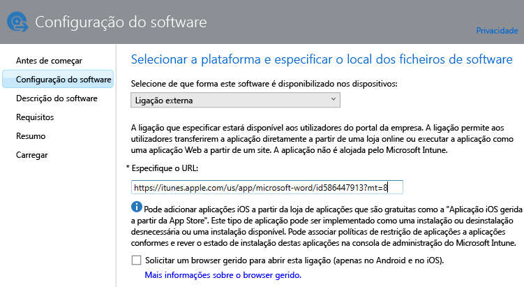
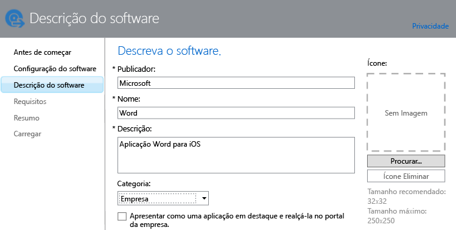

---
# required metadata

title: Adicionar aplicações para dispositivos móveis | Microsoft Intune
description:
keywords:
author: robstackmsft
manager: jeffgilb
ms.date: 04/28/2016
ms.topic: article
ms.prod:
ms.service: microsoft-intune
ms.technology:
ms.assetid: f5b1f1ae-f177-450a-9af9-936a02d052e3

# optional metadata

#ROBOTS:
#audience:
#ms.devlang:
ms.reviewer: jeffgilb
ms.suite: ems
#ms.tgt_pltfrm:
#ms.custom:

---

# Adicionar aplicações para dispositivos móveis no Microsoft Intune

Utilize as informações deste tópico para saber como adicionar aplicações ao Intune antes de implementá-las.

> [!IMPORTANT]
> As informações contidas neste tópico ajudam-no a adicionar as aplicações que pretende implementar em dispositivos inscritos e em PCs Windows inscritos. Se quiser adicionar aplicações a PCs Windows que gere com o software de cliente Intune, consulte o artigo [Adicionar aplicações para PCs Windows no Microsoft Intune](add-apps-for-windows-pcs-in-microsoft-intune.md).

## Adicionar a aplicação
Utilize o Intune Software Publisher para configurar as propriedades da aplicação e, quando aplicável, carregá-la para o seu espaço de armazenamento na nuvem através do seguinte procedimento:

1.  Na [consola do administrador do Microsoft Intune](https://manage.microsoft.com), clique em **Aplicações** &gt; **Adicionar Aplicações** para iniciar o Intune Software Publisher.

    > [!TIP]
    > Poderá ter de introduzir o seu nome de utilizador e palavra-passe do Intune para que o publicador seja iniciado.

2.  Na página **Configuração de software** do Software Publisher, selecione uma das seguintes opções para **Selecionar como este software é disponibilizado nos dispositivos**:
    - **Instalador de software**, para aplicações com a extensão **.msi**, ou **.exe**, especifique:
        - **Selecionar o tipo de ficheiro de instalador de software** - Indica o tipo de software que pretende implementar. Por exemplo, se pretender instalar uma aplicação iOS, escolha **Pacote de Aplicações para iOS (ficheiro &#42;.ipa)**.
        - **Especificar a localização dos ficheiros de configuração do software** - Introduza a localização dos ficheiros de instalação ou clique em **Procurar** para selecionar a localização numa lista.
        - **Incluir ficheiros adicionais e subpastas da mesma pasta** - Apenas para o tipo de ficheiro do **Windows Installer**. Alguns softwares que utilizam o Windows Installer necessitam de ficheiros de suporte que, normalmente, se encontram na mesma pasta que os ficheiros de instalação. Selecione esta opção se pretender também implementar estes ficheiros. Este tipo de instalação utiliza algum do seu espaço de armazenamento na nuvem.

  -   **Ligação externa**, para as aplicações que pretende criar, especificando uma ligação para uma loja de aplicações, especifique:

        - **Especificar o URL** - Especifique o URL de um dos seguintes:
            - O URL da loja de aplicações da aplicação que pretende implementar. Por exemplo, se quiser implementar a aplicação Ambiente de Trabalho Remoto da Microsoft para Android, especifique **https://play.google.com/store/apps/details?id=com.microsoft.rdc.android**. Para localizar o URL da aplicação, utilize um motor de busca para procurar a página da loja que contém a aplicação. Por exemplo, para localizar a aplicação Ambiente de Trabalho Remoto, pode pesquisar **Ambiente de Trabalho Remoto da Microsoft para Android**.
            - Um Web site. O Intune irá implementar um ícone de atalho para o site no dispositivo (conhecido como clip da Web).
            - Uma aplicação na Web. O Intune irá implementar um ícone de atalho para a aplicação no dispositivo.
        - **Exigir um browser gerido para abrir esta ligação (Android e iOS apenas)** - Quando implementa uma ligação para um site ou uma aplicação Web nos utilizadores, estes só poderão abri-la no Intune Managed Browser, que tem de estar instalado nos respetivos dispositivos. Para obter mais detalhes sobre o Managed Browser, consulte o artigo [Gerir o acesso à Internet através de políticas de browser gerido com o Microsoft Intune](manage-internet-access-using-managed-browser-policies.md). Este tipo de instalação não utiliza o seu espaço de armazenamento na nuvem.

  -   **Aplicação iOS gerida da loja de aplicações**, para aplicações gratuitas da iTunes Store que pretende gerir com políticas de MAM, especifique:

        - **Especificar o URL** - Introduza o URL da loja de aplicações da aplicação que pretende implementar. Por exemplo, se pretender implementar a aplicação Pastas de Trabalho da Microsoft para iOS, especifique **https://itunes.apple.com/us/app/work-folders/id950878067?mt=8**. Este tipo de instalação não utiliza o seu espaço de armazenamento na nuvem.

        Por exemplo, se pretender implementar a aplicação Microsoft Word a partir da iTunes Store em dispositivos, a página teria o seguinte aspeto:
        
        

3.  Na página **Descrição do software**, configure o seguinte:

    > [!TIP]
    > Dependendo do tipo de instalador que está a utilizar, alguns destes valores podem ter sido introduzidos automaticamente ou podem não aparecer.

    - **Publicador** - Introduza o nome do publicador da aplicação.
    - **Nome** - Introduza o nome da aplicação tal como será apresentado no portal da empresa. Certifique-se de que todos os nomes de aplicações que utiliza são exclusivos. Se o mesmo nome de aplicação existir duas vezes, apenas uma das aplicações será apresentada aos utilizadores no portal da empresa.
    - **Descrição** - Introduza uma descrição para a aplicação. A descrição será apresentada aos utilizadores no portal da empresa.
    - **URL para informações de software** - Disponível apenas se tiver selecionado **Instalador de software**. Opcionalmente, introduza o URL de um site que contenha informações sobre esta aplicação. O URL será apresentado aos utilizadores no portal da empresa.
    - **URL de Privacidade** - Disponível apenas se tiver selecionado **Instalador de software**. Opcionalmente, introduza o URL de um site que contenha informações sobre a privacidade desta aplicação. O URL será apresentado aos utilizadores no portal da empresa.
    - **Categoria** - (opcional) Selecione uma das categorias de aplicações incorporadas. Isto irá permitir que os utilizadores encontrem a aplicação mais facilmente quando procurarem no portal da empresa.
    - **Apresentar esta aplicação em destaque e realçá-la no portal da empresa:** - Apresente a aplicação de forma destacada na página principal do portal da empresa quando os utilizadores procurarem aplicações.
    - **Ícone** - (opcional) Carregue um ícone que será associado à aplicação. Este é o ícone que será apresentado com a aplicação quando os utilizadores procurarem no portal da empresa.

        Neste exemplo, configurou uma descrição para a aplicação Microsoft Word para iOS:

        

4.  Na página **Requisitos**, selecione os requisitos que têm de ser cumpridos antes de ser possível iniciar a instalação da aplicação num dispositivo. Por exemplo, para um pacote de aplicação para iOS, pode selecionar a versão mínima do iOS necessária e o tipo de dispositivo que tem de ser, como um iPhone ou iPad.

    > [!TIP]
    > A página **Requisitos** não é apresentada para todos os tipos de aplicações.

5.  Se escolher o tipo de ficheiro **Windows Installer**, são apresentadas mais páginas do assistente. Este tipo de ficheiro é utilizado quando implementa software em PCs com o Windows 10 ou posterior que estão inscritos no Intune.

6.  Na página **Resumo**, reveja as informações que especificou. Assim que estiver pronto, clique em **Carregar**.

7.  Clique em **Fechar** para concluir.

A aplicação é apresentada no nó **Aplicações** da área de trabalho **Aplicações**.

## Passos seguintes

Depois de criar uma aplicação, o passo seguinte é implementá-la. Para mais informações, consulte [Implementar aplicações no Microsoft Intune](deploy-apps.md)

<!--HONumber=May16_HO1-->

