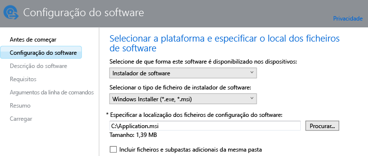

# Adicionar aplicações para PCs Windows no Microsoft Intune

Utilize as informações deste tópico para saber como adicionar aplicações ao Intune antes de implementá-las.

> [!IMPORTANT]
> As informações neste tópico ajudam a implementar aplicações em PCs Windows que gere com o software de cliente PC do Intune. Se pretender adicionar aplicações para PC com Windows inscritos e outros dispositivos móveis, consulte [Adicionar aplicações para dispositivos móveis no Microsoft Intune](add-apps-for-mobile-devices-in-microsoft-intune.md).

## Adicionar a aplicação
Utilize o Intune Software Publisher para configurar as propriedades da aplicação e carregá-la para o seu espaço de armazenamento na nuvem através do seguinte procedimento:

1.  Na [consola do administrador do Microsoft Intune](https://manage.microsoft.com), selecione **Aplicações** &gt; **Adicionar Aplicações** para iniciar o publicador de software Intune.

    > [!TIP]
    > Poderá ter de introduzir o seu nome de utilizador e palavra-passe do Intune para que o publicador seja iniciado.

2.  Na página **Configuração do software** do publicador de software, configure o seguinte:

    **Selecionar de que forma este software é disponibilizado nos dispositivos** - Escolha **Instalador de software** e especifique:

    - **Selecionar o tipo de ficheiro de instalador de software** - Indica o tipo de software que pretende implementar. Para um PC com Windows, escolha **Windows Installer**.
    - **Especificar a localização dos ficheiros de configuração do software** - Introduza a localização dos ficheiros de instalação ou selecione **Procurar** para selecionar a localização numa lista.
    - **Incluir ficheiros adicionais e subpastas da mesma pasta** - Alguns softwares que utilizam o Windows Installer necessitam de ficheiros de suporte que, normalmente, se encontram na mesma pasta dos ficheiros de instalação. Selecione esta opção se pretender também implementar estes ficheiros de suporte.

    Por exemplo, se pretender publicar uma aplicação com o nome Application.msi no Intune, a página teria o seguinte aspeto: 

   Este tipo de instalação utiliza algum do seu espaço de armazenamento na nuvem.

3.  Na página **Descrição do software**, configure o seguinte:

    Dependendo do ficheiro do instalador que está a utilizar, alguns destes valores podem ter sido introduzidos automaticamente ou podem não aparecer.

    - **Publicador** - Introduza o nome do publicador da aplicação.
    - **Nome** - Introduza o nome da aplicação tal como será apresentado no portal da empresa.  Certifique-se de que todos os nomes de aplicações que utiliza são exclusivos. Se o mesmo nome de aplicação existir duas vezes, apenas uma das aplicações será apresentada aos utilizadores no portal da empresa.
    - **Descrição** - Introduza uma descrição para a aplicação. A descrição será apresentada aos utilizadores no portal da empresa.
    - **URL para informações de software** - (opcional) Introduza o URL de um Web site que contenha informações sobre esta aplicação. O URL será apresentado aos utilizadores no portal da empresa.
    - **URL de privacidade** - (opcional) Introduza um URL para um site que contenha informações sobre a privacidade desta aplicação. O URL será apresentado aos utilizadores no portal da empresa.
    - **Categoria** - (opcional) Selecione uma das categorias de aplicações incorporadas. Isto irá permitir que os utilizadores encontrem a aplicação mais facilmente quando procurarem no portal da empresa.
    - **Ícone** - (opcional) Carregue um ícone que será associado à aplicação. Este é o ícone que será apresentado com a aplicação quando os utilizadores procurarem no portal da empresa.

4.  Na página **Requisitos**, selecione os requisitos que têm de ser cumpridos antes de ser possível iniciar a instalação da aplicação num dispositivo. Escolha a partir de **Arquitetura** - Selecione se esta aplicação pode ser instalada em sistemas operativos de 32 bits, 64 bits ou em ambos, **Sistema Operativo** - Selecione o sistema operativo mínimo no qual esta aplicação pode ser instalada.

5.  Na página **Regras de deteção**, pode configurar regras para detetar se a aplicação que está a configurar já está instalada num PC ou pode utilizar as regras de deteção predefinidas para substituir automaticamente quaisquer versões da aplicação instaladas anteriormente. Esta opção é para o Windows Installer (apenas ficheiros .exe).
6.  
    As regras que pode configurar são:
    - **Ficheiro existe** - Especifique o caminho para o ficheiro que pretende detetar. Pode procurar em **%ProgramFiles%** (que procura **Program Files**\*&lt;caminho&gt;* e **Program Files (x86)**\*&lt;caminho&gt;*) no PC ou **%SystemDrive%** (que procura na unidade raiz do PC, normalmente C:)
    - **O código de produto MSI existe** - Selecione **Procurar** para escolher o ficheiro do Windows Installer (msi) que pretende detetar. 
    - **A chave de registo existe** - Especifique uma chave de registo que comece com **HKEY_LOCAL_MACHINE\**. São procurados ambos os caminhos de registo de 32 bits e 64 bits. Se a chave que especificou existir em ambos os locais, a regra de deteção é satisfeita.

    Se a aplicação satisfizer qualquer uma das regras que tiver configurado, esta não será instalada.

7.  Apenas para o tipo de ficheiro do **Windows Installer** (msi e exe): na página **Argumentos de linha de comandos**, escolha se pretende fornecer argumentos de linha de comandos opcionais para o instalador. Por exemplo, alguns instaladores podem suportar o argumento **/q** para instalar automaticamente sem qualquer intervenção do utilizador.

8.  Apenas para o tipo de ficheiro do **Windows Installer** (apenas exe): na página **Códigos de retorno**, pode adicionar novos códigos de erro que são interpretados pelo Intune quando a aplicação é instalada num PC Windows gerido.
    Por predefinição, o Intune utiliza códigos de retorno comuns da indústria para comunicar a instalação falhada ou com êxito de um pacote de aplicações: **0** - Êxito ou **3010** - Êxito ao reiniciar. Também pode adicionar os seus códigos de retorno a esta lista. Se especificar uma lista de códigos de retorno e a instalação da aplicação devolver um código que não esteja na lista, será interpretado como uma falha.

9.  Na página **Resumo**, reveja as informações que especificou. Assim que estiver pronto, selecione **Carregar**.

10. Selecione **Fechar** para concluir.

A aplicação é apresentada no nó **Aplicações** da área de trabalho **Aplicações**.

## Passos seguintes

Depois de criar uma aplicação, o passo seguinte é implementá-la. Para mais informações, consulte [Implementar aplicações no Microsoft Intune](deploy-apps.md)

<!--HONumber=Jun16_HO4-->

