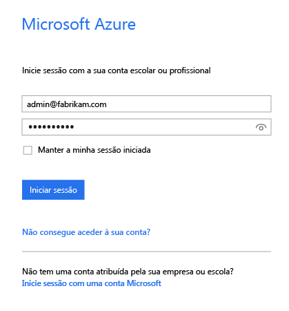
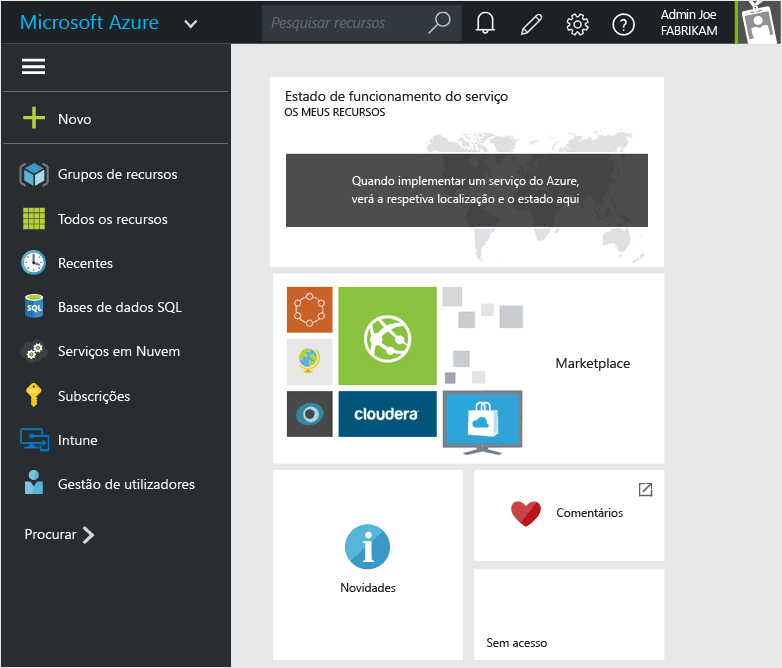
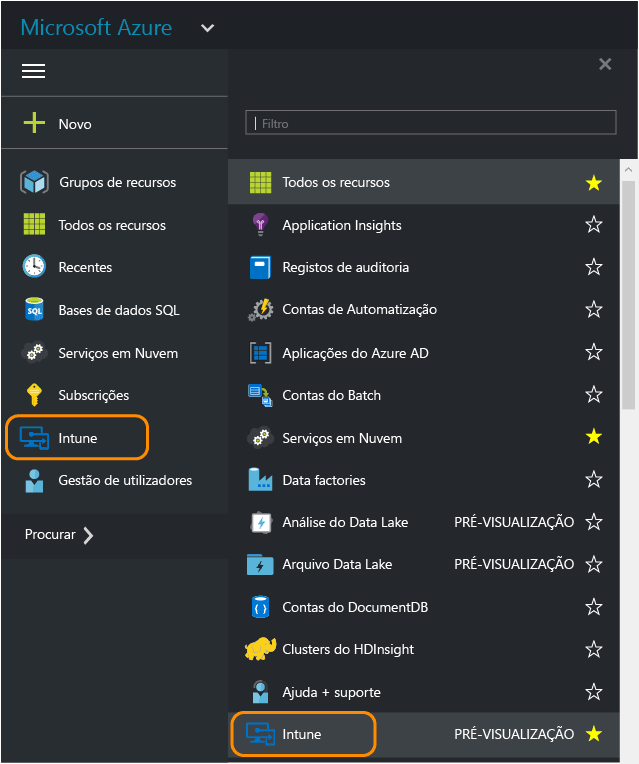
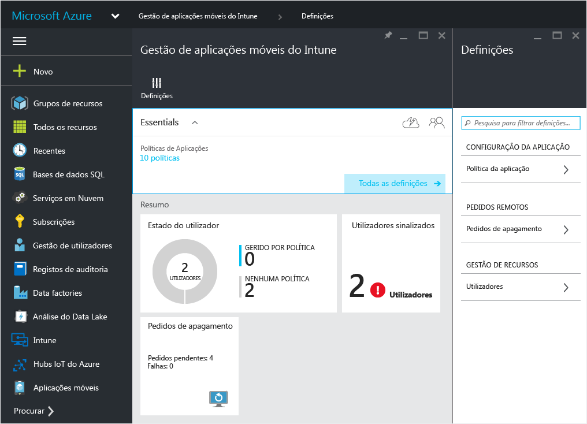
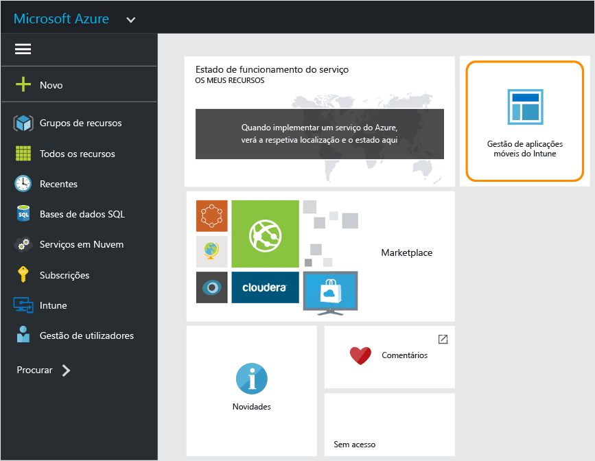

---
# required metadata

title: Portal do Azure para políticas de MAM | Microsoft Intune
description:
keywords:
author: karthikaraman
manager: jeffgilb
ms.date: 04/28/2016
ms.topic: article
ms.prod:
ms.service: microsoft-intune
ms.technology:
ms.assetid: 7d6dae94-a833-40b7-9016-14ea234bb33c

# optional metadata

#ROBOTS:
#audience:
#ms.devlang:
ms.reviewer: joglocke
ms.suite: ems
#ms.tgt_pltfrm:
#ms.custom:

---

# Portal do Azure para políticas de MAM do Microsoft Intune
## Aceder ao portal do Azure
O **portal do Azure** permite criar e gerir políticas de gestão de aplicações móveis.

O portal do Azure suporta a criação de políticas de MAM para:
- Aplicações em execução em dispositivos **inscritos e geridos pelo Intune**.
- Aplicações em execução em dispositivos que **não estão inscritos** em nenhuma solução de MDM.
- Aplicações em execução em dispositivos que estão **inscritos numa solução de MDM de terceiros**.

Se estiver a utilizar atualmente a **consola de administração do Intune** para gerir os seus dispositivos, pode criar uma política de MAM que suporte aplicações para dispositivos inscritos no Intune, utilizando a [consola de administração do Intune](configure-and-deploy-mobile-application-management-policies-in-the-microsoft-intune-console.md).
>[!IMPORTANT]
> Poderá não ver todas as definições de política de MAM na consola de administração do Intune. O portal do Azure é a nova consola de administração para a criação de políticas de MAM. Se criar políticas de MAM na consola de administração do Intune e no portal do Azure, a política no portal do Azure é aplicada às aplicações e implementada nos utilizadores.

## Iniciar sessão no portal do Azure e personalizar a página inicial

1.  Aceda ao [portal do Azure](https://portal.azure.com) e inicie sessão com as credenciais do [!INCLUDE[wit_nextref](../includes/wit_nextref_md.md)].

    

2.  Depois de iniciar sessão com êxito, verá a página **Dashboard**. A página **Dashboard** inclui um conjunto de mosaicos predefinidos que pode remover e adicionar novos para personalizar a página.

    

3.  No menu **Procurar**, localize **Intune**.

4.  Clique em **Intune > Gestão de aplicações móveis do Intune > Definições**.

    

    > [!TIP]
    > Para afixar um painel à página **Início** , pode utilizar a opção **afixar** no painel.  Clique no ícone de afixação no **painel de gestão de aplicações móveis do Intune**para afixá-lo à página **Início** .

    

    
## Passos seguintes
[Configurar políticas de gestão de aplicações móveis](get-ready-to-configure-mobile-app-management-policies-with-microsoft-intune.md)

<!--HONumber=Jun16_HO2-->

