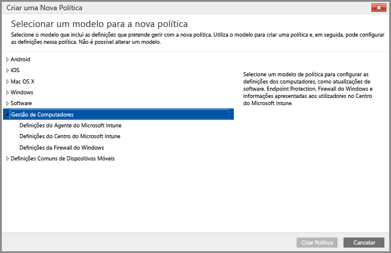
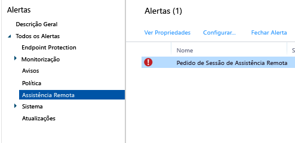

<<<<<<< HEAD
---
title: "Tarefas de gestão comuns do PC Windows | Microsoft Intune"
description: "Reveja as tarefas neste tópico para saber como gerir os PCs Windows que executam o cliente de software do Intune."
keywords: 
author: NathBarn
manager: angrobe
ms.date: 08/04/2016
ms.topic: article
ms.prod: 
ms.service: microsoft-intune
ms.technology: 
ms.assetid: eb912c73-54d2-4d78-ac34-3cbe825804c7
ms.reviewer: owenyen
ms.suite: ems
translationtype: Human Translation
ms.sourcegitcommit: 16be49504b24269f9463905ab5767acbda136a0a
ms.openlocfilehash: 9ef18ee054928fcfb12a36fe8ac3ad3c2909f6c1

||||||| merged common ancestors
---
title: "Tarefas de gestão comuns do PC Windows | Microsoft Intune"
description: "Reveja as tarefas neste tópico para saber como gerir os PCs Windows que executam o cliente de software do Intune."
keywords: 
author: NathBarn
manager: angrobe
ms.date: 08/04/2016
ms.topic: article
ms.prod: 
ms.service: microsoft-intune
ms.technology: 
ms.assetid: eb912c73-54d2-4d78-ac34-3cbe825804c7
ms.reviewer: owenyen
ms.suite: ems
translationtype: Human Translation
ms.sourcegitcommit: 16be49504b24269f9463905ab5767acbda136a0a
ms.openlocfilehash: 9ef18ee054928fcfb12a36fe8ac3ad3c2909f6c1

=======
---
title: "Tarefas de gestão comuns do PC Windows | Microsoft Intune"
description: "Reveja as tarefas neste tópico para saber como gerir os PCs Windows que executam o cliente de software do Intune."
keywords: 
author: staciebarker
ms.author: stabar
manager: angrobe
ms.date: 08/04/2016
ms.topic: article
ms.prod: 
ms.service: microsoft-intune
ms.technology: 
ms.assetid: eb912c73-54d2-4d78-ac34-3cbe825804c7
ms.reviewer: owenyen
ms.suite: ems
translationtype: Human Translation
ms.sourcegitcommit: cf6b4c0fbc8a739f205173f39093ce5550cb8321
ms.openlocfilehash: 075ed3f7d8b5f8283b7936c1c89d20081a9264a6

>>>>>>> 6851ab9d7bde3f80f14f27ebf43e5f2b265939e2

---
<<<<<<< HEAD

# Tarefas de gestão comuns de PCs Windows com o cliente de software do Intune
Reveja as tarefas neste tópico para saber como gerir os computadores que executam o cliente de software do Intune. Se ainda não instalou o cliente nos seus computadores, veja [Instalar o cliente de software do Intune](install-the-windows-pc-client-with-microsoft-intune.md).
||||||| merged common ancestors

# Tarefas de gestão comuns de PCs Windows com o cliente de software do Intune
Reveja as tarefas neste tópico para saber como gerir os computadores que executam o cliente de software do Intune. Se ainda não instalou o cliente nos seus computadores, veja [Instalar o cliente de software do Intune](install-the-windows-pc-client-with-microsoft-intune.md).
=======

# Tarefas de gestão comuns de PCs Windows com o cliente de software do Intune
Reveja as tarefas neste tópico para saber como gerir os computadores que executam o cliente de software do Intune. Se ainda não instalou o cliente nos seus computadores, consulte [Instalar o cliente de software do Intune](install-the-windows-pc-client-with-microsoft-intune.md).
>>>>>>> 6851ab9d7bde3f80f14f27ebf43e5f2b265939e2

## Utilizar políticas para simplificar a gestão do PC

Os PCs Windows que executam o cliente de software do Intune podem ser geridos através das políticas de **Gestão de Computadores** do Intune.

### Gerir o Centro do Microsoft Intune
Os utilizadores veem o cliente de software do Intune como o **Microsoft Intune Center**. O Centro do Microsoft Intune permite aos utilizadores:

-   Obter aplicações a partir do portal da empresa.

-   Procurar atualizações.

-   Gerir o Endpoint Protection do Microsoft Intune.

-  Pedir assistência remota.

O Centro do Microsoft Intune é instalado em todos os computadores geridos. Pode configurar as seguintes definições numa política do Intune e estas serão apresentadas aos utilizadores no Centro do Microsoft Intune:

|Definição de política|Detalhes|
|------------------|--------------------|
|**Nome**|O nome do administrador que gere o computador. Comprimento máximo: 40 carateres|
|**Número de telefone**|O número de telefone do administrador que gere o computador. Comprimento máximo: 20 carateres|
|**Endereço de e-mail**|O endereço de e-mail do administrador que gere o computador. Comprimento máximo: 40 carateres|
|**Nome do site**|O nome do seu site de suporte para utilizadores. >Comprimento máximo: 40 carateres|
|**URL do site**|O URL do seu site de suporte. Comprimento máximo: 150 carateres|
|**Notas**|Uma nota que é apresentada aos utilizadores. Comprimento máximo: 120 carateres|

Consulte os seguintes recursos para obter informações sobre as políticas e definições que pode configurar para PCs Windows:

- [Manter os PCs Windows atualizados com atualizações de software no Microsoft Intune](keep-windows-pcs-up-to-date-with-software-updates-in-microsoft-intune.md) – estas políticas verificam os computadores geridos e transferem atualizações de software da Microsoft e de terceiros. Estas atualizações não incluem atualizações do SO (por exemplo, atualizar do Windows 7 para o Windows 10 ou atualizações de uma versão do Windows 10 para uma versão posterior).

- [Ajudar a proteger os PCs Windows com o Endpoint Protection para o Microsoft Intune](help-secure-windows-pcs-with-endpoint-protection-for-microsoft-intune.md) – estas definições incluem agendamentos de análises e ações a efetuar quando for detetado software maligno.

- [Ajudar a proteger os PCs Windows que utilizam políticas da Firewall do Windows no Microsoft Intune](help-protect-windows-pcs-using-windows-firewall-policies-in-microsoft-intune.md) – estas políticas simplificam a administração das definições da Firewall do Windows nos computadores geridos.

## Ver o inventário de hardware e software
O Intune recolhe informações detalhadas sobre o hardware e o software de computadores geridos. Utilize as informações nos seguintes procedimentos para saber como criar:

-   Um relatório que lista as informações sobre as capacidades de hardware dos seus computadores.

-   Um relatório que lista o software instalado em cada computador.

-   Como atualizar o inventário de um computador para se certificar de que os dados do relatório estão atualizados.

### Para apresentar informações sobre os seus computadores

1.  Na [consola de administração do Microsoft Intune](https://manage.microsoft.com/), escolha **Relatórios** &gt; **Relatórios de Inventário de Computadores**.

2.  Na página **Criar Novo Relatório**, aceite os valores predefinidos ou personalize-os para filtrar os resultados que serão devolvidos pelo relatório. Por exemplo, pode selecionar apenas os computadores que executam o Windows 8.1 para serem apresentados no relatório.

3.  Escolha **Ver Relatório** para abrir o **Relatório de Inventários de Computadores** numa nova janela.

    Pode ordenar o relatório por qualquer uma das colunas, como **Nome**, **Tipo de Chassis** ou **Fabricante**, selecionando o cabeçalho de cada coluna.

### Para apresentar o software instalado nos seus computadores

1.  Na [consola de administração do Microsoft Intune](https://manage.microsoft.com/), escolha **Relatórios** &gt; **Relatórios de Software Detetado**.

2.  Na página **Criar Novo Relatório**, aceite os valores predefinidos ou personalize-os para filtrar os resultados que serão devolvidos pelo relatório. Por exemplo, pode selecionar para que apenas o software publicado pela Microsoft seja apresentado no relatório.

3.  Escolha **Ver Relatório** para abrir o **Relatório de Software Detetado** numa nova janela.

    Pode ordenar o relatório por qualquer uma das colunas, como **Nome**, **Publicador** ou **Categoria**, selecionando o cabeçalho de cada coluna. Pode expandir as atualizações na lista para mostrar mais detalhes (como os computadores em que estão instaladas) ao escolher a seta direcional junto ao item da lista.

### Para atualizar o inventário dos computadores e certificar-se de que está atualizado

1.  Na [consola de administração do Microsoft Intune](https://manage.microsoft.com/), escolha **Grupos** &gt; **Todos os Dispositivos** (ou outro grupo que contenha o computador cujo inventário quer atualizar).

2.  Selecione um computador ou prima se soltar a tecla **Ctrl** para selecionar múltiplos computadores.

3.  Na barra de tarefas, escolha **Tarefas Remotas** &gt; **Atualizar Inventário**.

4.  Para ver o estado da tarefa, escolha **Tarefas Remotas** no canto inferior direito da página.

    É apresentada a caixa de diálogo **Estado da Tarefa**, que mostra as tarefas remotas atuais, o estado das tarefas, o nome do dispositivo e todos os erros comunicados e fornece uma ligação para informações de resolução de problemas.

## Reiniciar um PC Windows remotamente

1.  Na [consola de administração do Microsoft Intune](https://manage.microsoft.com/), escolha **Grupos** &gt; **Todos os Dispositivos** (ou outro grupo que contenha o computador que pretende reiniciar).

2.  Selecione um ou mais computadores e, em seguida, escolha **Tarefas Remotas** &gt; **Reiniciar o Computador**.

3.  Para ver o estado da tarefa, escolha **Tarefas Remotas** no canto inferior direito da página.

4.  Na caixa de diálogo **Estado da Tarefa**, reveja as tarefas remotas atuais, os estados de tarefas, o nome do dispositivo e todos os erros comunicados.

## Extinguir um computador

1.  Na [consola de administração do Microsoft Intune](https://manage.microsoft.com/), escolha **Grupos** &gt; **Todos os Dispositivos** (ou outro grupo que contenha o computador que pretende extinguir).

2.  Selecione os dispositivos que pretende extinguir e, em seguida, escolha **Extinguir/Limpar**.

Para inscrever novamente um computador no Intune, reinstale o cliente de software no PC, com as orientações em [Instalar o cliente do PC Windows com o Microsoft Intune](install-the-windows-pc-client-with-microsoft-intune.md).

Se um computador não conseguir ligar ao Intune, é apresentada uma mensagem na área de trabalho **Dashboard**.

Quando extingue um computador:

-   Este é removido da gestão e do inventário do Intune e a licença associada ao computador é disponibilizada para reutilização. Extinguir/Eliminar remove o cliente de software do Intune, mas não remove aplicações ou dados do computador. Este extinção não efetua uma eliminação completa no computador.

-   O estado do mesmo já não é apresentado na consola do Intune.

-   O Intune remove o cliente de software do computador. Se o computador não estiver ligado ao serviço Intune, o cliente de software será removido na próxima vez que for ligado.

-   O Endpoint Protection do Microsoft Intune é removido do computador. Se o computador tiver outra aplicação de ponto final instalada e esta estiver desativada, essa aplicação pode ser ativada novamente quando o Endpoint Protection do Microsoft Intune for removido, para garantir a proteção dos seus computadores.

-   Todas as políticas serão removidas do computador e os valores que estavam definidos pela política serão alterados.

-   O computador deixará de receber atualizações de software e atualizações de definições de software maligno do serviço Intune.

-   Dependendo de como estiverem configurados, os computadores extintos poderão continuar a receber atualizações ao utilizar os Windows Server Update Services, o Windows Update ou o Microsoft Update.

    > [!IMPORTANT]
    > Se o software de cliente tiver sido instalado com um Objeto de Política de Grupo (GPO), tem de remover o Objeto de Política de Grupo (GPO) antes de poder remover o software de cliente, para impedir que o software seja reinstalado.

    Se o cliente não for desinstalado, leia [Resolução de problemas do Endpoint Protection](/intune/troubleshoot/troubleshoot-endpoint-protection-in-microsoft-intune) para obter mais ajuda.

## Gerir a associação utilizador-dispositivo
Antes de poder implementar software para um utilizador, tem de associar o utilizador a um computador. Pode associar um utilizador a múltiplos computadores, mas cada computador só pode ser associado a um utilizador. Os utilizadores são automaticamente associados a qualquer computador que inscrevam no Intune através do portal da empresa.

### Para associar um utilizador a um computador

1.  Na [consola de administração do Microsoft Intune](https://manage.microsoft.com/), escolha **Grupos** &gt; **Todos os Dispositivos** (ou outro grupo que contenha o computador que pretende associar a um utilizador).

2.  Selecione o computador que pretende associar a um utilizador e, em seguida, escolha **Associar Utilizador**.

    A caixa de diálogo **Associar Utilizador** apresenta uma lista de utilizadores disponíveis com os respetivos nomes a apresentar, IDs de utilizador e o número de computadores a que cada utilizador está atualmente associado. Se um utilizador já estiver associado ao computador selecionado, o ID de utilizador e o nome desse utilizador serão apresentados em **Utilizador atual**. Se o computador não estiver associado a nenhum utilizador, o texto **Sem Utilizador** aparecerá em **Utilizador Atual**.

3.  Efetue uma das seguintes ações:

    -   Para deixar o computador associado ao utilizador atual, se existir um, escolha **Cancelar**.

    -   Para remover a associação ao utilizador atual, se existir um, escolha **Remover associação** &gt; **OK**.

    -   Para associar o computador a um novo utilizador, selecione um utilizador na lista **Todos os utilizadores** . Confirme que os dados do utilizador estão corretos e, em seguida, escolha **OK**.

> [!TIP]
> Se pretender restringir a capacidade dos próprios utilizadores finais se ligarem a computadores, ative a opção **Restringir a capacidade dos próprios utilizadores se ligarem a computadores** na política **Definições de Agente do Microsoft Intune**.

## Pedir e fornecer assistência remota para PCs Windows

Pode utilizar o software [TeamViewer](https://www.teamviewer.com) do Microsoft Intune, adquirido separadamente, para permitir que os utilizadores de PCs que executam o cliente de software do Intune obtenham ajuda de assistência remota da sua parte. Quando um utilizador solicita a ajuda do Microsoft Intune Center, é informado por um alerta. Pode aceitar o pedido e, em seguida, fornecer assistência.
Esta funcionalidade substitui a funcionalidade existente de Assistência Remota do Windows no Intune.

### Antes de começar

Antes de começar a estabelecer e responder a pedidos de assistência remota, certifique-se de que os seguintes pré-requisitos estão implementados:

- Tem de se ter [inscrito numa conta do TeamViewer](https://login.teamviewer.com/LogOn#register) para iniciar sessão no site do TeamViewer.
- Os PCs Windows que pretende administrar têm de ser [geridos pelo cliente de PC Windows](manage-windows-pcs-with-microsoft-intune.md)
- Todos os sistemas operativos de PCs Windows suportados pelo Intune podem ser administrados.

### Configurar o TeamViewer Connector

1. Na [consola de administração do Microsoft Intune](https://manage.microsoft.com), escolha **Admin**.
2. Na área de trabalho **Admin**, selecione **TeamViewer**.
3. Na página **TeamViewer**, em **TeamViewer Connector**, escolha **Ativar**.
4. Na caixa de diálogo **Ativar TeamViewer**, leia e, em seguida, **Aceite** os termos de licenciamento. Se ainda não tem uma licença do TeamViewer, escolha **Comprar uma licença do TeamViewer**.
5. Depois de a janela TeamViewer do browser abrir, inicie sessão no site com as suas credenciais do TeamViewer.
6. No site do TeamViewer, leia e, em seguida, aceite as opções para permitir que o Intune estabeleça ligação ao TeamViewer.
7. Na consola do Intune, certifique-se de que o item **TeamViewer Connector** é apresentado como **Ativado**.

### Abrir um pedido de assistência remota (utilizador final)

1. Num cliente de PC Windows, abra o **Microsoft Intune Center**.
2. Em **Assistência Remota**, escolha **Pedir Assistência Remota**.
3. Depois de aprovar o pedido (ver abaixo), o TeamViewer abre no cliente. O utilizador tem de aceitar todas as mensagens que indicam que o browser está a tentar abrir a aplicação TeamViewer.
4. O utilizador verá uma mensagem a perguntar-lhe se pode controlar o PC dele. Esta mensagem tem de ser aceite para continuar.
5. Durante a sessão de assistência remota, o utilizador verá uma janela que lhe mostra que está ligado. Se ele fechar esta janela, a sessão remota termina.

### Responder a um pedido de assistência remota

1. Quando um utilizador submete um pedido de assistência remota, pode vê-la na área de trabalho **Alertas**, em **Monitorização** > **Assistência Remota**. Por exemplo:
> 

 Se um pedido não tiver resposta durante mais de 4 horas, é removido.
2. Para aceitar o pedido, selecione **Aprovar o pedido e iniciar a Assistência Remota**.
3. Na caixa de diálogo **Um Novo Pedido de Assistência Remota está Pendente**, selecione **Aceitar o pedido de assistência remota**. O TeamViewer irá instalar todas as aplicações necessárias no seu computador, se ainda não estiverem instaladas.
4. O TeamViewer notifica o utilizador final de que pretende assumir o controlo do PC dele. Depois de o utilizador aceitar o pedido, a janela do TeamViewer abre e pode controlar o PC.

Durante uma sessão de assistência remota, pode utilizar todos os comandos do TeamViewer disponíveis para controlar o PC remoto. Para obter ajuda com estes comandos, transfira o [Manual para controlo remoto](http://www.teamviewer.com/en/support/documents/) do site do TeamViewer.

### Fechar a sessão de assistência remota

A partir do menu **Ações** da janela **TeamViewer**, escolha **Terminar Sessão**.

<!--HONumber=Nov16_HO3-->

