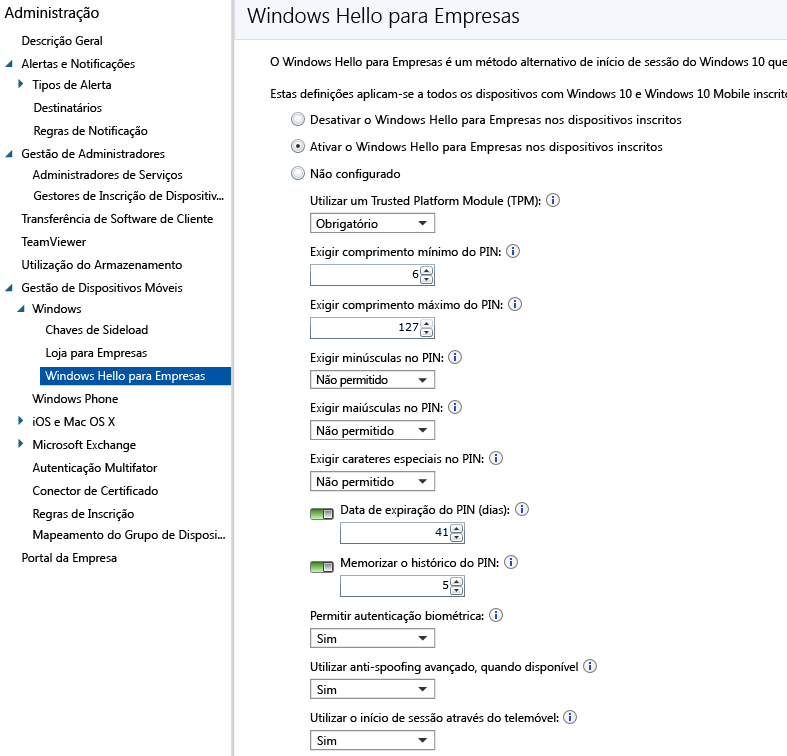

# Controlar as definições do Microsoft Passport em dispositivos com o Microsoft Intune
O Microsoft Intune permite integrar com o **Microsoft Passport for Work**, que é um método de início de sessão alternativo que utiliza o Active Directory ou uma conta do Azure Active Directory para substituir uma palavra-passe, um smart card ou um smart card virtual.

Com o Passport, pode utilizar um **gesto de utilizador** para iniciar sessão, em vez de uma palavra-passe. Um gesto de utilizador pode ser um PIN simples, uma autenticação biométrica, como o Windows Hello, ou um dispositivo externo, como um leitor de impressões digitais.

O Intune integra-se com o Passport for Work de duas formas:

-   Pode utilizar uma política do Intune para controlar os gestos que os utilizadores podem e não podem utilizar para iniciar sessão.

-   Pode armazenar certificados de autenticação no fornecedor de armazenamento de chaves (KSP) do Passport for Work. Para mais informações, consulte [Proteger o acesso a recursos com perfis de certificado no Microsoft Intune](secure-resource-access-with-certificate-profiles.md).

## Para criar um Passport para a Política de trabalho

1.  Na [consola de administração do Microsoft Intune](https://manage.microsoft.com), clique em **Admin** &gt; **Gestão de Dispositivos Móveis** &gt; **Windows** &gt; **Passport for Work** para abrir a página do Passport for Work, tal como mostrado a seguir.

    

2.  Escolha uma das seguintes definições:
    - **Desativar o Passport for Work em dispositivos inscritos** - Se não pretender utilizar o Passport for Work em dispositivos Windows 10, selecione esta definição. Todas as outras definições no ecrã estão desativadas.
    - **Ativar o Passport for Work em dispositivos inscritos** - Selecione esta definição se pretender configurar definições do Passport for Work em todos os dispositivos Windows 10.
    - **Não configurado** - Selecione esta definição se não pretender utilizar o Intune para controlar as definições do Passport for Work. Todas as definições do Passport for Work existentes em dispositivos Windows 10 não serão alteradas. Todas as outras definições no ecrã estão desativadas.
3.  Se tiver selecionado **Ativar Passport for Work em dispositivos inscritos**, configure as definições necessárias que serão aplicadas a todos os dispositivos Windows 10 e Windows 10 Mobile inscritos.
3.  Quando terminar, clique em **Guardar**.

## Passport for Work: definições de PIN

  
- **Exigir comprimento mínimo do PIN**/**Exigir comprimento máximo do PIN** - Configura os dispositivos para utilizar os comprimentos mínimo e máximo do PIN que especificar para ajudar a garantir o início de sessão seguro. O comprimento predefinido do PIN é de 6 carateres, mas pode impor um comprimento mínimo de 4 carateres. O comprimento máximo do PIN é de 127 carateres.
- **Exigir minúsculas no PIN**/**Exigir maiúsculas no PIN**/**Exigir carateres especiais no PIN** - Além disso, pode impor um PIN mais seguro, exigindo a utilização de maiúsculas, minúsculas e de carateres especiais no PIN. Escolha entre:
    - **Permitido** - Os utilizadores podem utilizar o tipo de caráter no PIN, mas não é obrigatório.
    - **Necessário** - Os utilizadores têm de incluir, pelo menos, um dos tipos de caráter no PIN. Por exemplo, é prática comum exigir pelo menos um caráter maiúsculo e um caráter especial.
    - **Não permitido** (predefinição) - Os utilizadores não podem utilizar estes tipos de carateres no PIN (este é também o comportamento se a definição não estiver configurada).
    > [!TIP]
    > Os carateres especiais incluem: **! " # $ % &amp; ' ( ) &#42; + , - . / : ; &lt; = &gt; ? @ [ \ ] ^ _ &#96; { &#124; } ~**.
- **Expiração do PIN (dias)** - É recomendável especificar um período de expiração para um PIN, após o qual os utilizadores finais têm de alterá-lo. A predefinição é de 41 dias. 
- **Memorizar histórico de PINs** - Utilize esta definição para restringir a reutilização de PINs utilizados anteriormente. Por predefinição, os últimos 5 PINs utilizados não podem ser reutilizados.

## Passport for Work: outras definições

- **Utilizar um Trusted Platform Module (TPM)** - Um chip Trusted Platform Module (TPM) fornece uma camada adicional de segurança de dados. Escolha um dos seguintes valores:
    - **Necessário** (predefinição) - Apenas os dispositivos com um TPM acessível podem aprovisionar o Passport for Work.
    - **Preferencial** - Os dispositivos tentam utilizar primeiro um TPM. Se não estiver disponível, podem utilizar a encriptação de software
- **Permitir autenticação biométrica** - Permite a autenticação biométrica, como o reconhecimento facial ou impressão digital, como alternativa a um PIN no Passport for Work. Os utilizadores continuam a ter de configurar um PIN, para a eventualidade de a autenticação biométrica falhar. Escolha entre:
    - **Sim** - O Passport for Work permite a autenticação biométrica.
    - **Não** - O Passport for Work impede a autenticação biométrica (para todos os tipos de conta).
- **Utilizar anti-spoofing avançado, quando disponível** - Configura se as funcionalidades de anti-spoofing do Windows Hello são utilizadas nos dispositivos que o suportam (por exemplo, detetar uma fotografia de um rosto em vez de um rosto real). Se estiver definido como **Sim**, o Windows requer que todos os utilizadores utilizem anti-spoofing para funcionalidades faciais, quando suportado.
- **Utilizar Passaporte Remoto** - Se esta opção estiver definida como **Sim**, os utilizadores podem utilizar um passaporte remoto para servir de dispositivo complementar portátil para autenticação de computadores de secretária. O computador de secretária tem de estar associado ao Azure Active Directory e o dispositivo complementar tem de ser configurado com um PIN do Passport for Work.

## Informações adicionais
Para obter mais informações sobre o Microsoft Passport, consulte [o guia](https://technet.microsoft.com/library/mt589441.aspx) na documentação do Windows 10.

<!--HONumber=Jun16_HO4-->

