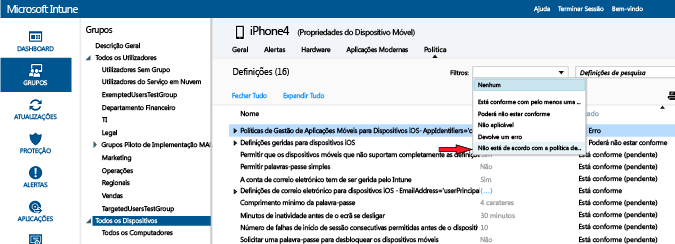

---
# required metadata

title: Implementar e monitorizar políticas de conformidade no Microsoft Intune | Microsoft Intune
description:
keywords:
author: karthikaraman
manager: jeffgilb
ms.date: 04/28/2016
ms.topic: article
ms.prod:
ms.service: microsoft-intune
ms.technology:
ms.assetid: d8f246d4-0d86-4c8b-a1bf-9977985506d8

# optional metadata

#ROBOTS:
#audience:
#ms.devlang:
ms.reviewer: jeffgilb
ms.suite: ems
#ms.tgt_pltfrm:
#ms.custom:

---

# Implementar e monitorizar políticas de conformidade de dispositivos no Microsoft Intune
## Implementar uma política de conformidade
Implemente a política de conformidade que [criou](create-a-device-compliance-policy-in-microsoft-intune.md) em um ou mais grupos de utilizadores ou dispositivos na sua organização.

1.  Na área de trabalho **Política**, selecione a política que quer implementar e, em seguida, escolha **Gerir Implementação**.

2.  Na caixa de diálogo **Gerir Implementação**, selecione um ou mais grupos nos quais quer implementar a política e escolha **Adicionar > OK**
 Utilize o resumo do estado e os alertas na página **Descrição Geral** da área de trabalho **Política** para identificar problemas com a política que necessitam da sua atenção.

> [!IMPORTANT]Para além disso, é apresentado um resumo de estado na área de trabalho **Dashboard** .

## Se não tiver implementado uma política de conformidade e, em seguida, ativar uma política de acesso condicional do Exchange, todos os dispositivos direcionados terão permissão de acesso.
Como são resolvidos os conflitos de políticas do Intune Se forem aplicadas várias políticas do Intune a um dispositivo, podem ocorrer conflitos de políticas.

-   Se as definições de políticas se sobrepuserem, o Intune utiliza as regras abaixo para resolver eventuais conflitos:

-   Se as definições em conflito pertencerem a uma política de configuração do Intune e a uma política de conformidade, as definições da política de conformidade têm prioridade sobre as definições da política de configuração, mesmo que as definições da política de configuração sejam mais seguras.

## Se tiver implementado várias políticas de conformidade, será utilizada a mais segura destas políticas.

#### Monitorizar a política de conformidade

1.  Para ver os dispositivos que não estão em conformidade com uma política de conformidade

2.  Na [consola de administração do Microsoft Intune](https://manage.microsoft.com), escolha **Grupos > Todos os Dispositivos**

3.  Faça duplo clique no nome de um dispositivo na lista de dispositivos.

4.  Escolha o separador **Política** para ver uma lista das políticas desse dispositivo.

#### Captura de ecrã que mostra a lista de opções na lista de filtros

1.  Para ver os Relatórios do Atestado de Estado de Funcionamento

2.  Na [consola de administração do Microsoft Intune](https://manage.microsoft.com), escolha **Relatórios** Na página **Relatório do Atestado de Estado de Funcionamento - criar um novo relatório**, pode ver um relatório com todos os dados do atestado de estado de funcionamento do Windows 10 recolhidos pelo Intune. Também pode utilizar os filtros para criar um relatório com um subconjunto dos dados.

## Os filtros podem basear-se no tipo de dispositivo, de sistema operativo ou apenas num subconjunto dos pontos de dados.
Passos seguintes

[Agora, pode utilizar a política de conformidade com políticas de acesso condicional para controlar o acesso aos serviços da sua organização.](restrict-access-to-email-and-o365-services-with-microsoft-intune.md)

### Restringir o acesso ao e-mail e aos serviços do O365
[Consulte também](introduction-to-device-compliance-policies-in-microsoft-intune.md)

<!--HONumber=May16_HO2-->

