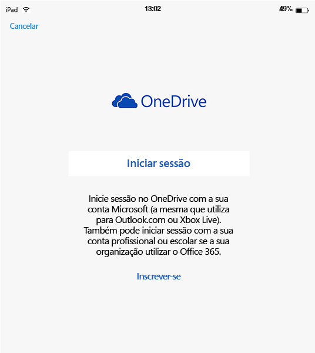
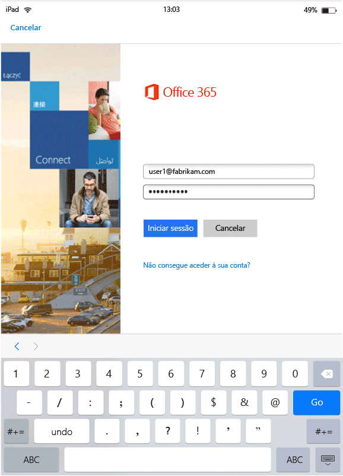
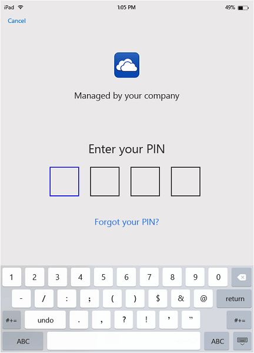
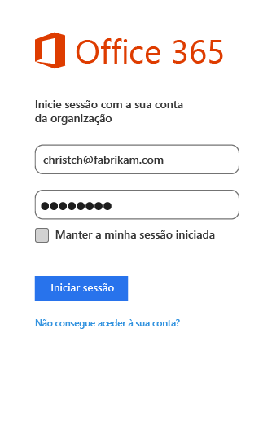
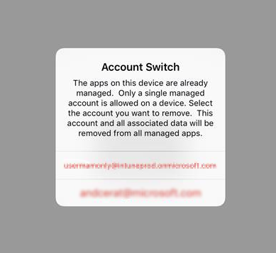

# Experiência de utilizador final para aplicações com MAM ativada com o Microsoft Intune
As políticas de gestão de aplicações móveis (MAM) apenas se aplicam quando as aplicações são utilizadas no contexto de trabalho.  Leia os seguintes cenários para compreender como funcionam as aplicações geridas.
##  Aceder ao OneDrive num dispositivo iOS

1.  Inicie a aplicação do  **OneDrive** para abrir a página de início de sessão.

    

    > [!NOTE]
    > Normalmente, num dispositivo pessoal, o utilizador final teria de transferir a aplicação.  Se o dispositivo for gerido por uma solução MDM, pode implementar a aplicação no dispositivo.

2.  Escreva o nome de utilizador da sua conta profissional. Será redirecionado para a página da **autenticação O365** para introduzir as suas credenciais de trabalho.

    

3.  Depois de as suas credenciais serem autenticadas com êxito pelo Azure AD, as políticas MAM são aplicadas e ser-lhe-á pedido que reinicie a aplicação do **OneDrive** .
  >[NOTA!] A caixa de diálogo necessária para reiniciar é apresentada apenas nos dispositivos que não estão inscritos no Intune.

    

4.  Quando reiniciar a aplicação **OneDrive**, a aplicação é iniciada com as políticas de MAM ativadas. Em seguida, é-lhe pedido que defina um **PIN** para a aplicação (caso tenha configurado a política relevante para o efeito).

    

5.  Depois de definir o PIN e confirmar, poderá aceder aos ficheiros no **OneDrive para Empresas**.

    

    > [!NOTE]
    > Quando altera uma política implementada, as alterações serão aplicadas na próxima vez que abrir a aplicação.

##  Aceder ao OneDrive num dispositivo Android

1.  Inicie a aplicação do OneDrive para abrir a página de início de sessão.

    > [!NOTE]
    > Normalmente, num dispositivo pessoal, o utilizador final teria de transferir a aplicação.  Se o dispositivo for gerido por uma solução MDM, pode implementar a aplicação no dispositivo.

2.  Escreva o nome de utilizador da sua conta profissional. Será redirecionado para a página da **autenticação O365** para introduzir as suas credenciais de trabalho.

    

3.  Depois de as suas credenciais serem autenticadas com êxito pelo **Azure AD**, verá uma mensagem a informá-lo de que é necessário instalar a aplicação do portal da empresa, caso não esteja ainda instalada no dispositivo.  Toque em **Obter a aplicação** para continuar.

>[!NOTE]
>A aplicação Portal da Empresa é necessária para todas as aplicações associadas com políticas de MAM em dispositivos Android. Em dispositivos que não estão inscritos no Intune, a aplicação tem de estar instalada no dispositivo, mas não é necessário iniciar ou iniciar sessão na aplicação.  

  

4.  Entrou na loja do **Google Play** , onde pode transferir e instalar a aplicação **Portal da Empresa** .

    A aplicação Portal da Empresa ajuda a manter os dados em segurança.

    

5.  Depois de concluir a instalação, selecione **Aceitar** para aceitar os termos.

6.  A aplicação do **OneDrive** é iniciada automaticamente.

7.  Na próxima vez que abrir o OneDrive, ser-lhe-á pedido que defina um **PIN**, desde que tenha definido a política no sentido de solicitar um PIN para aceder à aplicação do **OneDrive** .

    

8.  Depois de definir e confirmar o PIN, pode continuar a utilizar o **OneDrive**, que passa a ser gerido pelas políticas de aplicações.

##  Utilizar aplicações com suporte de várias identidades
O Microsoft Word é utilizado como exemplo para este cenário.

1.  Abra a aplicação do **Word** no seu dispositivo. Estamos a utilizar um dispositivo iOS para mostrar os passos.

2.  Toque em **Novo** para criar um novo documento do Word.

    

3.  Escreva uma frase à sua escolha.  Quando tentar guardar este documento, ambas as localizações, a de trabalho e a pessoal, são apresentadas como opções para guardar o documento que acabou de criar.  Nesta fase, as políticas de aplicações não foram ainda aplicadas, pois o contexto profissional/pessoal ainda não foi estabelecido.

4.  Guarde o documento na localização do OneDrive para Empresas. Este ficheiro fica assinalado como dados da empresa e são aplicadas as restrições da política.

    

5.  Abra o documento que guardou no local de trabalho.  Copie o texto, abra a sua conta pessoal do **Facebook** e tente colar o texto copiado.  Não deverá ser possível colar o conteúdo na nova mensagem do Facebook. A opção de colagem não está esbatida, mas não acontece nada quando prime **Colar**.

    

    

6.  Agora, repita os passos 2 e 3 para criar outro documento novo, escreva uma frase à sua escolha e, em vez de o guardar na localização de trabalho, guarde-o na localização pessoal, como, por exemplo, **OneDrive - pessoal**.

    

7.  Abra o documento pessoal guardado.  Copie o texto, abra a aplicação do **Facebook** e tente colar o texto copiado. Verá que é possível colar o conteúdo numa mensagem do Facebook.

    

##  Gerir contas de utilizador

O Intune só suporta a implementação de políticas de MAM apenas numa conta de utilizador por dispositivo. Se um dispositivo tiver mais do que uma conta profissional, apenas uma conta profissional é gerida pelas políticas de MAM.

Consoante a aplicação que estiver a utilizar, o segundo utilizador poderá ou não estar bloqueado no dispositivo. No entanto, em todos os casos, apenas o primeiro utilizador que obtém as políticas de MAM é afetado pela política.

Se um dispositivo tiver várias contas de utilizador existentes antes de as políticas de MAM serem implementadas, a conta em que as políticas de MAM são implementadas em primeiro lugar é gerida pelas políticas de MAM do Intune.

O **Microsoft Word**, **Excel** e **PowerPoint** não bloqueiam uma segunda conta de utilizador, mas a segunda conta de utilizador não é afetada pelas políticas de MAM.  

Nas **aplicações OneDrive e Outlook**, só pode utilizar uma conta profissional.  Não é permitido adicionar várias contas profissionais nestas aplicações.  Pode, contudo, remover um utilizador e adicionar um utilizador diferente no dispositivo.

Leia o cenário de exemplo abaixo para obter uma compreensão mais aprofundada de como são tratadas as várias contas de utilizador.

O utilizador A trabalha para duas empresas - a **Empresa X** e a **Empresa Y**. O utilizador A tem uma conta profissional para cada empresa e ambas utilizam o Intune para implementar políticas de MAM. A **Empresa X** implementa políticas de MAM **antes da** **Empresa Y**. A conta associada à **Empresa X** obterá a política de MAM, mas a conta associada à Empresa Y não. Se pretender que a conta de utilizador associada à Empresa Y seja gerida pelas políticas de MAM, tem de remover a conta de utilizador associada à Empresa X.
### Adicionar uma segunda conta
#### iOS
Se estiver a utilizar um dispositivo iOS, quando tentar adicionar uma segunda conta profissional no mesmo dispositivo, poderá ver uma mensagem a informá-lo de que essa ação não é permitida.  Também verá uma opção para remover a conta existente e adicionar uma nova. Se é o que pretende, selecione **Sim**.

####  Android
Se estiver a utilizar um dispositivo Android, poderá ver uma mensagem a informá-lo de que essa ação não é permitida, com instruções sobre como remover a conta existente e adicionar uma nova.  Nos dispositivos Android, para remover a conta existente, vá para **Definições &gt;Geral &gt; Gestor de Aplicações &gt;Portal da Empresa e selecione "Limpar Dados"**.

##  Ver ficheiros de multimédia para com a aplicação de partilha Rights Management
Para ver ficheiros AV, PDF e de imagem da empresa em dispositivos Android, utilize a [aplicação de partilha Microsoft Rights Management (RMS)](https://play.google.com/store/apps/details?id=com.microsoft.ipviewer).

Transfira esta aplicação a partir da loja Google Play.  Quando a aplicação estiver instalada no seu dispositivo, inicie a aplicação e autentique-se com as credenciais da empresa. Agora, deverá conseguir ver os ficheiros protegidos e não protegidos de outras aplicações geridas por políticas.

São suportados os seguintes tipos de ficheiro:

* **Áudio:** AAC LC, HE-AACv1 (AAC+), HE-AACv2 (AAC+ melhorado), AAC ELD (AAC de atraso lento melhorado), AMR-NB, AMR-WB, FLAC, MP3, MIDI, Vorbis, PCM/WAVE.
* **Vídeo:** H.263, H.264 AVC, MPEG-4 SP, VP8.
* **Imagem:** jpg, pjpg, png, ppng, bmp, pbmp, gif, pgif, jpeg, pjpeg.
* PDF, PPDF

------------
|**pfile**|**texto**|
|----|----|
|Pfile é um formato de "encapsulamento" genérico para ficheiros protegidos que encapsula o conteúdo encriptado e as licenças de RMS e pode ser utilizado para proteger qualquer tipo de ficheiro.|Os ficheiros de texto, incluindo XML, CSV, etc. podem ser abertos para visualização na aplicação, mesmo que estejam protegidos. Tipos de ficheiro: txt, ptxt, csv, pcsv, log, plog, xml, pxml.|
---------------
**Dispositivos Android que não estão inscritos no Intune**

Antes de poder utilizar a aplicação de partilha RMS para ver os ficheiros de outras aplicações geridas pelo Intune, inicie a aplicação RMS e autentique-se com a sua conta profissional.  Quando iniciar sessão, verá a seguinte mensagem **apenas se não tiver uma licença RMS**:

**Autenticação Bem-sucedida – pode agora visualizar ficheiros empresariais, mas a sua organização não está configurada para lhe permitir proteger ficheiros. Contacte o seu administrador de TI para obter mais detalhes.**

Isto não o impede de utilizar a aplicação de partilha RMS para ver os ficheiros da empresa. Ainda pode abrir e ver os ficheiros da empresa a partir de outras aplicações geridas pelo Intune, e as políticas de MAM ainda são aplicáveis.  O que esta mensagem diz é que não poderá adicionar as capacidades de proteção adicionais que a aplicação de partilha RMS fornece.  Tem de ter uma licença RMS para adicionar uma proteção aos seus ficheiros. Para saber mais sobre as funcionalidades de proteção RMS de ficheiros, consulte [Proteger um ficheiro num dispositivo](https://docs.microsoft.com/en-us/rights-management/rms-client/sharing-app-protect-in-place) e [Proteger um ficheiro que partilha por e-mail](https://docs.microsoft.com/en-us/rights-management/rms-client/sharing-app-protect-by-email).

### Consulte também
[Criar e implementar políticas de gestão de aplicações móveis com o Microsoft Intune](create-and-deploy-mobile-app-management-policies-with-microsoft-intune.md)

<!--HONumber=Jul16_HO4-->

