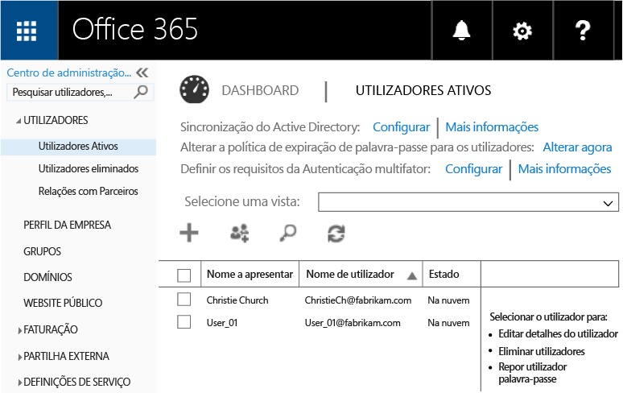
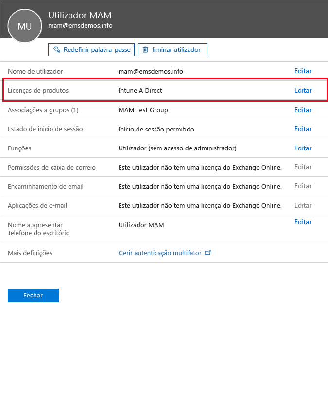
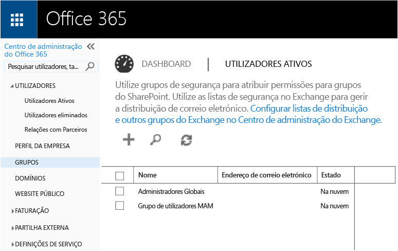
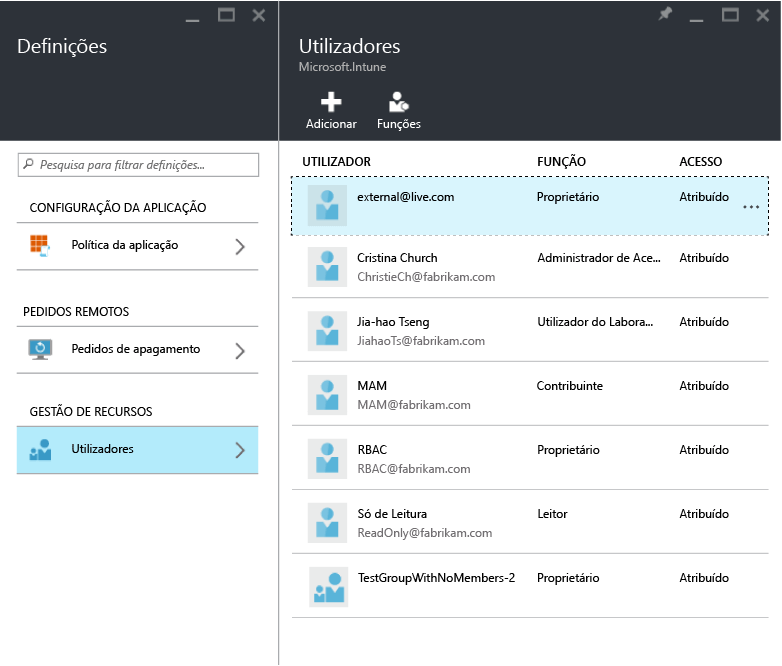
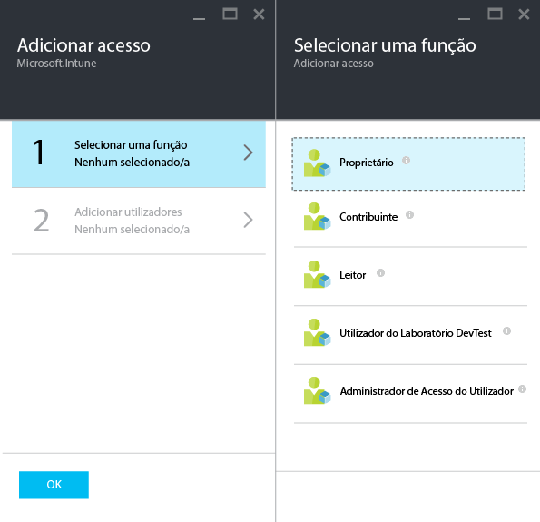
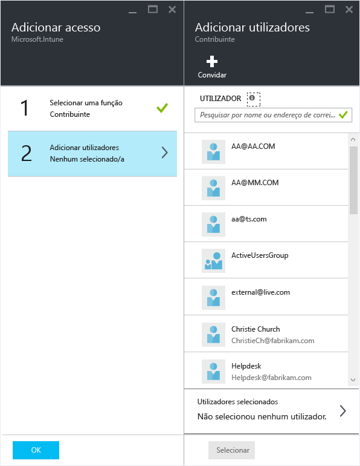

# Configurar políticas de gestão de aplicações móveis com o Microsoft Intune
Este tópico descreve o que tem de fazer antes de poder criar políticas de gestão de aplicações móveis (MAM) no portal do Azure.

O portal do Azure é a nova consola de administração para a criação de políticas de MAM. Recomendamos que utilize este portal para criar as políticas de MAM. O portal do Azure suporta os seguintes cenários de MAM:
- Dispositivos que estão inscritos no Intune
- Dispositivos que são geridos por uma solução de MDM de terceiros
- Dispositivos que não são geridos por nenhuma solução de MDM (BYOD).

Se estiver a utilizar o portal do Azure, leia o [Portal do Azure para políticas de MAM do Microsoft Intune](azure-portal-for-microsoft-intune-mam-policies.md) para obter uma descrição geral rápida.

>[!IMPORTANT]

> Se estiver a utilizar a consola de administração do Intune para gerir os seus dispositivos, pode criar políticas de MAM que suportem aplicações para dispositivos inscritos no Intune com a consola de administração do Intune. Contudo, recomendamos que utilize o portal do Azure, mesmo para dispositivos que estejam inscritos no Intune. Para obter instruções sobre como criar uma política de MAM com a consola de administração do Intune, veja [Configure and deploy mobile application management policies in the Microsoft Intune console (Configurar e implementar políticas de gestão de aplicações móveis na consola do Microsoft Intune)](configure-and-deploy-mobile-application-management-policies-in-the-microsoft-intune-console.md).

> Poderá não ver todas as definições de política de MAM na consola de administração do Intune. Se criar políticas de MAM na consola de administração do Intune e no portal do Azure, a política no portal do Azure é aplicada às aplicações e implementada nos utilizadores.
> As políticas de MAM criadas na consola de administração do Intune não podem ser importadas para o portal do Azure.  Têm de ser recriadas no portal do Azure.

##  Plataformas suportadas
- iOS 8.1 ou posterior

- Android 4 ou posterior

Os dispositivos Windows não são atualmente suportados.
##  Aplicações suportadas
* **Aplicações da Microsoft:** estas aplicações têm o SDK da Aplicação do Intune incorporado e não requerem processamento adicional antes de aplicar as políticas de MAM.
Para ver a lista completa de aplicações da Microsoft suportadas, aceda à [Galeria de aplicações móveis do Microsoft Intune](https://www.microsoft.com/en-us/server-cloud/products/microsoft-intune/partners.aspx), na página de parceiros de aplicações do Microsoft Intune. Clique numa aplicação para ver os cenários e as plataformas suportados e se suporta várias identidades.
* **As aplicações de linha de negócio da sua organização:** é necessário preparar as aplicações para incluir o SDK da Aplicação do Intune antes de poder aplicar políticas de MAM.

  * Para saber que dispositivos são geridos pelo Intune, consulte [Decidir como preparar as aplicações para MAM](decide-how-to-prepare-apps-for-mobile-application-management-with-microsoft-intune.md).
  * Para saber que dispositivos não são geridos (como dispositivos pertencentes aos empregados) ou que são geridos por uma solução de gestão de dispositivos móveis de terceiros, veja [Proteger aplicações e dados de linha de negócio em dispositivos não inscritos no Intune](protect-line-of-business-apps-and-data-on-devices-not-enrolled-in-microsoft-intune.md).

*Antes* de poder configurar políticas de MAM, precisa do seguinte:

-   Uma subscrição do Microsoft Intune.    Os utilizadores precisam de licenças do [!INCLUDE[wit_nextref](../includes/wit_nextref_md.md)] para obter aplicações com a política de MAM.

-   Uma subscrição do Office 365, que é necessária para o seguinte:
  - Para aplicar políticas de MAM a aplicações com suporte de várias identidades.
  - Criar contas profissionais do SharePoint Online e do Exchange Online. O Exchange no local e o SharePoint no local não são suportados.
-   Configuração do Skype para Empresas Online para autenticação moderna. Para obter mais informações, veja [Enable modern authentication (Ativar autenticação moderna)](http://social.technet.microsoft.com/wiki/contents/articles/34339.skype-for-business-online-enable-your-tenant-for-modern-authentication.aspx.md).

- Azure Active Directory (Azure AD) para criar utilizadores. O Azure AD autentica os utilizadores quando abrem a aplicação e introduzem as respetivas credenciais de trabalho.

    > [!NOTE]
    > Se estiver a configurar os utilizadores com a consola do [!INCLUDE[wit_nextref](../includes/wit_nextref_md.md)], tenha em atenção que a configuração da política de MAM é mover para o portal do Azure. Para utilizar este portal, tem de configurar grupos de utilizadores do Azure AD com o portal do Office 365.

## Criar utilizadores e atribuir licenças do Microsoft Intune

1. Confirme que tem uma subscrição do Intune. Já tem uma subscrição do [!INCLUDE[wit_nextref](../includes/wit_nextref_md.md)] se estiver a utilizar atualmente o [!INCLUDE[wit_nextref](../includes/wit_nextref_md.md)] para gerir os dispositivos.  Também tem uma subscrição do [!INCLUDE[wit_nextref](../includes/wit_nextref_md.md)] se tiver comprado uma licença do Enterprise Mobility Suite (EMS). Se estiver a tentar [!INCLUDE[wit_nextref](../includes/wit_nextref_md.md)] verificar as capacidades do MAM, pode obter uma conta de avaliação na [página Web do Microsoft Intune](http://www.microsoft.com/en-us/server-cloud/products/microsoft-intune/).

    Para verificar se tem uma subscrição do [!INCLUDE[wit_nextref](../includes/wit_nextref_md.md)] , no portal do Office, aceda à página de **Faturação**.  Deverá ver [!INCLUDE[wit_nextref](../includes/wit_nextref_md.md)] como **Ativo** nas subscrições.

2.  Inicie sessão no [portal do Office](http://portal.office.com) com as suas credenciais de administrador.

3.  Navegue para a página **Utilizadores Ativos** para adicionar utilizadores e atribuir licenças do [!INCLUDE[wit_nextref](../includes/wit_nextref_md.md)].

    

    

4.  Para permitir a um utilizador aceder ao portal do Office, ao portal do Azure AD e ao portal do Azure, atribua-lhe a função **Administrador global**.

    

5.  As políticas de MAM são implementadas em grupos de utilizadores no Azure Active Directory. Para criar grupos de utilizadores para as políticas de MAM, aceda à página **Grupos** no portal do Office e escolha a opção **Adicionar um grupo** no menu superior para criar um novo grupo de segurança.  Escreva um nome e uma descrição e clique em **Criar**. Quando o grupo for criado, pode adicionar utilizadores ao mesmo ao clicar em **Editar membros**. O grupo de segurança é criado no Azure Active Directory.

    

A tabela seguinte lista as funções e as permissões que pode atribuir aos utilizadores administradores.

|||
|--|----|
|**Função**|**Permissões**|
|Administrador global (portal do Office 365)|Acesso ao portal do Office 365 e ao portal do Azure AD.  Acesso ao portal do Azure (pode fazer tarefas de gestão de funções e de aplicações móveis).|
|Proprietário (portal do Azure)|Acesso ao portal do Azure (pode fazer tarefas de gestão de funções e de aplicações móveis).|
|Contribuidor (portal do Azure)|Acesso ao portal do Azure (só pode fazer tarefas de gestão de aplicações móveis).|

## Atribuir a função de contribuinte a um utilizador

Os Administradores globais têm acesso ao [portal do Azure](https://portal.azure.com).  Se quiser que outros utilizadores administradores possam configurar políticas e fazer outras tarefas de gestão de aplicações móveis, pode atribuir-lhes a função de contribuidor:

1.  No painel **Definições**, na secção **Gestão de recursos**, clique em **Utilizadores**.

    

2.  Clique em **Adicionar** para abrir o painel **Adicionar acesso** .

3.  Clique em **Selecionar uma função**e, em seguida, em **Contribuidor**.

    

4.  Clique em **Adicionar utilizador** e procure-o por nome ou endereço de e-mail. Os utilizadores que vê nesta lista são os primeiros mil utilizadores que criou anteriormente no Azure AD através do portal do Office. Clique em **OK** no painel **Adicionar acesso** para guardar e atribuir a função ao utilizador.

    

    > [!IMPORTANT]
    > Se selecionar um utilizador que não tenha uma licença do [!INCLUDE[wit_nextref](../includes/wit_nextref_md.md)] atribuída, este não poderá aceder ao portal.

## Passos seguintes
[Criar e implementar políticas de gestão de aplicações móveis com o Microsoft Intune](create-and-deploy-mobile-app-management-policies-with-microsoft-intune.md)

<!--HONumber=Jul16_HO4-->

