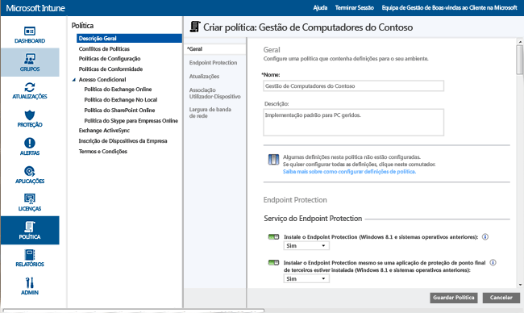
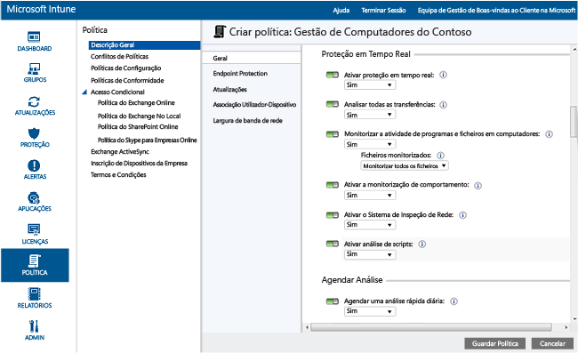
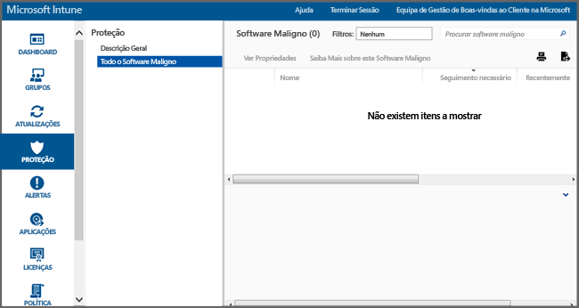

---
# required metadata

title: Endpoint Protection para PCs Windows | Microsoft Intune
description:
keywords:
author: NathBarn
manager: jeffgilb
ms.date: 04/28/2016
ms.topic: article
ms.prod:
ms.service: microsoft-intune
ms.technology:
ms.assetid: 002241bf-6cd0-4c75-a4f0-891ac7e6721a

# optional metadata

#ROBOTS:
#audience:
#ms.devlang:
ms.reviewer: jeffgilb
ms.suite: ems
#ms.tgt_pltfrm:
#ms.custom:

---

# Ajude a proteger os PCs Windows com o Endpoint Protection para o Microsoft Intune
O Microsoft Intune pode ajudá-lo a proteger os seus computadores geridos de variadas formas, incluindo o Endpoint Protection, que fornece proteção em tempo real contra ameaças de software maligno, mantém as definições de software maligno atualizadas e efetua análises automáticas nos computadores. O Endpoint Protection também fornece ferramentas que o ajudam a gerir e monitorizar ataques de software maligno.

Se ainda não instalou o cliente Intune nos seus computadores, consulte o artigo [Instalar o cliente do PC Windows com o Microsoft Intune](install-the-windows-pc-client-with-microsoft-intune.md)

Utilize as informações das secções seguintes para o ajudar a configurar, implementar e monitorizar o Endpoint Protection.

## Escolher quando utilizar o Endpoint Protection
Como administrador de TI, uma das suas principais prioridades é manter os computadores que gere sem software maligno e vírus. Antes de implementar o Intune em PCs Windows na sua organização, deve decidir como pretende proteger os seus computadores ao selecionar uma das seguintes opções e configurar as definições de política associadas:

|Pretendo:|Definições de política do Endpoint Protection|Mais informações|
|--------------|---------------------------------------|--------------------|
|Utilizar o Endpoint Protection do Microsoft Intune apenas se não existir uma aplicação de Endpoint Protection de terceiros instalada.  Pode utilizar o Endpoint Protection do Microsoft Intune em todos os computadores nos quais não se encontre instalada nenhuma aplicação de Endpoint Protection de terceiros instalada.|Instalar o Endpoint Protection = **Sim**  Ativar o Endpoint Protection = **Sim**  Instalar o Endpoint Protection mesmo que se encontre instalada uma aplicação do Endpoint Protection de terceiros = **Não**|Caso seja detetada uma aplicação de Endpoint Protection de terceiros, o Endpoint Protection do Microsoft Intune não será instalado. Se já tiver sido instalado, será desinstalado.|
|Utilizar o Endpoint Protection do Microsoft Intune mesmo que exista uma aplicação de Endpoint Protection de terceiros instalada.  Com esta abordagem, executará o Endpoint Protection do Microsoft Intune e a aplicação de Endpoint Protection de terceiros em simultâneo. Esta configuração não é recomendada devido a potenciais problemas de desempenho.|Instalar o Endpoint Protection = **Sim**  Ativar o Endpoint Protection = **Sim**  Instalar o Endpoint Protection mesmo que se encontre instalada uma aplicação do Endpoint Protection de terceiros = **Sim**|Utilize se:  -   Pretender passar a utilizar o Endpoint Protection do Microsoft Intune. -   Implementar um novo cliente que irá utilizar o Endpoint Protection do Microsoft Intune. -   Atualizar qualquer cliente que irá utilizar o Endpoint Protection do Microsoft Intune.|
|Utilizar o Intune sem o Endpoint Protection do Microsoft Intune. Em alternativa, utilizará uma aplicação do Endpoint Protection de terceiros.|Instalar o Endpoint Protection = **Não**|Esta configuração não é recomendada se não estiver a utilizar uma aplicação do Endpoint Protection de terceiros, pois esta pode expor os computadores da sua organização a software maligno ou a outros ataques.  O Endpoint Protection do Microsoft Intune não se encontra instalado. Caso tenha sido instalado anteriormente, será desinstalado.|
Para mudar da sua aplicação de Endpoint Protection atual para o Endpoint Protection do Microsoft Intune, efetue o seguinte:

1.  Deixe a sua aplicação de Endpoint Protection atual em execução enquanto implementa o software de cliente Intune nesses computadores.

2.  Confirme que o Endpoint Protection do Microsoft Intune está instalado e que está a ajudar a proteger os computadores cliente.

3.  Remova o software do Endpoint Protection de terceiros ao:

    -   Utilizar a distribuição de software do Intune para implementar uma ferramenta de remoção de software fornecida pelo fabricante da aplicação de Endpoint Protection de terceiros. Para mais informações, consulte o artigo [Implementar aplicações com o Microsoft Intune](deploy-apps.md).

    -   Remover a aplicação do Endpoint Protection de terceiros manualmente.

> O Intune não desinstalará automaticamente aplicações de Endpoint Protection de terceiros.

## Como configurar o Endpoint Protection do Microsoft Intune
Utilize os seguintes passos para o ajudar a configurar o Endpoint Protection do Microsoft Intune.

1.  Na [consola de administração do Microsoft Intune](https://manage.microsoft.com/), clique em **Política** > **Adicionar Política**

2.  Expanda **Gestão de Computadores** e selecione **Definições do Agente do Microsoft Intune**. Selecione **Criar e Implementar uma Política Personalizada** para especificar a política para definições do Endpoint Protection e, em seguida, clique no botão **Criar Política**. Pode utilizar definições recomendadas ou personalizar as mesmas. Se precisar de mais informações sobre como criar e implementar políticas, consulte o tópico [Tarefas de gestão comuns do PC Windows com o cliente do computador do Microsoft Intune](common-windows-pc-management-tasks-with-the-microsoft-intune-computer-client.md).

  

Pode ver a política implementada do Endpoint Protection na página **Todas as Políticas** da área de trabalho **Política**.

## Definições de serviço do Endpoint Protection

|Definição de política|Detalhes|
|------------------|--------------------|
|**Instalar o Endpoint Protection**|Defina como **Sim** para instalar o Endpoint Protection em computadores geridos. Se uma aplicação de Endpoint Protection de terceiros for detetada durante a instalação, o Endpoint Protection só será instalado se a opção **Instalar o Endpoint Protection mesmo que se encontre instalada uma aplicação de Endpoint Protection de terceiros** estiver definida como **Sim**. **Nota:** O Endpoint Protection do Intune está instalado nos computadores geridos por predefinição. Se não pretender o Endpoint Protection seja instalado nos seus computadores geridos, tem de definir explicitamente esta política como **Não**. Se o Endpoint Protection tiver sido anteriormente instalado e a política for atualizada para **Não**, o cliente do Endpoint Protection será desinstalado. Valor recomendado: **Sim** Instalar o Endpoint Protection mesmo que se encontre instalada uma aplicação do Endpoint Protection de terceiros|
|**Defina como **Sim** para instalar o Endpoint Protection do Microsoft Intune mesmo que seja detetada uma aplicação de Endpoint Protection de terceiros.**|Valor recomendado: **Sim**  Ativar o Endpoint Protection|
|**Defina como **Sim** para ativar o Endpoint Protection do Microsoft Intune nos computadores que têm o cliente Endpoint Protection.**|Se definir como **Não**, e o Endpoint Protection do Microsoft Intune estiver instalado, a interface de utilizador do cliente Endpoint Protection não será apresentada aos utilizadores e todas as funcionalidades de proteção estarão inativas.  Valor recomendado: **Sim**  Desativar IU de Cliente|
|**Defina como **Sim** para ocultar a interface de utilizador do cliente Endpoint Protection do Microsoft Intune dos utilizadores (é necessário reiniciar o computador cliente para que as alterações sejam aplicadas).**|Valor recomendado: **Não**  Instalar o Endpoint Protection mesmo que se encontre instalada uma aplicação do Endpoint Protection de terceiros|
|**Defina como **Sim** para forçar a instalação do Endpoint Protection do Microsoft Intune, mesmo que seja detetada uma aplicação de Endpoint Protection de terceiros.**|Valor recomendado: **Não**  Criar um ponto de restauro do sistema antes de remediação de software maligno|
|**Defina como **Sim** para criar um Ponto de Restauro do Sistema do Windows antes do início de remediações de software maligno.**|Valor recomendado: **Sim**  Controlar software maligno resolvido (dias)|
|**Permite ao Endpoint Protection controlar software maligno resolvido durante um período de tempo específico, para que possa verificar manualmente computadores anteriormente infetados.**|Pode especificar um valor de 0 a 30 dias.  Valor recomendado: **7 dias**  Se tiver definido os valores da política para **Instalar o Endpoint Protection** e **Ativar o Endpoint Protection** como **Sim** e o valor de política para  **Instalar o Endpoint Protection mesmo que se encontre instalada uma aplicação do Endpoint Protection de terceiros** como **Não**, o Endpoint Protection do Microsoft Intune detetará que existe outra aplicação de Endpoint Protection instalada e não será instalado ou será desinstalado, caso já se encontre presente. No entanto, o Endpoint Protection do Microsoft Intune cria relatórios relativos ao estado de funcionamento da outra aplicação de Endpoint Protection no Intune.|
Proteção em tempo real é como o Microsoft Security Essentials alerta o utilizador quando potenciais ameaças, tais como vírus e spyware, estão a tentar instalar-se ou a executar no seu PC.

  No momento em que isto acontece, verá uma mensagem na área de notificação na extremidade direita da barra de tarefas Definições de proteção em tempo real

### Definição de política

|Detalhes|Ativar proteção em tempo real|
|------------------|--------------------|
|**Ativa a monitorização e análise de todos os ficheiros e aplicações acedidos.**|Também bloqueia aplicações e ficheiros maliciosos antes de estes serem executados em computadores. Valor recomendado: **Sim**  Analisar todas as transferências|
|**Permite a análise de todos os ficheiros e anexos transferidos da Internet para computadores.**|Valor recomendado: **Sim**  Monitorizar a atividade de programas e ficheiros em computadores|
|**Ativa a monitorização da atividade de ficheiros recebidos e de ficheiros enviados e de programas em computadores.**|Com esta definição, o Endpoint Protection pode monitorizar a altura em que os ficheiros e programas começam a ser executados e alertá-lo relativamente a ações realizadas pelos mesmos ou ações efetuadas nos mesmos. Valor recomendado: **Sim**  Ficheiros monitorizados|
|**Se a opção **Monitorizar a atividade de ficheiros e de programas em computadores** estiver ativada, esta definição permite-lhe optar por monitorizar apenas ficheiros recebidos, apenas ficheiros enviados ou todos os ficheiros.**|Valor recomendado: **Monitorizar todos os ficheiros**  Ativar a monitorização de comportamento|
|**Permite ao Endpoint Protection do Microsoft Intune verificar a existência de padrões específicos de atividades suspeitas em computadores cliente.**|Valor recomendado: **Sim**  Ativar o Sistema de Inspeção de Rede|
|**Ativa o Sistema de Inspeção de Rede (NIS) em computadores cliente.**|O NIS utiliza assinaturas de vulnerabilidades conhecidas do [Centro Microsoft de Proteção Contra Software Maligno](http://go.microsoft.com/fwlink/?LinkId=234249) para ajudar a detetar e a bloquear tráfego de rede malicioso. Valor recomendado: **Sim**  Definições em tempo real para o Endpoint Protection|

  

### Definição de política

|Mais informações|Agendar uma análise rápida diária|
|------------------|--------------------|
|**Agenda uma análise rápida diária de ficheiros utilizados frequentemente e de ficheiros de sistema importantes em computadores.**|Esta análise rápida afeta pouco o desempenho. Valor recomendado: **Sim**  Executar uma análise rápida caso não tenham ocorrido duas análises consecutivas|
|**Configura o Endpoint Protection para que execute automaticamente uma análise rápida em computadores, caso não tenham ocorrido duas análises rápidas agendadas consecutivas.**|Valor recomendado: **Sim**  Agendar uma análise completa|
|**Configura uma análise completa de todos os ficheiros e recursos nos discos rígidos locais dos computadores.**|Esta análise pode demorar algum tempo e pode afetar o desempenho do computador (dependendo do número de ficheiros e recursos analisados). Valor recomendado: **Não**  Executar uma análise completa caso não tenham ocorrido duas análises completas consecutivas|
|**Configura o Endpoint Protection para que execute automaticamente uma análise completa em computadores, caso não tenham ocorrido duas análises completas agendadas consecutivas.**|Valor recomendado: Não configurado  Definições de opções de análise|

### Definição de política

|Detalhes|Executar uma análise completa após a instalação do Endpoint Protection|
|------------------|--------------------|
|**Configura o Endpoint Protection para que execute automaticamente uma análise completa do sistema após a respetiva instalação em computadores.**|Esta análise apenas é executada quando os computadores estão inativos, de forma a minimizar as consequências na produtividade do utilizador. Valor recomendado: **Sim**  Executar automaticamente uma análise completa, quando necessário, após remoção de software maligno|
|**Defina como **Sim** para permitir que o Endpoint Protection execute automaticamente uma análise completa do sistema em computadores após a remoção de software maligno, para ajudar a confirmar que não foram afetados outros ficheiros.**|Valor recomendado: **Sim**  Iniciar uma análise agendada apenas quando o computador estiver inativo|
|**Defina como **Sim** para impedir o início de análises agendadas quando os computadores estiverem a ser utilizados, de modo a evitar perda de produtividade por parte dos utilizadores.**|Valor recomendado: **Sim**  Verificar as definições de software maligno mais recentes antes de iniciar uma análise|
|**Defina como **Sim** para permitir que o Endpoint Protection verifique automaticamente as definições de software maligno mais recentes antes de iniciar uma análise em computadores.**|Valor recomendado: **Sim**  Analisar ficheiros de arquivo|
|**Defina como **Sim** para configurar o Endpoint Protection para procurar software maligno em ficheiros de arquivo (como ficheiros .zip ou .cab) em computadores.**|Valor recomendado: **Não**  Analisar mensagens de e-mail|
|**Defina como **Sim** para configurar o Endpoint Protection para analisar mensagens de e-mail recebidas quando estas chegam aos computadores.**|Valor recomendado: **Sim**  Analisar ficheiros abertos a partir de pastas partilhadas na rede|
|**Defina como **Sim** para configurar o Endpoint Protection para analisar ficheiros abertos a partir de pastas partilhadas na rede.**|Normalmente, estes ficheiros são acedidos através de um caminho UNC. A ativação desta funcionalidade pode causar problemas a utilizadores com acesso só de leitura, uma vez que não podem remover software maligno. Valor recomendado: **Não**  Analisar unidades de rede mapeadas|
|**Defina como **Sim** para configurar o Endpoint Protection para analisar ficheiros em unidades de rede mapeadas.**|A ativação desta funcionalidade pode causar problemas a utilizadores com acesso só de leitura, uma vez que não podem remover software maligno. Valor recomendado: **Não**  Analisar unidades amovíveis|
|**Defina como **Sim** para configurar o Endpoint Protection para procurar software maligno e software indesejado em unidades amovíveis, como pens USB, quando executa uma análise completa em computadores.**|Valor recomendado: **Sim**  Limitar a utilização da CPU durante a análise|
|**Configura a percentagem máxima de utilização da CPU que pode ser utilizada durante análises agendadas em computadores.**|Pode definir este valor de 1 a 100 %. Valor recomendado: **50%**  Definições de ações predefinidas|

### A definição **Escolher como o Endpoint Protection age em software maligno dos seguintes níveis de alerta** especifica a ação predefinida que o Endpoint Protection executa quando é detetado software maligno de vários níveis de alerta.

Para cada nível de alerta, pode remover o software maligno, colocá-lo em quarentena ou efetuar a ação recomendada da Microsoft. Valor recomendado: **Ação recomendada** que permite que o Endpoint Protection recomende uma ação. Definições de pastas e ficheiros excluídos   

### A definição **Ficheiros e pastas a serem excluídos ao executar uma análise ou utilizar a proteção em tempo real** exclui ficheiros ou pastas específicos quando uma análise é executada ou quando a proteção em tempo real é utilizada em computadores.

Definições de processos excluídos

### A definição **Processos a serem excluídos ao executar uma análise ou utilizar a proteção em tempo real** permite excluir processos específicos quando uma análise é executada ou da proteção em tempo real.

Só pode excluir ficheiros com as seguintes extensões: **.exe**, **.com** ou **.scr** Definições de tipos de ficheiro excluídos

### A definição **Extensões de ficheiros a serem excluídas ao executar uma análise ou ao utilizar a proteção em tempo real** permite excluir extensões de nome de ficheiro específicas quando uma análise é executada ou quando a proteção em tempo real é utilizada em computadores.

Definições do Serviço de Proteção Ativa Microsoft

### O Serviço de Proteção Ativa Microsoft é uma comunidade online que o ajuda a decidir como reagir a potenciais ameaças.
A comunidade também ajuda a parar a propagação de novas infeções de software maligno. Pode **Aderir ao Serviço de Proteção Ativa Microsoft**, selecionando **Sim** e, em seguida, especificando o **Nível de Associação**: **Básico** - Envia informações básicas sobre software maligno detetado à Microsoft.
  - Estas informações incluem a origem do software, as ações aplicadas por si ou que o Endpoint Protection aplica automaticamente e se as mesmas tiveram êxito. **Avançado** - Envia mais informações sobre software maligno, spyware e software potencialmente indesejado à Microsoft.
  - São incluídos a localização do software, os nomes de ficheiros, a forma como o software funciona e como afetou o seu computador. Também pode **Receber definições dinâmicas baseadas em relatórios do Serviço de Proteção Ativa Microsoft**

Tarefas de gestão do Endpoint Protection

## As tarefas seguintes ajudam-no a realizar várias tarefas de gestão em computadores geridos que executam o Endpoint Protection.
Atualizar definições de software maligno
 - Consola do Intune - Na área de trabalho **Grupos**, selecione os computadores que pretende atualizar.
  - Clique em **Tarefas Remotas** &gt; **Atualizar Definições de Software Maligno** Computador gerido - Inicie o software do cliente Endpoint Protection a partir da área de notificação do Windows.
  - Clique no separador **Atualizar** e, em seguida, clique em **Atualizar**. Executar uma análise de software maligno:
 - Consola do Intune - Na área de trabalho **Grupos**, selecione os computadores que pretende analisar.
  - Clique em **Executar uma Análise Completa de Software Maligno** ou em **Executar uma Análise Rápida de Software Maligno**. Computador gerido - Inicie o software do cliente Endpoint Protection a partir da área de notificação do Windows.
  - Selecione **Rápida**, **Completa**ou **Personalizada** e, em seguida, clique em **Analisar agora**. Pode ver o estado de uma tarefa remota ao clicar na ligação **Tarefas Remotas** no canto inferior direito da consola do Intune.

A caixa de diálogo **Estado da Tarefa Remota** apresenta as tarefas remotas atuais, o estado da tarefa, o nome do dispositivo, os erros reportados e fornece uma ligação para informações de resolução de problemas, caso aplicável. Monitorizar o Endpoint Protection

## Pode monitorizar o estado de software maligno nos seus computadores ao utilizar a área de trabalho **Proteção** da [consola de administração do Microsoft Intune](https://manage.microsoft.com/).
Esta área de trabalho contém duas páginas: **Descrição Geral da Proteção** - Apresenta problemas importantes como ligações nas quais pode clicar para obter mais informações.
 - Os problemas que podem ser apresentados incluem: **Instâncias de software maligno que necessitam de seguimento** - Clique na ligação para ver uma lista de problemas de software maligno, incluindo a ação de seguimento necessária para resolver o problema.
  - Pode pormenorizar mais esta lista para ver quais os computares que foram afetados. **Computadores com software maligno que necessita de seguimento** - Clique na ligação para ver todos os computadores com problemas de software maligno não resolvidos, incluindo a ação de seguimento necessária para resolver o problema.
  - **Dispositivos não protegidos** - Clique na ligação para ver computadores não protegidos por software do Endpoint Protection, devido à não instalação do software ou a um erro.
  - Selecione um computador para ver mais detalhes. **Dispositivos com outra aplicação do Endpoint Protection em execução** - Clique na ligação para ver computadores com uma aplicação do Endpoint Protection de terceiros em execução.
  - **Todo o Software Maligno** - Apresenta uma lista de todo o software maligno ativo encontrado nos seus computadores.
 - Pode explorar esta lista para ver todos os computadores afetados por um software maligno específico ou pode selecionar uma das seguintes tarefas: **Ver Propriedades** - Abre uma página com mais informações sobre o software maligno selecionado.
  - **Saber Mais Sobre Este Software Maligno** - Abre um tópico do Centro Microsoft de Proteção Contra Software Maligno com mais informações sobre o software maligno.
  - A área de trabalho **Proteção** só é apresentada na consola do administrador quando tiver instalado o cliente e estiver a gerir, no mínimo, um cliente do computador.

> Monitorizar o Endpoint Protection

  

### O Intune pode apresentar os caminhos correspondentes a um máximo de dez instâncias de software maligno detetadas mais recentemente num dispositivo.
O **Caminho de Deteção Recente** está desativado por predefinição. Para ativar esta vista: Na [consola de administração do Microsoft Intune](https://manage.microsoft.com/), aceda a **Grupos** > **Todos os Dispositivos** . **Software Maligno**

1.  Clique no cabeçalho de uma coluna. É apresentada uma lista das colunas disponíveis.

2.  Marque a caixa de verificação **Caminhos de Deteção Recentes** na lista. É apresentada a coluna **Caminhos de Deteção Recentes** , que mostra um máximo de dez instâncias de software maligno mais recentes monitorizadas no dispositivo.

3.  Precisa de mais ajuda? Para obter mais ajuda e suporte, consulte o artigo [Resolução de Problemas do Endpoint Protection no Microsoft Intune](/intune/troubleshoot/troubleshoot-endpoint-protection-in-microsoft-intune).

## Consulte Também
Políticas para proteger PCs Windows

### See Also
[Policies to protect Windows PCs](policies-to-protect-windows-pcs-in-microsoft-intune.md)

<!--HONumber=May16_HO2-->

