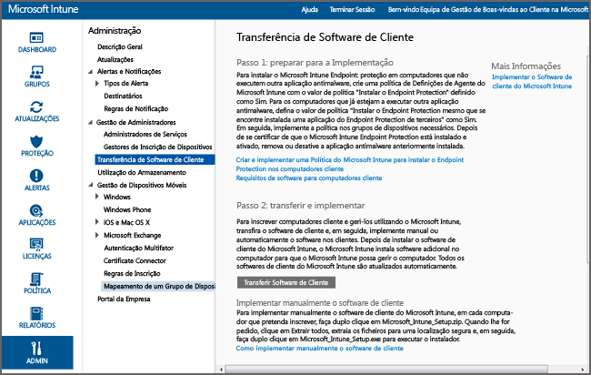

# Instalar o cliente do computador com Windows com o Microsoft Intune
Utilize este guia para ajudá-lo a gerir os PCs Windows através do software de cliente do Microsoft Intune.

## Antes de começar
Antes de começar a instalar o software de cliente do Intune, leia o tópico [Resolver conflitos de políticas de GPO e do Microsoft Intune](resolve-gpo-and-microsoft-intune-policy-conflicts.md) para compreender o que é necessário para instalar o cliente corretamente e, em seguida, regresse a estas instruções.

## Instalar o cliente
Utilize estes passos para instalar o cliente:

-   [Para transferir o software de cliente](#to-download-the-client-software)

Em seguida, utilize um ou mais dos seguintes métodos para instalar o cliente:

-   [Para implementar manualmente o software de cliente](#to-manually-deploy-the-client-software)

-   [Para implementar automaticamente o software de cliente através da Política de Grupo](#to-automatically-deploy-the-client-software-by-using-group-policy)

-   [Instalar o software de cliente do Microsoft Intune como parte de uma imagem](#install-the-microsoft-intune-client-software-as-part-of-an-image)

Se já não necessita de gerir um computador com o Intune, pode extinguir o computador, cuja ação também remove o software de cliente do computador. Para obter mais informações, veja [Tarefas de gestão comuns do PC Windows com o computador cliente do Microsoft Intune](common-windows-pc-management-tasks-with-the-microsoft-intune-computer-client.md).

### Para transferir o software de cliente

1.  Na [consola de administração do Microsoft Intune](https://manage.microsoft.com/), clique em **Admin** &gt; **Transferir Software de Cliente**

  

2.  Na página **Transferir Software de Cliente**, clique em **Transferir Software de Cliente** e guarde o pacote **Microsoft_Intune_Setup.zip** que contém o software numa localização segura na sua rede.

    > [!NOTE]
    > O pacote de instalação do software de cliente do Intune contém informações sobre a sua conta. Se utilizadores não autorizados tiverem acesso ao pacote de instalação, pode inscrever os computadores na conta que é representada pelo respetivo certificado incorporado.

3.  Extraia os conteúdos do pacote de instalação para uma localização segura na sua rede.

    > [!IMPORTANT]
    > Não mude o nome ou remova o ficheiro **ACCOUNTCERT** que é extraído ou a instalação de software de cliente falhará.

### Para implementar manualmente o software de cliente

1.  Num computador, navegue até à pasta onde estão localizados os ficheiros de instalação do software de cliente e, em seguida, execute o ficheiro **Microsoft_Intune_Setup.exe** para instalar o software de cliente.

    > [!NOTE]
    > O estado da instalação é apresentado quando paira o rato sobre o ícone na barra de tarefas no computador cliente.

### Para implementar automaticamente o software de cliente através da Política de Grupo

1.  Na pasta que contém os ficheiros**Microsoft_Intune_Setup.exe** e **MicrosoftIntune.accountcert**, execute o seguinte comando para extrair os programas de instalação baseados no Windows Installer para computadores de 32 bits e 64 bits:

    ```
    Microsoft_Intune_Setup.exe/Extract <destination folder>
    ```

2.  Copie os ficheiros **Microsoft_Intune_x86.msi**, **Microsoft_Intune_x64.msi** e **MicrosoftIntune.accountcert** para uma localização na rede que possa ser acedida por todos os computadores nos quais o software de cliente vai ser instalado.

    > [!IMPORTANT]
    > Não separe ou mude o nome dos ficheiros ou a instalação do software de cliente falhará.

3.  Utilize a Política de Grupo para implementar software nos computadores na sua rede.

    Para obter mais informações sobre como utilizar a Política de Grupo para implementar software automaticamente, consulte a documentação do Windows Server.

### Instalar o software de cliente do Microsoft Intune como parte de uma imagem
Pode implementar o software de cliente do Intune em computadores como parte de uma imagem do sistema operativo ao utilizar o seguinte procedimento de exemplo como base:

1.  Copie os ficheiros de instalação do cliente **Microsoft_Intune_Setup.exe** e **MicrosoftIntune.accountcert** para a pasta **%Systemdrive%\Temp\Microsoft_Intune_Setup** no computador de referência.

2.  Crie a entrada de registo **WindowsIntuneEnrollPending** ao adicionar o seguinte comando ao script **SetupComplete.cmd** :

    ```
    %windir%\system32\reg.exe add HKEY_LOCAL_MACHINE\Software\Microsoft\Onlinemanagement\Deployment /v
    WindowsIntuneEnrollPending /t REG_DWORD /d 1
    ```

3.  Adicione o seguinte comando ao **setupcomplete.cmd** para executar o pacote de inscrição com o argumento da linha de comandos /PrepareEnroll:

    ```
    %systemdrive%\temp\Microsoft_Intune_Setup\Microsoft_Intune_Setup.exe /PrepareEnroll
    ```
    > [!TIP]
    > O script **SetupComplete.cmd** permite à Configuração do Windows efetuar modificações ao sistema antes de um utilizador iniciar sessão. O argumento da linha de comandos **/PrepareEnroll** prepara um computador de destino para ser inscrito automaticamente no Intune após a Configuração do Windows ser concluída.

4.  Coloque o**SetupComplete.cmd** na pasta **%Windir%\Setup\Scripts** no computador de referência.

5.  Capture uma imagem do computador de referência e, em seguida, efetue a implementação nos computadores visados.

Quando o computador de destino reiniciar no final da Configuração do Windows, é criada a chave de registo **WindowsIntuneEnrollPending** . O pacote de inscrição verifica se o computador está inscrito. Se o computador estiver inscrito, não é necessária mais nenhuma ação. Se o computador não estiver inscrito, o pacote de inscrição cria uma Tarefa de Inscrição Automática do Microsoft Intune.

Quando a tarefa de inscrição automática for executada na próxima hora agendada, verifica a existência do valor de registo **WindowsIntuneEnrollPending** e tenta inscrever o PC de destino no Intune. Se a inscrição falhar por alguma razão, é repetida da próxima vez que a tarefa for executada. As repetições continuam durante um período de um mês.

A Tarefa de Inscrição Automática do Intune, o valor de registo **WindowsIntuneEnrollPending** e o certificado da conta são eliminados do computador de destino quando a inscrição é efetuada com êxito ou após um mês.

## Monitorizar e validar implementações de cliente com êxito
Utilize um dos seguintes procedimentos para ajudá-lo a monitorizar e a validar implementações de cliente com êxito.

### Para verificar a instalação do software de cliente a partir da consola do administrador do Microsoft Intune

1.  Na [consola de administração do Microsoft Intune](https://manage.microsoft.com/), clique em **Grupos** &gt; **Todos os Dispositivos** &gt; **Todos os Computadores**.

2.  Desloque para baixo a lista de computadores para localizar os computadores geridos que estão a comunicar com o Intune ou para procurar um computador gerido específico ao escrever o nome, ou parte do nome do computador, na caixa **Procurar dispositivos**.

3.  Examine o estado do computador no painel inferior da consola e resolva quaisquer erros.

### Para criar um relatório de inventário de computadores para apresentar todos os computadores inscritos

1.  Na [consola de administração do Microsoft Intune](https://manage.microsoft.com/), clique em **Relatórios** &gt; **Relatórios de Inventário de Computadores**.

2.  Na página **Criar Novo Relatório** , deixe todos os campos com os valores predefinidos (a não ser que pretenda aplicar filtros) e clique em **Ver Relatório**.

3.  A página **Relatório de Inventário de Computadores** é aberta numa nova janela que apresenta todos os computadores inscritos com êxito no Intune.

    > [!TIP]
    > Clique em qualquer cabeçalho de coluna no relatório para ordenar a lista pelos conteúdos dessa coluna.


### Consulte Também
[Gerir PCs Windows com o Microsoft Intune](manage-windows-pcs-with-microsoft-intune.md)
[Resolver problemas da configuração do cliente](../troubleshoot/troubleshoot-client-setup-in-microsoft-intune)


<!--HONumber=Aug16_HO4-->


