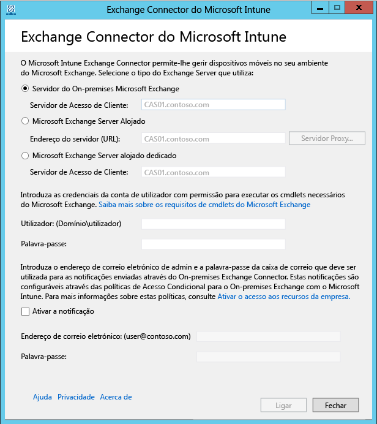

# Instalar o Exchange Connector no local do Intune

Para configurar uma ligação que permite a comunicação entre o Microsoft Intune e o Exchange Server que aloja as caixas de correio dos dispositivos móveis, tem de transferir e configurar a ferramenta Conector No Local na consola do administrador do Intune. O Intune apenas suporta uma ligação de conector do Exchange de qualquer tipo por subscrição.

## Requisitos do Conector No Local
A tabela seguinte descreve os requisitos do computador onde irá instalar o Exchange Connector no local.

|Requisito|Mais informações|
|---------------|--------------------|
|Sistemas operativos|O Intune suporta o Exchange Connector no local num computador com qualquer edição do Windows Server 2008 SP2 64 bits, Windows Server 2008 R2, Windows Server 2012 ou Windows Server 2012 R2.  O conector não é suportado em nenhuma instalação Server Core.|
|Versão do Microsoft Exchange|Ou o Conector no local requer o Microsoft Exchange 2010 SP1 ou posterior, ou o Exchange Online Dedicado em lagado. Para determinar se o ambiente dedicado do Exchange Online está na configuração **nova** ou **legada**,  contacte o seu gestor de conta.|
|Autoridade de gestão de dispositivos móveis| [Definir o Intune como a autoridade de gestão de dispositivos móveis](get-ready-to-enroll-devices-in-microsoft-intune.md#set-mobile-device-management-authority).|
|Hardware|O computador onde vai instalar o conector requer uma CPU de 1,6 GHz com 2 GB de ram e, pelo menos, 10 GB de espaço livre no disco no hardware.|
|Sincronização do Active Directory|Antes de poder utilizar qualquer um dos Conectores para ligar o Intune ao seu Exchange Server, tem de [configurar a sincronização do Active Directory](/intune/get-started/start-with-a-paid-subscription-to-microsoft-intune-step-3), para que os seus utilizadores e grupos de segurança locais sejam sincronizados com a instância do Azure Active Directory.|
|Software adicional|O computador que aloja o conector tem de ter uma instalação completa do Microsoft .NET Framework 4 e do Windows PowerShell 2.0.|
|Rede|O computador em que instalar o conector tem de estar num domínio que tenha uma relação de fidedignidade com o domínio que aloja o seu Exchange Server.  O computador requer configurações que lhe permitam aceder ao serviço Intune através de firewalls e servidores proxy pelas Portas 80 e 443. Os domínios utilizados pelo Intune incluem manage.microsoft.com, &#42;manage.microsoft.com e &#42;.manage.microsoft.com.|
|Exchange alojado configurado e em execução|Consulte [Exchange Server 2016](https://technet.microsoft.com/library/mt170645.aspx) para obter mais informações. |

### Requisitos de cmdlets do Exchange

Tem de criar uma conta de utilizador do Active Directory que é utilizada pelo Exchange Connector do Intune. A conta tem de ter permissão para executar os seguintes cmdlets necessários do Windows PowerShell do Exchange:

 -   Get-ActiveSyncOrganizationSettings, Set-ActiveSyncOrganizationSettings
 -   Get-CasMailbox, Set-CasMailbox
 -   Get-ActiveSyncMailboxPolicy, Set-ActiveSyncMailboxPolicy, New-ActiveSyncMailboxPolicy, Remove-ActiveSyncMailboxPolicy
 -   Get-ActiveSyncDeviceAccessRule, Set-ActiveSyncDeviceAccessRule, New-ActiveSyncDeviceAccessRule, Remove-ActiveSyncDeviceAccessRule
 -   Get-ActiveSyncDeviceStatistics
 -   Get-ActiveSyncDevice
 -   Get-ExchangeServer
 -   Get-ActiveSyncDeviceClass
 -   Get-Recipient
 -   Clear-ActiveSyncDevice, Remove-ActiveSyncDevice
 -   Set-ADServerSettings
 -   Get-Command

## Transferir o pacote de instalação de software do Exchange Connector no local

1. Num sistema operativo Windows Server suportado para o Exchange Connector no local, abra a [consola de administração do Microsoft Intune](http://manage.microsoft.com) (http://manage.microsoft.com) com uma conta de utilizador que seja administrador no inquilino do Exchange com uma licença para utilizar o Exchange Server.

2.  No painel de atalhos da área de trabalho, escolha **Administração**, escolha **Gestão de Dispositivos Móveis** > **Microsoft Exchange** e escolha **Configurar Ligação ao Exchange**.

3.  Na página **Configurar a Ligação ao Exchange**, escolha **Transferir o Conector No Local**.

4.  O Exchange Connector no local encontra-se numa pasta comprimida (.zip) que pode ser aberta ou guardada. Na caixa de diálogo **Transferência de Ficheiros**, escolha **Guardar**, para armazenar a pasta comprimida numa localização segura.

> [!IMPORTANT]
> Não mude o nome nem mova os ficheiros dentro da pasta do Exchange Connector no local. Mover ou mudar o nome do conteúdo da pasta irá interromper a instalação.

## Instalar e configurar o Exchange Connector no local do Intune
Execute os seguintes passos para instalar o Exchange Connector no local do Intune. O Exchange Connector no local só pode ser instalado uma vez por cada subscrição do Intune e em apenas um computador. Se tentar configurar um Exchange Connector no local adicional, a nova ligação substituirá a ligação original.

1.  Num sistema operativo suportado para o Connector No Local, extraia os ficheiros em **Exchange_Connector_Setup.zip** para uma localização segura.

2.  Após a extração dos ficheiros, abra a pasta extraída e faça duplo clique em **Exchange_Connector_Setup.exe** para instalar o Exchange Connector no local.

    > [!IMPORTANT]
    > Se a pasta de destino não for uma localização segura, deve eliminar o ficheiro de certificado **WindowsIntune.accountcert** após a instalação do Conector No Local.

3.  No campo **Exchange Server**, selecione o tipo de ambiente do servidor do Exchange: **Microsoft Exchange Server no Local** ou **Microsoft Exchange Server Alojado**.

  

  Para um servidor do Exchange no local, forneça o nome do servidor ou o nome de domínio completamente qualificado do servidor do Exchange que aloja a função **Servidor de Acesso de Cliente**.

  Para um servidor do Exchange alojado, forneça o endereço do servidor do Exchange. Para localizar o URL do servidor do Exchange alojado:

      1.  Abra o Outlook Web App para Office 365.

      2.  Escolha o "?" na parte superior esquerda e selecione **Acerca de**.

      3.  Localize o valor do **Servidor POP Externo** .

      4.  Escolha o **Servidor Proxy** para especificar as definições do servidor proxy do seu servidor do Exchange alojado.
        1.  Selecione **Utilizar um servidor proxy ao sincronizar informações de dispositivos móveis**.

        2.  Introduza o **nome do servidor proxy** e o **número de porta** a utilizar para aceder ao servidor.

        3.  Caso seja necessário fornecer as credenciais de utilizador para aceder ao servidor proxy, selecione Utilizar as credenciais para se ligar ao servidor proxy e introduza o **domínio\utilizador** e a **palavra-passe**.

        4.  Escolha **OK**.

5.  Forneça as credenciais, **Utilizador (Domínio\utilizador)** e **Palavra-passe**, necessárias para se ligar ao servidor Exchange.

6.  Forneça as credenciais administrativas necessárias para enviar notificações para a caixa de correio do Exchange de um utilizador. Estas notificações são configuráveis através das políticas de Acesso Condicional com o Intune.

    Certifique-se de que o serviço de Deteção Automática e os Serviços Web Exchange são configurados no Servidor de Acesso de Cliente do Exchange. Para obter mais informações, consulte o artigo [servidor de Acesso de Cliente](https://technet.microsoft.com/library/dd298114.aspx).

7.  No campo **Palavra-passe**, forneça a palavra-passe desta conta para permitir que o Intune aceda ao Exchange Server.

8. Escolha **Ligar**.

    A configuração da ligação pode demorar alguns minutos.

Durante a configuração, o Exchange Connector armazena as suas definições de proxy para ativar o acesso à Internet. Se as suas definições de proxy forem alteradas, terá de reconfigurar o Exchange Connector, de modo a aplicar as definições de proxy atualizadas ao Exchange Connector.

Quando o Exchange Connector configurar a ligação, os dispositivos móveis associados a utilizadores geridos no Exchange Connector são automaticamente sincronizados e adicionados ao Exchange Connector. Esta sincronização poderá demorar algum tempo.

> [!NOTE]
> Se instalou o Exchange Connector no local e, a determinada altura, eliminou a ligação ao Exchange, terá de desinstalar o Exchange Connector no local do computador em que foi instalado.

## Validar a ligação ao Exchange

Após a configuração com êxito do Exchange Connector, pode ver o estado da ligação e a última tentativa de sincronização efetuada com êxito. Na [consola de administração do Microsoft Intune](http://manage.microsoft.com), escolha a área de trabalho **ADMIN** e, em **Gestão de Dispositivos Móveis**, escolha **Microsoft Exchange** e confirme se os detalhes fornecidos são apresentados em **Informações da Ligação ao Exchange**.

Também pode ver a data e hora da última tentativa de sincronização efetuada com êxito.

<!--HONumber=Jul16_HO5-->

