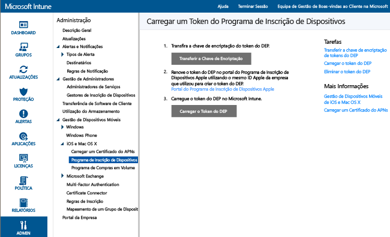

---
# required metadata

title: Gestão do Apple DEP para dispositivos iOS com o Microsoft Intune | Microsoft Intune
description:
keywords:
author: NathBarn
manager: jeffgilb
ms.date: 04/28/2016
ms.topic: article
ms.prod:
ms.service: microsoft-intune
ms.technology:
ms.assetid: 8ff9d9e7-eed8-416c-8508-efc20fca8578

# optional metadata

#ROBOTS:
#audience:
#ms.devlang:
ms.reviewer: jeffgilb
ms.suite: ems
#ms.tgt_pltfrm:
#ms.custom:

---

# Inscrever dispositivos iOS pertencentes à empresa através do Programa de Inscrição de Dispositivos
O Microsoft Intune pode implementar um perfil de inscrição que inscreve os dispositivos iOS adquiridos através do Programa de Inscrição de Dispositivos (DEP) "por ondas eletromagnéticas". O pacote de inscrição pode incluir opções do assistente de configuração do dispositivo. Os utilizadores não podem anular a inscrição de dispositivos inscritos através do DEP.

## Gestão do Apple DEP para dispositivos iOS com o Microsoft Intune
Para gerir dispositivos iOS propriedade da empresa com o Programa de Inscrição de Dispositivos da Apple (DEP), a sua empresa tem de se associar ao DEP da Apple e de adquirir dispositivos através desse programa. Os detalhes desse processo estão disponíveis em:  [https://deploy.apple.com](https://deploy.apple.com) Entre as vantagens do programa incluem-se a configuração automatizada de dispositivos sem ligar por USB cada dispositivo a um computador.

Antes de poder inscrever dispositivos iOS pertencentes à empresa no DEP, precisa de um Token do DEP da Apple. Este token permite ao Intune sincronizar informações sobre os dispositivos pertencentes à empresa participantes no DEP. Também permite ao Intune efetuar carregamentos do Perfil de Inscrição para a Apple e atribuir dispositivos a esses perfis.

1.  **Começar a gerir dispositivos iOS com o Microsoft Intune**
    Antes de poder inscrever dispositivos iOS no Programa de Inscrição de Dispositivos (DEP), tem de concluir a ativação da gestão iOS para o Intune.

2.  **Obter uma Chave de Encriptação**
    Como um utilizador administrativo, abra a [consola de administração do Microsoft Intune](http://manage.microsoft.com), aceda a **Admin** &gt; **Gestão de Dispositivos Móveis** &gt; **iOS** &gt; **Programa de Inscrição de Dispositivos** e clique em **Transferir Chave de Encriptação**. Guarde o ficheiro da chave de encriptação (.pem) localmente. O ficheiro .pem é utilizado para pedir um certificado de relação de confiança a partir do portal do Programa de Inscrição de Dispositivos da Apple.

      

3.  **Obter um token do Programa de Inscrição de Dispositivos**
    Aceda ao [Portal do Programa de Inscrição de Dispositivos](https://deploy.apple.com) (https://deploy.apple.com) e inicie sessão com o ID Apple da sua empresa. Este ID Apple tem de ser utilizado no futuro para renovar o seu token do DEP.

    1.  No [Portal do Programa de Inscrição de Dispositivos](https://deploy.apple.com), aceda a **Programa de Inscrição de Dispositivos** &gt; **Gerir Servidores** e, em seguida, clique em **Adicionar Servidor MDM**.

    2.  Introduza o **Nome do Servidor MDM** e, em seguida, clique em **Seguinte**. O nome do servidor é uma referência para identificar o servidor MDM. Não é o nome nem o URL do servidor Microsoft Intune.

    3.  É aberta a caixa de diálogo **Adicionar &lt;NomeDoServidor&gt;**. Clique em **Escolher Ficheiro…** para carregar o ficheiro .pem e, em seguida, clique em **Seguinte**.

    4.  A caixa de diálogo **Adicionar &lt;NomeDoServidor&gt;** apresenta uma ligação para o **Token do Seu Servidor**. Transfira o ficheiro do token do servidor (.p7m) para o seu computador e, em seguida, clique em **Concluído**.

    Este ficheiro do certificado (.p7m) é utilizado para estabelecer uma relação de confiança entre os servidores do Intune e do Programa de Inscrição de Dispositivos da Apple.

4.  **Adicionar o token do DEP ao Intune**
    Na [consola de administração do Microsoft Intune](http://manage.microsoft.com), aceda a **Admin** &gt; **Gestão de Dispositivos Móveis** &gt; **iOS** &gt; **Programa de Inscrição de Dispositivos**, clique em **Carregar o Token do DEP**. **Procurar** para o ficheiro de certificado (.p7m), introduza o seu **ID Apple** e clique em **Carregar**.

5.  **Adicionar a Política de Inscrição de Dispositivos da Empresa**
    Na [consola de administração do Microsoft Intune](http://manage.microsoft.com), aceda a **Política** &gt; **Inscrição de Dispositivos da Empresa** e, em seguida, clique em **Adicionar**. Forneça detalhes **Gerais** , incluindo o **Nome** e a **Descrição**, especifique se os dispositivos atribuídos ao perfil têm afinidade com o utilizador ou se pertencem a um grupo e, em seguida, ative as **Definições para Configurar o Programa de Inscrição de Dispositivos para esta política** de modo a que suportem o DEP. Os **Painéis do assistente de configuração** especificam as definições do dispositivo iOS estabelecidas durante a configuração.

      

6.  **Atribuir Dispositivos DEP para Gestão**
    Aceda ao [Portal do Programa de Inscrição de Dispositivos](https://deploy.apple.com) (https://deploy.apple.com) e inicie sessão com o ID Apple da sua empresa. Aceda a **Programa de Implementação** &gt; **Programa de Inscrição de Dispositivos** &gt; **Gerir Dispositivos**. Especifique como irá **Escolher Dispositivos**, fornecer informações sobre o dispositivo e especificar detalhes pelo **Número de Série**e **Número da Encomenda**do dispositivo, ou como **Carregar Ficheiro CSV**. Em seguida, selecione **Atribuir ao Servidor**, selecione o &lt;NomeDoServidor&gt; especificado para o Microsoft Intune e, em seguida, clique em **OK**.

7.  **Sincronizar Dispositivos Geridos por DEP**
    Como um utilizador administrativo, abra a [consola de administração do Microsoft Intune](http://manage.microsoft.com), aceda a **Admin** &gt; **Gestão de Dispositivos Móveis** &gt; **iOS** &gt; **Programa de Inscrição de Dispositivos** e clique em **Sincronizar Agora**. É enviado um pedido de sincronização para a Apple. Para ver os dispositivos geridos por DEP após a sincronização, na [consola de administração do Microsoft Intune](http://manage.microsoft.com), aceda a **Grupos** &gt; **Todos os Dispositivos Pertencentes à Empresa**. Na área de trabalho **Dispositivos Pertencentes à Empresa**, o **Estado** dos dispositivos geridos indica “Não contactado” até que o dispositivo seja ativado e execute o Assistente de Configuração para inscrever o dispositivo.

    Para estar em conformidade com os termos da Apple para o tráfego DEP aceitável, o Intune impõe as seguintes restrições:
     -  Uma sincronização completa do DEP não pode ser executada mais do que uma vez a cada 7 dias. Durante uma sincronização completa, o Intune atualiza cada número de série que a Apple tenha atribuído ao Intune, quer o número tenha sido ou não sincronizado anteriormente. Se for tentada uma sincronização completa no prazo de 7 dias após a sincronização completa anterior, o Intune apenas atualiza os números de série que ainda não estejam listados no Intune.
     -  São atribuídos 10 minutos a qualquer pedido de sincronização para ser concluído. Durante este tempo ou até o pedido ser concluído com êxito, o botão Sincronizar está desativado.

8.  **Distribuir dispositivos pelos utilizadores**
    Os dispositivos pertencentes à empresa podem agora ser distribuídos pelos utilizadores. Quando um dispositivo iOS é ativado, será inscrito para gestão pelo Intune.

### Consulte também
[Prepare-se para inscrever dispositivos](get-ready-to-enroll-devices-in-microsoft-intune.md)

<!--HONumber=May16_HO1-->

