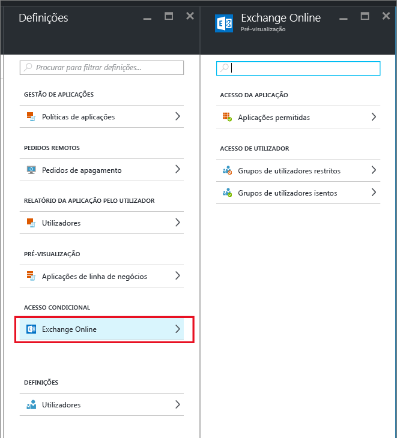
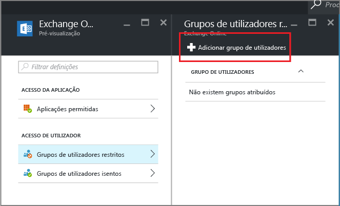

# Criar um acesso condicional do Exchange Online para permitir apenas aplicações suportadas por MAM
Este tópico fornece-lhe as instruções passo a passo sobre como configurar o acesso condicional para que o Exchange Online permita apenas aplicações móveis que suportem políticas de gestão de aplicações móveis (MAM) do Intune.

## Criar uma política do Exchange Online
1.  Inicie sessão no [portal do Azure](portal.azure.com) que inclui a funcionalidade de acesso da aplicação. Caso não esteja familiarizado com a experiência do portal do Azure, leia o tópico [Portal do Azure para políticas de MAM](azure-portal-for-microsoft-intune-mam-policies.md).

2.  Selecione **Procurar >Intune > Painel de gestão de aplicações móveis do Intune > Definições** e, na secção **acesso condicional**, selecione **Exchange Online**.

  

3.  No painel **Aplicações permitidas**, selecione a opção **Permitir aplicações que suportam políticas de aplicação do Intune** para permitir que apenas as aplicações que são suportadas pelas políticas da MAM do Intune consigam aceder ao Exchange Online. Quando selecionar esta opção, é apresentada a lista de aplicações suportadas.

  >[!NOTE]
  >Todos os clientes de correio do Exchange Active Sync, incluindo os clientes de correio incorporado em iOS e Android que se ligam ao Exchange Online ficarão impedidos de enviar ou receber e-mail. Em alternativa, os utilizadores irão receber um único e-mail a informar que têm de utilizar a aplicação de correio do Outlook. 
4.   Para aplicar esta política aos utilizadores, abra o painel **Grupos de utilizadores restritos** e selecione **Adicionar grupo de utilizadores**. Selecione um ou mais grupos de utilizadores que devem receber esta política.

  

5.  Poderá querer que alguns utilizadores do grupo que selecionou no passo anterior não sejam afetados por esta política. Nesses casos, adicione o grupo de utilizadores à lista de grupos de utilizadores isentos. No painel **Exchange Online**, selecione **Grupos de utilizadores isentos**. Selecione **Adicionar grupo de utilizadores** para abrir a lista de grupos de utilizadores. Selecione os grupos aos quais pretende dar isenção desta política.  

## Modificar uma política existente
### Adicionar ou eliminar grupos de utilizadores

Para **eliminar um grupo de utilizadores**, na lista de **grupos de utilizadores restritos**, abra o painel **Grupos de utilizadores restritos**, selecione o grupo que quer eliminar e clique nas **reticências (...)** para ver a opção **Eliminar**. Selecione **Eliminar** para remover o grupo de utilizadores da lista. Pode seguir o mesmo procedimento para remover um grupo de utilizadores da lista de **grupos de utilizadores isentos**.

## Passos seguintes
[Bloquear aplicações que não possuem autenticação moderna](block-apps-with-no-modern-authentication.md)
### Consulte também
[Proteger dados de aplicações com políticas de MAM](protect-app-data-using-mobile-app-management-policies-with-microsoft-intune.md)

<!--HONumber=Oct16_HO2-->

