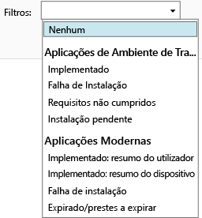

---
# required metadata

title: Monitorizar implementações de aplicações| Microsoft Intune
description:
keywords:
author: robstackmsft
manager: jeffgilb
ms.date: 04/28/2016
ms.topic: article
ms.prod:
ms.service: microsoft-intune
ms.technology:
ms.assetid: 5daad56d-71c8-455b-8a55-f8b33e279a8a

# optional metadata

#ROBOTS:
#audience:
#ms.devlang:
ms.reviewer: jeffgilb
ms.suite: ems
#ms.tgt_pltfrm:
#ms.custom:

---

# Monitorizar implementações de aplicações no Microsoft Intune

## Monitorizar a implementação de uma aplicação
Pode ver as aplicações que gere e o estado de todas as implementações na consola de administração do Intune.

### Para ver as aplicações que gere e o respetivo estado
Na área de trabalho **Aplicações**, clique no nó **Aplicações** e clique em **Aplicações**

A lista de aplicações que gere será apresentada. Pode clicar em qualquer aplicação para ver um estado de instalação no painel inferior das janelas da consola. Clique neste estado para ver mais detalhes. Por exemplo, se o estado mostrar **1 utilizador tem este software disponível**, pode clicar na mensagem para ver o nome do utilizador.

> Pode utilizar a lista pendente **Filtros** para ver apenas as aplicações que cumprem os critérios que especificar, como as aplicações que não conseguiu instalar ou as que foram implementadas com êxito.
> 
> 

Além disso, a área de trabalho **Dashboard** mostra uma descrição geral do estado das suas aplicações. Se clicar em qualquer parte da descrição geral, será direcionado para a lista de aplicações.

## Para ver informações mais detalhadas sobre uma aplicação
Na lista de aplicações, selecione uma aplicação e clique em **Ver Propriedades**

Na página **Propriedades de Software** da aplicação, clique num dos seguintes separadores: **Geral** -mostra informações gerais sobre a aplicação e o estado de instalação da mesma; **Dispositivos** -mostra os dispositivos que instalaram com êxito a implementação segmentada de uma aplicação; **Utilizadores** -mostra os utilizadores cujos dispositivos instalaram com êxito a implementação segmentada de uma aplicação.

Como anteriormente, pode utilizar a lista pendente **Filtros** para configurar os valores apresentados em cada um dos separadores.

<!--HONumber=May16_HO2-->

