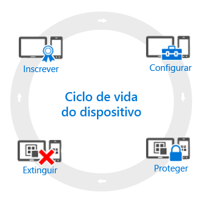

# Descrição geral do ciclo de vida da gestão de dispositivos móveis (MDM)

Todos os dispositivos que gere têm o que apelidamos de *ciclo de vida*. O Intune pode ajudá-lo a gerir este ciclo de vida desde a inscrição até à configuração, proteção e extinção do dispositivo quando já não for necessário:

## Inscrever
As atuais estratégias de gestão de dispositivos móveis (MDM) lidam com uma variedade de telemóveis, tablets e PCs (iOS, Android, Windows e Mac OS X). Se precisar de ter a capacidade de gerir o dispositivo, o que é normalmente o caso dos dispositivos pertencentes à empresa, o primeiro passo consiste em [configurar a inscrição do dispositivo](enroll-devices-in-microsoft-intune.md). Também pode gerir PCs Windows, inscrevendo-os no Intune (MDM) ou [instalando o software de cliente do Intune](manage-windows-pcs-with-microsoft-intune.md).

## Configurar
Inscrever os seus dispositivos é apenas o primeiro passo. Para tirar partido de tudo o que o Intune oferece e para garantir que os seus dispositivos estão protegidos e em conformidade com as normas da empresa, pode escolher de entre um vasto leque de políticas. Estas permitem-lhe configurar quase todos os aspetos do funcionamento dos dispositivos geridos. Por exemplo, os utilizadores devem ter palavras-passe em dispositivos que tenham dados da empresa? Pode pedir uma. Tem Wi-Fi da empresa? Pode configurá-la automaticamente. Eis os tipos de opções de configuração disponíveis:

- [**Políticas de configuração**](manage-settings-and-features-on-your-devices-with-microsoft-intune-policies.md). Estas políticas permitem-lhe configurar o modo de funcionamento das funcionalidades e capacidades dos dispositivos que gere. Por exemplo, pode exigir a utilização de uma palavra-passe em Windows Phones ou desativar a utilização da câmara em iPhones.
- [**Políticas de acesso a recursos da empresa**](enable-access-to-company-resources-with-microsoft-intune.md). Permitir que os utilizadores acedam ao seu trabalho nos respetivos dispositivos pessoais pode apresentar desafios. Por exemplo, como é que garante que todos os dispositivos que precisam de aceder ao e-mail da empresa estão configurados corretamente? Como pode garantir que os utilizadores conseguem aceder à rede da empresa com uma ligação VPN sem terem de conhecer as definições necessárias tantas vezes complexas? O Intune pode ajudar a reduzir este fardo, configurando automaticamente os dispositivos que gere para aceder a recursos comuns da empresa.
- [**Políticas de gestão de PCs Windows (com o software de cliente Intune)**](common-windows-pc-management-tasks-with-the-microsoft-intune-computer-client.md). Embora a inscrição de PCs Windows no Intune lhe dê mais capacidades de gestão de dispositivos, o Intune continua a suportar a gestão de PCs Windows com o software de cliente Intune. Se precisar de informações sobre algumas das tarefas que pode realizar com PCs, comece por aqui.

## Proteger
No mundo de TI moderno, proteger os dispositivos contra acesso não autorizado é uma das tarefas mais importantes que irá realizar. Para além dos itens no passo **Configurar** do ciclo de vida do dispositivo, o Intune fornece mais capacidades que ajudam a proteger os dispositivos que gere contra acesso não autorizado ou ataques maliciosos:
- [**Autenticação multifator**](protect-windows-devices-with-multi-factor-authentication.md). Adicionar mais uma camada de autenticação aos inícios de sessão do utilizador pode ajudar a tornar os dispositivos ainda mais seguros. Os dispositivos Windows, Windows Phone e Windows Mobile oferecem autenticação multifator que exige um segundo nível de autenticação, como uma chamada telefónica ou uma mensagem de texto, antes de os utilizadores poderem obter acesso.
- [**Definições do Microsoft Passport**](control-microsoft-passport-settings-on-devices-with-microsoft-intune.md). O Microsoft Passport é um método de início de sessão alternativo que permite que os utilizadores utilizem um *gesto*, tal como uma identificação digital ou o Windows Hello para iniciar sessão, sem ser necessário uma palavra-passe.
- [**Políticas para proteger PCs Windows (com o software de cliente Intune)**](policies-to-protect-windows-pcs-in-microsoft-intune.md). Quando gere PCs Windows com o software de cliente Intune, estão disponíveis políticas que lhe permitem controlar as definições de Endpoint Protection, atualizações de software e Firewall do Windows nos computadores que gere.

## Extinguir
Quando um dispositivo é perdido ou roubado, quando tem de ser substituído ou quando os utilizadores passam a ter outro cargo, geralmente está na altura de [extinguir ou limpar](use-remote-wipe-to-help-protect-data-using-microsoft-intune.md) o dispositivo. Pode fazê-lo de várias formas, desde repor o dispositivo, removê-lo da gestão ou eliminar os dados empresariais contidos no mesmo.

<!--HONumber=Aug16_HO2-->

