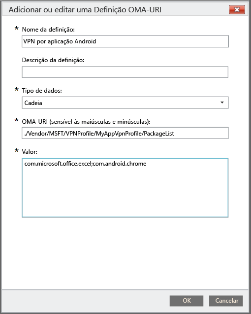

# Utilizar uma política personalizada para criar um perfil de VPN por aplicação para dispositivos Android

Pode criar um perfil VPN por aplicação para dispositivos Android 5.0 e posteriores geridos pelo Intune. Primeiro, crie um perfil de VPN que utilize o tipo de ligação Pulse Secure. Em seguida, crie uma política de configuração personalizada que associe o perfil de VPN a aplicações específicas. 

Depois de implementar a política no dispositivo Android ou nos grupos de utilizadores, os utilizadores devem iniciar a VPN do PulseSecure. O PulseSecure irá então permitir tráfego apenas das aplicações especificadas para utilizar a ligação VPN aberta.

> [!NOTE]
>
> Apenas o tipo de ligação Pulse Secure é suportado para este perfil.

### Passo 1: criar um perfil de VPN

1. Na [consola de administração do Microsoft Intune](https://manage.microsoft.com), escolha **Política** > **Adicionar Política**.
2. Para selecionar um modelo para a nova política, expanda **Android** e, em seguida, escolha **Perfil de VPN (Android 4 e posterior)**.
3. No modelo, em **Tipo de ligação**, escolha **Pulse Secure**.
4. Conclua e guarde o perfil de VPN. Para mais detalhes sobre perfis de VPN, veja [Ligações VPN](../deploy-use/vpn-connections-in-microsoft-intune.md).

> [!NOTE]
>
> Tome nota do nome do perfil de VPN para utilização no próximo passo. Por exemplo, MyAppVpnProfile.

### Passo 2: criar uma política de configuração personalizada

   1. Na consola de administração do Intune, escolha **Política** > **Adicionar Política** > **Android** > **Configuração personalizada** > **Criar Política**.
   2. Introduza um nome para a política.
   3. Em **Definições OMA-URI**, escolha **Adicionar**.
   4. Introduza um nome para a definição.
   5. Para **Tipo de dados**, especifique **Cadeia**.
   6. Para **OMA-URI**, especifique esta cadeia: **./Vendor/MSFT/VPN/Profile/*Name*/PackageList**, onde *Name* é o nome do perfil de VPN que anotou no Passo 1. No nosso exemplo, a cadeia seria **./Vendor/MSFT/VPN/Profile/MyAppVpnProfile/PackageList**.
   7.   Para **Valor**, crie uma lista separada por ponto e vírgula dos pacotes a associar ao perfil. Por exemplo, se pretender que o Excel e o browser Google Chrome utilizem a ligação VPN, introduza **com.microsoft.office.excel;com.android.chrome**.

#### Definir a lista de aplicações como lista de bloqueados ou lista de permitidos (opcional)
  Pode especificar uma lista de aplicações que *não* utilize a ligação VPN com o valor **BLACKLIST**. Todas as outras aplicações estabelecerão ligação através da VPN.
Em alternativa, pode utilizar o valor **WHITELIST** para especificar uma lista de aplicações que *possa* utilizar a ligação VPN. As aplicações que não estejam na lista não estabelecerão ligação através da VPN.
  1.    Em **Definições OMA-URI**, escolha **Adicionar**.
  2.    Introduza um nome para a definição.
  3.    Para **Tipo de dados**, especifique **Cadeia**.
  4.    Para **OMA-URI**, utilize esta cadeia: **./Vendor/MSFT/VPN/Profile/*Name*/Mode**, onde *Name* é o nome do perfil da VPN que anotou no Passo 1. No nosso exemplo, a cadeia seria **./Vendor/MSFT/VPN/Profile/MyAppVpnProfile/Mode**.
  5.    Para **Valor**, introduza **BLACKLIST** ou **WHITELIST**.

### Passo 3: implementar as duas políticas

Tem de implementar as *duas* políticas nos *mesmos* grupos do Intune.

1.  Na área de trabalho **Política**, selecione a que pretende implementar e escolha **Gerir a Implementação**.
2.  Na caixa de diálogo **Gerir a Implementação** , para:
    -   **Para implementar a política**, selecione um ou mais grupos nos quais pretende implementar a política e, em seguida, escolha **Adicionar** > **OK**.
    -   **Para fechar a caixa de diálogo sem implementar a política**, escolha **Cancelar**.

Um resumo do estado e alertas na página **Descrição Geral** da área de trabalho **Política** identificam problemas com a política que necessitam da sua atenção. Também é apresentado um resumo de estado na área de trabalho **Dashboard**.

<!--HONumber=Aug16_HO5-->

