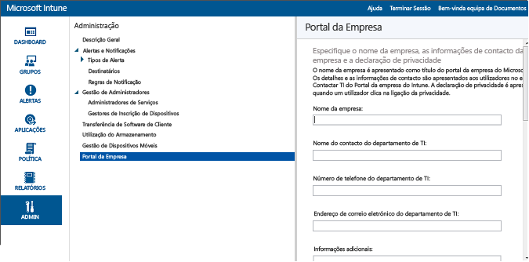

# Pré-requisitos para a gestão de dispositivos móveis no Intune
Para permitir que os seus funcionários inscrevam os respetivos dispositivos móveis no Intune, é necessário aplicar os passos que se seguem. Estes passos também são necessários para gerir dispositivos pertencentes à empresa.

|Passos|Detalhes|  
|-----------|-------------|  
|**Passo 1:** [dependências de inscrição de dispositivos](#step-1-device-enrollment-dependencies)|Certifique-se de que o nome personalizado do seu domínio foi configurado e que as comunicações de rede estão prontas|  
|**Passo 2:** [definir a autoridade de gestão de dispositivos](#step-2-set-mobile-device-management-authority)|A autoridade de gestão de dispositivos móveis define o serviço atribuído aos seus dispositivos|
|**Passo 3:** [configurar o Portal da Empresa do Intune](#step-3-configure-the-intune-company-portal)|Configure as definições destinadas ao utilizador para a aplicação Portal da Empresa|  
|**Passo 4:** [atribuir licenças de utilizador do Intune](#step-4-assign-intune-user-licenses)|Atribua licenças do Intune aos utilizadores para que estes possam inscrever dispositivos|
|**Passo 5:** [configurar a gestão de dispositivos](#step-5-set-up-device-management)|Ative definições específicas da plataforma para a gestão de dispositivos iOS e Windows. Os dispositivos Android não precisam de configurações adicionais.|

Está à procura do Intune com o Configuration Manager?
> [!div class="button"]
[Ver documentos do SCCM >](https://docs.microsoft.com/sccm/mdm/deploy-use/setup-hybrid-mdm)

## Passo 1: dependências de inscrição de dispositivos

Antes de ativar a inscrição de dispositivos móveis, certifique-se de que efetuou os seguintes procedimentos:
- [Rever as portas e os URLs de rede necessários](../get-started/network-infrastructure-requirements-for-microsoft-intune)
- [Adicionar e verificar o seu nome de domínio](../get-started/domain-names-for-microsoft-intune)

## Passo 2: definir a autoridade de gestão de dispositivos móveis
A autoridade de MDM define o serviço de gestão que tem permissão para gerir um conjunto de dispositivos. As opções para a autoridade de MDM incluem o Intune autónomo e o Configuration Manager com o Intune. Se definir o Configuration Manager como autoridade de gestão, nenhum outro serviço pode ser utilizado para gestão de dispositivos móveis.

>[!IMPORTANT]
> Considere cuidadosamente se pretende gerir dispositivos móveis apenas com o Intune (serviço online) ou com o System Center Configuration Manager com o Intune (solução de software no local em conjunto com o serviço online). A definição da autoridade de gestão de dispositivos móveis não pode ser alterada.

1.  Na [consola do administração do Microsoft Intune](http://manage.microsoft.com), escolha **Administrador** &gt; **Gestão de Dispositivos Móveis**.

2.  Na lista **Tarefas**, clique em **Definir Autoridade de Gestão de Dispositivos Móveis**. A caixa de diálogo **Definir Autoridade de Gestão de Dispositivos Móveis** é aberta.

    

3.  O Intune pede a confirmação de que pretende o Intune como a sua autoridade MDM. Selecione a caixa de verificação e, em seguida, escolha **Sim** para utilizar o Microsoft Intune para gerir dispositivos móveis.

## Passo 3: configurar o Portal da Empresa do Intune

O Portal da Empresa do Intune é onde os utilizadores acedem aos dados da empresa e podem realizar tarefas comuns, como inscrever dispositivos, instalar aplicações e localizar informações de assistência do departamento de TI.

> [!TIP]
> Quando personaliza o Portal da Empresa, as configurações aplicam-se tanto ao site do Portal da Empresa, como às aplicações do Portal da Empresa.

Personalizar o Portal da Empresa ajuda a proporcionar uma experiência familiar e útil aos utilizadores finais. Para tal, basta iniciar sessão na [consola de administrador do Microsoft Intune](https://manage.microsoft.com) como administrador de inquilinos ou de serviços, escolher **Administrador** &gt; **Portal da Empresa** e configurar as definições do Portal da Empresa.

### Informações de contacto e declaração de privacidade da empresa

O nome da empresa é apresentado como o título do Portal da Empresa. Os detalhes e as informações de contacto são apresentados aos utilizadores no ecrã Contactar TI do Portal da Empresa. A declaração de privacidade é apresentada quando um utilizador clica na ligação de privacidade.

|Nome do campo|Comprimento máximo|Mais informações|
    |----------|------------------------|----------------|
    |Nome da empresa|40|Este nome é apresentado como o título do Portal da Empresa. **Nota**: apenas carateres alfanuméricos. Este campo não suporta carateres especiais.|
    |Nome do contacto do departamento de TI|40|Este nome é apresentado na página **Contactar TI**.|
    |Número de telefone do departamento de TI|20|Este número de contacto é apresentado na página **Contactar TI**.|
    |Endereço de e-mail do departamento de TI|40|Este endereço de contacto é apresentado na página **Contactar TI**. Tem de inserir um endereço de e-mail válido no formato **alias@nomedodominio.com**.|
    |Informações adicionais|120|Estas informações são apresentadas na página **Contactar TI**.|
    |URL da declaração de privacidade da empresa|79|Pode especificar a sua declaração de privacidade da empresa que é apresentada quando os utilizadores clicam nas ligações de privacidade a partir do Portal da Empresa. Tem de introduzir um URL válido no formato https://www.contoso.com.|

### Contactos de suporte
O site de suporte é apresentado para os utilizadores no Portal da Empresa para que possam aceder ao suporte online.

|Nome do campo|Comprimento máximo|Mais informações|
    |----------|------------------------|----------------|
    |URL do site de suporte|150|Se tiver um site de suporte que pretende que os utilizadores usem, especifique o URL aqui. O URL tem de estar no formato https://www.contoso.com. Se não especificar um URL, não será apresentado nada no site de suporte da página **Contactar TI** no Portal da Empresa.|
    |Nome do site|40|Este é o nome amigável apresentado no URL do site de suporte. Se especificar um URL do site de suporte, mas não especificar um nome amigável, a ligação **Aceder ao site de TI** será apresentada na página **Contactar TI** no Portal da Empresa.|

### Personalização da imagem corporativa da empresa

Pode personalizar o Portal da Empresa com o logótipo e o nome da empresa, a cor do tema e o fundo.

|Nome do campo|Mais informações|
    |----------|----------------|
    |Cor do tema|Selecione a cor do tema que pretende aplicar ao Portal da Empresa.|
    |Incluir o logótipo da empresa|Quando ativa esta opção, pode carregar o logótipo da sua empresa que pretende que seja apresentado no Portal da Empresa. Pode carregar dois logótipos: um que é apresentado quando o fundo do Portal da Empresa é branco e outro que é apresentado quando o fundo do Portal da Empresa utiliza a cor do tema que selecionou. Cada logótipo tem de ser um ficheiro .png ou .jpg, ter uma resolução máxima de 400 x 100 píxeis e ter um tamanho de 750 KB ou menos.|
    |Selecionar um fundo para a aplicação Portal da Empresa|Esta definição afeta apenas o fundo da aplicação Portal da Empresa.|

Depois de guardar as alterações, pode utilizar as ligações fornecidas na parte inferior da página **Portal da Empresa** da consola de administração para ver o Web site do Portal da Empresa. Estas ligações não podem ser alteradas. Quando um utilizador inicia sessão, estas ligações apresentam as suas subscrições no Portal da Empresa.

## Passo 4: atribuir licenças de utilizador do Intune

Para adicionar manualmente utilizadores baseados na nuvem e atribuir licenças às contas de utilizador baseadas na nuvem e às contas sincronizadas do Active Directory no local com o Azure Active Directory (Azure AD), é utilizado o **portal de gestão do Office 365**. Pode [sincronizar utilizadores no local com o Azure AD](../get-started/domain-names-for-microsoft-intune#to-synchronize-on-premises-users-with-azure-ad.md).

1.  Inicie sessão no [portal de gestão do Office 365](https://portal.office.com/Admin/Default.aspx) com as suas credenciais de administrador de inquilino.

2.  Selecione a conta de utilizador à qual pretende atribuir uma licença de utilizador do Intune e selecione a caixa de verificação **Microsoft Intune** nas propriedades da conta de utilizador.

3.  A conta de utilizador será agora adicionada ao grupo de utilizadores do Microsoft Intune, que atribui as permissões de utilizador para utilizar o serviço e inscrever os respetivos dispositivos para gestão.

### Sincronizar os utilizadores no local com o Azure AD

1. [Adicionar o sufixo UPN](https://technet.microsoft.com/en-us/library/cc772007.aspx) para o seu domínio personalizado no Active Directory no local.
2. Defina o sufixo UPN novo para os utilizadores no local que pretende importar.
3. Execute a [sincronização do Azure AD Connect](https://azure.microsoft.com/en-us/documentation/articles/active-directory-aadconnect/) para integrar os seus utilizadores no local com o Azure AD.
4. Assim que as informações de conta de utilizador forem sincronizadas com êxito, pode atribuir licenças do Microsoft Intune utilizando o [Portal de Gestão do Office 365](https://portal.office.com/Admin/Default.aspx).

## Passo 5: configurar a gestão de dispositivos
Depois de configurar a autoridade de MDM, tem de configurar a gestão de dispositivos nos sistemas operativos que a sua organização pretende suportar. Os passos necessários para configurar a gestão de dispositivos variam consoante o sistema operativo. Por exemplo, o SO Android não requer que efetue nenhuma ação na consola de administração do Intune. Por outro lado, o Windows e o iOS requerem uma relação de confiança entre os dispositivos e o Intune para permitir a gestão.

Configurar a gestão das seguintes plataformas:
- [Android](set-up-android-management-with-microsoft-intune.md)
- [iOS e Mac](set-up-ios-and-mac-management-with-microsoft-intune.md)
- [PCs e Portáteis Windows](set-up-windows-device-management-with-microsoft-intune.md)
- [Windows 10 Mobile e Windows Phone](set-up-windows-phone-management-with-microsoft-intune.md)

Também pode:
 - Utilize a [conta do gestor de inscrição de dispositivos](enroll-corporate-owned-devices-with-the-device-enrollment-manager-in-microsoft-intune.md) para inscrever muitos dispositivos.
 - [Especifique os dispositivos pertencentes à empresa com os números IMEI](specify-corporate-owned-devices-with-international-mobile-equipment-identity-imei-numbers.md) para ajudar a inscrever dispositivos e a política de destino.

<!--HONumber=Oct16_HO2-->

