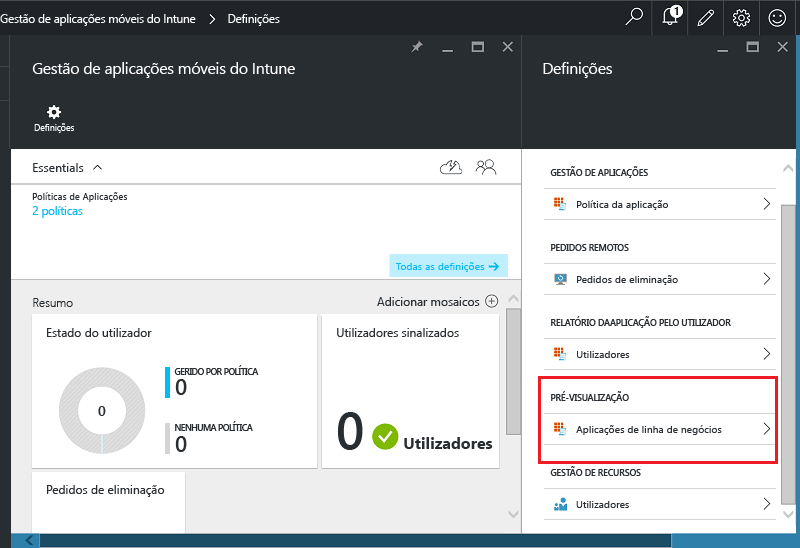
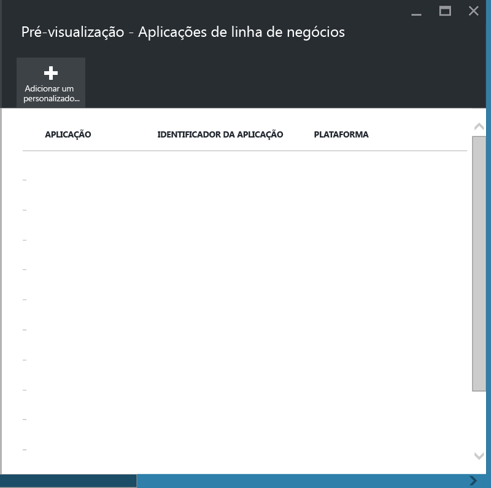
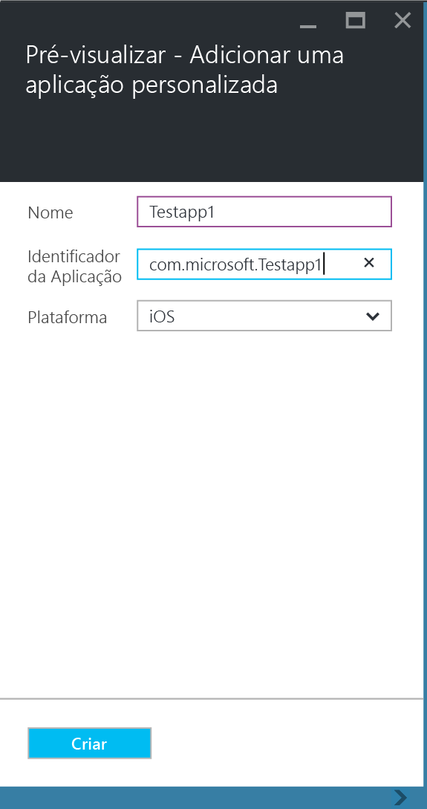
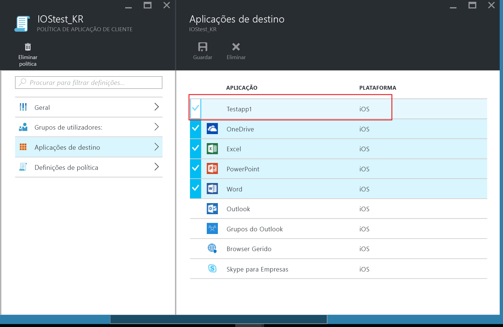
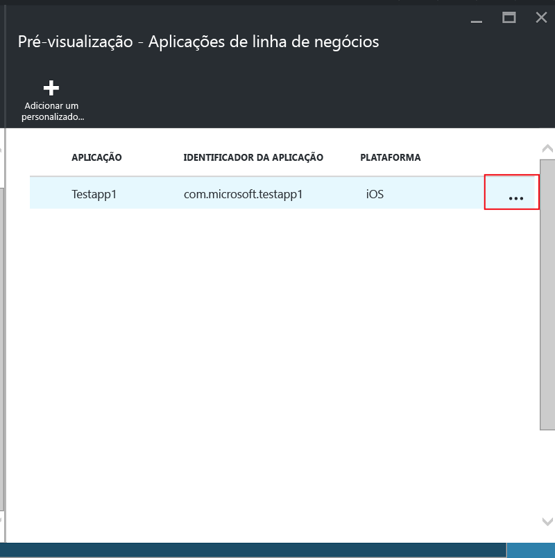
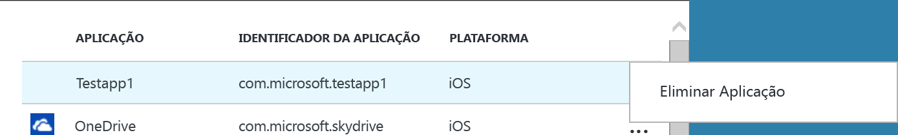

# Proteger aplicações e dados de linha de negócio em dispositivos não inscritos no Microsoft Intune

As políticas de gestão de aplicações móveis (MAM) ajudam a proteger os dados da empresa, restringindo o movimento de dados, como copiar e colar, ou impedindo que os utilizadores guardem documentos da empresa numa localização pessoal.   Para aplicar políticas de MAM a aplicações de linha de negócio iOS e ou Android, primeiro tem de encapsular a aplicação com a ferramenta de Encapsulamento de Aplicações do Microsoft Intune.  O encapsulamento de aplicações é o processo de aplicação de uma camada de gestão a uma aplicação móvel sem necessidade de alterações na aplicação subjacente.  Depois do encapsulamento da aplicação, pode aplicar-lhe políticas de MAM e distribuí-la pelos utilizadores finais.  

Este tópico explica os passos necessários para aplicar políticas de MAM a aplicações que são acedidas em **dispositivos pertencentes aos empregados, que não são geridos**, e em dispositivos geridos por uma **solução de gestão de dispositivos móveis (MDM) de terceiros**.  Para preparar as aplicações de linha de negócio que são executadas em **dispositivos que estão inscritos no Intune**, consulte [Decidir como preparar as aplicações para a gestão de aplicações móveis com o Microsoft Intune](decide-how-to-prepare-apps-for-mobile-application-management-with-microsoft-intune.md).
##  Passo 1: preparar a aplicação
Antes de poder aplicar políticas de MAM a uma aplicação, primeiro tem de encapsular a aplicação com a ferramenta de Encapsulamento de Aplicações do Microsoft Intune.  As instruções para instalar e utilizar a ferramenta de encapsulamento de aplicações estão incluídas na transferência.  
>[!IMPORTANT]  
>Esta versão da ferramenta de encapsulamento de aplicações, que suporta dispositivos que não estão inscritos no Intune, estará disponível na pré-visualização privada nas próximas semanas. Se pretende participar, envie um e-mail para msintuneappsdk@microsoft.com para obter mais informações.

## Passo 2: adicionar a aplicação

Para associar a aplicação de linha de negócio às políticas de MAM, tem de adicionar os detalhes da aplicação ao seu inquilino/subscrição do Intune, efetuando os seguintes passos:

1. No [Portal do Azure](https://portal.azure.com/), aceda a **Gestão de aplicações móveis do Intune > Definições**, e escolha **Aplicações de linha de negócio**.

  

2. No painel **Aplicações de linha de negócio**, escolha **Adicionar uma aplicação personalizada**.

  
3.  Forneça um nome para a aplicação, o identificador de pacote no campo Identificador da aplicação e a plataforma (iOS ou Android).

   Este passo ajuda a criar uma listagem exclusiva da sua aplicação.  A aplicação será também apresentada na lista de Aplicações direcionadas para uma política de MAM do seu inquilino, conforme descrito no passo seguinte.

## Passo 3: aplicar políticas de MAM
Depois de os metadados de aplicação serem carregados para o serviço, a aplicação será apresentada na lista de aplicações.  Pode agora [criar uma nova política ou uma política existente](create-and-deploy-mobile-app-management-policies-with-microsoft-intune.md) e aplicá-la à aplicação de linha de negócio que adicionou no passo 2.

>[!IMPORTANT]
>Tem de direcionar a política MAM aos utilizadores que vão utilizar a aplicação encapsulada.  Os utilizadores em relação aos quais não tenha sido aplicada esta política não poderão utilizar a aplicação.

  
## Passo 4: distribuir a aplicação
É possível implementar aplicações para os utilizadores finais das seguintes formas:
* Para dispositivos inscritos numa solução de MDM de terceiros, pode distribuir aplicações através da sua solução de MDM.
* Para dispositivos não geridos por qualquer solução de MDM, é necessário uma solução personalizada. Os utilizadores finais têm de transferir e instalar a aplicação nos respetivos dispositivos.

## Alterar os metadados
Se precisar de alterar os detalhes da aplicação, como o nome da aplicação ou o identificador do pacote, tem de [remover a aplicação](#remove-apps) e [adicioná-la](#step-2-add-the-app) aos novos metadados.

##  Remover aplicações
Pode remover uma aplicação de linha de negócio da lista de aplicações.  Isto irá remover a aplicação da lista e remover a associação às políticas de MAM, mas não irá remover ou desinstalar a aplicação do dispositivo do utilizador final.  

1.  No [Portal do Azure](https://portal.azure.com/), aceda a **Gestão de aplicações móveis do Intune > Definições**.  No painel **Definições**, escolha **Linha de negócio** para abrir a lista de aplicações existentes.  
2.  Selecione a aplicação que pretende remover e selecione o menu **(…) contexto**.

  
3.  Escolha **Eliminar aplicação** para eliminar a aplicação.

  

  Isto irá remover aplicações da lista de aplicações de linha de negócio e a Lista de aplicações direcionadas na política de MAM.

<!--HONumber=Jun16_HO4-->

