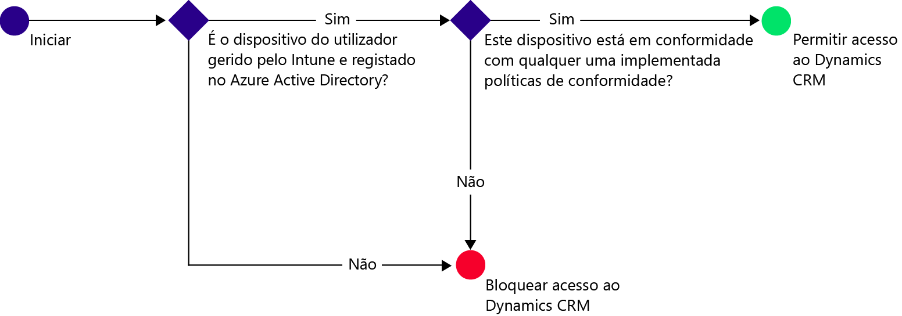
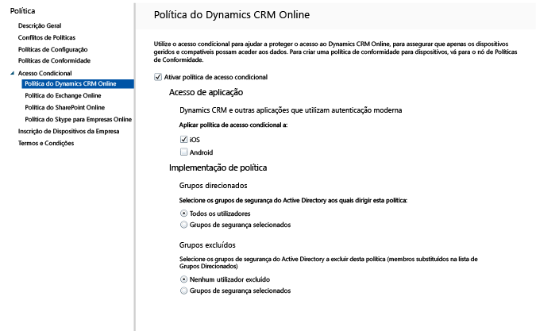

# Restringir o acesso ao e-mail ao Dynamics CRM Online com o Microsoft Intune
Pode controlar o acesso ao Microsoft Dynamics CRM Online a partir de dispositivos iOS e Android com acesso condicional do Microsoft Intune.  O acesso condicional do Intune tem dois componentes:
* A [política de conformidade de dispositivos](introduction-to-device-compliance-policies-in-microsoft-intune.md) que o dispositivo tem de cumprir para ser considerado conforme.
* [A política de acesso condicional](restrict-access-to-email-and-o365-services-with-microsoft-intune.md) onde especifica as condições que o dispositivo tem de cumprir para poder aceder ao serviço.

Para saber mais sobre como funciona o acesso condicional, leia o artigo [Restringir o acesso ao e-mail, 0365 e a outros serviços](restrict-access-to-email-and-o365-services-with-microsoft-intune.md).

[!IMPORTANT] Para implementar o acesso condicional, tem de ter subscrições do Intune e do Azure Active Directory Premium e os utilizadores têm de estar licenciados para ambos os produtos. A **subscrição do Enterprise Mobility + Security (EMS)** inclui as subscrições do Intune e do Azure Active Directory Premium. Para obter mais detalhes, consulte a [página de preços do Enterprise Mobility](https://www.microsoft.com/en-us/cloud-platform/enterprise-mobility-pricing). Se não tiver uma subscrição do EMS, pode obter uma subscrição do Azure Active Directory Premium. Consulte a [página de preços do Azure Active Directory](https://azure.microsoft.com/en-us/pricing/details/active-directory/). 

Quando um utilizador visado tentar utilizar a aplicação Dynamics CRM no respetivo dispositivo, ocorre a seguinte avaliação:

O dispositivo que necessita de acesso ao Dynamics CRM tem de:
* Ser um dispositivo **Android** ou **iOS**.
* Estar **inscrito** no Microsoft Intune.
* Deve ser **compatível** com todas as políticas de conformidade do Microsoft Intune implementadas.

O estado do dispositivo é armazenado no Azure Active Directory, o qual concede ou bloqueia o acesso, com base nas condições que especificar.

Se não for cumprida uma condição, é apresentada ao utilizador uma das duas mensagens seguintes quando iniciar sessão:
* Se o dispositivo não estiver inscrito no Intune ou registado no Azure Active Directory, será apresentada uma mensagem com instruções sobre como instalar a aplicação do portal da empresa e inscrevê-la.
* Se o dispositivo não for conforme, será apresentada uma mensagem que direciona o utilizador para o Web site do Portal da Empresa do Microsoft Intune ou para a aplicação do Portal da Empresa, onde pode obter informações sobre o problema e como resolvê-lo.

## Configurar o acesso condicional para o Dynamics CRM Online  
### Passo 1: configurar grupos de segurança do Active Directory

Antes de começar, configure grupos de segurança do Azure Active Directory para a política de acesso condicional. Pode configurar estes grupos no **centro de administração do Office 365**. Estes grupos serão utilizados para visar ou excluir os utilizadores da política. Quando um utilizador é direcionado por uma política, cada dispositivo que utiliza tem de estar em conformidade para poder aceder aos recursos.

Pode especificar dois tipos de grupo a utilizar para a política do Dynamics CRM:
* **Grupos visados** – contém os grupos de utilizadores aos quais a política será aplicada.
* **Grupos excluídos** – contém os grupos de utilizadores excluídos da política.

Se um utilizador estiver em ambos os grupos, estará excluído da política.

### Passo 2: configurar e implementar uma política de conformidade
[Crie](create-a-device-compliance-policy-in-microsoft-intune.md) e [implemente](deploy-and-monitor-a-device-compliance-policy-in-microsoft-intune.md) uma política de conformidade em todos os dispositivos que serão afetados pela política. Estes seriam todos os dispositivos utilizados pelos utilizadores nos grupos Visados.

> [!NOTE]
> Enquanto as políticas de conformidade são implementadas nos grupos do Microsoft Intune, as políticas de acesso condicional são segmentadas para os grupos de segurança do Azure Active Directory.

> [!IMPORTANT]
> Se não tiver implementado uma política de conformidade, os dispositivos serão tratados como conformes.

Quando estiver pronto, avance para o Passo 3.
### Passo 3: configurar a política de Dynamics CRM
Em seguida, configure a política para exigir que apenas os dispositivos geridos e compatíveis podem aceder ao Dynamics CRM. Esta política será armazenada no Azure Active Directory.

1.  Na consola de administração do Microsoft Intune, selecione **Política > Acesso condicional > Política online do Dynamics CRM**.

  

2.  Selecione a política **Ativar acesso condicional**.
3.  Em **Acesso da aplicação**, pode optar por aplicar a política de acesso condicional a:
  * **iOS**
  * **Android**
4.  Em **Grupos Visados**, escolha **Modificar** para selecionar os grupos de segurança do Azure Active Directory aos quais será aplicada a política. Pode optar por direcionar esta opção a todos os utilizadores ou apenas a um grupo de utilizadores específico.
5.  Como opção, em **Grupos Excluídos**, selecione **Modificar** para selecionar os grupos de segurança do Azure Active Directory que estão excluídos desta política.
6.  Quando tiver terminado, escolha **Guardar**.

Configurou o acesso condicional para o Dynamics CRM. Não tem de implementar a política de acesso condicional, pois esta entra em vigor imediatamente.
##  Monitorizar a conformidade e as políticas de acesso condicional

Na área de trabalho **Grupos** , pode ver o estado do acesso condicional dos seus dispositivos.

Selecione qualquer grupo de dispositivos móveis e, em seguida, no separador **Dispositivos** , selecione um dos seguintes **Filtros**:
* **Dispositivos não registados no AAD** – Estes dispositivos estão bloqueados no Dynamics CRM.
* **Dispositivos que não são compatíveis** – Estes dispositivos estão bloqueados no Dynamics CRM.
* **Dispositivos registados no AAD e conformes** – Estes dispositivos podem aceder ao Dynamics CRM.

##  Passos seguintes
[Acesso restrito ao Exchange Online](restrict-access-to-exchange-online-with-microsoft-intune.md)

[Restringir o acesso ao Exchange no local](restrict-access-to-exchange-onpremises-with-microsoft-intune.md)
[Restringir o acesso ao SharePoint Online](restrict-access-to-sharepoint-online-with-microsoft-intune.md)

[Restringir o acesso ao Skype para Empresas Online](restrict-access-to-skype-for-business-online-with-microsoft-intune.md)

<!--HONumber=Oct16_HO1-->

