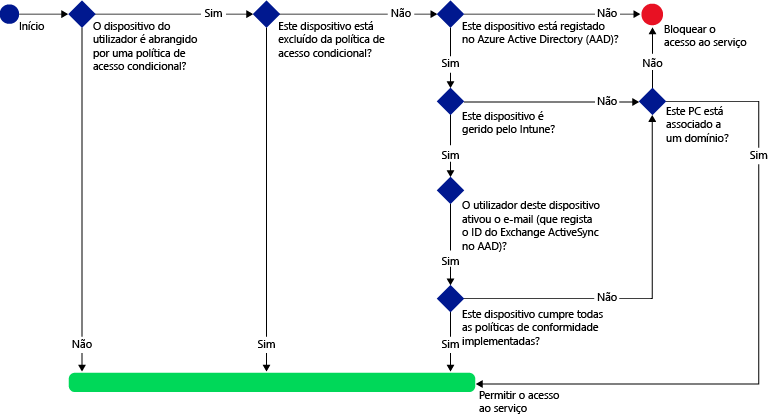
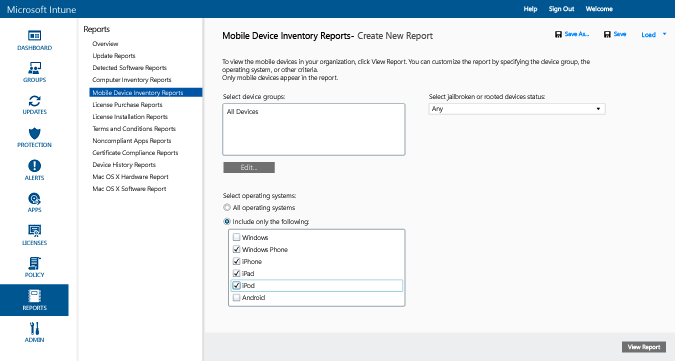
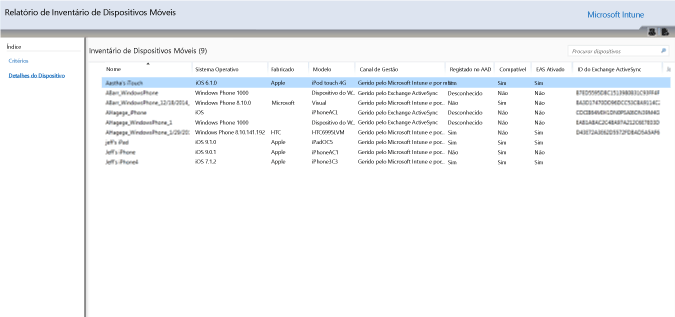
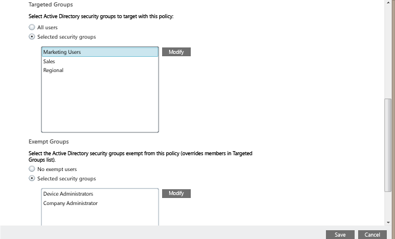
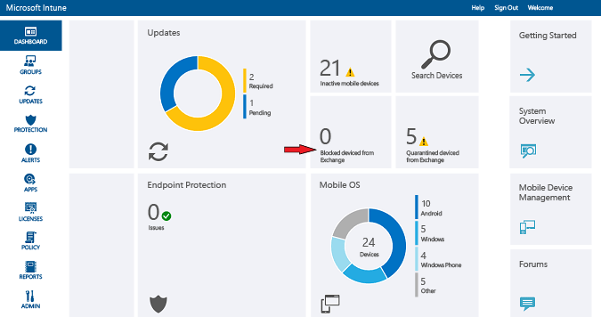

---
# required metadata

title: Restringir o acesso ao e-mail no Exchange Online e no novo Exchange Online Dedicado| Microsoft Intune
description:
keywords:
author: karthikaraman
manager: jeffgilb
ms.date: 04/28/2016
ms.topic: article
ms.prod:
ms.service: microsoft-intune
ms.technology:
ms.assetid: 09c82f5d-531c-474d-add6-784c83f96d93

# optional metadata

#ROBOTS:
#audience:
#ms.devlang:
ms.reviewer: chrisgre
ms.suite: ems
#ms.tgt_pltfrm:
#ms.custom:

---

# Restringir o acesso ao e-mail no Exchange Online e no novo Exchange Online Dedicado com o Intune

Se tiver um ambiente do Exchange Online Dedicado e precisar de saber se está na configuração nova ou legada, contacte o seu gestor de conta.

Para controlar o acesso ao e-mail no Exchange Online ou no novo ambiente do Exchange Online Dedicado, configure o acesso condicional para o Exchange Online no Intune.
Para saber mais sobre como funciona o acesso condicional, leia o artigo [Restringir o acesso ao e-mail e a serviços do Office 365](restrict-access-to-email-and-o365-services-with-microsoft-intune.md).

>[!IMPORTANT]
>O acesso condicional para PCs e dispositivos Windows 10 Mobile com aplicações que utilizam a autenticação moderna não está atualmente disponível para todos os clientes do Intune. Se já estiver a utilizar estas funcionalidades, não é necessário efetuar qualquer ação. Pode continuar a utilizá-las.

>Se não criou políticas de acesso condicional para PCs ou dispositivos Windows 10 Mobile para aplicações que utilizam a autenticação moderna e gostaria de fazê-lo, tem de submeter um pedido.  Pode encontrar mais informações sobre problemas conhecidos e sobre a forma de aceder a esta funcionalidade no [Web site do Microsoft Connect](http://go.microsoft.com/fwlink/?LinkId=761472).

**Antes de** pode configurar o acesso condicional, tem de:

-   Ter uma **subscrição do Office 365 que inclua o Exchange Online (como o plano E3)** e os utilizadores têm de estar licenciados para o Exchange Online.

-  Considere configurar o **Conector de serviços do Microsoft** opcional, que liga o [!INCLUDE[wit_nextref](../includes/wit_nextref_md.md)] ao Microsoft Exchange Online e ajuda-o a gerir informações de dispositivos através da consola do [!INCLUDE[wit_nextref](../includes/wit_nextref_md.md)]. Não tem de utilizar o conector para utilizar políticas de conformidade ou políticas de acesso condicional, mas é necessário executar relatórios que ajudam a avaliar o impacto do acesso condicional.

   > [!NOTE] Não configure o conector de serviços se pretender utilizar o acesso condicional para o Exchange Online e para o Exchange no local

   Para obter instruções sobre como configurar o conector, consulte o artigo [Conector de serviços do Intune](intune-service-to-service-exchange-connector.md)

Quando as políticas de acesso condicional são configuradas e direcionadas para um utilizador, antes de um utilizador poder ligar ao respetivo e-mail, o **dispositivo** que utiliza tem de ser:

-   **Inscrito** no [!INCLUDE[wit_nextref](../includes/wit_nextref_md.md)] ou ser um PC associado a um domínio.

-  **Registado no Azure Active Directory**. Isto ocorre automaticamente quando o dispositivo é inscrito no [!INCLUDE[wit_nextref](../includes/wit_nextref_md.md)]. Além disso, o ID do Exchange ActiveSync do cliente tem de ser registado no Azure Active Directory.

  O AAD DRS será automaticamente ativado para os clientes do Intune e do Office 365. Os clientes que já implementaram o Serviço de Registos de Dispositivos do ADFS não verão dispositivos registados no respetivo Active Directory no local.

-   **Conforme** com quaisquer políticas de conformidade do [!INCLUDE[wit_nextref](../includes/wit_nextref_md.md)] implementadas nesse dispositivo, ou associado a um domínio no local.

Se uma política de acesso condicional não for cumprida, é apresentada ao utilizador uma das duas mensagens seguintes quando iniciar sessão:

- Se o dispositivo não estiver inscrito no [!INCLUDE[wit_nextref](../includes/wit_nextref_md.md)], ou não estiver registado no Azure Active Directory, será apresentada uma mensagem com instruções sobre como instalar a aplicação do portal da empresa, inscrever o dispositivo e ativar o e-mail. Este processo também associa o ID do Exchange ActiveSync do dispositivo ao registo no Azure Active Directory.

-   Se o dispositivo for avaliado como não conforme com as regras da política de conformidade, o utilizador final é direcionado para o site do Portal da Empresa do [!INCLUDE[wit_nextref](../includes/wit_nextref_md.md)], ou para a aplicação Portal da Empresa, onde poderá encontrar informações sobre o problema e como resolvê-lo.

O diagrama abaixo ilustra o fluxo utilizado pelas políticas de acesso condicional para o Exchange Online.

## Suporte para dispositivos móveis
Pode restringir o acesso ao e-mail do Exchange Online a partir do **Outlook** e de outras **aplicações que utilizam autenticação moderna**:-

- Android 4.0 e posterior, Samsung Knox Standard 4.0 e posterior
- iOS 7.1 e posterior
- Windows Phone 8.1 e posterior

 A **autenticação moderna** proporciona um início de sessão baseado em ADAL (Active Directory Authentication Library) aos clientes do Microsoft Office.

> -   A autenticação baseada na ADAL permite que os clientes do Office participem na autenticação baseada no browser (também conhecido como autenticação passiva).  Para autenticar, o utilizador é direcionado para uma página Web de início de sessão. Este novo método de início de sessão permite uma maior segurança, como a **autenticação multifator**, e a **autenticação baseada em certificado** Este [artigo](https://support.office.com/en-US/article/How-modern-authentication-works-for-Office-2013-and-Office-2016-client-apps-e4c45989-4b1a-462e-a81b-2a13191cf517) tem informações mais detalhadas sobre como funciona a autenticação moderna.

Pode restringir o acesso ao e-mail do Exchange no **cliente de e-mail Exchange ActiveSync** incorporado nas seguintes plataformas:

- Android 4.0 e posterior, Samsung Knox Standard 4.0 e posterior

- iOS 7.1 e posterior

- Windows Phone 8.1 e posterior

## Suporte de PCs

Pode configurar o acesso condicional para computadores que executem aplicações de ambiente de trabalho do Office para aceder a **Exchange Online** e **SharePoint Online** para computadores que cumpram os requisitos seguintes:

-   O computador tem de estar a executar o Windows 7.0 ou o Windows 8.1.

-   O PC tem de estar associado a um domínio ou conforme com as regras da política de conformidade.

    Para ser considerado conforme, o PC tem de estar inscrito no [!INCLUDE[wit_nextref](../includes/wit_nextref_md.md)] e cumprir as políticas.

    Para um PC associado a um domínio, tem de defini-lo para [registar automaticamente o dispositivo](https://azure.microsoft.com/documentation/articles/active-directory-conditional-access-automatic-device-registration/) no Azure Active Directory.

-   A[autenticação moderna do Office 365 tem de estar ativada](https://support.office.com/en-US/article/Using-Office-365-modern-authentication-with-Office-clients-776c0036-66fd-41cb-8928-5495c0f9168a) e ter todas as atualizações mais recentes do Office.

    A autenticação moderna inclui o início de sessão baseado na Active Directory Authentication Library (ADAL) para clientes do Office 2013 Windows e permite uma maior segurança como **multi-factor authentication** e **autenticação baseada em certificado**.

-   Configure regras de afirmações do ADFS para bloquear protocolos de autenticação não moderna. São fornecidas instruções detalhadas no cenário 3 - [bloquear todo o acesso ao O365, exceto aplicações baseadas no browser](https://technet.microsoft.com/library/dn592182.aspx).

## Configurar o acesso condicional
### Passo 1: Configurar e implementar uma política de conformidade
Certifique-se de que [cria](create-a-device-compliance-policy-in-microsoft-intune.md) e [implementa](deploy-and-monitor-a-device-compliance-policy-in-microsoft-intune.md) uma política de conformidade para os grupos de utilizadores que também irão receber a política de acesso condicional.

> [!IMPORTANT] Se não tiver implementado uma política de conformidade, os dispositivos serão considerados conformes e terão permissão de acesso ao Exchange.

### Passo 2: Avaliar o efeito da política de acesso condicional
Pode utilizar os **Relatórios de Inventário de Dispositivos Móveis** para identificar os dispositivos que poderão ser impedidos de aceder ao Exchange após configurar a política de acesso condicional.

Para tal, configure uma ligação entre o [!INCLUDE[wit_nextref](../includes/wit_nextref_md.md)] e o Exchange utilizando o [Conector de serviços do Microsoft Intune](intune-service-to-service-exchange-connector.md).
1.  Navegue para **Relatórios -> Relatórios de Inventário de Dispositivos Móveis**.

2.  Nos parâmetros do relatório, selecione o grupo do [!INCLUDE[wit_nextref](../includes/wit_nextref_md.md)] que pretende avaliar e, se necessário, as plataformas de dispositivos às quais será aplicada a política.
3.  Depois de selecionar os critérios que satisfazem as necessidades da sua organização, escolha **Ver Relatório**.
O Visualizador de Relatórios é aberto numa nova janela.

Depois de executar o relatório, examine estas quatro colunas para determinar se um utilizador será bloqueado:

-   **Canal de Gestão** – indica se o dispositivo é gerido pelo Intune, pelo Exchange ActiveSync ou por ambos.

-   **Registado no AAD** – indica se o dispositivo está registado no Azure Active Directory (conhecido como Associação à Área de Trabalho).

-   **Conforme** – indica se o dispositivo está conforme com as políticas de conformidade implementadas.

-   **ID do Exchange ActiveSync** – é necessário que os dispositivos iOS e Android tenham o ID do Exchange ActiveSync associado ao registo do dispositivo no Azure Active Directory. Isto acontece quando o utilizador escolhe a ligação **Ativar E-mail** no e-mail de quarentena.

    > [!NOTE] Os dispositivos Windows Phone apresentam sempre um valor nesta coluna.

Os dispositivos que fazem parte de um grupo de destino serão impedidos de aceder ao Exchange, exceto se os valores da coluna corresponderem aos listados na seguinte tabela:

--------------------------
|Canal de gestão|Registado no AAD|Compatível|ID do Exchange ActiveSync|Ação resultante|
|----------------------|------------------|-------------|--------------------------|--------------------|
|**Gerido pelo Microsoft Intune e pelo Exchange ActiveSync**|Sim|Sim|É apresentado um valor|Acesso ao e-mail permitido|
|Qualquer outro valor|Não|Não|Não é apresentado nenhum valor|Acesso ao e-mail bloqueado|
----------------------
Pode exportar os conteúdos do relatório e utilizar a coluna **Endereço de E-mail** para informar os utilizadores de que serão bloqueados.

### Passo 3: Configurar grupos de utilizadores para a política de acesso condicional
As políticas de acesso condicional estão direcionadas para diferentes grupos de segurança de utilizadores do Azure Active Directory. Também pode isentar determinados grupos de utilizadores desta política.  Quando um utilizador é direcionado por uma política, cada dispositivo que utiliza tem de estar em conformidade para poder aceder ao e-mail.

Pode configurar estes grupos no **centro de administração do Office 365**ou no **portal de contas do Intune**.

Pode especificar dois tipos de grupos em cada política:

-   **Grupos direcionados** – grupos de utilizadores aos quais é aplicada a política.

-   **Grupos excluídos** – grupos de utilizadores excluídos da política (opcional)

Se um utilizador estiver em ambos os grupos, estará excluído da política.

Apenas os grupos direcionados pela política de acesso condicional são avaliados.

### Passo 4: Configurar a política de acesso condicional

1.  Na [consola de administração do Microsoft Intune](https://manage.microsoft.com), escolha **Política** > **Acesso Condicional** > **Política do Exchange Online**.

2.  Na página **Política do Exchange Online** , selecione **Ativar política de acesso condicional no Exchange Online**.

    > [!NOTE] Se não tiver implementado uma política de conformidade, os dispositivos são tratados como conformes.
    >
    > Independentemente do estado de conformidade, todos os utilizadores visados pela política terão de inscrever os respetivos dispositivos no [!INCLUDE[wit_nextref](../includes/wit_nextref_md.md)].

3.  Em **Acesso da aplicação**, para as aplicações que utilizam autenticação moderna, tem duas formas de escolher quais as plataformas a que a política deve ser aplicada. As plataformas suportadas incluem Android, iOS, Windows e Windows Phone.

    -   **Todas as plataformas**

        Esta opção requer que todos os dispositivos utilizados para aceder ao **Exchange  Online** estejam inscritos no Intune e em conformidade com as políticas.  Qualquer aplicação cliente que utilize a **autenticação moderna** está sujeita à política de acesso condicional, sendo que, se a plataforma não for suportada pelo Intune atualmente, o acesso ao **Exchange Online** será bloqueado.
        >[!TIP]
           Poderá não ver esta opção se ainda não estiver a utilizar o acesso condicional para PCs.  Em alternativa, utilize as **Plataformas específicas**. O acesso condicional para PCs não está atualmente disponível para todos os clientes do Intune.   Pode encontrar mais informações sobre problemas conhecidos e sobre a forma de aceder a esta funcionalidade no [Web site do Microsoft Connect](http://go.microsoft.com/fwlink/?LinkId=761472).

    -   **Plataformas específicas**

         A política de acesso condicional aplica-se a todas as aplicações cliente que utilizem a **autenticação moderna** nas plataformas de dispositivos que especificar.

4.  Em **Aplicações do Exchange ActiveSync**, pode optar por bloquear o acesso de dispositivos não conformes ao Exchange Online. Também pode selecionar se pretende permitir ou bloquear o acesso ao e-mail quando o dispositivo não está a executar uma plataforma suportada. As plataformas suportadas incluem Android, iOS, Windows e Windows Phone.

5.  Em **Grupos Direcionados**, selecione os grupos de segurança do Active Directory dos utilizadores aos quais será aplicada a política. Pode optar por segmentar todos os utilizadores ou uma lista selecionada de grupos de utilizadores.

    > [!NOTE] Para os utilizadores que estão nos **Grupos visados**, as políticas do Intune irão substituir as regras e as políticas do Exchange.
    >
    > O Exchange só irá impor as regras de permissão, bloqueio e quarentena do Exchange, e políticas do Exchange se:
    >
    > -   O utilizador não estiver licenciado para o Intune.
    > -   O utilizador estiver licenciado para o Intune, mas não pertencer a quaisquer grupos de segurança direcionados na política de acesso condicional.

6.  Em **Grupos Excluídos**, selecione os grupos de segurança do Active Directory dos utilizadores que estão excluídos desta política. Se um utilizador estiver em ambos os grupos, estará excluído da política.

7.  Quando tiver terminado, escolha **Guardar**.

-   Não tem de implementar a política de acesso condicional, pois esta entra em vigor imediatamente.

-   Depois de um utilizador criar uma conta de e-mail, o dispositivo é bloqueado de imediato.

-   Se um utilizador bloqueado inscrever o dispositivo no [!INCLUDE[wit_nextref](../includes/wit_nextref_md.md)] e corrigir problemas de não conformidade, o acesso ao e-mail é desbloqueado em dois minutos.

-   Se o utilizador anular a inscrição do dispositivo dele, o e-mail é bloqueado ao fim de, aproximadamente, seis horas.

**Para ver alguns cenários de exemplo de como poderia configurar a política de acesso condicional para restringir o acesso do dispositivo, consulte os [cenários de exemplo da restrição de acesso ao e-mail](restrict-email-access-example-scenarios.md).**

## Monitorizar a conformidade e as políticas de acesso condicional

#### Para ver os dispositivos bloqueados no Exchange

No dashboard do [!INCLUDE[wit_nextref](../includes/wit_nextref_md.md)], escolha o mosaico **Dispositivos Bloqueados no Exchange** para ver o número de dispositivos bloqueados e ligações para obter mais informações.

## Passos seguintes
[Restringir o acesso ao SharePoint Online](restrict-access-to-sharepoint-online-with-microsoft-intune.md)

[Restringir o acesso ao Skype para Empresas Online](restrict-access-to-skype-for-business-online-with-microsoft-intune.md)

<!--HONumber=Jun16_HO2-->

