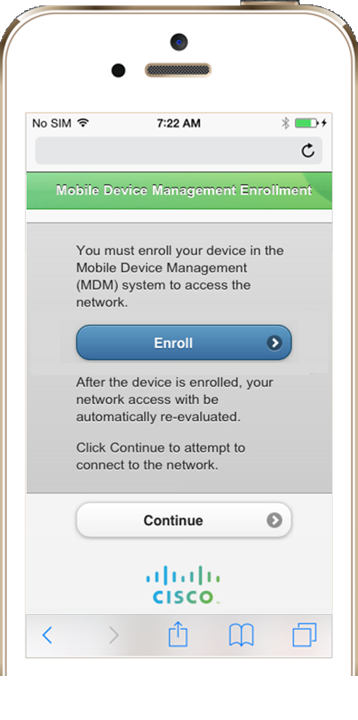

# Utilizar o Cisco ISE com o Microsoft Intune
A integração do Intune com o Cisco Identity Services Engine (ISE) permite-lhe criar políticas de rede no seu ambiente de ISE utilizando o estado de inscrição de dispositivos e de conformidade do Intune. Pode utilizar estas políticas para garantir que o acesso à rede da sua empresa está limitado aos dispositivos geridos pelo Intune e em conformidade com as políticas do Intune.

## Passos de configuração

Para ativar esta integração, não precisa de efetuar qualquer configuração no seu inquilino do Intune. Terá de fornecer permissões ao servidor do Cisco ISE para aceder ao inquilino do Intune. Depois de o fazer, ocorre a restante configuração no servidor do Cisco ISE. Este artigo dá instruções sobre como fornecer o servidor do ISE com permissões para aceder ao seu inquilino do Intune.

### Passo 1: gerir os certificados
Exporte o certificado da consola do Azure Active Directory (Azure AD) e, em seguida, importe-o para a loja de Certificados Fidedignos da consola do ISE:

#### Internet Explorer 11

   a. Execute o Internet Explorer como administrador e inicie sessão na consola do Azure AD.

   b. Selecione o ícone de cadeado na barra de endereço e escolha **Ver certificados**.

   c. No separador **Detalhes** das propriedades do certificado, escolha **Copiar para ficheiro**.

   d. Na página de boas-vindas do **Assistente para importar certificados**, escolha **Seguinte**.

   e. Na página **Formato do ficheiro de exportação**, deixe a predefinição, **Binário codificado DER x.509 (.CER)** e escolha **Seguinte**.  

   f. Na página **Ficheiro a exportar**, selecione **Procurar** para escolher uma localização na qual pretende guardar o ficheiro e forneça o nome do ficheiro. Apesar de parecer que está a escolher um ficheiro a exportar, está a atribuir um nome ao ficheiro no qual o certificado exportado será guardado. Selecione **Seguinte** &gt; **Concluir**.

   g. A partir da consola do ISE, importe o certificado do Intune (o ficheiro que exportou) para o  armazenamento **Certificados Fidedignos**.

#### Safari

 a. Inicie sessão na consola do Azure AD.

b. Selecione o ícone de cadeado &gt;  **Mais informações**.

   c. Selecione **Ver certificado** &gt; **Detalhes**.

   d. Escolha o certificado e, em seguida, selecione **Exportar**. 

   e. A partir da consola do ISE, importe o certificado do Intune (o ficheiro que exportou) para o  armazenamento **Certificados Fidedignos**.

> [!IMPORTANT]
>
> Verifique a data de expiração do certificado, porque terá de exportar e importar um novo certificado quando este expirar.

### Obter um certificado autoassinado do ISE 

1.  Na consola do ISE, vá para **Administração** > **Certificados** > **Certificados de Sistema** > **Gerar Certificado Autoassinado**.  
2.       Exporte o certificado autoassinado.
3. Num editor de texto, edite o certificado exportado:

 - Elimine ** -----BEGIN CERTIFICATE-----**
 - Elimine ** -----END CERTIFICATE-----**
 
Certifique-se de que todo o texto é uma linha única

### Passo 2: criar uma aplicação para ISE no seu inquilino do Azure AD
1. Na consola do Azure AD, escolha **Aplicações** > **Adicionar uma Aplicação** > **Adicionar uma aplicação que a minha organização está a desenvolver**.
2. Forneça um nome e um URL para a aplicação. O URL pode ser o Web site da sua empresa.
3. Transfira o manifesto da aplicação (um ficheiro JSON).
4. Edite o ficheiro de manifesto JSON. Na definição denominada **keyCredentials**, forneça o texto editado do certificado a partir do Passo 1, como o valor de definição.
5. Guarde o ficheiro sem alterar o respetivo nome.
6. Forneça a aplicação com permissões para o Microsoft Graph e a API do Microsoft Intune.

 a. Para o Microsoft Graph, escolha o seguinte:
    - **Permissões de aplicação**: ler os dados de diretório
    - **Permissões delegadas**:
        - Aceder a dados do utilizador em qualquer altura
        - Iniciar sessão dos utilizadores em

 b. Para a API do Microsoft Intune, em **Permissões de aplicação**, escolha **Obter estado do dispositivo e de conformidade do Intune**.

7. Selecione **Ver Pontos Finais** e copie os seguintes valores para utilização na configuração das definições de ISE:

|Valor no portal do Azure AD|Campo correspondente no portal ISE|
|-------------------|---------------------------------|
|Ponto final da API do Microsoft Azure AD Graph|URL de Deteção Automática|
|Ponto final de tokens de OAuth 2.0|URL de Emissão de tokens|
|Atualize o seu código com o seu ID de Cliente|ID de Cliente|

### Passo 3: carregar o certificado autoassinado a partir do ISE para a aplicação ISE que criou no Azure AD
1.     Obtenha o thumbprint e o valor do certificado codificado base64 a partir do ficheiro de certificado público .cer X509. Este exemplo utiliza o PowerShell:
   
      
      $cer = New-Object System.Security.Cryptography.X509Certificates.X509Certificate2    $cer.Import(“mycer.cer”)    $bin = $cer.GetRawCertData()    $base64Value = [System.Convert]::ToBase64String($bin)    $bin = $cer.GetCertHash()    $base64Thumbprint = [System.Convert]::ToBase64String($bin)    $keyid = [System.Guid]::NewGuid().ToString()
 
    Guarde os valores de $base64Thumbprint, $base64Value e $keyid para serem utilizados no passo seguinte.
2.       Carregue o certificado através do ficheiro de manifesto. Inicie sessão no [Portal de Gestão do Azure](https://manage.windowsazure.com)
2.      No snap-in do Azure AD encontre a aplicação que pretende configurar com um certificado X.509.
3.      Transfira o ficheiro de manifesto da aplicação. 
5.      Substitua o "KeyCredentials" vazio: [], propriedade com o seguinte JSON.  O tipo complexo KeyCredentials está documentado em [Referência de tipo complexo e entidade](https://msdn.microsoft.com/library/azure/ad/graph/api/entity-and-complex-type-reference#KeyCredentialType).

 
    “keyCredentials“: [ { “customKeyIdentifier“: “$base64Thumbprint_from_above”, “keyId“: “$keyid_from_above“, “type”: “AsymmetricX509Cert”, “usage”: “Verify”, “value”:  “$base64Value_from_above” }2. 
     ], 
 
Por exemplo:
 
    “keyCredentials“: [
    {
    “customKeyIdentifier“: “ieF43L8nkyw/PEHjWvj+PkWebXk=”,
    “keyId“: “2d6d849e-3e9e-46cd-b5ed-0f9e30d078cc”,
    “type”: “AsymmetricX509Cert”,
    “usage”: “Verify”,
    “value”: “MIICWjCCAgSgAwIBA***omitted for brevity***qoD4dmgJqZmXDfFyQ”
    }
    ],
 
6.      Guarde a alteração no ficheiro de manifesto da aplicação.
7.      Carregue o ficheiro de manifesto da aplicação editado através do portal de gestão do Azure.
8.      Opcional: transfira o manifesto novamente, para verificar que o certificado X.509 está presenta na aplicação.

>[!NOTE]
>
> KeyCredentials é uma coleção, pelo que pode carregar vários certificados X.509 para cenários de rollover ou eliminar certificados em cenários de compromisso.

### Passo 4: configurar as definições de ISE
Na consola de administração de ISE, forneça estes valores de definição:
  - **Tipo de Servidor**: o Gestor de Dispositivos Móveis
  - **Tipo de autenticação**: OAuth – Credenciais de Cliente
  - **Deteção Automática**: Sim
  - **URL de Deteção Automática**: *introduza o valor do Passo 1.*
  - **ID de Cliente**: *introduza o valor do Passo 1.*
  - **URL de emissão de tokens**: *introduza o valor do Passo 1.*

## As informações partilhadas entre o seu inquilino do Intune e o servidor de Cisco ISE
Esta tabela lista as informações partilhadas entre o seu inquilino do Intune e o servidor do Cisco ISE para dispositivos geridos pelo Intune.

|Propriedade|  Descrição|
|---------------|------------------------------------------------------------|
|complianceState|A cadeia verdadeiro ou falso que indica se o dispositivo é ou não compatível.|
|isManaged|A cadeia verdadeiro ou falso que indica se o cliente é gerido ou não pelo Intune.|
|macAddress|O endereço MAC do dispositivo.|
|serialNumber|O número de série do dispositivo. Aplica-se apenas a dispositivos iOS.|
|imei|O IMEI (15 dígitos decimais: 14 dígitos mais um dígito de verificação) ou IMEISV (16 dígitos) inclui informações sobre a origem, o modelo e o número de série do dispositivo. A estrutura deste número é especificada em 3GPP TS 23.003. Aplica-se apenas a dispositivos com cartões SIM.|
|udid|O Identificador de Dispositivo Exclusivo, uma sequência de 40 letras e números. É específico de dispositivos iOS.|
|meid|O identificador de equipamento móvel, um número globalmente único que identifica um elemento físico do equipamento da estação móvel CDMA. O formato do número é definido pelo relatório 3GPP2 S. R0048. No entanto, em termos práticos, pode ser visto como um IMEI, mas com dígitos hexadecimais. Um MEID tem 56 bits de comprimento (14 dígitos hexadecimais). É composto por três campos, incluindo um código regional de 8 bits (RR), um código de fabricante de 24 bits e um número de série atribuído pelo fabricante de 24 bits.|
|osVersion|A versão do sistema operativo do dispositivo.
|modelo|O modelo do dispositivo.
|fabricante|O fabricante do dispositivo.
|azureDeviceId|O ID do dispositivo depois de ter sido associado ao Azure AD. É um GUID vazio para os dispositivos que não estão associados.|
|lastContactTimeUtc|A data e a hora em que o dispositivo fez o registo pela última vez no serviço de gestão do Intune.

## Experiência de utilizador

Quando um utilizador tenta aceder aos recursos através de um dispositivo não inscrito, recebe uma linha de comandos para a inscrição, tal como a mostrada aqui:

Quando o utilizador opta pela inscrição, é redirecionado para o processo de inscrição do Intune. A experiência de inscrição do utilizador para o Intune é descrita nos seguintes tópicos:

- [Inscrever o seu dispositivo Android no Intune](/intune/enduser/enroll-your-device-in-Intune-android) 
- [Inscrever o seu dispositivo iOS no Intune](/intune/enduser/enroll-your-device-in-intune-ios) 
- [Inscrever o seu dispositivo Mac OS X no Intune](/intune/enduser/enroll-your-device-in-intune-mac-os-x) 
- [Inscrever o seu dispositivo Windows no Intune](/intune/enduser/enroll-your-device-in-intune-windows) 

Também existe um [conjunto transferível de instruções de inscrição](https://gallery.technet.microsoft.com/End-user-Intune-enrollment-55dfd64a) que pode utilizar para criar orientações personalizadas para a sua experiência de utilizador.

### Consulte também

[Cisco Identity Services Engine Administrator Guide, Release 2.1 (Guia do Administrador do Motor de Serviços de Identidade Cisco, Versão 2.1 – em inglês)](http://www.cisco.com/c/en/us/td/docs/security/ise/2-1/admin_guide/b_ise_admin_guide_21/b_ise_admin_guide_20_chapter_01000.html#task_820C9C2A1A6647E995CA5AAB01E1CDEF)

<!--HONumber=Nov16_HO1-->

