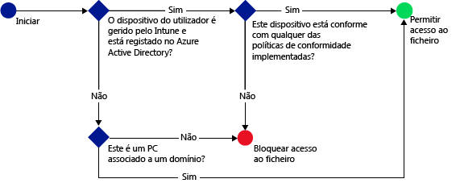

---
# required metadata

title: Restringir o acesso ao SharePoint Online | Microsoft Intune
description:
keywords:
author: karthikaraman
manager: jeffgilb
ms.date: 04/28/2016
ms.topic: article
ms.prod:
ms.service: microsoft-intune
ms.technology:
ms.assetid: b088e5a0-fd4a-4fe7-aa49-cb9c8cfb1585

# optional metadata

#ROBOTS:
#audience:
#ms.devlang:
ms.reviewer: jeffgilb
ms.suite: ems
#ms.tgt_pltfrm:
#ms.custom:

---

# Restringir o acesso ao SharePoint Online com o Microsoft Intune
Utilize o acesso condicional do [!INCLUDE[wit_firstref](../includes/wit_firstref_md.md)] para controlar o acesso a ficheiros localizados no SharePoint Online.
O acesso condicional tem dois componentes:
- A política de conformidade de dispositivos que o dispositivo tem de cumprir para ser considerado conforme.
- A política de acesso condicional onde especifica as condições que o dispositivo tem de cumprir para poder aceder ao serviço.
Para saber mais sobre como funciona o acesso condicional, leia o tópico [Restringir o acesso ao e-mail e aos serviços do Office 365](restrict-access-to-email-and-o365-services-with-microsoft-intune.md).

Quando um utilizador se tentar ligar a um ficheiro através de uma aplicação suportada, como o OneDrive, no respetivo dispositivo, ocorre a seguinte avaliação:

>[!IMPORTANT]
>O acesso condicional para PCs e dispositivos Windows 10 Mobile com aplicações que utilizam a autenticação moderna não está atualmente disponível para todos os clientes do Intune. Se já estiver a utilizar estas funcionalidades, não é necessário efetuar qualquer ação. Pode continuar a utilizá-las.

>Se não criou políticas de acesso condicional para PCs ou dispositivos Windows 10 Mobile para aplicações que utilizam a autenticação moderna e gostaria de fazê-lo, tem de submeter um pedido.  Pode encontrar mais informações sobre problemas conhecidos, bem como sobre como obter acesso a esta funcionalidade, no [site do Connect](http://go.microsoft.com/fwlink/?LinkId=761472)

**Antes de** configurar uma política de acesso condicional para o Skype para o SharePoint Online, tem de:
- Ter uma **subscrição do SharePoint Online** e os utilizadores têm de estar licenciados para o SharePoint Online.
- Ter uma subscrição do **Enterprise Mobility Suite** ou do **Azure Active Directory Premium**

  Para ligar aos ficheiros necessários, o dispositivo tem de:
-   Estar **inscrito** no [!INCLUDE[wit_nextref](../includes/wit_nextref_md.md)] ou ser um PC associado a um domínio.

-   **Registar o dispositivo** no Azure Active Directory (isto ocorre automaticamente quando o dispositivo é inscrito no

-   Ser compatível com todas as políticas de conformidade do [!INCLUDE[wit_nextref](../includes/wit_nextref_md.md)] implementadas

O estado do dispositivo é armazenado no Azure Active Directory, o qual concede ou bloqueia o acesso aos ficheiros, com base nas condições que especificar.

Se não for cumprida uma condição, é apresentada ao utilizador uma das duas mensagens seguintes quando iniciar sessão:

-   Se o dispositivo não estiver inscrito no [!INCLUDE[wit_nextref](../includes/wit_nextref_md.md)] ou não estiver registado no Azure Active Directory, é apresentada uma mensagem com instruções sobre como instalar a aplicação Portal da Empresa e inscrevê-lo.

-   Se o dispositivo não for conforme, é apresentada uma mensagem que direciona o utilizador para o site do Portal da Empresa do [!INCLUDE[wit_nextref](../includes/wit_nextref_md.md)], onde poderá encontrar informações sobre o problema e como resolvê-lo.

## Suporte para dispositivos móveis
- iOS 7.1 e posterior
- Android 4.0 e posterior, Samsung Knox Standard 4.0 ou posterior
- Windows Phone 8.1 e posterior

## Suporte de PCs
- Windows 8.1 e posterior (quando inscrito com o Intune)
- Windows 7.0 ou Windows 8.1 (quando associado a um domínio)

  - Os PCs associados a um domínio têm de estar configurados para serem [registados automaticamente](https://azure.microsoft.com/en-us/documentation/articles/active-directory-conditional-access-automatic-device-registration/) no Azure Active Directory.
O AAD DRS será automaticamente ativado para os clientes do Intune e do Office 365. Os clientes que já implementaram o Serviço de Registos de Dispositivos do ADFS não verão dispositivos registados no respetivo Active Directory no local.

  - Se a política estiver definida para exigir a associação a um domínio e o PC não estiver associado a um domínio, é apresentada uma mensagem para contactar o administrador de TI.

  - Se a política estiver definida para exigir a associação a um domínio ou estar em conformidade, e o PC não cumprir nenhum dos requisitos, é apresentada uma mensagem com instruções sobre como instalar a aplicação Portal da Empresa e inscrevê-lo.
-    A[autenticação moderna do Office 365 tem de estar ativada](https://support.office.com/en-US/article/Using-Office-365-modern-authentication-with-Office-clients-776c0036-66fd-41cb-8928-5495c0f9168a) e ter todas as atualizações mais recentes do Office.

    A autenticação moderna inclui o início de sessão baseado na Active Directory Authentication Library (ADAL) para clientes Windows do Office 2013 e permite uma maior segurança como a **autenticação multifator** e a **autenticação baseada em certificado**

## Configurar o acesso condicional para o SharePoint Online

### Passo 1: configurar grupos de segurança do Active Directory
Antes de começar, configure grupos de segurança do Azure Active Directory para a política de acesso condicional. Pode configurar estes grupos no **centro de administração do Office 365**ou no **portal de contas do Intune**. Estes grupos serão utilizados para visar ou excluir utilizadores da política. Quando um utilizador é direcionado por uma política, cada dispositivo que utiliza tem de estar em conformidade para poder aceder aos recursos.

Pode especificar dois tipos de grupos numa política do SharePoint Online:

-   **Grupos visados** – contém os grupos de utilizadores aos quais a política será aplicada.

-   **Grupos excluídos** – contém os grupos de utilizadores excluídos da política.

Se um utilizador estiver em ambos os grupos, estará excluído da política.

### Passo 2: configurar e implementar uma política de conformidade
Se ainda não o fez, crie e implemente uma política de conformidade para os utilizadores que a política do SharePoint Online irá visar.

> Enquanto as políticas de conformidade são implementadas nos grupos do [!INCLUDE[wit_nextref](../includes/wit_nextref_md.md)], as políticas de acesso condicional são direcionadas para os grupos de segurança do Azure Active Directory.

Para obter detalhes sobre como configurar a política de conformidade, consulte [Criar uma política de conformidade](create-a-device-compliance-policy-in-microsoft-intune.md)

> Se não tiver implementado uma política de conformidade, os dispositivos serão tratados como conformes.

Quando estiver pronto, avance para o **Passo 3**

### Passo 3: configurar a política do SharePoint Online
Em seguida, configure a política para exigir que apenas os dispositivos geridos e conformes podem aceder ao SharePoint Online. Esta política será armazenada no Azure Active Directory.

#### 

1.  Na [consola de administração do Microsoft Intune](https://manage.microsoft.com), clique em **Política** > **Acesso Condicional** > **Política do SharePoint Online**

2.  Selecione **Ativar política de acesso condicional do SharePoint Online**

3.  Em **Acesso da aplicação**, pode optar por aplicar a política de acesso condicional a:

    -   **Todas as plataformas**

        Esta opção requer que todos os dispositivos utilizados para aceder ao **SharePoint Online** estejam inscritos no Intune e em conformidade com as políticas.  Qualquer aplicação cliente que utilize a **autenticação moderna** está sujeita à política de acesso condicional. Se a plataforma não for atualmente suportada pelo Intune, o acesso ao **SharePoint Online** está bloqueado.
        >[!TIP]
        >Poderá não ver esta opção se ainda não estiver a utilizar o acesso condicional para PCs.  Em alternativa, utilize as **Plataformas específicas**. O acesso condicional para PCs não está atualmente disponível para todos os clientes do Intune.   Pode encontrar mais informações sobre problemas conhecidos, bem como sobre como obter acesso a esta funcionalidade no [site do Microsoft Connect](http://go.microsoft.com/fwlink/?LinkId=761472)

    -   **Plataformas específicas**

         A política de acesso condicional aplica-se a todas as aplicações cliente que utilizem a autenticação moderna nas plataformas que especificar.

     Para PCs Windows, o PC tem de estar associado a um domínio ou inscrito no [!INCLUDE[wit_nextref](../includes/wit_nextref_md.md)] e estar em conformidade. Pode definir os seguintes requisitos:

     -   **Os dispositivos têm de estar associados a um domínio ou em conformidade.** Escolha esta opção se pretender que os dispositivos estejam associados a um domínio ou em conformidade com as políticas definidas no [!INCLUDE[wit_nextref](../includes/wit_nextref_md.md)]. Se o PC não cumprir nenhum destes requisitos, é pedido ao utilizador que inscreva o dispositivo no

     -   **Os dispositivos têm de estar associados a um domínio.** Escolha esta opção para exigir que os PCs estejam associados a um domínio para aceder ao Exchange Online. Se o PC não estiver associado a um domínio, o acesso ao e-mail é bloqueado e é pedido ao utilizador que contacte o administrador de TI.

     -   **Os dispositivos têm de estar em conformidade.** Escolha esta opção para exigir que os PCs sejam inscritos no [!INCLUDE[wit_nextref](../includes/wit_nextref_md.md)] e em conformidade. Se o PC não estiver inscrito, será apresentada uma mensagem com instruções sobre como inscrevê-lo.

4.  Em **Grupos Direcionados**, clique em **Modificar** para selecionar os grupos de segurança do Azure Active Directory aos quais será aplicada a política. Pode optar por direcionar esta opção a todos os utilizadores ou apenas a grupos de utilizadores específicos.

5.  Opcionalmente, em **Grupos Excluídos**, clique em **Modificar** para selecionar os grupos de segurança do Azure Active Directory que estão excluídos desta política.

6.  Quando tiver terminado, clique em **Guardar**

Não tem de implementar a política de acesso condicional, pois esta entra em vigor imediatamente.

### Passo 4: Monitorizar a conformidade e as políticas de acesso condicional
Na área de trabalho **Grupos**, pode ver o estado dos seus dispositivos.

Selecione qualquer grupo de dispositivos móveis e, em seguida, no separador **Dispositivos** , selecione um dos seguintes **Filtros**:

-   **Dispositivos não registados no AAD** – estes dispositivos estão bloqueados no SharePoint Online.

-   **Dispositivos não conformes** – estes dispositivos estão bloqueados no SharePoint Online.

-   **Dispositivos registados no AAD e conformes** – estes dispositivos podem aceder ao SharePoint Online.

### Consulte também
[Restringir o acesso ao e-mail e aos serviços do Office 365 com o Microsoft Intune](restrict-access-to-email-and-o365-services-with-microsoft-intune.md)

<!--HONumber=May16_HO2-->

