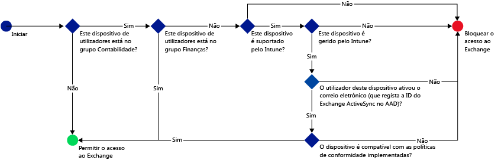
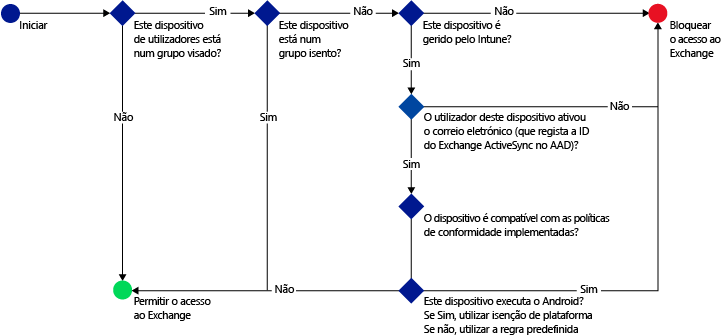

# Restringir o acesso ao e-mail com o Microsoft Intune: cenários de exemplo

## Impeça os utilizadores de utilizarem dispositivos não conformes para aceder ao Exchange Online.
### Requisitos do cenário
- Todos os utilizadores no grupo de segurança **Contabilidade** do Active Directory têm de ser impedidos de aceder ao Exchange Online se o respetivo dispositivo não for conforme com uma política de conformidade implementada por si.
- Se existirem utilizadores neste grupo cujos dispositivos não sejam suportados pelo [!INCLUDE[wit_nextref](../includes/wit_nextref_md.md)], têm de ser impedidos de aceder ao Exchange Online nesse dispositivo.
- Os utilizadores no grupo de segurança **Finanças** do Active Directory têm de estar excluídos da política, mesmo que também estejam no grupo de segurança **Contabilidade**.

Para tal, configure uma política de acesso condicional para o Exchange Online com as seguintes definições:

-   Selecione **Ativar política de acesso condicional**.

- Selecione as plataformas a partir das quais pretende permitir o acesso das aplicações com autenticação moderna.
- Para aplicações do Exchange ActiveSync, selecione **Bloquear dispositivos não conformes em plataformas suportadas pelo Microsoft Intune** e **Bloquear todos os outros dispositivos em plataformas não suportadas pelo Microsoft Intune.**
-   Na secção **Grupo visado**, em **Grupos de segurança selecionados**, escolha o grupo de utilizadores **Contabilidade**.

-   Na secção **Grupo excluído**, em **Grupos de segurança selecionados**, escolha o grupo de utilizadores **Finanças**.

É utilizado o fluxo seguinte para decidir quais os dispositivos que podem aceder ao Exchange Online:

## Todos os dispositivos iOS que acedem ao Exchange no local têm de ser geridos pelo Intune
### Requisitos do cenário
- Apenas os dispositivos que executam o iOS devem ter permissão para aceder ao Exchange no local.
- Os dispositivos também têm de estar inscritos no Intune e cumprir as regras de política de conformidade antes de poderem ser utilizados para aceder ao Exchange.

Para tal, configure a política de acesso condicional seguinte para o Exchange no local com as seguintes definições:

-   Selecione a opção **Impedir que as aplicações de e-mail acedam ao Exchange no local se o dispositivo não estiver em conformidade ou não estiver inscrito no Microsoft Intune**. Ao selecionar esta opção, a política de acesso condicional é ativada, o que requer que todos os dispositivos estejam inscritos no Microsoft Intune e cumpram as regras de política de conformidade antes de poderem aceder ao Exchange.

-   Para definições avançadas do Exchange Active Sync, crie:

  -   Uma exceção de plataforma que permite aos dispositivos que executam o iOS aceder ao Exchange.   

  -   Uma regra predefinida que especifique que quando um dispositivo não está abrangido pela regra de exceção da plataforma, deve ser impedido de aceder ao Exchange. Esta regra assegura que os dispositivos que não estejam a executar o iOS sejam impedidos de aceder ao Exchange.

É utilizado o fluxo seguinte para decidir quais os dispositivos que podem aceder ao Exchange:

## Nenhum dispositivo Android pode aceder ao Exchange no local.
### Requisitos do cenário
- Todos os dispositivos Android devem ser impedidos de aceder ao Exchange.
- Todos os outros dispositivos suportados podem aceder ao Exchange, desde que sejam geridos pelo [!INCLUDE[wit_nextref](../includes/wit_nextref_md.md)].

Para tal, configure uma política de acesso condicional para o Exchange no local com as seguintes definições:

-   Selecione a opção **Impedir que as aplicações de e-mail acedam ao Exchange no local se o dispositivo não estiver em conformidade ou não estiver inscrito no Microsoft Intune**. Ao selecionar esta opção, todos os dispositivos têm de estar inscritos no Intune e cumprir as regras de política de conformidade.

- Para definições avançadas do Exchange Active Sync, crie:
  -   Uma exceção de plataforma que impede os dispositivos que executam o Android de aceder ao Exchange. Esta regra assegura que os dispositivos Android não podem ser utilizados para aceder ao Exchange.

  -   Uma regra predefinida que especifica que, se um dispositivo não estiver abrangido por outras regras, deve ter permissão para aceder ao Exchange. Esta regra predefinida assegura que os dispositivos que executem plataformas que não sejam o Android, mas suportadas pelo Microsoft Intune, podem ser utilizados para aceder ao Exchange. No entanto, têm de estar inscritos no Intune e cumprir as regras de política de conformidade.

É utilizado o fluxo seguinte para decidir quais os dispositivos que podem aceder ao Exchange:

<!--HONumber=Jul16_HO4-->

