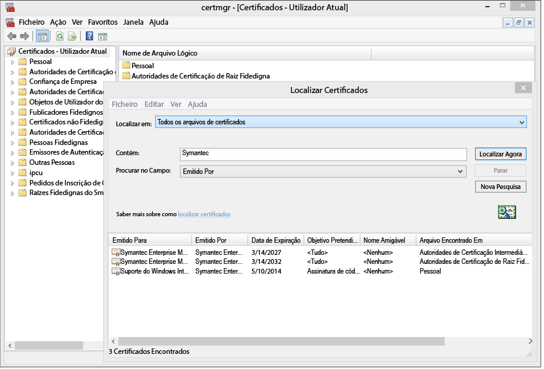
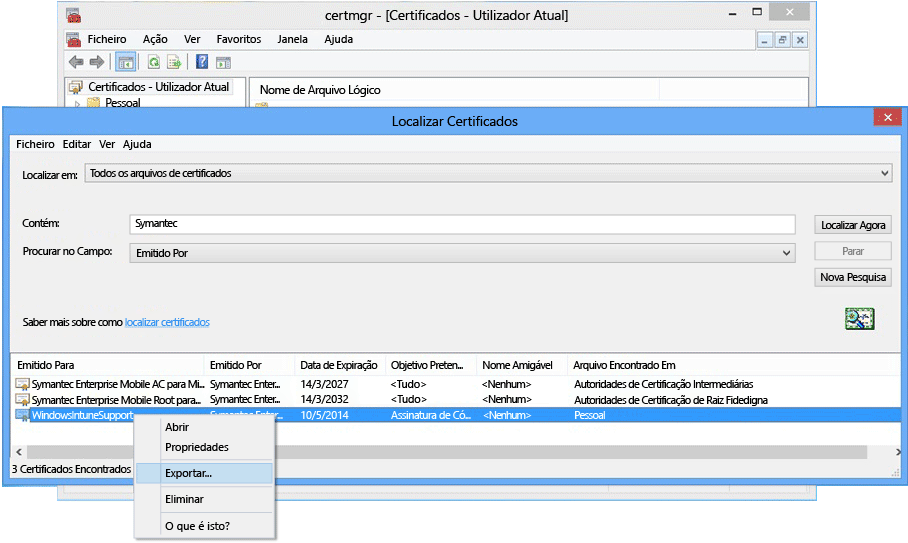

---
# required metadata

title: Configurar a gestão do Windows Phone 8.0 | Microsoft Intune
description:
keywords:
author: NathBarn
manager: jeffgilb
ms.date: 06/09/2016
ms.topic: article
ms.prod:
ms.service: microsoft-intune
ms.technology:
ms.assetid: 61e9b6c3-8795-49b0-8ab2-a9a05ee3ea1f

# optional metadata

#ROBOTS:
#audience:
#ms.devlang:
ms.reviewer: priyar
ms.suite: ems
#ms.tgt_pltfrm:
#ms.custom:

---

# Configurar a gestão de dispositivos para Windows Phone 8.0

O Windows Phone 8.0 requer um certificado da Symantec para instalar a aplicação Portal da Empresa do Intune e permitir a gestão de dispositivos. Também é necessário um certificado para assinar aplicações de linha de negócio. O tópico seguinte é apenas para o Windows Phone 8.0. Para gerir o Windows Phone 8.1 ou posterior, incluindo o Windows 10 Mobile, consulte [Configurar a inscrição do Windows Phone](set-up-windows-phone-management-with-microsoft-intune.md).

> [!IMPORTANT] A partir de setembro de 2016, a aplicação Portal da empresa para Windows 8.0 e Windows Phone 8.0 deixará de estar disponível para transferência.

-   **Windows Phone 8** - Certificado necessário
-   O **Windows Phone 8.1 e o Windows 10 Mobile** apenas requerem um certificado se:

    -   Pretender implementar a aplicação Portal da Empresa utilizando o Intune

    -   For implementar aplicações de linha de negócio (também conhecidas como "sideload")


  > [!IMPORTANT] O certificado da Symantec utilizado para gerir determinados dispositivos móveis Windows e Windows Phone [tem de ser renovado periodicamente](renew-a-symantec-code-signing-certificate.md).

Os requisitos de configuração da gestão de dispositivos móveis Windows Phone dependem da forma como irá gerir os dispositivos.  A definição de dois CNAMEs no registo DNS da empresa facilita a inscrição para os utilizadores. Se os seus utilizadores transferirem a aplicação Portal da Empresa a partir da Loja, depois de configurar as definições DNS, apenas tem de configurar o Portal da Empresa e informar os utilizadores sobre como efetuar a inscrição.  Para o Windows Phone 8.0, ou o Windows Phone 8.1 onde implementará o Portal da Empresa, necessitará de um certificado da Symantec para assinar a aplicação com código.

## Configurar os requisitos de configuração para ativar a gestão do Windows Phone
1.  **Configurar o Intune** Se ainda não o fez, prepare a gestão de dispositivos móveis, [definindo a autoridade de gestão de dispositivos móveis](get-ready-to-enroll-devices-in-microsoft-intune.md#set-mobile-device-management-authority) como **Microsoft Intune** e definindo o MDM.

2.  **Definir um alias DNS para o endereço do servidor de inscrição** (opcional)

    Um alias DNS (tipo de registo CNAME) torna mais fácil para os utilizadores inscrever os respetivos dispositivos preenchendo automaticamente o nome do servidor durante a inscrição.

    1.  Na [consola de administração do Intune](http://manage.microsoft.com), clique em **Administração** &gt; **Gestão de Dispositivos Móveis** &gt; **Windows Phone**.

    2.  Introduza o URL do domínio verificado do Web site da empresa na caixa **Especificar o nome de um domínio verificado** e, em seguida, clique em **Testar Deteção Automática**.

    3.  Crie registos de recursos DNS **CNAME** para o domínio da sua empresa. Os registos de recursos CNAME têm de conter as seguintes informações:

        |Nome do Anfitrião|Aponta para|TTL|
        |-------------|-------------|-------|
        |enterpriseenrollment.dominio_da_empresa.com|enterpriseenrollment-s.manage.microsoft.com |1 Hora|
        |enterpriseregistration.dominio_da_empresa.com|enterpriseregistration.windows.net|1 Hora|
        Por exemplo, se o Web site da sua empresa fosse contoso.com, criaria um CNAME em DNS que redireciona EnterpriseEnrollment.contoso.com para manage.microsoft.com. Se existir mais do que um domínio verificado, crie um registo CNAME para cada domínio.

        -   `enterpriseenrollment-s.manage.microsoft.com` – Suporta o redirecionamento para o serviço Intune com reconhecimento de domínio a partir do nome de domínio do e-mail

        -   `enterpriseregistration.windows.net` – Suporta a associação à área de trabalho para dispositivos móveis. Também suporta acesso condicional para Windows 8.1

    

3.  **Gestão de certificados para suportar a assinatura de aplicações** [Necessário para os dispositivos Windows Phone 8.0 e Windows Phone 8.1 que não conseguem aceder à Loja do Windows Phone e/ou que precisem de aplicações de linha de negócio.]

    Para suportar a aplicação Portal da Empresa para Windows Phone 8.0 e implementar as aplicações da empresa no Windows Phone 8.1, tem de obter um **Certificado de Assinatura de Código de Dispositivo Móvel Empresarial da Symantec**. Não pode utilizar um certificado emitido pela sua própria autoridade de certificação porque os dispositivos Windows Phone só consideram fidedigno o certificado da Symantec. Este certificado é necessário para:

    -   Assinar a aplicação Portal da Empresa para implementação no [!INCLUDE[winphone8_client_1](../includes/winphone8_client_1_md.md)] para inscrição e gestão de telemóveis

    -   Assinar aplicações de linha de negócio para que o [!INCLUDE[wit_nextref](../includes/wit_nextref_md.md)] as possa implementar em Windows Phones

    Os passos abaixo irão ajudá-lo a obter os certificados necessários e a assinar a aplicação do portal da empresa. Precisará de uma conta do Windows Phone Dev Center e de comprar um certificado da Symantec.

    1.  **Aderir ao Windows Phone Dev Center** Adira ao [Windows Phone Dev Center](http://go.microsoft.com/fwlink/?LinkId=268442) ao utilizar as informações de conta empresarial quando iniciar sessão para comprar a sua conta de empresa. Este pedido terá de ser autorizado por um responsável da empresa antes de poder receber um certificado de assinatura com código.

    2.  **Obter um certificado empresarial da Symantec** Compre um certificado no [Web site da Symantec](http://go.microsoft.com/fwlink/?LinkId=268441) com o seu ID da Symantec. Depois de comprar o certificado, o aprovador da empresa que tiver designado na sua conta do Windows Phone Dev Center receberá uma mensagem de e-mail a solicitar a aprovação do pedido de certificado. Para mais informações sobre o requisito do certificado da Symantec, consulte as FAQ sobre a inscrição de dispositivos Windows [Por que é que o Windows Phone precisa de um certificado da Symantec?](https://technet.microsoft.com/en-us/library/dn764959.aspx#BKMK_Symantec) .

    3.  **Importar certificados** Quando o pedido for aprovado, receberá um e-mail com instruções para importar os certificados. Siga as instruções no e-mail para importar os certificados.

    4.  **Verificar os certificados importados** Para verificar se os certificados foram importados corretamente, aceda ao snap-in **Certificados**, clique com o botão direito do rato em **Certificados** e selecione **Localizar Certificados**. No campo **Contém** , escreva “Symantec” e clique em **Localizar Agora**. Os certificados que importou deverão ser apresentados nos resultados.

        

    5.  **Exportar um certificado de assinatura** Após verificar que os certificados estão presentes, pode exportar o ficheiro .pfx para assinar o portal da empresa. Selecione o certificado da Symantec com “assinatura com código” como o **Objetivo a que se destina**. Clique com o botão direito do rato no certificado de assinatura com código e selecione **Exportar**.

        

        No **Assistente para Exportar Certificados**, selecione **Sim, exportar a chave privada** e, em seguida, clique em **Seguinte**. **Selecione Personal Information Exchange –PKCS #12 (.PFX)** e marque **Incluir todos os certificados no caminho de certificação, se possível**. Conclua o assistente. Para mais informações, consulte o artigo [Como Exportar um Certificado com a Chave Privada](http://go.microsoft.com/fwlink/?LinkID=203031).

    6.  **Transferir e assinar a aplicação Portal da Empresa**

        O suporte para a inscrição do Windows Phone requer que a aplicação Portal da Empresa do Windows Phone 8.0 seja assinada e carregada para o Intune.

        1.  **Transferir o Portal da Empresa** Transfira o [Portal da Empresa do Intune para Windows Phone](http://go.microsoft.com/fwlink/?LinkId=268440) a partir do Centro de Transferências. A localização predefinida de instalação é `C:\Program Files (x86)\Microsoft Corporation\Windows Intune Company Portal for Windows Phone`.

        2.  **Transferir o Windows Phone 8.0 SDK** Transfira o [Windows Phone SDK](http://go.microsoft.com/fwlink/?LinkId=615570).

        3.  **Assinar a aplicação Portal da Empresa com código** Utilize a aplicação XAPSignTool transferida com o SDK para assinar o portal da empresa com o ficheiro .pfx que criou a partir do certificado da Symantec. Para mais informações, consulte o artigo [Como assinar uma aplicação da empresa com a XapSignTool](http://go.microsoft.com/fwlink/?LinkID=280195).

    7.  **Carregar a aplicação Portal da Empresa para o Intune** Carregue o ficheiro assinado da aplicação Portal da Empresa e o seu certificado de assinatura com código para disponibilizar a aplicação aos seus utilizadores finais.

        1.  Na [consola de administração do Intune](http://manage.microsoft.com), clique em **Administração** &gt; **Windows Phone**.

        2.  Clique em **Carregar o Ficheiro Assinado da Aplicação** e inicie sessão com o seu ID de Administrador do Intune.

        3.  Na página **Configuração do software** para **Especificar a localização dos ficheiros de configuração do software**, navegue para a localização da aplicação Portal da Empresa assinada com código (.xap para Windows Phone 8.0 ou .appx para Windows Phone 8.1).

            Se estiver a avaliar o Intune e carregar um ficheiro de aplicação assinado com código numa conta de avaliação do Intune, desmarque a caixa de verificação **Utilizar o ficheiro da Aplicação Portal da Empresa assinado pelo certificado assinado com código da Symantec de exemplo**.

        4.  Adicione o ficheiro de certificado (.pfx) que exportou para o **Certificado de assinatura com código** e crie uma palavra-passe para o certificado.

        5.  Na página **Descrição do software** , preencha os campos, tendo em conta que os utilizadores verão estas informações nos respetivos dispositivos ao consultarem os detalhes da aplicação no Portal da Empresa.

        6.  Conclua o assistente. Os utilizadores que inscreverem um dispositivo Windows Phone 8.0 obterão a aplicação Portal da Empresa nos respetivos dispositivos durante a inscrição. Os utilizadores do Windows Phone 8.1 podem instalar a aplicação Portal da Empresa a partir da versão da loja do Portal da Empresa.  Se os dispositivos Windows Phone 8.1 estiverem impedidos de aceder à Loja do Windows Phone ou se pretender implementar a aplicação Portal da Empresa através do Intune, tem de transferir e assinar a aplicação Portal da Empresa do Windows Phone 8.1 (SSP.appx).

4.  **Informar os utilizadores sobre como obter acesso aos recursos da empresa com o portal da empresa** Os seus utilizadores terão de saber como inscrever os respetivos dispositivos e o que esperar quando passarem a ser geridos. [O que dizer aos utilizadores finais sobre a utilização do Microsoft Intune](what-to-tell-your-end-users-about-using-microsoft-intune.md)

## Implementar a aplicação Portal da Empresa do Windows Phone 8.1
Pode implementar a aplicação Portal da Empresa em dispositivos Windows Phone 8.1 com o Intune em vez de instalá-la a partir da Loja do Windows Phone. Ainda tem de ativar a inscrição de dispositivos Windows Phone com os passos acima utilizando o certificado da Symantec. Em seguida, tem de transferir a aplicação Portal da Empresa do Windows Phone 8.1 e assiná-la com o certificado da Symantec.  Isto apenas é necessário se os utilizadores não utilizarem a Loja da Empresa e pretender implementar o Portal da Empresa em dispositivos Windows Phone 8.1.


1.  **Transferir o Portal da Empresa**

    Transfira a [Aplicação Portal da Empresa do Microsoft Intune para Windows Phone 8.1](http://go.microsoft.com/fwlink/?LinkId=615799) a partir do Centro de Transferências e execute o ficheiro de extração automática (.exe). Este ficheiro contém dois ficheiros:

    -   CompanyPortal.appx – a aplicação de instalação do Portal da Empresa para Windows Phone 8.1

    -   WinPhoneCompanyPortal.ps1 – um script do PowerShell que pode utilizar para assinar o ficheiro de aplicação do Portal da Empresa, para que possa ser implementado em dispositivos Windows Phone 8.1

2.  **Transferir o Windows Phone SDK** Transfira o [Windows Phone SDK 8.0](http://go.microsoft.com/fwlink/?LinkId=615570) (http://go.microsoft.com/fwlink/?LinkId=268439) e instale-o no seu computador. Este SDK é necessário para gerar um token de inscrição de aplicações.

3.  **Gerar um ficheiro AETX** Faça a gestão de um ficheiro de token de inscrição de aplicações (.aetx) a partir do ficheiro PFX da Symantec com o AETGenerator.exe, que faz parte do Windows Phone SDK 8.0. Para obter instruções sobre como criar um ficheiro AETX, consulte [How to generate an application enrollment token for Windows Phone](https://msdn.microsoft.com/library/windows/apps/jj735576.aspx)(Como gerar um token de inscrição de aplicações para Windows Phone)

4.  **Transferir o Windows SDK para Windows 8.1** Transfira e instale e o [Windows Phone SDK](http://go.microsoft.com/fwlink/?LinkId=613525) (http://go.microsoft.com/fwlink/?LinkId=613525). Tenha em atenção que o script do PowerShell incluído com a aplicação Portal da Empresa utiliza a localização de instalação predefinida, `${env:ProgramFiles(x86)}\Windows Kits\8.1`. Se instalar noutra localização, tem de incluí-la num parâmetro de cmdlet.

5.  **Assinar a aplicação com código através do PowerShell** Na qualidade de administrador, abra o **Windows PowerShell** no computador anfitrião instalado com o Windows SDK, o Certificado de Assinatura de Código de Dispositivo Móvel Empresarial da Symantec, navegue para o ficheiro Sign-WinPhoneCompanyPortal.ps1 e execute o script.

    **Exemplo 1**

    ```
    .\Sign-WinPhoneCompanyPortal.ps1 -InputAppx 'C:\temp\CompanyPortal.appx' -OutputAppx 'C:\temp\CompanyPortalEnterpriseSigned.appx' -PfxFilePath 'C:\signing\cert.pfx' -PfxPassword '1234' -AetxPath 'C:\signing\cert.aetx'
    ```
    Este exemplo assina o CompanyPortal.appx em C:\temp\ e produz o CompanyPortalEnterpriseSigned.appx. Seria utilizada a palavra-passe 1234 do PFX e seria lido o ID de publicador do ficheiro PFX. Também lê o ID empresarial do ficheiro cert.aetx.

    **Exemplo 2**

    ```
    .\Sign-WinPhoneCompanyPortal.ps1 -InputAppx 'C:\temp\CompanyPortal.appx' -OutputAppx 'C:\temp\CompanyPortalEnterpriseSigned.appx' -PfxFilePath 'C:\signing\cert.pfx' -PfxPassword '1234' -PublisherId 'OID.0.9.2342.19200300.100.1.1=1000000001, CN="Test, Inc.", OU=Test 1' -EnterpriseId 1000000001
    ```
    Este exemplo assina o CompanyPortal.appx em C:\temp\ e produz o CompanyPortalEnterpriseSigned.appx. Seria utilizada a palavra-passe 1234 do PFX e seria utilizado o ID de publicador especificado.

    **Parâmetros:**

    -   `-InputAppx` – O caminho local para o ficheiro CompanyPortal.appx entre plicas. Por exemplo, 'C:\temp\CompanyPortal.appx'

    -   `-OutputAppx` – O caminho local e o nome de ficheiro da aplicação Portal da Empresa assinada entre plicas. Por exemplo, 'C:\temp\CompanyPortalEnterpriseSigned.appx'

    -   `-PfxFilePath` – O caminho local e o nome do ficheiro PFX exportado do certificado da Symantec. Por exemplo, 'C:\signing\cert.pfx'

    -   `-PfxPassword` – A palavra-passe utilizada para assinar o ficheiro PFX entre plicas. Por exemplo, '1234'

    -   `-AetxPath` – O caminho local do ficheiro .aetx utilizado para ler o ID empresarial quando o argumento "EnterpriseId" não está definido. O argumento ou o EnterpriseId têm de ser fornecidos. Por exemplo, 'C:\signing\cert.aetx'

    -   `-PublisherId` – O ID de Publicador da empresa. Se estiver ausente, é utilizado o campo "Assunto" do Certificado de Assinatura de Código de Dispositivo Móvel Empresarial da Symantec. Por exemplo, 'OID.0.9.2342.19200300.100.1.1=1000000001, CN="Test, Inc.", OU=Test 1'

    -   `-SdkPath` – O caminho para a pasta raiz do Windows SDK para Windows 8.1. Este argumento é opcional e está predefinido para ${env:ProgramFiles(x86)}\Windows Kits\8.1.

    -   `-EnterpriseId` – O ID empresarial. O argumento ou o "AetxPath" têm de ser fornecidos. Se este argumento não for fornecido, o ID empresarial é lido a partir do ficheiro AETX. For example, 1000000001

6.  Implemente a aplicação Portal da Empresa do Windows Phone 8.1 (SSP.appx).

    > [!IMPORTANT]
    > O ficheiro ssp.xap e o Portal da Empresa da loja podem ser instalados em simultâneo, o que pode ser confuso para os utilizadores. Para que todos os utilizadores usem o ficheiro ssp.xap, crie uma aplicação bloqueada para a versão de loja do Portal da Empresa. Para que todos os dispositivos Windows Phone 8.1 utilizem apenas a versão de loja do Portal da Empresa, tem três opções:
    >
    > -   Se não pretender instalar aplicações em sideload e não precisar de suportar o Windows 8.0, não carregue o ficheiro ssp.xap assinado.
    > -   Se precisar de aplicações em sideload e não existirem dispositivos Windows Phone 8 a ser inscritos, altere a implementação do ficheiro ssp.xap criada automaticamente de “disponível” para “desinstalar”.
    > -   Se for necessário instalar aplicações em sideload e existirem dispositivos Windows Phone 8.0 que precisam de ser inscritos e de receber o ficheiro ssp.xap, crie uma nova implementação de software do ficheiro ssp.xap e implemente-a com a ação **desinstalar** . Os dispositivos Windows Phone 8.0 não suportam a instalação ou desinstalação forçada de aplicações, pelo que irão ignorar a implementação. Os dispositivos Windows Phone 8.1 suportam a ação de desinstalação e removerão o ficheiro ssp.xap.


<!--HONumber=Jun16_HO2-->


