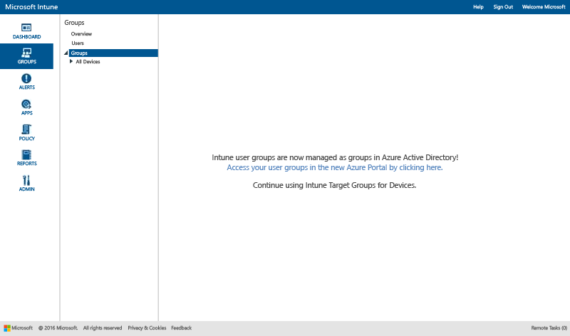

# Utilizar grupos para gerir utilizadores e dispositivos no Microsoft Intune

Este tópico descreve como criar grupos no Intune. Também fornece informações sobre como a gestão de grupos será alterada ao longo dos próximos meses. 

>[!IMPORTANT]
>
>Se abrir a área de trabalho Grupos no portal do Intune e vir uma ligação para o portal do Azure Active Directory (Azure AD), significa que já está a utilizar a *nova* abordagem dos grupos de segurança do Azure AD à gestão de grupos no Intune, descrita no [Aviso sobre as futuras melhorias na experiência de administrador para grupos](#notice-of-upcoming-improvements-to-the-admin-experience-for-groups). Clique na ligação para o portal do Azure AD para criar e gerir os seus grupos.
>
> 
>
>Se não vir a ligação para o portal do Azure AD, é porque está a utilizar a abordagem *atual* à gestão de grupos descrita na secção [Criar grupos para gerir utilizadores e dispositivos com o Microsoft Intune](#Create-groups-to-manage-users-and-devices-with-Microsoft-Intune) deste tópico.

## Aviso sobre melhorias futuras na experiência de administrador para grupos

Informou-nos de que gostaria de ter uma única experiência de agrupamento e filtragem no Enterprise Mobility + Security. Ouvimos a sua opinião. Com base no seu feedback, iremos converter brevemente os grupos do Intune para grupos de segurança baseados no Azure Active Directory. Esta alteração irá uniformizar a gestão de grupos no Intune e no Azure Active Directory (Azure AD). Esta nova experiência fará com que não tenha de duplicar grupos entre serviços. Além disso, também estende as opções de utilização do Windows PowerShell e do Microsoft Graph.

### Como isto me afeta neste momento?
Se já for um cliente do Intune, esta alteração não o afeta neste momento. No entanto, podemos informá-lo sobre o que vai acontecer:

-   As novas contas irão utilizar os grupos de segurança do Azure AD em vez dos grupos de *utilizadores* do Intune.   
-   Em novembro de 2016, as novas contas aprovisionadas após o lançamento do serviço mensal irão gerir os grupos baseados em utilizadores e baseados em dispositivos no portal do Azure AD. Esta alteração não afetará os clientes existentes.
-   Em dezembro de 2016, a equipa do produto do Intune iniciará a migração de clientes existentes para a nova experiência de gestão de grupos com base no Azure AD. Todos os grupos de utilizadores e dispositivos que existirem atualmente no Intune serão migrados para grupos de segurança do Azure AD. Não iniciaremos as migrações enquanto não conseguirmos minimizar qualquer impacto no seu trabalho diário e enquanto não previrmos que estas não afetarão os seus utilizadores. Também enviaremos um aviso antes da migração da sua conta.

### Como e quando serei migrado para a nova experiência de grupos?
Os clientes atuais do Intune serão migrados durante um determinado período de tempo. Estamos a finalizar o agendamento dessa migração e atualizaremos este tópico dentro de algumas semanas para fornecer mais detalhes. Receberá um aviso antes de ser migrado. Se tiver alguma preocupação referente à migração, contacte a nossa equipa de migração em [intunegrps@microsoft.com](mailto:intunegrps@microsoft.com). Consulte [Migrar grupos para o Azure Active Directory](migrating-groups-to-azure-active-directory.md) para obter detalhes sobre a forma como os grupos serão migrados.

### O que acontece aos meus grupos de utilizadores e dispositivos existentes?
 Os grupos de utilizadores e dispositivos que criou no Intune serão migrados para os grupos de segurança do Azure AD. Os grupos predefinidos do Intune, como o grupo Todos os Utilizadores, apenas serão migrados se estiver a utilizá-los em implementações no momento da migração. A migração poderá ser mais complexa para alguns grupos. Iremos notificá-lo se forem necessários passos adicionais para efetuar a migração na sua organização.

### Que novas funcionalidades estarão disponíveis para mim?
Seguem-se as novas funcionalidades que serão introduzidas com esta migração do Intune para o Azure Active Directory:

-    Os grupos de segurança do Azure AD serão suportados no Intune para todos os tipos de implementações.
-    Os grupos de segurança do Azure AD suportarão o agrupamento de dispositivos e de utilizadores.
-    Os grupos de segurança do Azure AD suportarão grupos dinâmicos com atributos de dispositivos do Intune. Por exemplo, poderá agrupar dinamicamente dispositivos com base na plataforma, como o iOS. Dessa forma, quando um novo dispositivo iOS for inscrito na sua organização, este será adicionado automaticamente ao grupo de dispositivos dinâmico iOS.
-    Terá uma experiência de administrador partilhada para gestão de grupos no Azure AD e no Intune.
- A função de Administrador de Serviço Intune será adicionada ao Azure AD, de modo a que os administradores do serviço Intune possam desempenhar tarefas de gestão de grupos no Azure AD.

### Que funcionalidades do Intune não estarão disponíveis?
Embora a experiência de grupo vá ser melhorada, poderão existir algumas funcionalidades do Intune que não estarão disponíveis após a sua organização migrar dos grupos do Intune para grupos de segurança do Azure AD.

#### Funcionalidade de gestão de grupos

-   Após a migração, não poderá excluir membros ou grupos quando criar um novo grupo. No entanto, os grupos dinâmicos do Azure AD irão permitir a utilização de atributos para criar regras avançadas para excluir membros de um grupo com base nos critérios por si definidos.
-   Os grupos Utilizadores Sem Grupo e Dispositivos Sem Grupo não serão suportados. Esses grupos não serão migrados do Intune para o Azure AD.

#### Funcionalidade dependente dos grupos

-   A função Administrador de Serviço não terá permissões para **Gerir grupos**.
-   Não poderá agrupar dispositivos do Exchange ActiveSync. O grupo Todos os Dispositivos Geridos do EAS será convertido de um grupo para uma vista de relatório.
-  A funcionalidade para ordenar com grupos em relatórios não estará disponível.
-  A filtragem de grupos personalizada de regras de notificação não estará disponível.

### O que devo fazer para me preparar para esta alteração?
 Temos recomendações que facilitarão esta transição para si:

- Limpe todos os grupos do Intune indesejados ou desnecessários antes da migração.
- Avalie a sua utilização da exclusão em grupos e considere reestruturar os grupos para que não tenha de utilizar a exclusão.
-  Se tiver administradores que não têm permissões para criar grupos no Azure AD, peça ao administrador do Azure AD para os adicionar à função Administrador de Serviço Intune do Azure AD.

## Criar grupos para gerir utilizadores e dispositivos com o Microsoft Intune

Esta secção descreve como criar grupos do Intune na consola de administração do Intune.

Pode criar e gerir grupos na área de trabalho **Grupos** na consola de administrador do Microsoft Intune. A página **Descrição Geral dos Grupos** contém resumos de estado que podem ajudá-lo a identificar e a atribuir prioridades a problemas que necessitam da sua atenção. Os resumos de estado abrangem os seguintes pontos:

-   Alertas
-   Atualizações de software
-   Endpoint Protection
-   Política
-   Gestão de software

Além disso, a hierarquia de grupo é apresentada com resumos de estado para ajudar a identificar e resolver problemas de membros de um grupo selecionado.

## Criar grupos

> [!TIP]
> Ao criar os grupos, tenha em consideração a forma como irá aplicar as políticas. Por exemplo, pode ter políticas específicas para sistemas operativos de dispositivos e políticas específicas para diferentes funções na sua organização ou para unidades organizacionais que já definiu no Active Directory. Poderá ser útil ter grupos de dispositivos específicos para iOS, Android e Windows, bem como grupos de utilizadores para cada função organizacional.
>
> Também poderá querer criar uma política predefinida que se aplique a todos os grupos e dispositivos e para estabelecer os requisitos de conformidade básicos da sua organização. Em seguida, pode criar políticas mais específicas para as categorias mais amplas de utilizadores e dispositivos. Por exemplo, pode criar políticas de e-mail para cada um dos sistemas operativos do dispositivo.
>
> Seja cuidadoso ao atribuir nomes às políticas, para que as possa identificar facilmente mais tarde. Por exemplo, um nome bom e descritivo para uma política é **Política de E-mail para WP para Toda a Empresa**.
>
> Sempre que criar uma política restritiva, deverá comunicá-la aos seus utilizadores. Depois de criar os grupos e as políticas mais gerais, tenha atenção à forma como cria grupos mais pequenos, de modo a reduzir a comunicação desnecessária.

### Para criar um grupo de dispositivos

1.  Na consola de administrador do Intune, selecione **Grupos** &gt; **Descrição Geral** &gt; **Criar Grupo**.

2.  Introduza um nome e uma descrição (opcional) para o grupo e, em seguida, selecione um grupo de dispositivos como o grupo principal. Selecione **Seguinte**.

3.  Na página **Definir Critérios de Associação**, selecione o tipo de dispositivos a incluir no grupo. Serão apresentadas opções adicionais de configuração de grupos com base no tipo de dispositivos que decidir incluir:

    -   **Computador**. Selecione se pretende incluir todos os membros do grupo principal, as unidades organizacionais que pretende incluir ou excluir e os domínios que pretende incluir ou excluir. Pode obter informações sobre unidades organizacionais e domínios de um computador a partir do inventário.

    -   **Dispositivos móveis**. Selecione se pretende incluir dispositivos móveis geridos pelo Intune, dispositivos móveis geridos pelo Exchange ActiveSync ou ambos.

    -   **Todos os dispositivos**. Esta opção inclui todos os dispositivos sem exclusões baseadas em critérios.

4.  Na página **Definir Associação Direta**, selecione **Procurar** para selecionar dispositivos individuais a incluir ou excluir. Se selecionar dispositivos que não estão no grupo principal que especificou, o Intune adiciona automaticamente esses dispositivos ao grupo principal.

5.  Na página **Resumo**, verifique as suas seleções e, em seguida, selecione **Concluir**.

Pode encontrar o grupo recém-criado na lista **Grupos**, na área de trabalho **Grupos** no grupo principal. Aqui, também pode editar ou eliminar o grupo.

### Para criar um grupo de utilizadores

1.  Na consola de administrador do Intune, selecione **Grupos** &gt; **Descrição Geral** &gt; **Criar Grupo**.

2.  Introduza um nome e uma descrição (opcional) para o grupo e, em seguida, selecione um grupo de utilizadores como o grupo principal. Selecione **Seguinte**.

3.  Na página **Definir Critérios de Associação**, selecione se pretende incluir todos os membros do grupo principal ou começar com um grupo vazio. Em seguida, inclua ou exclua membros com base nos grupos de segurança dos utilizadores que configurou manualmente no [centro de administração do Office 365](http://go.microsoft.com/fwlink/?LinkId=698854) ou sincronizou a partir do Active Directory. Se a associação de um grupo de segurança for alterada, a associação de grupos de utilizadores com base nesse grupo de segurança poderá também ser alterada.

    > [!IMPORTANT]
    > Atualmente, se o seu grupo incluir membros de grupos de segurança ou grupos de gestores específicos e se excluir membros de alguns grupos, os membros incluídos inicialmente serão removidos. Para criar um grupo com membros incluídos e excluídos, aconselhamos a criar primeiro um grupo principal com os membros incluídos. Em seguida, crie um grupo subordinado ao grupo principal. No novo grupo subordinado, liste os membros excluídos. Em seguida, utilize o grupo subordinado para gerir políticas, perfis e a distribuição de aplicações no Intune.

    > [!NOTE]
    > No portal do Azure, pode criar grupos com base nos gestores a quem os utilizadores reportam. Este tipo de grupo é dinâmico e é alterado à medida que se adicionam ou removem funcionários da equipa de um gestor no Azure Active Directory. O procedimento para criar um grupo do Azure com base num gestor encontra-se descrito no artigo [Utilizar atributos para criar regras avançadas](https://azure.microsoft.com/en-us/documentation/articles/active-directory-accessmanagement-groups-with-advanced-rules/), na secção **Configurar um grupo como um grupo de "Gestores"**.

4.  Na página **Definir Associação Direta**, selecione **Procurar** para selecionar os utilizadores individuais a incluir ou excluir. Se selecionar utilizadores que não se encontram no grupo principal que especificou, esses utilizadores são adicionados automaticamente ao grupo principal. Na parte inferior da caixa de diálogo **Selecionar Membros** encontrará a opção para adicionar manualmente um utilizador. Esta ação é útil se pretender adicionar um utilizador que ainda não tem um dispositivo inscrito.

5.  Na página **Resumo**, verifique as suas seleções e, em seguida, selecione **Concluir**.

Pode encontrar o grupo recém-criado na lista **Grupos**, na área de trabalho **Grupos** no grupo principal. Aqui, também pode editar ou eliminar o grupo.

> [!TIP]
> Os grupos de segurança são um ótimo recurso para preencher os grupos de utilizadores. Uma vez que os grupos de segurança definem quem tem acesso a que recursos, estes podem ser transferidos com êxito para grupos de utilizadores do Intune. Os grupos de segurança que são sincronizados a partir do Active Directory para o Azure Active Directory ou que são criados diretamente no Azure Active Directory através do centro de administração do Office 365 ou do portal do Azure estão disponíveis para que possa criar grupos de utilizadores no Intune.

## Personalizar vistas de acordo com funções de administrador
As vistas de grupo filtradas permitem-lhe personalizar o que um administrador de TI pode ver com base na sua função. Também pode restringir os grupos que cada administrador de TI pode gerir. Esta ação pode ser útil quando:

-   Pretende que os seus administradores de TI só possam implementar itens a utilizadores e a dispositivos específicos
-   Pretende apresentar apenas grupos relevantes para cada administrador de TI

Pode configurar vistas de grupo filtradas para administradores de serviço na consola de administrador do Intune. Para mais detalhes, consulte [O que deve saber antes de iniciar o Microsoft Intune](/intune/get-started/what-to-know-before-you-start-microsoft-intune).

Após configurar as vistas de grupo filtradas para um administrador de serviço, este pode ver e selecionar apenas os grupos que tiver especificado ao implementar software ou políticas ou ao executar relatórios. O administrador também não pode ver as informações de estado nas seguintes páginas da consola de administrador:

-   **Descrição Geral do Sistema**
-   **Descrição Geral dos Grupos**
-   **Descrição Geral do Endpoint Protection**
-   **Descrição Geral dos Alertas**
-   **Descrição Geral do Software**
-   **Descrição Geral da Política**

### Para criar uma vista de grupo filtrada

1.  Na consola de administração do Intune, selecione **Admin** &gt; **Gestão de Administradores** &gt; **Administradores de Serviço**.

2.  Selecione o administrador de serviço para o qual pretende criar uma vista de grupo filtrada e, em seguida, selecione **Gerir Grupos**.

3.  Na caixa de diálogo **Selecione os grupos que estarão visíveis para o administrador deste serviço**, adicione os grupos a que o administrador de serviço selecionado poderá aceder e, em seguida, clique em **OK**.

Após configurar as vistas de grupo filtradas, o administrador de TI poderá ver e selecionar apenas os grupos que o utilizador indicou.

## Gerir os grupos
Após criar os grupos, pode continuar a geri-los de acordo com as necessidades da sua organização.

Pode editar o seu grupo para alterar o nome e a descrição ou quem pertence ao mesmo.

Pode eliminar um grupo que já não serve as necessidades da sua organização. Eliminar um grupo não elimina os utilizadores que pertencem a esse grupo.

## Passos seguintes
Depois de configurar os grupos e as políticas, verifique as implicações práticas da estrutura em **Valor Pretendido** e **Estado**.

### Para verificar a estrutura

1. Selecione qualquer dispositivo de um grupo de dispositivos e procure as categorias de informações na parte superior da página.
2. Selecione **Política**. Verá algo semelhante a esta captura de ecrã das definições de política de um dispositivo Android.

Cada política tem um **Valor Pretendido** e um **Estado**. O valor pretendido é o que esperava obter quando atribuiu a política. O estado é o que é realmente obtido quando todas as políticas que se aplicam ao dispositivo, bem como as restrições e os requisitos de hardware e do sistema operativo, são consideradas em conjunto. Nesta captura de ecrã pode ver dois exemplos claros:

-   A opção**Permitir palavras-passe simples** está definida como **Sim**, conforme apresentado na coluna **Valor Pretendido**, mas o **Estado** está definido como **Não aplicável**. Isto ocorre porque os dispositivos Android não suportam as palavras-passe simples.
-   Da mesma forma, o item de política expandida **Definições de e-mail para dispositivos iOS** não se aplica a este dispositivo, uma vez que é um dispositivo Android.

> [!NOTE]
> Lembre-se de que quando duas políticas com diferentes níveis de restrição se aplicam ao mesmo dispositivo ou utilizador, na prática é aplicada a política mais restrita.

<!--HONumber=Oct16_HO2-->

