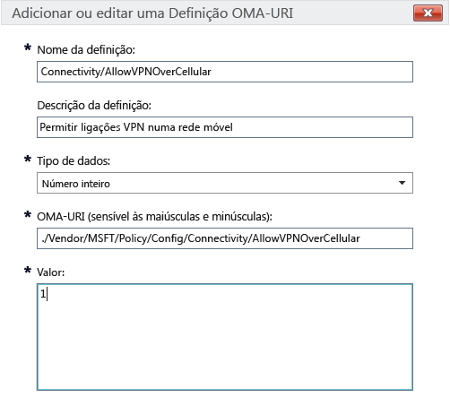

# Definições de política do Intune para dispositivos Windows 10 no Microsoft Intune

Este tópico contém informações para ajudá-lo a compreender as definições de política do Intune que pode utilizar para gerir dispositivos Windows 10. Leia este tópico juntamente com os procedimentos em [Gerir as definições e funcionalidades nos seus dispositivos com as políticas do Microsoft Intune](manage-settings-and-features-on-your-devices-with-microsoft-intune-policies) para configurar definições incorporadas e personalizadas para dispositivos com ambiente de trabalho Windows 10 e Windows 10 Mobile inscritos. Não é possível utilizar estas políticas com PCs que executam o [software de cliente de PCs do Intune](/intune/get-started/windows-pc-management-capabilities-in-microsoft-intune).

Poderá escolher entre dois tipos de política:

- **Política personalizada** - utilize a **política personalizada** do Microsoft Intune para Windows 10 e Windows 10 Mobile para implementar definições OMA-URI (Open Mobile Alliance Uniform Resource Identifier) que podem ser utilizadas para controlar as funcionalidades nos dispositivos. O Windows 10 disponibiliza várias definições através de [Fornecedor do Serviço de Configuração da Política (CSP de política)](https://technet.microsoft.com/itpro/windows/manage/how-it-pros-can-use-configuration-service-providers).
- **Política de configuração geral** - utilize este tipo de política quando pretende selecionar definições da lista incorporada fornecida com o Microsoft Intune.

## Definições de política personalizada

Forneça as seguintes definições numa política personalizada:

## &nbsp;&nbsp;&nbsp;Geral

Introduza um nome e, opcionalmente, uma descrição para esta política, que o ajude a identificá-la na consola do Intune.

## &nbsp;&nbsp;&nbsp;Definições OMA-URI

Para cada definição OMA-URI que pretende adicionar, introduza as informações seguintes. Utilize a [referência de definições URI do Windows 10](/intune/deploy-use/windows-10-policy-settings-in-microsoft-intune#Windows-10-URI-settings) neste tópico para saber mais sobre as definições que pode utilizar: 

- **Nome da definição** - introduza um nome exclusivo para a definição OMA-URI para o ajudar a identificá-la na lista de definições.
- **Descrição da definição** - opcionalmente, introduza uma descrição para a definição.
- **Tipo de dados** - escolha entre:
    - **Cadeia**
    - **Cadeia (XML)**
    - **Data e Hora**
    - **Número inteiro**
    - **Vírgula flutuante**
    - **Booleano**
- **OMA-URI (sensível às maiúsculas e minúsculas)** - especifique o OMA-URI para o qual pretende fornecer uma definição.
- **Valor** - indique o valor a associar ao OMA-URI que introduziu.

### Exemplo
Na captura de ecrã abaixo, a definição **Connectivity/AllowVPNOverCellular** foi ativada. Isto permite que um dispositivo Windows 10 abra uma ligação VPN quando estiver numa rede celular.

> 

## Definições de URI do Windows 10
Utilize esta secção para saber mais sobre as definições OMA-URI que pode configurar com uma **Política Personalizada do Windows 10**.

## &nbsp;&nbsp;&nbsp;Política

|Nome da política e URI|Detalhes|
|---------------|------------|-----------|
|**Permitir Atualização Automática** ./Vendor/MSFT/Policy/Config/Update/AllowAutoUpdate|Apenas ambiente de trabalho **Tipo de dados:** Número inteiro **Valores:** **0** - **5** (predefinição: **1**)|
|**Agendar Dia da Instalação** ./Vendor/MSFT/Policy/Config/Update/ScheduledInstallDay|Apenas dispositivos móveis **Tipo de dados:** Número inteiro **Valores:** **0** - Todos os dias (predefinição) **1** - Domingo **2** - Segunda-feira **3** - Terça-feira **4** - Quarta-feira **5** - Quinta-feira **6** - Sexta-feira **7** - Sábado|
|**Agendar Hora da Instalação** ./Vendor/MSFT/Policy/Config/Update/ScheduledInstallTime|Ambiente de trabalho e dispositivos móveis **Tipo de dados:** Número inteiro **Valores:** **0** – **23** horas (**0** é meia-noite) (predefinição: **3**)|
|**DeviceLock/AllowIdleReturnWithoutPassword** ./Vendor/MSFT/Policy/Config/DeviceLock/AllowIdleReturnWithoutPassword|Apenas dispositivos móveis **Tipo de dados:** Número inteiro **Valores:** **0** - o utilizador não pode definir o temporizador do período de tolerância da palavra-passe; o valor está definido como “sempre” **1** - o utilizador pode definir o temporizador do período de tolerância da palavra-passe (predefinição)|
|**WiFi/AllowWiFi** ./Vendor/MSFT/Policy/Config/WiFi/AllowWiFi|Apenas dispositivos móveis **Tipo de dados:** Número inteiro **Valores:** **0** – não permitir a **utilização de ligação Wi-Fi**. **1** –** permitir a utilização de ligação Wi-Fi** (predefinição)|
|**WiFi/AllowInternetSharing** ./Vendor/MSFT/Policy/Config/WiFi/AllowInternetSharing|Ambiente de trabalho e dispositivos móveis **Tipo de dados:** Número inteiro **Valores:** **0** – Não permitir Partilha da Internet, **1** – Permitir Partilha da Internet (predefinição)|
|**WiFi/AllowAutoConnectToWiFiSenseHotspots** ./Vendor/MSFT/Policy/Config/WiFi/AllowAutoConnectToWiFiSenseHotspots|Ambiente de trabalho e dispositivos móveis **Tipo de dados:** Número inteiro **Valores:** **0** – não permitido **1** – permitido (predefinição)|
|**WiFi/AllowManualWiFiConfiguration** ./Vendor/MSFT/Policy/Config/WiFi/AllowManualWiFiConfiguration|Apenas dispositivos móveis **Tipo de dados:** Número inteiro **Valores:** **0** – não é permitida uma ligação Wi-Fi fora da MDM aprovisionada. **1** – é permitido adicionar novos SSIDs de rede para além dos que já são aprovisionados pelo MDM (predefinição)|
|**System/AllowLocation** ./Vendor/MSFT/Policy/Config/System/AllowLocation|Ambiente de trabalho e dispositivos móveis **Tipo de dados:** Número inteiro **Valores:** **0** – não permitido **1** – permitido (predefinição)|
|**System/AllowTelemetry** ./Vendor/MSFT/Policy/Config/System/AllowTelemetry|Ambiente de trabalho e dispositivos móveis **Tipo de dados:** Número inteiro **Valores:** **0** – não permitido (definição apenas para empresas) **1** – limitado **2** – completo (predefinição) **3** - completo e informações de diagnóstico|
|**System/AllowExperimentation** ./Vendor/MSFT/Policy/Config/System/AllowExperimentation|Ambiente de trabalho e dispositivos móveis **Tipo de dados:** Número inteiro **Valores:** **0** – não permitido **1**- apenas definições (predefinição) **2**- definições e experimentação|
|**Security/AntiTheftMode** ./Vendor/MSFT/Policy/Config/Security/AntiTheftMode|Apenas dispositivos móveis **Tipo de dados:** Número inteiro **Valores:** **0** - não permitir modo Anti Roubo **1** - preferência do utilizador (predefinição)|
|**Connectivity/AllowUSBConnection** ./Vendor/MSFT/Policy/Config/Connectivity/AllowUSBConnection|Apenas dispositivos móveis **Tipo de dados:** Número inteiro **Valores:** **0** – não permitido **1** – permitido (predefinição)|
|**System/AllowUserToResetPhone** ./Vendor/MSFT/Policy/Config/System/AllowUserToResetPhone|Apenas dispositivos móveis **Tipo de dados:** Número inteiro **Valores:** **0** – não permitido **1** – permitido (predefinição)|
|**Connectivity/AllowCellularDataRoaming** ./Vendor/MSFT/Policy/Config/Connectivity/AllowCellularDataRoaming|Ambiente de trabalho e dispositivos móveis **Tipo de dados:** Número inteiro **Valores:** **0** – não permitido **1** – permitido (predefinição)|
|**Connectivity/AllowVPNOverCellular** ./Vendor/MSFT/Policy/Config/Connectivity/AllowVPNOverCellular|Ambiente de trabalho e dispositivos móveis **Tipo de dados:** Número inteiro **Valores:** **0** - não é permitida VPN por rede móvel **1** – a VPN pode utilizar qualquer ligação, incluindo rede móvel (predefinição)|
|**Connectivity/AllowVPNRoamingOverCellular** ./Vendor/MSFT/Policy/Config/Connectivity/AllowVPNRoamingOverCellular|Apenas dispositivos móveis **Tipo de dados:** Número inteiro **Valores:** **0** – não permitido **1** – permitido (predefinição)|
|**Connectivity/AllowVPNRoamingOverCellular** ./Vendor/MSFT/Policy/Config/Connectivity/AllowVPNRoamingOverCellular|Apenas dispositivos móveis **Tipo de dados:** Número inteiro **Valores:** **0** – não permitido **1** – permitido (predefinição)|
|**Connectivity/AllowBluetooth** ./Vendor/MSFT/Policy/Config/Connectivity/AllowBluetooth|Ambiente de trabalho e dispositivos móveis **Tipo de dados:** Número inteiro **Valores:** **0** – não permitir que o utilizador ligue o Bluetooth. **1** – reservado. O utilizador pode ligar e configurar o Bluetooth (não suportado no Windows Phone 8.1 para MDM, EAS, ambiente de trabalho do Windows 10 ou Windows 10 Mobile) **2** - permitido. O utilizador pode ligar e configurar o Bluetooth (predefinição)|
|**Experience/AllowScreenCapture** ./Vendor/MSFT/Policy/Config/Experience/AllowScreenCapture|Apenas dispositivos móveis **Tipo de dados:** Número inteiro **Valores:** **0** – não permitido **1** – permitido (predefinição)|
|**Experience/AllowTaskSwitcher** ./Vendor/MSFT/Policy/Config/Experience/AllowTaskSwitcher|Apenas dispositivos móveis **Tipo de dados:** Número inteiro **Valores:** **0** – não permitido **1** – permitido (predefinição)|
|**Experience/AllowVoiceRecording** ./Vendor/MSFT/Policy/Config/Experience/AllowVoiceRecording|Apenas dispositivos móveis **Tipo de dados:** Número inteiro **Valores:** **0** – não permitido **1** – permitido (predefinição)|
|**Experience/AllowSyncMySettings** ./Vendor/MSFT/Policy/Config/Experience/AllowSyncMySettings|Apenas dispositivos móveis **Tipo de dados:** Número inteiro **Valores:** **0** – Não permitir roaming, **1** – Permitir roaming (predefinição)|
|**Experience/AllowManualMDMUnenrollment** ./Vendor/MSFT/Policy/Config/Experience/AllowManualMDMUnenrollment|Ambiente de trabalho e dispositivos móveis **Tipo de dados:** Número inteiro **Valores:** **0** – não permitido **1** – permitido (predefinição)|
|**Accounts/AllowMicrosoftAccountConnection** ./Vendor/MSFT/Policy/Config/Accounts/AllowMicrosoftAccountConnection|Ambiente de trabalho e dispositivos móveis **Tipo de dados:** Número inteiro **Valores:** **0** – não permitido **1** – permitido (predefinição)|
|**Accounts/AllowAddingNonMicrosoftAccountsManually** ./Vendor/MSFT/Policy/Config/Accounts/AllowAddingNonMicrosoftAccountsManually|Ambiente de trabalho e dispositivos móveis **Tipo de dados:** Número inteiro **Valores:** **0** – não permitido **1** – permitido (predefinição)|
|**Security/AllowManualRootCertificateInstallation** ./Vendor/MSFT/Policy/Config/Security/AllowManualRootCertificateInstallation|Apenas dispositivos móveis **Tipo de dados:** Número inteiro **Valores:** **0** – não permitido **1** – permitido (predefinição)|
|**Security/AllowAddProvisioningPackages** ./Vendor/MSFT/Policy/Config/Security/AllowAddProvisioningPackages|Ambiente de trabalho e dispositivos móveis **Tipo de dados:** Número inteiro **Valores:** **0** – não permitido **1** – permitido (predefinição)|
|**Search/DisableBackoff** ./Vendor/MSFT/Policy/Config/Search/DisableBackoff|Ambiente de trabalho e dispositivos móveis **Tipo de dados:** Número inteiro **Valores:** **0** (predefinição), **1**|
|**Search/PreventRemoteQueries** ./Vendor/MSFT/Policy/Config/Search/PreventRemoteQueries|Ambiente de trabalho e dispositivos móveis **Tipo de dados:** Número inteiro **Valores:** **0**, **1** (predefinição)|
|**Search/AllowUsingDiacritics** ./Vendor/MSFT/Policy/Config/Search/AllowUsingDiacritics|Ambiente de trabalho e dispositivos móveis **Tipo de dados:** Número inteiro **Valores:** **0** (predefinição), **1**|
|**Search/AlwaysUseAutoLangDetection** ./Vendor/MSFT/Policy/Config/Search/AlwaysUseAutoLangDetection|Ambiente de trabalho e dispositivos móveis **Tipo de dados:** Número inteiro **Valores:** **0** (predefinição), **1**|
|**Search/DisableRemovableDriveIndexing** ./Vendor/MSFT/Policy/Config/Search/DisableRemovableDriveIndexing|Ambiente de trabalho e dispositivos móveis **Tipo de dados:** Número inteiro **Valores:** **0** (predefinição), **1**|
|**Search/PreventIndexingLowDiskSpaceMB** ./Vendor/MSFT/Policy/Config/Search/PreventIndexingLowDiskSpaceMB|Ambiente de trabalho e dispositivos móveis **Tipo de dados:** Número inteiro **Valores:** **0**, **1** (predefinição)|
|**Search/AllowIndexingEncryptedStoresOrItems** ./Vendor/MSFT/Policy/Config/Search/AllowIndexingEncryptedStoresOrItems|Ambiente de trabalho e dispositivos móveis **Tipo de dados:** Número inteiro **Valores:** **0** (predefinição), **1**|
|**Security/AllowRemoveProvisioningPackage** ./Vendor/MSFT/Policy/Config/Security/AllowRemoveProvisioningPackage|Ambiente de trabalho e dispositivos móveis **Tipo de dados:** Número inteiro **Valores:** **0** – não permitido **1** – permitido (predefinição)|
|**Security/RequireProvisioningPackageSignature** ./Vendor/MSFT/Policy/Config/Security/RequireProvisioningPackageSignature|Ambiente de trabalho e dispositivos móveis **Tipo de dados:** Número inteiro **Valores:** **0** (predefinição), **1**|
|**AboveLock/AllowActionCenterNotifications** ./Vendor/MSFT/Policy/Config/AboveLock/AllowActionCenterNotifications|Ambiente de trabalho e dispositivos móveis **Tipo de dados:** Número inteiro **Valores:** **0** – não permitido **1** – permitido (predefinição)|
|**TextInput/AllowIMENetworkAccess** ./Vendor/MSFT/Policy/Config/TextInput/AllowIMENetworkAccess|Apenas ambiente de trabalho **Tipo de dados:** Número inteiro **Valores:** **0** – não permitir O Dicionário Expandido Aberto está desativado. O utilizador não pode: - Adicionar um novo Dicionário Expandido Aberto - Adicionar um novo ficheiro de configuração de integração de pesquisa - Utilizar a funcionalidade de candidato na nuvem - Enviar palavras registadas pelo utilizador. **1** - permitir É possível adicionar e utilizar um Dicionário Expandido Aberto como predefinição. Além disso, a função de integração de pesquisas pode ser utilizada como predefinição. O utilizador pode: Utilizar a funcionalidade de candidato na nuvem.|
|**TextInput/AllowIMELogging** ./Vendor/MSFT/Policy/Config/TextInput/AllowIMELogging|Apenas ambiente de trabalho **Tipo de dados:** Número inteiro **Valores:** **0** - registo de conversões incorretas desativado. **1** - registo de conversões incorretas ativado (predefinição)|
|**TextInput/AllowJapaneseNonPublishingStandardGlyph** ./Vendor/MSFT/Policy/Config/TextInput/AllowJapaneseNonPublishingStandardGlyph|Apenas ambiente de trabalho **Tipo de dados:** Número inteiro **Valores:** **0** – não permitido **1** – permitido (predefinição)|
|**TextInput/AllowJapaneseIVSCharacters** ./Vendor/MSFT/Policy/Config/TextInput/AllowJapaneseIVSCharacters|Apenas ambiente de trabalho **Tipo de dados:** Número inteiro **Valores:** **0** – não permitido **1** – permitido (predefinição)|
|**TextInput/AllowJapaneseUserDictionary** ./Vendor/MSFT/Policy/Config/TextInput/AllowJapaneseUserDictionary|Apenas ambiente de trabalho **Tipo de dados:** Número inteiro **Valores:** **0** – não permitido **1** – permitido (predefinição)|
|**TextInput/AllowJapaneseIMESurrogatePairCharacters** ./Vendor/MSFT/Policy/Config/TextInput/AllowJapaneseIMESurrogatePairCharacters|Apenas ambiente de trabalho **Tipo de dados:** Número inteiro **Valores:** **0** – não permitido **1** – permitido (predefinição)|
|**TextInput/ExcludeJapaneseIMEExceptShiftJIS** ./Vendor/MSFT/Policy/Config/TextInput/ExcludeJapaneseIMEExceptShiftJIS|Apenas ambiente de trabalho **Tipo de dados:** Número inteiro **Valores:** **0** - não é filtrado nenhum caráter (predefinição) **1** - são filtrados todos os carateres, exceto os Shift JIS|
|**TextInput/ExcludeJapaneseIMEExceptJIS0208** ./Vendor/MSFT/Policy/Config/TextInput/ExcludeJapaneseIMEExceptJIS0208|Apenas ambiente de trabalho **Tipo de dados:** Número inteiro **Valores:** **0** - não é filtrado nenhum caráter (predefinição) **1** - são filtrados todos os carateres, exceto os JIS0208|
|**TextInput/ExcludeJapaneseIMEExceptJIS0208andEUDC** ./Vendor/MSFT/Policy/Config/TextInput/ExcludeJapaneseIMEExceptJIS0208andEUDC|Apenas ambiente de trabalho **Tipo de dados:** Número inteiro **Valores:** **0** - não é filtrado nenhum caráter (predefinição) **1** - são filtrados todos os carateres, exceto os JIS0208 ou os EUDC|
|**TextInput/AllowInputPanel** ./Vendor/MSFT/Policy/Config/TextInput/AllowInputPanel|Apenas ambiente de trabalho **Tipo de dados:** Número inteiro **Valores:** **0** – não permitido **1** – permitido (predefinição)|
|**Bluetooth/AllowDiscoverableMode** ./Vendor/MSFT/Policy/Config/Bluetooth/AllowDiscoverableMode|Ambiente de trabalho e dispositivos móveis **Tipo de dados:** Número inteiro **Valores:** **0** – não permitido **1** – permitido (predefinição)|
|**Bluetooth/AllowAdvertising** ./Vendor/MSFT/Policy/Config/Bluetooth/AllowAdvertising|Ambiente de trabalho e dispositivos móveis **Tipo de dados:** Número inteiro **Valores:** **0** – não permitido **1** – permitido (predefinição)|
|**Settings/AllowDataSense** ./Vendor/MSFT/Policy/Config/Settings/AllowDataSense|Ambiente de trabalho e dispositivos móveis **Tipo de dados:** Número inteiro **Valores:** **0** – não permitido **1** – permitido (predefinição)|
|**Settings/AllowVPN** ./Vendor/MSFT/Policy/Config/Settings/AllowVPN|Ambiente de trabalho e dispositivos móveis **Tipo de dados:** Número inteiro **Valores:** **0** – não permitido **1** – permitido (predefinição)|
|**Settings/AllowWorkplace** ./Vendor/MSFT/Policy/Config/Settings/AllowWorkplace|Apenas ambiente de trabalho **Tipo de dados:** Número inteiro **Valores:** **0** – não permitido **1** – permitido (predefinição)|
|**Settings/AllowDateTime** ./Vendor/MSFT/Policy/Config/Settings/AllowDateTime|Ambiente de trabalho e dispositivos móveis **Tipo de dados:** Número inteiro **Valores:** **0** – não permitido **1** – permitido (predefinição)|
|**Settings/AllowLanguage** ./Vendor/MSFT/Policy/Config/Settings/AllowLanguage|Apenas ambiente de trabalho **Tipo de dados:** Número inteiro **Valores:** **0** – não permitido **1** – permitido (predefinição)|
|**Settings/AllowRegion** ./Vendor/MSFT/Policy/Config/Settings/AllowRegion|Apenas ambiente de trabalho **Tipo de dados:** Número inteiro **Valores:** **0** – não permitido **1** – permitido (predefinição)|
|**Settings/AllowSignInOptions** ./Vendor/MSFT/Policy/Config/Settings/AllowSignInOptions|Apenas ambiente de trabalho **Tipo de dados:** Número inteiro **Valores:** **0** – não permitido **1** – permitido (predefinição)|
|**Settings/AllowYourAccount** ./Vendor/MSFT/Policy/Config/Settings/AllowYourAccount|Ambiente de trabalho e dispositivos móveis **Tipo de dados:** Número inteiro **Valores:** **0** – não permitido **1** – permitido (predefinição)|
|**Settings/AllowPowerSleep** ./Vendor/MSFT/Policy/Config/Settings/AllowPowerSleep|Apenas ambiente de trabalho **Tipo de dados:** Número inteiro **Valores:** **0** – não permitido **1** – permitido (predefinição)|
|**Settings/AllowAutoPlay** ./Vendor/MSFT/Policy/Config/Settings/AllowAutoPlay|Apenas ambiente de trabalho **Tipo de dados:** Número inteiro **Valores:** **0** – não permitido **1** – permitido (predefinição)|
|**Experience/AllowCortana** ./Vendor/MSFT/Policy/Config/Experience/AllowCortana|Ambiente de trabalho e dispositivos móveis **Tipo de dados:** Número inteiro **Valores:** **0** – não permitido **1** – permitido (predefinição)|
|**Search/SafeSearchPermissions** ./Vendor/MSFT/Policy/Config/Search/SafeSearchPermissions|Apenas dispositivos móveis **Tipo de dados:** Número inteiro **Valores:** **0** – rígida, filtragem mais estrita de conteúdos para adultos **1** – moderada, filtragem moderada de conteúdos para adultos (os resultados de pesquisa válidos não serão filtrados - predefinição)|
|**Experience/AllowCopyPaste** ./Vendor/MSFT/Policy/Config/Experience/AllowCopyPaste|Apenas ambiente de trabalho **Tipo de dados:** Número inteiro **Valores:** **0** – não permitido **1** – permitido (predefinição)|
|**Forçar Tamanho Inicial** ./Vendor/MSFT/Policy/Config/Start/ForceStartSize|Apenas dispositivos móveis **Tipo de dados:** Número inteiro **Valores:** **0** - permitir que o utilizador altere o tamanho (predefinição) **1** - forçar não utilização do ecrã inteiro **2** - forçar ecrã inteiro|
|**Atualização/RequireDeferUpgrade** ./Vendor/MSFT/Policy/Config/Update/RequireDeferUpgrade|Ambiente de trabalho e dispositivos móveis **Tipo de dados:** Número inteiro **Valores:** **0**: não difere da atualização (mantenha-se no ramo atual, CB - predefinição) **1**: permite que as atualizações sejam adiadas (o dispositivo segue o ramo atual para empresa, CBB, regras) Para obter detalhes, veja: [Introdução à manutenção do Windows](https://technet.microsoft.com/library/mt598226.aspx) [Plano de implementação do Windows 10](https://technet.microsoft.com/library/mt574241.aspx)|
|**Atualização/DeferUpdatePeriod** ./Vendor/MSFT/Policy/Config/Update/DeferUpdatePeriod|Ambiente de trabalho e dispositivos móveis **Descrição:** política para diferir atualizações de software para até quatro semanas **Tipo de dados:** Número inteiro **Valores:**  **0**: aplicar atualizações imediatamente (predefinição) **1**-**4**: número de semanas para diferir atualizações de software. Para obter detalhes, veja: [Introdução à manutenção do Windows](https://technet.microsoft.com/library/mt598226.aspx) [Plano de implementação do Windows 10](https://technet.microsoft.com/library/mt574241.aspx)|
|**Atualização/DeferUpgradePeriod** ./Vendor/MSFT/Policy/Config/Update/DeferUpgradePeriod|Ambiente de trabalho e dispositivos móveis **Descrição:** política para diferir atualizações de funcionalidade para até oito meses **Tipo de dados:** Número inteiro **Valores:** **0**: aplicar atualizações imediatamente (predefinição) **1**-**8**: número de meses para diferir atualizações de funcionalidade. Para obter detalhes, veja: [Introdução à manutenção do Windows](https://technet.microsoft.com/library/mt598226.aspx) [Plano de implementação do Windows 10](https://technet.microsoft.com/library/mt574241.aspx)|
|**Atualização/PauseDeferrals** ./Vendor/MSFT/Policy/Config/Update/PauseDeferrals|Ambiente de trabalho e dispositivos móveis **Descrição:** permite que um dispositivo deixe de receber atualizações durante cinco semanas. **Tipo de dados:** Número inteiro **Valores:** **0**: aplicar atualizações imediatamente (predefinição) **1**: colocar atualizações em pausa (expira após cinco semanas)|

## &nbsp;&nbsp;&nbsp;Windows Defender

|Nome da política e URI|Detalhes|
|---------------|-----------|
|**AllowRealtimeMonitoring** ./Vendor/MSFT/Policy/Config/Defender/AllowRealtimeMonitoring|Apenas ambiente de trabalho **Tipo de dados:** Número inteiro **Valores:** **0** – não permitido **1** – permitido (predefinição)|
|**AllowBehaviorMonitoring** ./Vendor/MSFT/Policy/Config/Defender/AllowBehaviorMonitoring|Apenas ambiente de trabalho **Tipo de dados:** Número inteiro **Valores:** **0** – não permitido **1** – permitido (predefinição)|
|**AllowIntrusionPreventionSystem** ./Vendor/MSFT/Policy/Config/Defender/AllowIntrusionPreventionSystem|Apenas ambiente de trabalho **Tipo de dados:** Número inteiro **Valores:** **0** – não permitido **1** – permitido (predefinição)|
|**AllowIOAVProtection** ./Vendor/MSFT/Policy/Config/Defender/AllowIOAVProtection|Apenas ambiente de trabalho **Tipo de dados:** Número inteiro **Valores:** **0** – não permitido **1** – permitido (predefinição)|
|**AllowScriptScanning** ./Vendor/MSFT/Policy/Config/Defender/AllowScriptScanning|Apenas ambiente de trabalho **Tipo de dados:** Número inteiro **Valores:** **0** – não permitido **1** – permitido (predefinição)|
|**AllowOnAccessProtection** ./Vendor/MSFT/Policy/Config/Defender/AllowOnAccessProtection|Apenas ambiente de trabalho **Tipo de dados:** Número inteiro **Valores:** **0** – não permitido **1** – permitido (predefinição)|
|**RealTimeScanDirection** ./Vendor/MSFT/Policy/Config/Defender/RealTimeScanDirection|Apenas ambiente de trabalho **Tipo de dados:** Número inteiro **Valores:** **0** – Monitorizar todos os ficheiros (predefinição) **1** – monitorizar ficheiros recebidos **2** – monitorizar ficheiros enviados|
|**DaysToRetainCleanedMalware** ./Vendor/MSFT/Policy/Config/Defender/DaysToRetainCleanedMalware|Apenas ambiente de trabalho **Tipo de dados:** Número inteiro **Valores:** **0** - **90** – representa o período de retenção do software maligno **Predefinição:** **0** – mantém na pasta de quarentena indefinidamente e não remove automaticamente|
|**AllowUserUIAccess** ./Vendor/MSFT/Policy/Config/Defender/AllowUserUIAccess|Apenas ambiente de trabalho **Tipo de dados:** Número inteiro **Valores:** **0** – não permitido **1** – permitido (predefinição)|
|**ScanParameter** ./Vendor/MSFT/Policy/Config/Defender/ScanParameter|Apenas ambiente de trabalho **Tipo de dados:** Número inteiro **Valores:** **1** – análise rápida (predefinição) **2** - análise completa|
|**ScheduleScanDay** ./Vendor/MSFT/Policy/Config/Defender/ScheduleScanDay|Apenas ambiente de trabalho **Tipo de dados:** Número inteiro **Valores:** **0** -todos os dias (predefinição) **1** - Segunda-feira **2** - Terça-feira **3** - Quarta-feira **4** - Quinta-feira **5** - Sexta-feira **6** - Sábado **7** - Domingo **8** – nenhuma análise agendada|
|**ScheduleScanTime** ./Vendor/MSFT/Policy/Config/Defender/ScheduleScanTime|Apenas ambiente de trabalho **Tipo de dados:** Número inteiro **Valores:** **0** - 24:00 **60** – 01:00 **120** – 2:00 (predefinição) **180** – 03:00 **240** – 04:00 **300** – 05:00 **360** – 06:00 **420** – 07:00 **480** – 08:00 **540** – 09:00 **600** – 10:00 **660** – 11:00 **720** – 12:00 **780** – 13:00 **840** – 14:00 **900** – 15:00 **960** – 16:00 **1020** – 17:00 **1080** – 18:00 **1140** – 19:00 **1200** – 20:00 **1260** – 21:00 **1320** – 22:00 **1381** – janela de manutenção|
|**ScheduleQuickScanTime** ./Vendor/MSFT/Policy/Config/Defender/ScheduleQuickScanTime|Apenas ambiente de trabalho **Tipo de dados:** Número inteiro **Valores:** **0** - 24:00 **60** – 01:00 **120** – 2:00 (predefinição) **180** – 03:00 **240** – 04:00 **300** – 05:00 **360** – 06:00 **420** – 07:00 **480** – 08:00 **540** – 09:00 **600** – 10:00 **660** – 11:00 **720** – 12:00 **780** – 13:00 **840** – 14:00 **900** – 15:00 **960** – 16:00 **1020** – 17:00 **1080** – 18:00 **1140** – 19:00 **1200** – 20:00 **1260** – 21:00 **1320** – 22:00 **1380** – 23:00|
|**AVGCPULoadFactor** ./Vendor/MSFT/Policy/Config/Defender/AVGCPULoadFactor|Apenas ambiente de trabalho **Tipo de dados:** Número inteiro **Valores:** **0** - **100** (predefinição: **50**)|
|**AllowArchiveScanning** ./Vendor/MSFT/Policy/Config/Defender/AllowArchiveScanning|Apenas ambiente de trabalho **Tipo de dados:** Número inteiro **Valores:** **0** – não permitido **1** – permitido (predefinição)|
|**AllowEmailScanning** ./Vendor/MSFT/Policy/Config/Defender/AllowEmailScanning|Apenas ambiente de trabalho **Tipo de dados:** Número inteiro **Valores:** **0** – não permitido (predefinição), **1** – permitido|
|**AllowFullScanRemovableDriveScanning** ./Vendor/MSFT/Policy/Config/Defender/AllowFullScanRemovableDriveScanning|Apenas ambiente de trabalho **Tipo de dados:** Número inteiro **Valores:** **0** – não permitido (predefinição), **1** – permitido|
|**AllowFullScanOnMappedNetworkDrives** ./Vendor/MSFT/Policy/Config/Defender/AllowFullScanOnMappedNetworkDrives|Apenas ambiente de trabalho **Tipo de dados:** Número inteiro **Valores:** **0** – não permitido **1** – permitido (predefinição)|
|**AllowScanningNetworkFiles** ./Vendor/MSFT/Policy/Config/Defender/AllowScanningNetworkFiles|Apenas ambiente de trabalho **Tipo de dados:** Número inteiro **Valores:** **0** – não permitido, **1** – permitido (predefinição) – também é executada quando o RTP está definido como permitido|
|**SignatureUpdateInterval** ./Vendor/MSFT/Policy/Config/Defender/SignatureUpdateInterval|Apenas ambiente de trabalho **Tipo de dados:** Número inteiro **Valores:** **0** – não verificar assinaturas num intervalo **1** - verificar assinaturas a cada hora **2** – verificar a cada duas horas, etc. **24** - verificar todos os dias **Valor predefinido:** 8 – verificar a cada oito horas|
|**AllowCloudProtection** ./Vendor/MSFT/Policy/Config/Defender/AllowCloudProtection|Apenas ambiente de trabalho **Tipo de dados:** Número inteiro **Valores:** **0** – não permitido **1** – permitido (predefinição)|
|**SubmitSamplesConsent** ./Vendor/MSFT/Policy/Config/Defender/SubmitSamplesConsent|Apenas ambiente de trabalho **Tipo de dados:** Número inteiro **Valores:** **0** – perguntar sempre (predefinição) **1** – enviar automaticamente amostras seguras **2** – nunca enviar **1** – enviar automaticamente todas as amostras|
|**ExcludedExtensions** ./Vendor/MSFT/Policy/Config/Defender/ExcludedExtensions|Apenas ambiente de trabalho **Tipo de dados:** Cadeia **Valores:** *&lt;lista de extensões separadas por ponto e vírgula&gt;* Por exemplo, **obj;lib** **Predefinição**: não é excluída nenhuma extensão|
|**ExcludedPaths** ./Vendor/MSFT/Policy/Config/Defender/ExcludedPaths|Apenas ambiente de trabalho **Tipo de dados:** Cadeia **Valores:** *&lt;lista de caminhos separados por ponto e vírgula&gt;* Exemplo: **c:\test;c:\test1.exe** **Valor predefinido:** Não são excluídos caminhos|
|**ExcludedProcesses** ./Vendor/MSFT/Policy/Config/Defender/ExcludedProcesses|Apenas ambiente de trabalho **Tipo de dados:** Cadeia **Valores:** *&lt;lista de caminhos separados por ponto e vírgula&gt;* Exemplo: **c:\test.exe;c:\test1.exe** **Valor predefinido:** Não são excluídos processos|

## &nbsp;&nbsp;&nbsp;Browser Edge

|Nome da política e URI|Detalhes|
|---------------|------------|-----------|
|**Permitir Browser** ./Vendor/MSFT/Policy/Config/Browser/AllowBrowser|Apenas dispositivos móveis **Tipo de dados:** Número inteiro **Valores:** **0**: navegação desativada, **1**: navegação ativada (predefinição)|
|**AllowSearchSuggestionsinAddressBar** ./Vendor/MSFT/Policy/Config/Browser/AllowSearchSuggestionsinAddressBar|Ambiente de trabalho e dispositivos móveis **Tipo de dados:** Número inteiro **Valores:** **0**: não mostrar sugestões, **1**: mostrar sugestões (predefinição)|
|**SendIntranetTraffictoInternetExplorer** ./Vendor/MSFT/Policy/Config/Browser/SendIntranetTraffictoInternetExplorer|Apenas ambiente de trabalho **Tipo de dados:** Número inteiro **Valores:** **0**: desativado (abrir sites da intranet no browser Edge - predefinição) **1** - ativado (abrir sites da intranet no Internet Explorer).|
|**Permitir Não Controlar** ./Vendor/MSFT/Policy/Config/Browser/AllowDoNotTrack|Ambiente de trabalho e dispositivos móveis) **Tipo de dados:** Número inteiro **Valores:** **0** – desativado (DNT não enviado - predefinição), **1** – ativado (enviar DNT)|
|**Configurar SmartScreen** ./Vendor/MSFT/Policy/Config/Browser/AllowSmartScreen|Ambiente de trabalho e dispositivos móveis **Tipo de dados:** Número inteiro **Valores:** **0** – não permitir, **1** – permitir (predefinição)|
|**Permitir Pop-ups** ./Vendor/MSFT/Policy/Config/Browser/AllowPopups|Apenas ambiente de trabalho **Tipo de dados:** Número inteiro **Valores:** **0** – bloquear janelas de pop-up (predefinição), **1** – permitir janelas de pop-up|
|**Permitir Cookies** ./Vendor/MSFT/Policy/Config/Browser/AllowCookies|Ambiente de trabalho e dispositivos móveis **Tipo de dados:** Número inteiro **Valores:** **0** – permitir cookies de todos os sites (predefinição) **1** – bloquear apenas cookies de terceiros **2** – bloquear todos os cookies|
|**Permitir Guardar Palavra-passe** ./Vendor/MSFT/Policy/Config/Browser/AllowPasswordManager|Ambiente de trabalho e dispositivos móveis **Tipo de dados:** Número inteiro **Valores:** **0** – o gestor de palavras-passe está desativado;  **1** – o gestor de palavras-passe está ativado (predefinição)|
|**Permitir Preenchimento Automático** ./Vendor/MSFT/Policy/Config/Browser/AllowAutofill|Apenas ambiente de trabalho **Tipo de dados:** Número inteiro **Valores:** **0** – desativado (predefinição), **1** – ativado|
|**Configurar a Lista de Sites da Empresa** ./Vendor/MSFT/Policy/Config/Browser/EnterpriseModeSiteList|Apenas ambiente de trabalho **Tipo de dados:** Cadeia **Valores: **0** – Não configurado **1** – Utilizar a localização da lista de sites do modo empresarial do IE, se estiver configurada (predefinição) **2** – Especificar a localização da lista de sites da empresa|

## Definições de política de configuração geral

Utilize a **política de configuração geral** do Microsoft Intune para Windows 10 para configurar definições incorporadas de dispositivos com ambiente de trabalho Windows 10 e Windows 10 Mobile inscritos. 

## &nbsp;&nbsp;&nbsp;Palavra-passe

|Nome da definição|Informações adicionais (quando necessário)|
|----------------|----------------------|
|**Pedir uma palavra-passe para desbloquear dispositivos**|-|
|**Tipo obrigatório de palavra-passe**|Especifica se a palavra-passe tem de ser apenas numérica ou alfanumérica|
|**Tipo obrigatório de palavra-passe** - **Número mínimo de conjuntos de carateres**|Existem quatro conjuntos de carateres, letras minúsculas, letras maiúsculas, números e símbolos. Esta definição especifica quantos destes conjuntos têm de ser incluídos na palavra-passe.|
|**Comprimento mínimo da palavra-passe**|Aplica-se apenas ao Windows 10 Mobile|
|**Número de falhas de início de sessão consecutivas a permitir antes do dispositivo ser apagado**|Para dispositivos que executam o Windows 10: se o dispositivo tiver o BitLocker ativado, será colocado no modo de recuperação do BitLocker após o início de sessão falhar o número de vezes que especificar. Se o dispositivo não tiver o BitLocker ativado, esta definição não será aplicada. Para dispositivos com Windows 10 Mobile: após o início de sessão falhar o número de vezes que especificar, o dispositivo será apagado.|
|**Minutos de inatividade antes de o ecrã se desligar**|Especifica o período de tempo durante o qual o dispositivo tem de estar inativo antes de o ecrã ser bloqueado.|
|**Expiração da Palavra-passe (dias)**|Especifica o período de tempo após o qual a palavra-passe do dispositivo tem de ser alterada.|
|**Memorizar histórico de palavras-passe**|Especifica se pretende impedir que o utilizador final crie palavras-passe utilizadas anteriormente.|
|**Memorizar histórico de palavras-passe** - **Evita a reutilização de palavras-passe anteriores**|Especifica o número de palavras-passe utilizadas anteriormente memorizadas pelo dispositivo.|
|**Exigir uma palavra-passe quando o dispositivo regressa de um estado inativo**|Se estiver ativada, o utilizador tem de introduzir uma palavra-passe para desbloquear o dispositivo. (Apenas Windows 10 Mobile)|

## &nbsp;&nbsp;&nbsp;Encriptação

|Nome da definição|Informações adicionais (quando necessário)|
|----------------|----------------------|
|**Encriptação obrigatória no dispositivo móvel**|Ativa a encriptação nos dispositivos visados. (Apenas Windows 10 Mobile)|

## &nbsp;&nbsp;&nbsp;Sistema

|Nome da definição|Informações adicionais (quando necessário)|
|----------------|----------------------|
|**Permitir captura de ecrã**|Permite que o utilizador efetue uma captura do ecrã do dispositivo como uma imagem. (Apenas Windows 10 Mobile)|
|**Permitir anular inscrições manualmente**|Permite que o utilizador elimine manualmente a conta da área de trabalho do dispositivo.|
|**Permitir instalação do certificado de raiz manual**|Aplica-se ao Windows 10 Mobile|
|**Permitir que os dados de diagnóstico e de utilização sejam enviados à Microsoft**|Os valores possíveis são:  **Não** - Não são enviados dados à Microsoft **Básico** -informações limitadas são enviadas à Microsoft **Melhorado** - dados de diagnóstico melhorados são enviados à Microsoft **Completo (recomendado)** -Envia os mesmos dados que **Melhorado**, juntamente com dados adicionais sobre o estado do dispositivo|

## &nbsp;&nbsp;&nbsp;Conta e sincronização

|Nome da definição|Informações adicionais (quando necessário)|
|----------------|----------------------|---------------------|
|**Permitir conta Microsoft**|Permite que o utilizador associe uma conta Microsoft ao dispositivo.|
|**Permitir adicionar contas de terceiros manualmente**|Permite que o utilizador adicione contas de e-mail ao dispositivo, que não estão associadas a uma conta Microsoft.|
|**Permitir a sincronização de definições para contas Microsoft**|Permite que as definições do dispositivo e de aplicações associadas a uma conta Microsoft sejam sincronizadas entre dispositivos.|

## &nbsp;&nbsp;&nbsp;Microsoft Edge

|Nome da definição|Informações adicionais (quando necessário)|
|----------------|----------------------|
|**Permitir browser**|Permite a utilização do browser Microsoft Edge no dispositivo. (Apenas Windows 10 Mobile)|
|**Permitir sugestões de pesquisa na barra de endereço**|Permite que o motor de busca sugira sites à medida que escreve expressões de pesquisa.|
|**Permitir o envio de tráfego da intranet para o Internet Explorer**|Permite que os utilizadores abram sites da intranet no Internet Explorer. (apenas para ambiente de trabalho Windows 10)|
|**Permitir não controlar**|Configura o browser Edge para enviar cabeçalhos Do Not Track para sites que os utilizadores visitam.|
|**Ativar SmartScreen**|-|
|**Permitir scripting ativo**|Permite a execução de scripts, como JavaScript, no browser Edge.|
|**Permitir pop-ups**|Aplica-se apenas ao ambiente de trabalho Windows 10|
|**Permitir cookies**|-|
|**Permitir Preenchimento Automático**|Permite que os utilizadores alterem as definições de conclusão automática no browser. (apenas para ambiente de trabalho Windows 10)|
|**Permitir Gestor de Palavras-passe**|Ativar ou desativar a funcionalidade Gestor de Palavras-passe do Microsoft Edge.|
|**Localização da lista de sites do Modo Empresarial**|Especifica onde encontrar a lista de Web sites que serão abertos no modo Empresarial. Os utilizadores não podem editar esta lista. (apenas para ambiente de trabalho Windows 10)|

## &nbsp;&nbsp;&nbsp;Aplicações

|Nome da definição|Informações adicionais (quando necessário)|
|----------------|----------------------|---------------------|
|**Permitir loja de aplicações**|Aplica-se apenas ao Windows 10 Mobile|

## &nbsp;&nbsp;&nbsp;Rede móvel

|Nome da definição|Informações adicionais (quando necessário)|
|----------------|----------------------|---------------------|
|**Permitir roaming de dados**|Permitir roaming entre redes ao aceder a dados.|
|**Permitir VPN sobre redes móveis**|Controla se o dispositivo pode aceder a ligações VPN quando ligado a uma rede celular.|
|**Permitir roaming do VPN sobre redes móveis**|Controla se o dispositivo pode aceder a ligações VPN quando está em roaming numa rede celular.|

## &nbsp;&nbsp;&nbsp;Hardware

|Nome da definição|Informações adicionais (quando necessário)|
|----------------|----------------------|
|**Permitir câmara**|-|
|**Permitir armazenamento amovível**|Especifica se os dispositivos de armazenamento externo, como um cartão SD, podem ser utilizados com o dispositivo.|
|**Permitir Wi-Fi**|Aplica-se apenas ao Windows 10 Mobile|
|**Permitir partilha da internet**|Permite a utilização da partilha de ligação à Internet no dispositivo.|
|**Permitir configuração de Wi-Fi manual**|Controla se o utilizador pode configurar as suas próprias ligações Wi-F ou se podem utilizar apenas as ligações configuradas por um perfil Wi-Fi. (Apenas Windows 10 Mobile)|
|**Permitir ligação automática a hotspots Wi-Fi**|Permite que o dispositivo ligue automaticamente a hotspots Wi-Fi gratuitos e aceite automaticamente os termos e condições para a ligação.|
|**Permitir geolocalização**|Especifica se o dispositivo pode utilizar informações de serviços de localização.|
|**Permitir NFC**|Permite que o dispositivo utilize as capacidades de comunicação de proximidade.|
|**Permitir Bluetooth**|-|
|**Permitir modo detetável do Bluetooth**|Permite que este dispositivo seja detetado por outros dispositivos com capacidade de Bluetooth.|
|**Permitir publicidade do Bluetooth**|Permite que os dispositivos recebam anúncios sobre o Bluetooth.|
|**Permitir reposição do telefone**|Controla se o utilizador pode efetuar a reposição de fábrica do seu dispositivo.|
|**Permitir ligação USB**|Controla se os dispositivos podem aceder a dispositivos de armazenamento externo através de uma ligação USB.|
|**Permitir modo Anti-roubo**|Configurar se o modo Anti-roubo do Windows estiver ativado.|

## &nbsp;&nbsp;&nbsp;Funcionalidades

|Nome da definição|Informações adicionais (quando necessário)|
|----------------|----------------------|---------------------|
|**Permitir copiar e colar**|Aplica-se apenas ao Windows 10 Mobile|
|**Permitir gravação de chamadas**|Aplica-se apenas ao Windows 10 Mobile|
|**Permitir Cortana**|Ativar ou desativar o assistente de voz Cortana.|
|**Permitir notificações de centro de ação**|Ativar ou desativar notificações do centro de ação no ecrã de bloqueio do dispositivo. (Apenas Windows 10 Mobile)|

## &nbsp;&nbsp;&nbsp;Windows Defender

Todas as definições são apenas para ambiente de trabalho Windows 10.

|Nome da definição|Informações adicionais (quando necessário)|
|-|-|
|**Permitir monitorização em tempo real**|Permite a análise em tempo real de software maligno, spyware e outro software indesejável.|
|**Permitir monitorização de comportamento**|Permite que o Defender verifique a existência de determinados padrões conhecidos de atividade suspeita nos dispositivos.|
|**Ativar o Sistema de Inspeção de Rede**|O Sistema de Inspeção de Rede (NIS) ajuda a proteger os dispositivos contra exploits baseados na rede, utilizando as assinaturas de vulnerabilidades conhecidas do Microsoft Endpoint Protection Center para ajudar a detetar e a bloquear tráfego malicioso.|
|**Analisar todas as transferências**|Controla se o Defender analisa todos os ficheiros transferidos da Internet.|
|**Permitir análise de script**|Permite que o Defender analise os scripts que são utilizados no Internet Explorer.|
|**Monitorizar a atividade dos ficheiros e programas**|Ative esta definição para permitir que o Defender monitorize a atividade de programas e ficheiros nos dispositivos.|
|**Dias para controlar o software maligno resolvido**|Permite que o Defender continue a controlar o software maligno resolvido durante o número de dias que especificar, para que possa verificar manualmente os dispositivos afetados anteriormente. Se definir o número de dias como **0**, o software maligno permanece na pasta Quarentena e não é removido automaticamente. |
|**Permitir o acesso à IU de cliente**|Controla se a interface de utilizador do Windows Defender está ocultada dos utilizadores finais. Quando esta definição é alterada, será aplicada da próxima vez que o PC do utilizador final for reiniciado.|
|**Agendar uma análise rápida diária**|Permite agendar uma análise rápida que ocorre diariamente à hora que selecionar.|
|**Agendar uma análise do sistema**|Permite agendar uma análise completa ou rápida do sistema, que ocorre regularmente no dia e na hora que selecionar.|
|**Limitar a utilização da CPU durante a análise**|Permite limitar a quantidade de CPU que as análises estão autorizadas a utilizar (de **1** a **100**)|
|**Analisar ficheiros de arquivo**|Permite que o Defender analise os ficheiros arquivados, tais como ficheiros Zip ou Cab.|
|**Analisar mensagens de e-mail**|Permite que o Defender analise mensagens de e-mail quando chegam ao dispositivo.|
|**Analisar unidades amovíveis**|Permite que o Defender analise unidades amovíveis, como pens USB.|
|**Analisar unidades de rede mapeadas**|Permite que o Defender analise ficheiros em unidades de rede mapeadas. Se os ficheiros na unidade forem só de leitura, o Defender não conseguirá remover qualquer software maligno encontrado nos mesmos.|
|**Analisar ficheiros abertos a partir de pastas partilhadas na rede**|Permite que o Defender analise ficheiros em unidades de rede partilhadas (por exemplo, aquelas às quais o acesso é feito a partir de um caminho UNC. Se os ficheiros na unidade forem só de leitura, o Defender não conseguirá remover qualquer software maligno encontrado nos mesmos.|
|**Intervalo de atualização de assinatura**|Especifique o intervalo no qual o Defender irá verificar a existência de novos ficheiros de assinatura.|
|**Permitir proteção da nuvem**|Permitir ou impedir que o Serviço de Proteção Ativa Microsoft receba informações sobre a atividade de software maligno nos dispositivos que gere. Estas informações são utilizadas para melhorar o serviço no futuro.|
|**Solicitar aos utilizadores o envio de amostras**|Controla se os ficheiros que possam exigir análise adicional pela Microsoft para determinar se são maliciosos são automaticamente enviados à Microsoft.|
|**Deteção de Aplicação Potencialmente Indesejável**|Esta definição pode ser utilizada para proteger dispositivos de ambiente de trabalho Windows inscritos contra software em execução classificado pelo Windows Defender como potencialmente indesejado. Pode proteger contra estas aplicações em execução ou utilizar o modo de auditoria para relatar quando uma aplicação potencialmente indesejável é instalada.|
|**Ficheiros e pastas a serem excluídos ao executar uma análise ou utilizar a proteção em tempo real**|Adicione um ou mais ficheiros e pastas, como **C:\Path** ou **%ProgramFiles%\Path\filename.exe** à lista de exclusões. Estes ficheiros e pastas não serão incluídos em análises em tempo real ou agendadas.|
|**Extensões de ficheiro a serem excluídas ao executar uma análise ou ao utilizar a proteção em tempo real**|Adicione uma ou mais extensões de ficheiro, como **jpg** ou **txt**, à lista de exclusões. Quaisquer ficheiros com estas extensões não serão incluídos em análises em tempo real ou agendadas.|
|**Processos a serem excluídos ao executar uma análise ou ao utilizar a proteção em tempo real**|Adicione um ou mais processos do tipo **.exe**, **.com** ou **.scr** à lista de exclusões. Estes processos não serão incluídos em análises em tempo real ou agendadas.| 

## &nbsp;&nbsp;&nbsp;Updates

|Nome da definição|Informações adicionais (quando necessário)|
|----------------|---------------|
|**Permitir atualizações automáticas**|Ative esta definição para permitir atualizações automáticas. Em seguida, configure uma das seguintes definições para controlar o comportamento da atualização: **Notificar carregamento** **Instalação automática ao tempo de manutenção** **Instalação automática e reinicio ao tempo de manutenção** **Instalação automática e reinício à hora agendada** **Nota**: quando esta opção está selecionada, também pode configurar as seguintes definições: **Suprimir a notificação para o utilizador final** e **Definir o dia da instalação de atualizações agendadas**. (apenas para ambiente de trabalho Windows 10)|
|**Permitir funcionalidades de pré-lançamento**|Permite à Microsoft implementar funcionalidades e definições de pré-lançamento em dispositivos do Windows 10. Pode selecionar para permitir as definições apenas, ou todas as definições de versão de pré-lançamento e funcionalidades para a instalação.|

### Consulte também
[Gerir definições e funcionalidades nos seus dispositivos com as políticas do Microsoft Intune](manage-settings-and-features-on-your-devices-with-microsoft-intune-policies.md)

<!--HONumber=Oct16_HO1-->

