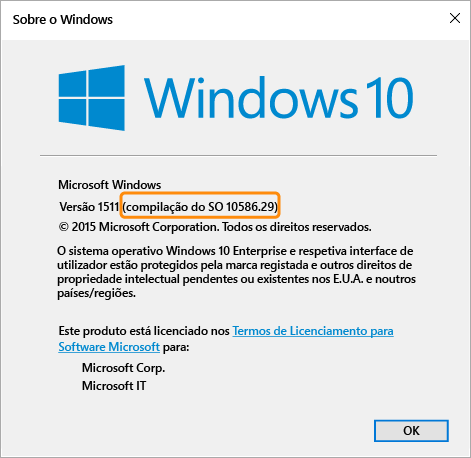

# Definições de política de conformidade para dispositivos Windows no Microsoft Intune

As definições de política descritas neste tópico aplicam-se a dispositivos com o sistema operativo Windows. A versão específica do Windows suportada é realçada nas secções abaixo.

Se estiver à procura de informações sobre outras plataformas, selecione uma das seguintes opções:
> [!div class="op_single_selector"]
- [Definições de política de conformidade para dispositivos iOS](ios-compliance-policy-settings-in-microsoft-intune.md)
- [Definições de política de conformidade para dispositivos Android](android-compliance-policy-settings-in-microsoft-intune.md)
- [Definições de política de conformidade para Android for Work](afw-compliance-policy-settings-in-microsoft-intune)

## Definições de política de conformidade para dispositivos Windows Phone
As definições apresentadas nesta secção são suportadas no Windows Phone 8.1 e posterior.

## Definições de segurança do sistema
### Palavra-passe
- **Exigir uma palavra-passe para desbloquear dispositivos móveis:**    defina esta opção como **Sim** para exigir que os utilizadores introduzam uma palavra-passe para que possam aceder ao respetivo dispositivo.

- **Permitir palavras-passe simples:**    defina esta opção para **Sim** para permitir que os utilizadores criem palavras-passe simples, tal como "**1234**" ou "**1111**".

-  **Comprimento mínimo da palavra-passe:** especifique o número mínimo de dígitos ou carateres que a palavra-passe do utilizador tem de ter.
- **Solicitar tipo de palavra-passe:** especifique se os utilizadores têm de criar uma palavra-passe **Alfanumérica**, ou **Numérica**.

  Nos dispositivos com o Windows e cujo acesso é feito com uma conta Microsoft, a política de conformidade não conseguirá avaliar corretamente se o comprimento mínimo da palavra-passe é superior a oito carateres ou se o número mínimo de conjuntos de carateres é mais de dois.

- **Número mínimo de conjuntos de carateres:** se o **Tipo obrigatório de palavra-passe** estiver definido como **Alfanumérico**, esta definição especifica o número mínimo de conjuntos de carateres que a palavra-passe tem de conter. Os quatro conjuntos de carateres são:
  -   Letras minúsculas
  -   Letras maiúsculas
  -   Símbolos
  -   Números

  A definição de um número mais alto nesta definição obrigará os utilizadores a criarem palavras-passe mais complexas. Nos dispositivos com o Windows e cujo acesso é feito com uma conta Microsoft, a política de conformidade não conseguirá avaliar corretamente se o comprimento mínimo da palavra-passe é superior a oito carateres ou se o número mínimo de conjuntos de carateres é mais de dois.
- **Minutos de inatividade antes de a palavra-passe ser exigida:** especifica o tempo de inatividade antes de o utilizador ter de reintroduzir a palavra-passe.

- **Expiração da Palavra-passe (dias):** selecione o número de dias antes de a palavra-passe do utilizador expirar e ser necessário criar uma nova.

- **Memorizar histórico de palavras-passe:** utilize esta definição juntamente com **Impedir a reutilização de palavras-passe anteriores** para impedir o utilizador de criar palavras-passe utilizadas anteriormente.

- **Impedir a reutilização de palavras-passe anteriores:** se a opção **Memorizar histórico de palavras-passe** estiver selecionada, especifique o número de palavras-passe utilizadas anteriormente que não podem ser reutilizadas.
- **Exigir uma palavra-passe quando o dispositivo regressa de um estado inativo:** esta definição deve ser utilizada em conjunto com a definição **Minutos de inatividade antes de a palavra-passe ser exigida**. Será pedido aos utilizadores finais que introduzam uma palavra-passe para aceder a dispositivos que tenham estado inativos durante o período de tempo especificado na definição **Minutos de inatividade antes de a palavra-passe ser exigida**.

  **Esta definição só se aplica a dispositivos Windows 10 Mobile.**
### Encriptação
- **Exigir encriptação no dispositivo móvel:** defina esta opção como **Sim** para exigir que os dispositivos sejam encriptados para ligar aos recursos.

## Definições de estado de funcionamento do dispositivo
- **Exigir que os dispositivos sejam comunicados como estando em bom estado de funcionamento:** pode definir uma regra para exigir que os dispositivos **Windows 10 Mobile** sejam comunicados como estando em bom estado de funcionamento nas Políticas de Conformidade novas ou existentes.  Se esta definição estiver ativada, os dispositivos Windows 10 são avaliados através do Serviço de Atestado de Estado de Funcionamento (HAS) quanto aos seguintes pontos de dados:
  -  **BitLocker está ativado:** se o BitLocker estiver ativado, o dispositivo é capaz de proteger os dados que são armazenados na unidade contra acesso não autorizado, quando o sistema é desligado ou entra em hibernação. A Encriptação de Unidade BitLocker do Windows encripta todos os dados armazenados no volume do sistema operativo Windows. O BitLocker utiliza o TPM para ajudar a proteger o sistema operativo Windows e os dados de utilizador e ajuda a garantir que os computadores não são adulterados, mesmo que não estejam a ser vigiados, sejam roubados ou se percam. Se os computadores estiverem equipados com um TPM compatível, o BitLocker utiliza o TPM para bloquear as chaves de encriptação que protegem os dados. Como resultado, as chaves não podem ser acedidas até o TPM ter verificado o estado do computador
  -  **A integridade do código está ativada:** a integridade do código é uma funcionalidade que valida a integridade de um ficheiro de controlador ou de sistema sempre que é carregado para a memória. A integridade do código deteta se está a ser carregado um ficheiro de controlador ou de sistema não assinado para o kernel ou se um ficheiro de sistema foi modificado por software malicioso que está a ser executado por uma conta de utilizador com privilégios administrativos.
  - **O Arranque Seguro está ativado:** se o Arranque Seguro estiver ativado, o sistema é forçado a fazer o arranque para um estado de fábrica fidedigno. Além disso, com o Arranque Seguro ativado, os componentes do núcleo utilizados para arrancar o computador têm de ter assinaturas criptográficas corretas e que sejam consideradas fidedignas pela organização que fabricou o dispositivo. O firmware UEFI verifica isto antes de permitir que o computador seja iniciado. Se um ficheiro tiver sido adulterado, danificando a respetiva assinatura, o sistema não arrancará.

  Para obter informações sobre como funciona o serviço HAS, veja [Health Attestation CSP (CSP de Atestado de Estado de Funcionamento)](https://msdn.microsoft.com/library/dn934876.aspx).
##  Definições de propriedade do dispositivo
- **SO mínimo necessário:** quando um dispositivo não cumpre o requisito de versão mínima do SO, será reportado como não conforme.
    É apresentada uma ligação com informações sobre como atualizar. O utilizador final pode optar por atualizar o dispositivo para poder aceder aos recursos da empresa.

- **Versão do SO máxima permitida:** quando um dispositivo utiliza uma versão do SO posterior à especificada na regra, o acesso aos recursos da empresa é bloqueado e é pedido ao utilizador que contacte o administrador de TI. Até a regra ser alterada para permitir a versão do SO, este dispositivo não pode ser utilizado no acesso aos recursos da empresa.

## Definições de política de conformidade para dispositivos PCs Windows
As definições apresentadas nesta secção são suportadas em PCs Windows.
## Definições de segurança do sistema
### Palavra-passe
- **Comprimento mínimo da palavra-passe:** - suportada no Windows 8.1.

  Especifique o número mínimo de dígitos ou carateres que a palavra-passe do utilizador tem de ter.

  Nos dispositivos acedidos com uma conta Microsoft, a política de conformidade não conseguirá avaliar corretamente se o **Comprimento mínimo da palavra-passe** é superior a oito carateres ou se o **Número mínimo de conjuntos de carateres** corresponde a mais de dois carateres.

- **Tipo obrigatório de palavra-passe:** - suportada no Windows RT, Windows RT 8.1 e Windows 8.1

  Especifique se os utilizadores têm de criar uma palavra-passe **Alfanumérica** ou **Numérica**.

- **Número mínimo de conjuntos de carateres:**  - suportada no Windows RT, Windows RT 8.1 e Windows 8.1. Se **Tipo obrigatório de palavra-passe** estiver definido como **Alfanumérico**, esta definição especifica o número mínimo de conjuntos de carateres que a palavra-passe tem de ter. Os quatro conjuntos de carateres são:
  -   Letras minúsculas
  -   Letras maiúsculas
  -   Símbolos
  -   Números:  a definição de um número mais alto nesta definição obrigará os utilizadores a criarem palavras-passe mais complexas.

  Nos dispositivos acedidos com uma conta Microsoft, a política de conformidade não conseguirá avaliar corretamente se o **Comprimento mínimo da palavra-passe** é superior a oito carateres ou se o **Número mínimo de conjuntos de carateres** corresponde a mais de dois carateres.
- **Minutos de inatividade antes de a palavra-passe ser exigida:** - suportada no Windows RT, Windows RT 8.1 e Windows 8.1

  Especifica o tempo de inatividade antes de o utilizador ter de reintroduzir a palavra-passe.

- **Expiração da palavra-passe (dias):**  - suportada no Windows RT, Windows RT 8.1 e Windows 8.1.

  Selecione o número de dias antes de a palavra-passe do utilizador expirar e ser necessário criar uma nova.

- **Memorizar histórico de palavras-passe:** - suportada no Windows RT, Windows RT e Windows 8.1.

  Utilize esta definição juntamente com **Impedir a reutilização de palavras-passe anteriores** para impedir o utilizador de criar palavras-passe utilizadas anteriormente.
- **Impedir a reutilização de palavras-passe anteriores:** - suportada no Windows RT, Windows RT 8.1 e Windows 8.1

  Se a opção **Memorizar histórico de palavras-passe** estiver selecionada, especifique o número de palavras-passe utilizadas anteriormente que não podem ser reutilizadas.

## Definições de estado de funcionamento do dispositivo
- **Exigir que os dispositivos sejam comunicados como estando em bom estado de funcionamento:** - suportada nos dispositivos Windows 10.
Pode definir uma regra para exigir que os dispositivos Windows 10 sejam comunicados como estando em bom estado de funcionamento nas Políticas de Conformidade novas ou existentes.  Se esta definição estiver ativada, os dispositivos Windows 10 são avaliados através do Serviço de Atestado de Estado de Funcionamento (HAS) quanto aos seguintes pontos de dados:
  -  **BitLocker está ativado:** se o BitLocker estiver ativado, o dispositivo é capaz de proteger os dados que são armazenados na unidade contra acesso não autorizado, quando o sistema é desligado ou entra em hibernação. A Encriptação de Unidade BitLocker do Windows encripta todos os dados armazenados no volume do sistema operativo Windows. O BitLocker utiliza o TPM para ajudar a proteger o sistema operativo Windows e os dados de utilizador e ajuda a garantir que os computadores não são adulterados, mesmo que não estejam a ser vigiados, sejam roubados ou se percam. Se os computadores estiverem equipados com um TPM compatível, o BitLocker utiliza o TPM para bloquear as chaves de encriptação que protegem os dados. Como resultado, as chaves não podem ser acedidas até o TPM ter verificado o estado do computador
  -  **A integridade do código está ativada:** a integridade do código é uma funcionalidade que valida a integridade de um ficheiro de controlador ou de sistema sempre que é carregado para a memória. A integridade do código deteta se está a ser carregado um ficheiro de controlador ou de sistema não assinado para o kernel ou se um ficheiro de sistema foi modificado por software malicioso que está a ser executado por uma conta de utilizador com privilégios administrativos.
  - **O Arranque Seguro está ativado:** se o Arranque Seguro estiver ativado, o sistema é forçado a fazer o arranque para um estado de fábrica fidedigno. Além disso, com o Arranque Seguro ativado, os componentes do núcleo utilizados para arrancar o computador têm de ter assinaturas criptográficas corretas e que sejam consideradas fidedignas pela organização que fabricou o dispositivo. O firmware UEFI verifica isto antes de permitir que o computador seja iniciado. Se um ficheiro tiver sido adulterado, danificando a respetiva assinatura, o sistema não arrancará.
  - **O antimalware de início antecipado está ativado:** o antimalware de início antecipado (ELAM) proporciona proteção aos computadores da sua rede quando são iniciados e antes de os controladores de terceiros serem inicializados.

  Para obter informações sobre como funciona o serviço HAS, veja [Health Attestation CSP (CSP de Atestado de Estado de Funcionamento)](https://msdn.microsoft.com/library/dn934876.aspx).

## Definições de propriedade do dispositivo
- **SO mínimo obrigatório:** - suportada no Windows 8.1 e Windows 10.

  Especifique o número major.minor.build aqui. O número de versão tem de corresponder à versão devolvida pelo comando winver.

  Quando um dispositivo tem uma versão anterior à versão de SO especificada, é reportado como não conforme. É apresentada uma ligação com informações sobre como atualizar. O utilizador final pode optar por atualizar o dispositivo para poder aceder aos recursos da empresa.

- **Versão máxima de SO permitida:** - suportada no Windows 8.1 e Windows 10.

  Quando um dispositivo está a utilizar uma versão do SO posterior à especificada na regra, o acesso aos recursos da empresa é bloqueado e é pedido ao utilizador que contacte o administrador de TI. Até a regra ser alterada para permitir a versão do SO, este dispositivo não pode ser utilizado no acesso aos recursos da empresa.

Para localizar a versão de SO a utilizar para as definições **SO mínimo obrigatório** e **Versão máxima de SO permitida**, execute o comando **winver** a partir da linha de comandos. O comando winver devolve a versão comunicada do sistema operativo.
- Os PCs Windows 8.1 devolvem a versão **6.3**.    Se a regra de versão de SO estiver definida como Windows 8.1 para o Windows, o dispositivo é comunicado como não conforme, mesmo que tenha o sistema operativo Windows 8.1.
- Nos PCs com o Windows 10, a versão deve ser definida como "10.0" + o número de Compilação do SO devolvido pelo comando winver. Por exemplo, poderia ser semelhante a 10.0.10586.
> 

<!--HONumber=Nov16_HO2-->

