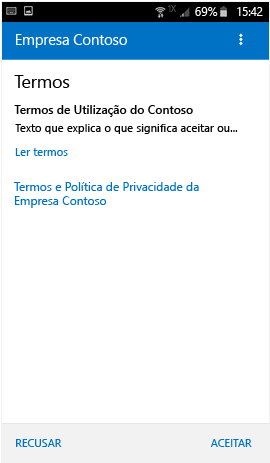
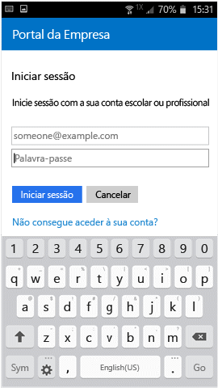
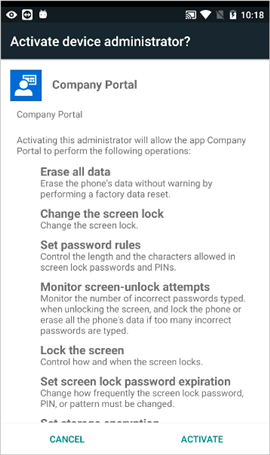
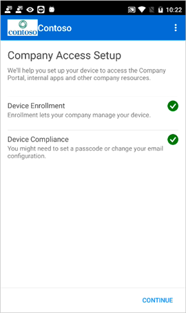

# Inscrever o dispositivo Android no Intune

Se a sua empresa ou escola utiliza o Microsoft Intune, pode inscrever o seu dispositivo Android para aceder a e-mails, ficheiros e outros recursos da empresa. A inscrição de dispositivos permite ao departamento de TI gerir esses recursos do trabalho ou da escola e mantê-los seguros, dando-lhe a liberdade de utilizar o seu dispositivo preferencial para realizar o seu trabalho. Para saber mais sobre a inscrição, veja [What happens when I install and Company Portal app and enroll my device? (O que acontece quando instalo a aplicação do Portal da Empresa e inscrevo o meu dispositivo?)](what-happens-if-you-install-the-Company-Portal-app-and-enroll-your-device-in-intune-android.md).

Estas instruções de inscrição destinam-se a dispositivos Samsung Knox Android e a dispositivos Android "nativos" (não Samsung Knox). Para determinar se tem um dispositivo Samsung Knox, aceda a **Definições** &gt; **Acerca do dispositivo**. Se não vir a "versão KNOX" aí listada, tem um dispositivo Android nativo.

Antes ou depois da inscrição, poderá ser-lhe pedido para escolher uma categoria que melhor descreve como utiliza o seu dispositivo. O administrador de TI utiliza esta categoria para ajudar a determinar as aplicações a que tem acesso.

Se obtiver um erro ao tentar inscrever o dispositivo no Intune, pode [enviar erros de inscrição ao administrador de TI](send-enrollment-errors-to-your-it-administrator-android.md).

**Para inscrever o seu dispositivo Android:**

1.  Instale a aplicação gratuita do Portal da Empresa do Intune a partir do [Google Play](http://play.google.com/store/apps/details?id=com.microsoft.windowsintune.companyportal).

2.  Abra a aplicação Portal da Empresa do Microsoft Intune.

3.  No ecrã **Bem-vindo** do Portal da Empresa, toque em **Iniciar sessão** e, em seguida, inicie sessão com a sua conta escolar ou profissional.

       

4.  Se o administrador de TI configurar termos e condições empresariais, toque em **ACEITAR** para aceitar os termos.

    

5.  Inicie sessão na aplicação do Portal da Empresa com a sua conta e palavra-passe profissional ou escolar e, em seguida, toque em **Iniciar sessão**.

    

6.  No ecrã **Configuração de Acesso à Empresa**, toque em **COMEÇAR**.

    

7.  No ecrã **Porquê inscrever o seu dispositivo?**, leia sobre o que pode fazer quando inscrever o seu dispositivo e, em seguida, toque em **CONTINUAR**.

    

8.  Reveja uma lista do que o administrador de TI pode e não pode ver no seu dispositivo e toque em **CONTINUAR**.

    

9.  No ecrã **O que vem a seguir**, leia sobre o que acontece durante a inscrição e, em seguida, toque em **INSCREVER**.

    

10.  Se estiver a utilizar o Android 6.0 ou posterior, efetue este passo. Caso contrário, avance para o passo seguinte.

    Se o administrador de TI tiver configurado determinadas políticas, poderá ver as seguintes mensagens:
    -   **Permitir que o Portal da Empresa efetue e faça a gestão de chamadas telefónicas?**

    

    Se vir esta mensagem, toque em **PERMITIR**. É seguro tocar em PERMITIR, porque a **Microsoft nunca efetua ou gere as suas chamadas telefónicas**! A Google controla o texto da mensagem e a Microsoft não a pode alterar. Ao permitir o acesso, está a permitir que o seu dispositivo escreva registos de dados no cartão SD do dispositivo, o que lhe permite mover esses registos com um cabo USB.

    Se negar o acesso, irá aparecer a mensagem quando iniciar sessão novamente no Portal da Empresa, mas pode desativar futuras mensagens ao tocar na caixa de verificação **Não voltar a perguntar**.  Se, posteriormente, decidir permitir o acesso, aceda a **Definições** &gt; **Aplicações** &gt; **Portal da Empresa** &gt; **Permissões** &gt; **Telemóvel** e ative a permissão.

    -   **Permitir que o Portal da Empresa aceda aos seus contactos?**

    

    Se vir esta mensagem, toque em **PERMITIR**. É seguro tocar em PERMITIR, porque a **Microsoft nunca acede aos seus contactos!** A Google controla o texto da mensagem e a Microsoft não a pode alterar. Ao permitir o acesso, só permite à aplicação Portal da Empresa criar, utilizar e gerir a sua conta de trabalho.

    Se negar o acesso, irá aparecer a mensagem novamente quando tocar em **Enviar Dados**, mas pode desativar futuras mensagens ao tocar na caixa de verificação **Não voltar a perguntar**. Se, posteriormente, decidir permitir o acesso, aceda a **Definições** &gt; **Aplicações** &gt; **Portal da Empresa** &gt; **Permissões** &gt; **Armazenamento** e ative a permissão.

11.  No ecrã **Ativar administrador de dispositivo**, toque em **Ativar**.

    

12.  Siga as indicações para introduzir um PIN ou palavra-passe. Se já configurou um PIN ou uma palavra-passe neste dispositivo, não verá este ecrã nem terá de introduzir um novo PIN ou palavra-passe.

    

13.  Siga as instruções abaixo que correspondem ao tipo de dispositivo que está a utilizar (Android nativo ou Samsung Knox). Para determinar se tem um dispositivo Samsung Knox, aceda a **Definições** &gt; **Acerca do dispositivo**. Se não vir a "versão KNOX" aí listada, tem um dispositivo Android nativo.

    -   Dispositivo nativo (não Samsung Knox): no ecrã **Nomear o certificado**, toque em **OK** para aceitar o certificado predefinido.

    

    -   Dispositivo Samsung Knox: aceite a política de privacidade e toque em **CONFIRMAR**.

    

    Verá a seguinte mensagem no ecrã quando o Intune inscrever o seu dispositivo.

    

14. Quando o ecrã **Configuração de Acesso à Empresa** aparece, toque em **CONTINUAR**. Se vir uma mensagem que indica que o seu dispositivo não está em conformidade, siga as instruções para corrigir o problema e, em seguida, toque em **CONTINUAR**.

      

11. No ecrã **Configuração de Acesso à Empresa concluída**, toque em **CONCLUÍDO**. O dispositivo está agora inscrito.

    

Antes de tentar instalar aplicações da empresa, aceda a **Definições** &gt; **Segurança** e ative os **Recursos desconhecidos**. Se não ativar esta opção antes de tentar instalar aplicações, verá a mensagem "Instalação bloqueada." Por motivos de segurança, o dispositivo está definido para bloquear as instalações de aplicações obtidas a partir de origens desconhecidas." Pode tocar em **Definições** no diálogo de erro, para ir para a opção **Origens desconhecidas**.

Ainda precisa de ajuda? Contacte o se administrador de TI (verifique as informações de contacto no [Web site do Portal da Empresa](http://portal.manage.microsoft.com)) ou escreva para a equipa do Microsoft Android, através do endereço wintunedroidfbk@microsoft.com.

### Consulte também
[Utilizar o dispositivo Android com o Intune](using-your-android-device-with-intune.md)

<!--HONumber=Jul16_HO4-->

