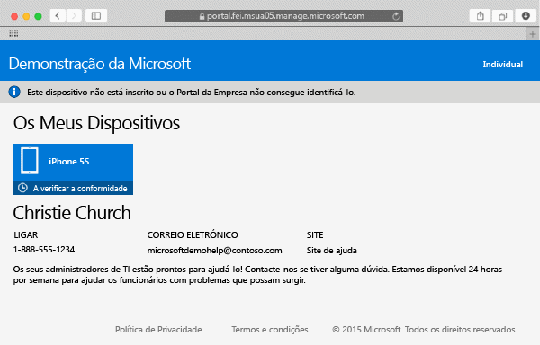

# Inscrever o dispositivo Mac OS X no Intune

Quando inscreve o seu dispositivo Mac OS X no Intune, pode aceder à rede da empresa, ao seu e-mail profissional e a ficheiros profissionais. Também pode obter aplicações empresariais. Para mais informações sobre o que acontece quando inscreve o seu dispositivo, consulte [O que acontece se instalar a aplicação Portal da Empresa e inscrever o seu dispositivo no Intune?](what-happens-if-you-install-the-company-portal-app-and-enroll-your-device-in-intune-ios.md).

Se estiver a tentar inscrever um dispositivo iOS, consulte [Inscrever o dispositivo iOS no Intune](enroll-your-device-in-intune-ios.md).

Para inscrever o dispositivo Mac OS X:

1.  Com o browser Safari, abra o [Web site do Portal da Empresa](https://portal.manage.microsoft.com) e toque na barra de notificações.

2.  Toque em **Este dispositivo não está inscrito ou o Portal da Empresa não consegue identificá-lo**.

    

3.  Toque em **Instalar** para começar a inscrever o seu dispositivo.

    

4.  Na caixa de diálogo **Instalar Perfil de Gestão**, toque em **Instalar**. Se uma caixa de diálogo lhe pedir para introduzir as suas credenciais, introduza o seu nome de utilizador e a sua palavra-passe e, em seguida, toque em **Continuar** &gt; **Instalar**.

    

    Quando terminar a inscrição, uma página **Perfil de Gestão** mostra que o seu perfil foi confirmado.

    

Ainda precisa de ajuda? Contacte o seu administrador de TI. Para encontrar as informações de contacto dele, verifique o [Web site do Portal da Empresa](http://portal.manage.microsoft.com).

<!--HONumber=Oct16_HO2-->

