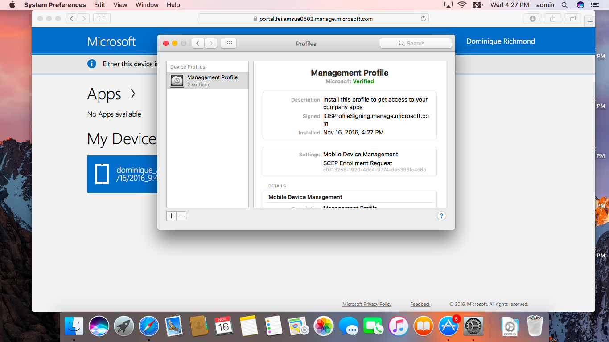

# Inscrever o dispositivo macOS no Intune

O acesso às aplicações, aos dados e aos recursos da sua organização permite-lhe fazer o seu trabalho. Se estiver a utilizar um dispositivo macOS no trabalho, precisa de instalar um __Perfil de Gestão__. Este é apenas um ficheiro configurado pelo seu administrador de TI que carrega as definições e acede a informações no seu Mac. Quer saber mais? Saiba [o que acontece quando instala a aplicação Portal da Empresa e inscreve o seu dispositivo no Intune](what-happens-if-you-install-the-company-portal-app-and-enroll-your-device-in-intune-ios.md).

  > [!NOTE]
  > Se estiver realmente a tentar inscrever um dispositivo iOS, tal como um iPhone ou iPad, [experimente antes estas instruções](enroll-your-device-in-intune-ios.md).

1. Na sua __Estação de Ancoragem__, procure o __Safari__, abra uma nova janela e, em seguida, abra o [site do Portal da Empresa](http://portal.manage.microsoft.com).
2. Inicie sessão no site do Portal da Empresa com a sua conta escolar ou profissional.

  [!INCLUDE[wit_nextref](../includes/end-user-password-guidance.md)]

3. Quando inicia a sessão, poderá ver as __Aplicações__ disponíveis, __Os Meus Dispositivos__ e outras __informações de contacto__ disponíveis para a sua equipa de TI. Na parte superior da página, verá um aviso a indicar que **Este dispositivo não está inscrito ou o Portal da Empresa não consegue identificá-lo. <u>Toque aqui</u> para selecionar um dispositivo diferente.** Clique em __Toque aqui__.

 

4. Será apresentada uma janela de pop-up com uma breve explicação sobre o motivo pelo qual vai __Identificar ou inscrever este dispositivo__. Analise-a e, em seguida, clique em __Inscrever__ para continuar.

 

5. Será apresentada uma segunda janela de pop-up com uma breve explicação sobre o que acontecerá quando __Inscrever este dispositivo__. Analise-a e, em seguida, clique em __Instalar__ para continuar.

 

  > [!NOTE]
  > O Intune precisa de aceder ao seu computador para confirmar que o dispositivo é suficientemente seguro para aceder aos recursos da sua organização. Saiba [o que o acontece quando inscreve o dispositivo no Intune](what-happens-if-you-install-the-Company-Portal-app-and-enroll-your-device-in-intune-ios.md).

6. A janela __Preferências do Sistema__ irá abrir e perguntar se pretende __Instalar o "Perfil de Gestão"?__ Clique em __Instalar__ para continuar ou clique em __Mostrar Perfil__ para obter mais detalhes.

 

7. Será apresentada uma janela de pop-up do macOS. Confirme que pretende fazer alterações ao disponibilizar o __Nome de Utilizador__ e a __Palavra-passe__ do seu computador e, em seguida, clique em __OK__. Esta ação irá instalar o perfil de gestão no seu Mac.

 

8. Poderá ver algumas mensagens adicionais a partir do seu Mac com mais detalhes sobre o perfil ou se tem a certeza que quer __Instalar__. Clique em __Continuar__ e __Instalar__ nestes para continuar. Depois da conclusão da instalação, poderá ver o seu __Perfil de Gestão__ recém-instalado na lista de __Perfis de Dispositivo__.

 

Ainda precisa de ajuda? Consulte o seu administrador de TI. Pode encontrar as informações de contacto no [Site do Portal da Empresa](http://portal.manage.microsoft.com).

<!--HONumber=Dec16_HO2-->

