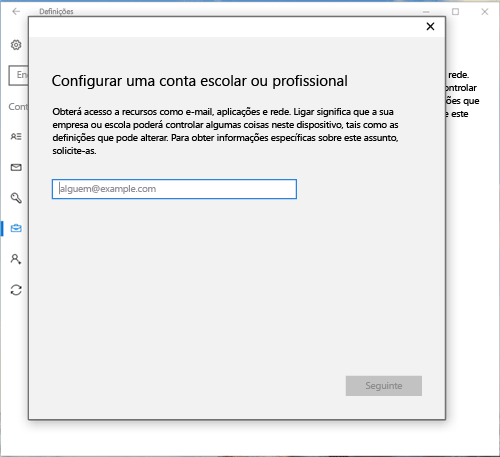
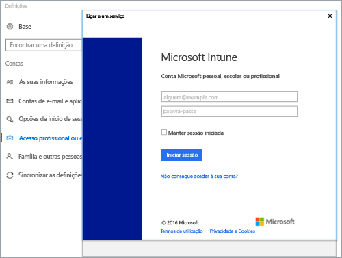
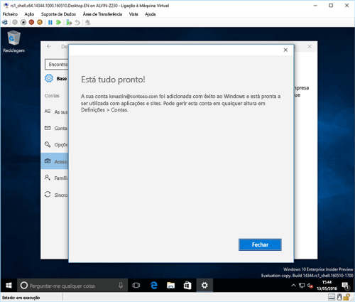
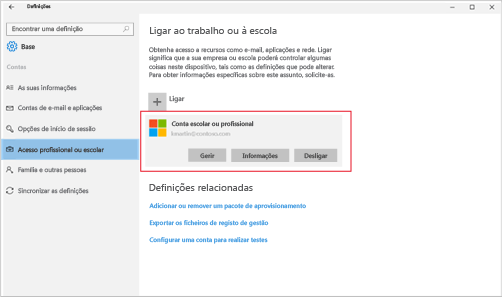

# Inscrever o seu dispositivo com o Windows 10 no Intune

<iframe src="https://channel9.msdn.com/Series/IntuneEnrollment/Windows-Enrollment-with-AAD/player" width="960" height="540" allowFullScreen frameBorder="0"></iframe>

1.  Abra a aplicação **Definições** do Windows ao aceder ao **menu Iniciar** e selecione o botão **Definições**. Também pode procurar "definições" na barra de pesquisa.

2. Selecione **Contas** > **Aceder a profiss./escolar** > **Ligar**.

    

3.  Introduza o seu e-mail profissional ou escolar e, em seguida, selecione **Seguinte**.

    

4. Inicie sessão no Intune com a sua conta profissional ou escolar.

    

    Verá uma mensagem a indicar que a sua empresa ou escola está a registar o dispositivo.

5. Quando vir o ecrã **Está tudo pronto!** selecione **Fechar**. Terminou.

  

6. Se pretender verificar novamente se a ligação tem o aspeto pretendido, volte às **Definições**, onde deve conseguir ver a sua conta profissional ou escolar listada.

    

Se seguiu os passos anteriores, mas continua a não conseguir aceder à conta de e-mail e aos ficheiros profissionais ou escolares, siga os passos em [Passos de resolução de problemas a seguir se vir Acesso profissional ou escolar](troubleshoot-your-windows-10-device-windows.md#troubleshooting-steps-to-follow-if-you-see-access-work-or-school).

