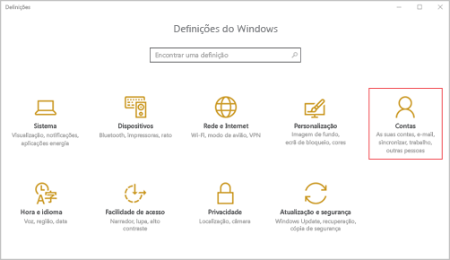
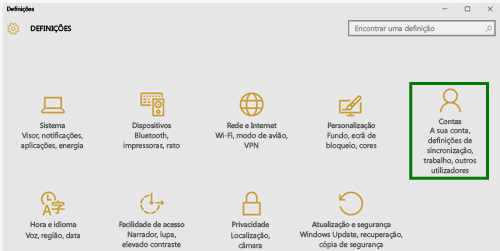
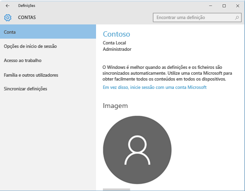
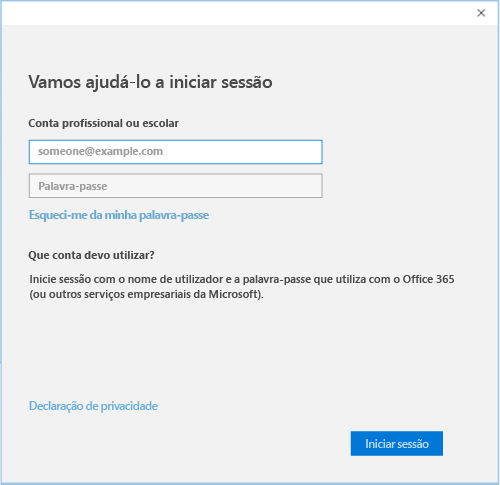

# Inscrever o dispositivo de ambiente de trabalho Windows 10 Mobile ou Windows 10 no Intune

Se a sua empresa ou escola utiliza o Microsoft Intune, pode inscrever os seus dispositivos para aceder a e-mails, ficheiros e outros recursos da empresa. A inscrição dos dispositivos permite à sua organização manter os dados empresariais protegidos. Para saber mais sobre a inscrição, veja [What happens if you install the Company Portal app and enroll your device in Intune? (O que acontece quando instala a aplicação do Portal da Empresa e inscreve o seu dispositivo no Intune?)](what-happens-if-you-install-the-company-portal-app-and-enroll-your-device-in-intune-windows.md) e [What your IT administrator can and can't see on your device (O que o administrador pode ver e não pode ver no seu dispositivo?)](what-can-your-it-administrator-see-when-you-enroll-your-device-in-intune-windows.md).

Inscrever o dispositivo de ambiente de trabalho Windows 10 Mobile ou Windows 10

1.  Aceda às **Definições** do Windows e, em seguida, toque em **Contas**.

    

2.  Observe os dois ecrãs seguintes e veja qual deles se parece com o que vê no seu dispositivo. Siga os passos que acompanham o ecrã que aparece no seu dispositivo.

    Se vir este ecrã, siga as instruções em [Passos a seguir se vir Acesso profissional ou escolar](#steps-to-follow-if-you-see-access-work-or-school).

    

    Se vir este ecrã, siga os passos em [Passos a seguir se vir A sua conta](#steps-to-follow-if-you-see-your-account).

    

## Passos a seguir se vir Acesso profissional ou escolar

1.  Toque em **Aceder ao trabalho ou escola** e, em seguida, toque em **Ligar**.

    

2.  Introduza o seu e-mail profissional ou escolar e, em seguida, toque em **Seguinte**.

    

3. Inicie sessão no Intune com a sua conta profissional ou escolar.

    

    Verá uma mensagem a indicar que a sua empresa ou escola está a registar o dispositivo.

4. Quando vir a página **Está tudo pronto!** toque em **Fechar**. Terminou.

  

5. Se pretender verificar novamente se a ligação tem o aspeto pretendido, volte às **Definições**, onde deve conseguir ver a sua conta profissional ou escolar listada.

    

Se seguiu os passos anteriores, mas continua a não conseguir aceder à conta de e-mail e aos ficheiros profissionais ou escolares, siga os passos em [Passos de resolução de problemas a seguir se vir Acesso profissional ou escolar](troubleshoot-your-windows-10-device-windows.md#troubleshooting-steps-to-follow-if-you-see-access-work-or-school).

## Passos a seguir se vir A sua conta

1.  Aceda às **Definições** do Windows e, em seguida, toque em **Contas**.

    

2.  Toque em **A sua conta**.

    

3.  Toque em **Adicionar uma conta escolar ou profissional**.

    

4.  Inicie sessão com as credenciais da sua conta profissional ou escolar.

    

Se seguiu os passos anteriores, mas continua a não conseguir aceder ao e-mail, aos ficheiros ou outros dados profissionais ou escolares, experimente as instruções em [Passos de resolução de problemas a seguir se vir A sua conta](troubleshoot-your-windows-10-device-windows.md#troubleshooting-steps-to-follow-if-you-see-your-account).

Também recomendamos a instalação da aplicação do Portal da Empresa, que lhe permite identificar e obter facilmente as aplicações da empresa relevantes para si e a sua função. Consoante o modo como a empresa configurou o Intune, a aplicação Portal da Empresa pode ter sido instalada como parte do seu processo de inscrição.

Para verificar se tem a aplicação, procure **Portal da Empresa** na lista de aplicações. Se não vir o Portal da Empresa na lista de aplicações, siga estes passos para instalá-lo.

1.  Toque em **Iniciar** &gt; **Loja**.

2.  Toque em **Pesquisar** e, em seguida, escreva **portal da empresa**.

3.  Na lista de resultados, toque em **Portal da Empresa** &gt; **Instalar**.

4.  Toque em **Instalar** ou em **Gratuito**. A opção mostrada depende da forma como a sua empresa configurou a aplicação.

Ainda precisa de ajuda? Contacte o seu administrador de TI. Para encontrar as informações de contacto dele, verifique o [Web site do Portal da Empresa](http://portal.manage.microsoft.com).

<!--HONumber=Oct16_HO1-->

