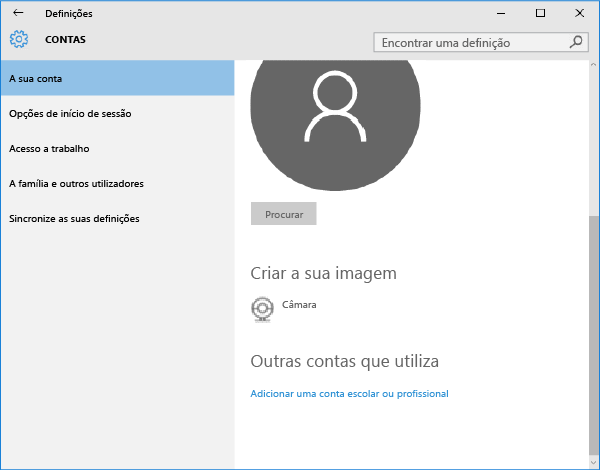

---
# required metadata

title: Inscrever o dispositivo de ambiente de trabalho Windows 10 Mobile ou Windows 10 no Intune | Microsoft Intune
description:
keywords:
author: Staciebarker
manager: jeffgilb
ms.date: 04/28/2016
ms.topic: article
ms.prod:
ms.service: microsoft-intune
ms.technology:
ms.assetid: 36250832-c6fd-4e8d-b681-de735023ebc3

# optional metadata

#ROBOTS:
#audience:
#ms.devlang:
ms.reviewer: jeffgilb
ms.suite: ems
#ms.tgt_pltfrm:
#ms.custom:

---

# Inscrever o dispositivo de ambiente de trabalho Windows 10 Mobile ou Windows 10 no Intune

Se a sua empresa ou escola utiliza o Microsoft Intune, pode inscrever os seus dispositivos para aceder a e-mails, ficheiros e outros recursos da empresa. A inscrição dos dispositivos permite à sua organização manter os dados empresariais protegidos. Para saber mais sobre a inscrição, veja [What happens if you install the Company Portal app and enroll your device in Intune? (O que acontece quando instala a aplicação Portal da Empresa e inscreve o seu dispositivo no Intune?)](what-happens-if-you-install-the-company-portal-app-and-enroll-your-device-in-intune-windows.md)

e [What your IT administrator can and can't see on your device (O que o administrador de TI pode ou não ver no seu dispositivo)](what-can-your-it-administrator-see-when-you-enroll-your-device-in-intune-windows.md)

1.  Inscrever o dispositivo de ambiente de trabalho Windows 10 Mobile ou Windows 10

    

2.  settings-accounts

    

3.  your-account

    

4.  add-work-school-account

    

sign-in

-   Se seguiu os passos acima, mas continua a não conseguir aceder ao e-mail, aos ficheiros e a outros dados do trabalho ou da escola, volte a **Contas** e toque em **Acesso a trabalho** Se visualizar a sua conta profissional ou escolar, parabéns, está ligado.

-   Está ligado.

Se não vir a sua conta profissional ou escolar, toque em **Ligar** e, em seguida, inicie sessão com as credenciais da sua conta profissional ou escolar. Também recomendamos a instalação da aplicação do Portal da Empresa, que lhe permite identificar e obter facilmente as aplicações da empresa relevantes para si e a sua função. Consoante o modo como a empresa configurou o Intune, a aplicação do Portal da Empresa pode ter sido instalada como parte do seu processo de inscrição. Para verificar se tem a aplicação, procure **Portal da Empresa** na lista de aplicações.

1.  Se não vir o Portal da Empresa na lista de aplicações, siga estes passos para instalá-lo.

2.  Toque em **Iniciar** &gt; **Loja**

3.  Toque em **Pesquisar** e escreva **portal da empresa**

4.  Na lista de resultados, toque em **Portal da Empresa** &gt; **Instalar** Toque em **Instalar** ou em **Gratuito**.

### A opção apresentada depende da forma como a sua empresa configurou a aplicação.
[Consulte também](enroll-your-device-in-intune-windows.md) 
[Inscrever o dispositivo Windows no Intune](using-your-windows-device-with-intune.md)

<!--HONumber=May16_HO2-->

