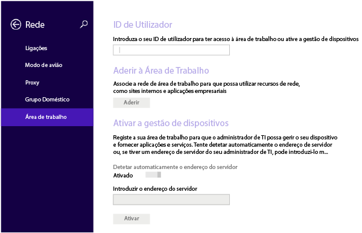
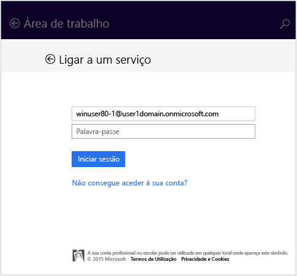
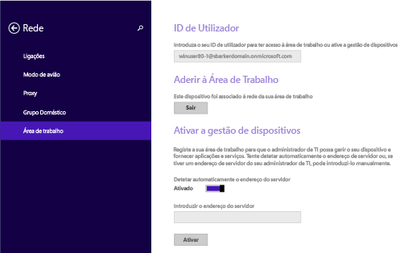
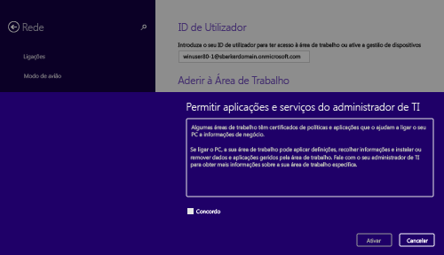

# Inscrever o seu dispositivo Windows 8.1 ou Windows RT 8.1 no Intune

Se a sua empresa ou escola utiliza o Microsoft Intune, pode inscrever os seus dispositivos para aceder a e-mails, ficheiros e outros recursos da empresa. Quando inscreve os seus dispositivos, a sua empresa pode manter os dados empresariais seguros. Para saber mais sobre a inscrição, veja [What happens if you install the Company Portal app and enroll your device in Intune? (O que acontece quando instala a aplicação Portal da Empresa e inscreve o seu dispositivo no Intune?)](what-happens-if-you-install-the-company-portal-app-and-enroll-your-device-in-intune-windows.md) e [What your IT administrator can and can't see on your device (O que o administrador pode ver e não pode ver no seu dispositivo?)](what-can-your-it-administrator-see-when-you-enroll-your-device-in-intune-windows.md).

Inscrever o dispositivo Windows 8.1 ou Windows RT 8.1

1.  No dispositivo, toque em **Definições** &gt; **Definições do PC** &gt; **Rede** &gt; **Área de trabalho**.

    

2.  Introduza o seu e-mail escolar ou profissional do ID de Utilizador, se necessário, e toque em **Participar**.

    Se o seu ID de utilizador não for necessário, é utilizado o endereço de e-mail introduzido quando iniciou sessão neste dispositivo.

3.  Introduza a palavra-passe para o seu e-mail escolar ou profissional.

    

4.  Em **Ativar gestão de dispositivos**, toque em **Ativar**.

    

5.  Na caixa de diálogo **Permitir aplicações e serviços do administrador de TI**, selecione a caixa de verificação **Aceito** e, em seguida, toque em **Ativar**.

    

    Quando tiver inscrito com êxito, verá o ecrã seguinte.

    

Também recomendamos a instalação da aplicação Portal da Empresa, que lhe permite identificar e obter facilmente as aplicações da empresa relevantes para si e a sua função. Consoante o modo como a empresa configurou o Intune, a aplicação Portal da Empresa pode ter sido instalada como parte do seu processo de inscrição. Para verificar se tem a aplicação, procure **Portal da Empresa** na lista de aplicações. Se não vir o Portal da Empresa na lista de aplicações, siga estes passos para instalá-lo.

1.  Toque em **Iniciar** &gt; **Loja**.

2.  Toque em **Pesquisar** e, em seguida, escreva **portal da empresa**.

3.  Na lista de resultados, toque em **Portal da Empresa**.

4.  Toque em **Instalar** ou em **Gratuito**. A opção apresentada depende da forma como a sua empresa configurou a aplicação.

Ainda precisa de ajuda? Contacte o administrador de TI. Para encontrar as informações de contacto dele, verifique o [site do Portal da Empresa](http://portal.manage.microsoft.com).

<!--HONumber=Dec16_HO2-->

