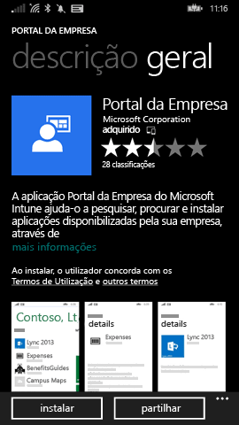
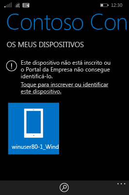
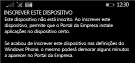

# Inscrever o dispositivo Windows Phone 8.1 no Intune

Se a sua empresa ou escola utiliza o Microsoft Intune, pode inscrever os seus dispositivos para aceder a e-mails, ficheiros e outros recursos da empresa. A inscrição dos dispositivos permite à sua organização manter os dados empresariais protegidos. Para saber mais sobre a inscrição, veja [What happens if you install the Company Portal app and enroll your device in Intune? (O que acontece quando instala a aplicação do Portal da Empresa e inscreve o seu dispositivo no Intune?)](what-happens-if-you-install-the-company-portal-app-and-enroll-your-device-in-intune-windows.md) e [What your IT administrator can and can't see on your device (O que o administrador pode ver e não pode ver no seu dispositivo?)](what-can-your-it-administrator-see-when-you-enroll-your-device-in-intune-windows.md).

Para inscrever o dispositivo Windows Phone 8.1 no Intune, siga as instruções que se aplicam à sua empresa ou escola:

-   [Se a sua empresa permitir a utilização do Portal da Empresa a partir da Loja Windows](#if-your-company-lets-you-use-the-company-portal-from-the-windows-store)

-   [Se não tiver permissão para aceder à Loja Windows a partir do seu Windows Phone ou se não tiver uma Conta Microsoft](#if-you-are-not-allowed-to-access-the-windows-store-from-your-windows-phone-or-if-you-do-not-have-a-microsoft-account)

## Se a sua empresa permitir a utilização do Portal da Empresa a partir da Loja Windows
Instalar a aplicação Portal da Empresa no dispositivo:

1.  Toque em **Iniciar** &gt; **Loja**.

2.  Toque em **Pesquisar** e escreva **portal da empresa**.

3.  Na lista de resultados, toque em **Portal da Empresa**.

    

4.  Toque em **Portal da Empresa**  &gt; **Instalar**.

    

Inscrever o dispositivo:

1.  No dispositivo, abra a aplicação **Portal da Empresa do Microsoft Intune**.

2.  Forneça as suas credenciais. Pode ser-lhe pedido para aceitar os Termos e Condições da empresa, se aplicável.

3.  Percorra até **Os Meus Dispositivos**.

4.  Toque em **Tocar para inscrever ou identificar este dispositivo**.

    

5.  Toque em **Inscrever este dispositivo**.

    

6.  Toque em **Adicionar conta**.

    

7.  Introduza informações adicionais conforme pedido e toque em **iniciar sessão** para concluir a inscrição. Agora, deve conseguir ver a conta da área de trabalho listada na página **Definições** &gt; ** Área de Trabalho**.

    

## Se não tiver permissão para aceder à Loja Windows a partir do seu Windows Phone ou se não tiver uma Conta Microsoft

1.  Toque em **Definições** &gt; **área de trabalho**.

2.  Toque em **adicionar conta** e, em seguida, inicie sessão com a sua conta profissional.

3.  Introduza informações adicionais conforme pedido e toque em **iniciar sessão** para concluir a inscrição.

4.  Se lhe for pedido para instalar a aplicação da empresa ou o Hub, certifique-se de que a caixa relevante está selecionada e toque em **concluído**.

Se o administrador de TI tiver configurado o Portal da Empresa para ser instalado durante a inscrição, o Portal da Empresa irá aparecer na sua lista de aplicações.

Ainda precisa de ajuda? Contacte o seu administrador de TI. Para encontrar as informações de contacto dele, verifique o [Web site do Portal da Empresa](http://portal.manage.microsoft.com).

<!--HONumber=Sep16_HO3-->

