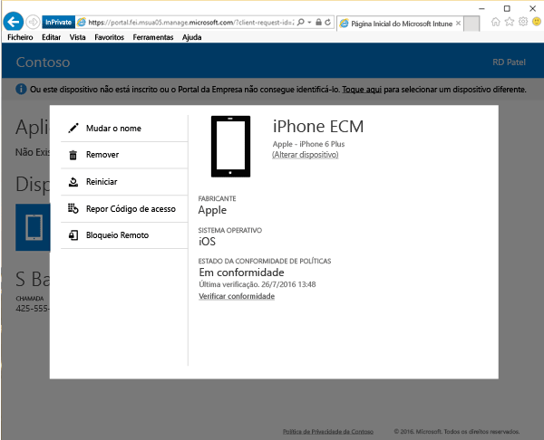

# Remover o seu dispositivo do Portal da Empresa

Se decidir que já não quer que o seu dispositivo seja gerido pelo Intune e pelo administrador de TI, pode removê-lo do Portal da Empresa, no [Web site do Portal da Empresa](http://portal.manage.microsoft.com). O Web site do Portal da Empresa é uma página Web que pode utilizar para gerir computadores e dispositivos que tenha inscrito no Intune e para fazer a maioria das tarefas que pode fazer com a aplicação Portal da Empresa.

Se remover o seu dispositivo, este deixa de aparecer no Portal da Empresa e poderá também perder acesso aos dados, às aplicações e ao e-mail da empresa ou da escola.

Para remover o dispositivo:

1.  Abra o [site do Portal da Empresa](http://portal.manage.microsoft.com) e toque no dispositivo cujo nome quer mudar.

2.  Toque em **Remover**.

    

3. Ler a mensagem de aviso que indica o que acontecerá se remover o dispositivo e, em seguida, toque em **Remover** para remover o dispositivo do Portal da Empresa.

O seu dispositivo foi removido.

Ainda precisa de ajuda? Contacte o seu administrador de TI. Para encontrar as informações de contacto dele, verifique o [Web site do Portal da Empresa](http://portal.manage.microsoft.com).

<!--HONumber=Aug16_HO5-->

