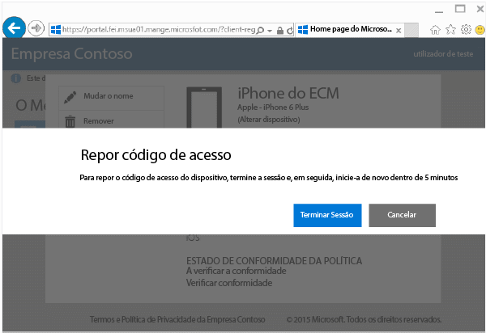
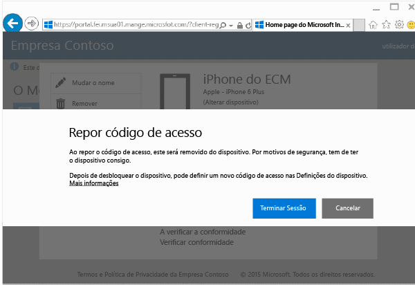

---
# required metadata

title: Repor o código de acesso do dispositivo a partir do site do Portal da Empresa | Microsoft Intune
description:
keywords:
author: Staciebarker
manager: jeffgilb
ms.date: 04/28/2016
ms.topic: article
ms.prod:
ms.service: microsoft-intune
ms.technology:
ms.assetid: 4fa3255b-9d1e-42d5-bd8b-70963dcf2d86

# optional metadata

#ROBOTS:
#audience:
#ms.devlang:
ms.reviewer: jeffgilb
ms.suite: ems
#ms.tgt_pltfrm:
#ms.custom:

---

# Repor o código de acesso do dispositivo a partir do site do Portal da Empresa

Se perder o PIN ou a palavra-passe de um dispositivo que tenha inscrito no Intune, pode utilizar o [site do Portal da Empresa](http://portal.manage.microsoft.com) para efetuar a reposição. O site do Portal da Empresa é uma página Web que pode utilizar para gerir computadores e dispositivos que tenha inscrito no Intune e para fazer a maioria das tarefas que pode fazer com a aplicação Portal da Empresa.

> [!NOTE] Poderá não ver o botão Repor Código de Acesso no site do Portal da Empresa, dependendo de como o seu administrador de TI configurou o Intune. A Reposição do Código de Acesso não é suportada em dispositivos Windows 8.1 e Windows RT.

Para repor o código de acesso:

1.  Abra o [site do Portal da Empresa](http://portal.manage.microsoft.com) e toque no dispositivo cujo código de acesso pretende repor.

2.  Toque em **Repor Código de Acesso**.

    

3.  Toque em **Terminar sessão** e, em seguida, volte a iniciar sessão com as credenciais da sua conta escolar ou profissional. Tem de voltar a iniciar sessão dentro de cinco minutos.

    

4.  Toque em **Repor Código de Acesso**.

    

    Consulte a tabela para ver como funciona a opção Repor Código de Acesso no seu dispositivo.

    |Plataforma|Support|
    |------------|-----------|
    |Android|Cria um novo código de acesso temporário alfanumérico.|
    |iOS|Remove o código de acesso do dispositivo e não cria um novo código de acesso temporário. Se estiver a utilizar o Touch ID, terá de configurá-lo novamente no seu dispositivo, porque este é removido quando o código de acesso for reposto.|
    |Windows 10 (apenas para dispositivos móveis)|Cria um novo código de acesso temporário alfanumérico. O Windows Hello é suportado.|
    |Windows Phone 8.1|Cria um novo código de acesso temporário numérico.|
    Depois de desbloquear o dispositivo, pode definir um novo código de acesso ao aceder a **Definições** no seu dispositivo.

5.  Desbloqueie o dispositivo e, em seguida, defina um novo código de acesso ou altere o código de acesso temporário, acedendo a **Definições** no seu dispositivo.

    Para ver uma notificação a confirmar que a palavra-passe foi reposta com êxito, clique no sinalizador de notificação na parte superior direita do site do Portal da Empresa.

### Consulte também
[Utilizar o Site do Portal da Empresa do Intune](using-the-intune-company-portal-website.md)

<!--HONumber=May16_HO3-->

