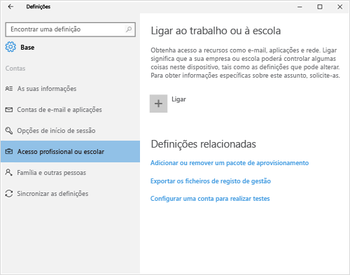
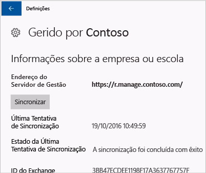

# Sincronizar o seu dispositivo Windows manualmente
Caso a instalação da sua aplicação esteja a demorar muito tempo, pode tentar sincronizar manualmente o seu dispositivo Windows. A sincronização manual poderá ajudar a acelerar a instalação.

Apenas as seguintes versões são suportadas. Se o seu dispositivo não estiver na lista, a sincronização não é suportada. Utilize as instruções que correspondem ao tipo de dispositivo que tem.

* [Windows 10 Mobile](#windows-10-mobile)
* [Windows 10 Desktop](#windows-10-desktop)
* [Windows Phone 8.1](#windows-phone-8-1)

## Windows 10 Mobile
Para sincronizar manualmente o seu dispositivo Windows 10 Mobile para acelerar uma instalação de aplicações lenta:

1. Aceda a **Todas as aplicações** > **Definições** > **Contas**.

    

2. Selecione **Acesso de trabalho**.

    

3. Em **Inscrever na gestão de dispositivos**, selecione o nome da sua empresa.

    

4. Selecione o ícone **Sincronizar**.

    

    É apresentada a mensagem "Estamos a sincronizar a sua conta" na parte superior do ecrã. O botão **Sincronizar** aparece a cinzento até que seja concluída a sincronização do dispositivo.

## Windows 10 Desktop
Existe mais do que uma versão do Windows 10, pelo que existem dois conjuntos de passos. Para saber que passos que deve utilizar, observe as capturas de ecrã e, em seguida, siga os passos que se parecem com o que vê no seu dispositivo. 

1. Selecione o botão **Iniciar** e, em seguida, selecione **Definições**.

    

2. Na página **Definições**, selecione **Contas**.

    

3. Observe os dois ecrãs seguintes e veja qual deles se parece com o que vê no seu dispositivo. Siga os passos que acompanham o ecrã que aparece no seu dispositivo.

    Se vir este ecrã, que mostra "Acesso profissional ou escolar", siga as instruções em [Passos a seguir se vir Acesso profissional ou escolar](#steps-to-follow-if-you-see-access-work-or-school).

    

    Se vir este ecrã, que mostra "Acesso de trabalho", siga os passos em [Passos a seguir se vir Acesso profissional ou escolar](#steps-to-follow-if-you-see-your-account).

     

### Passos a seguir se vir Acesso profissional ou escolar

1. Na página **Contas**, selecione **Acesso profissional ou escolar**.

    

2. Selecione a sua conta escolar ou profissional. Dependendo da configuração que o administrador de TI efetuou, poderá ver duas contas com aspeto semelhante ao exemplo mostrado abaixo. Uma conta tem uma pasta junto à mesma, e a outra conta tem o logótipo da Microsoft. 

    - Se vir a conta com a pasta, selecione-a e procure o botão **Informações** sob a mesma. 
    - Se vir apenas a conta com o logótipo da Microsoft, selecione a conta e procure o botão **Informações** sob a mesma.

    

3. Selecione o botão **Informações**. É aberta uma caixa de diálogo semelhante à do exemplo abaixo.

    

4. Selecione o botão**Sincronizar**. O seu dispositivo será sincronizado com o Intune.

### Passos a seguir se vir Acesso de trabalho
    
1. Na página **Contas**, selecione **Acesso de trabalho**.

    

2. Na secção **Inscrever na gestão de dispositivos**, selecione o nome da sua empresa.

    

3. Selecione o botão**Sincronizar**.

    

   O botão fica a cinzento até a sincronização estar concluída.

## Windows Phone 8.1
Para sincronizar manualmente o seu dispositivo Windows Phone 8.1 para acelerar uma instalação de aplicações lenta:

1. Aceda a **Todas as aplicações** > **Definições** > **área de trabalho**.

    

2. Selecione o nome da sua empresa.

    

3. Selecione o ícone **Sincronizar**.

    

   É apresentada a mensagem "Estamos a sincronizar a sua conta" na parte superior do ecrã até que seja concluída a sincronização do dispositivo.

Ainda precisa de ajuda? Contacte o administrador de TI. Para encontrar as informações de contacto dele, verifique o [site do Portal da Empresa](http://portal.manage.microsoft.com).

<!--HONumber=Nov16_HO1-->

