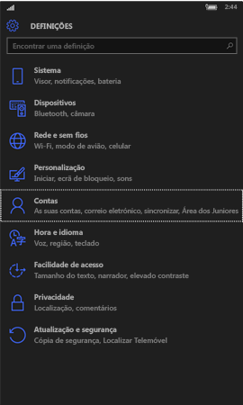
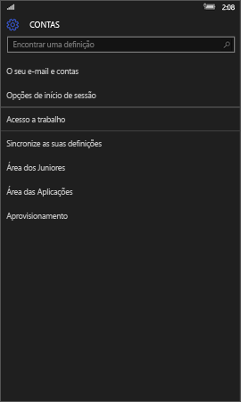
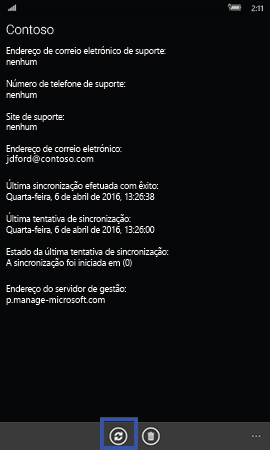
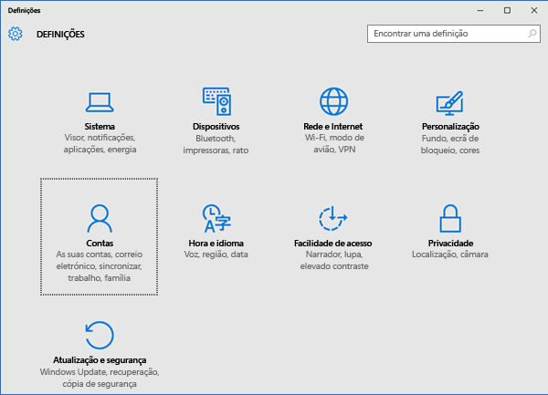
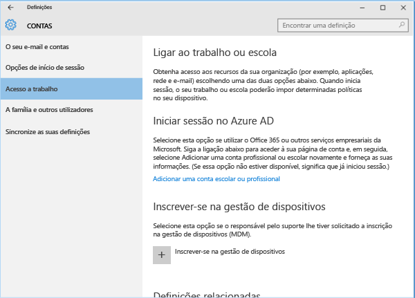
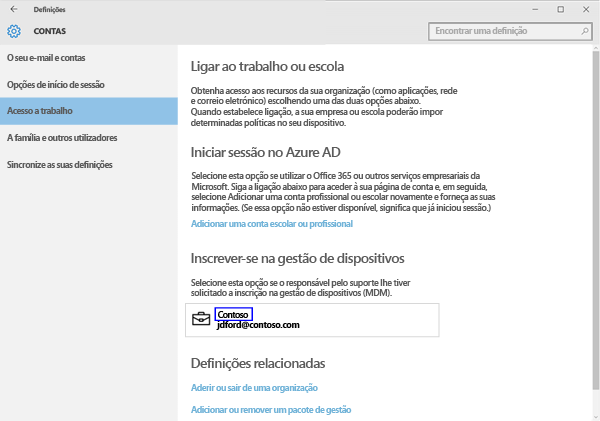
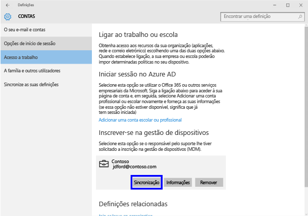
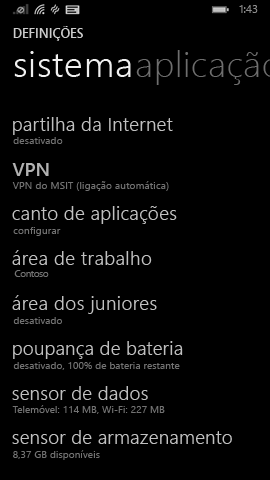
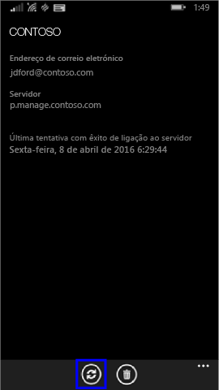

# Sincronizar o seu dispositivo manualmente
Se a instalação da aplicação estiver a demorar demasiado tempo, utilize as instruções seguintes para sincronizar manualmente o seu dispositivo Windows, o que poderá ajudar a acelerar a instalação. As únicas versões suportadas são as da lista. Utilize a ligação, mostrado na secção “Neste artigo” acima, que corresponde ao seu tipo de dispositivo:

* [Windows 10 Mobile](#windows-10-mobile)
* [Windows 10 Desktop](#windows-10-desktop)
* [Windows Phone 8.1](#windows-phone-8-1)

## Windows 10 Mobile
Para sincronizar manualmente o seu dispositivo Windows 10 Mobile para acelerar uma instalação de aplicações lenta:

1. Aceda a **Todas as aplicações** > **Definições** > **Contas**.

    
    
2. Toque em **Acesso a trabalho**.

    
    
3. Em **Inscrever-se na gestão de dispositivos**, toque no nome da sua empresa, conforme apresentado abaixo.

    
    
4. Toque no ícone **Sincronizar**.

    
    
    É apresentada a mensagem "Estamos a sincronizar a sua conta" na parte superior do ecrã. O botão Sincronizar aparece a cinzento até que seja concluída a sincronização do dispositivo.

## Windows 10 Desktop
Para sincronizar manualmente o seu dispositivo Windows 10 Desktop para acelerar uma instalação de aplicações lenta:

1. Selecione o botão **Iniciar**, tal como mostrado a seguir e, em seguida, selecione **Definições**.

    
    
2. Na página **Definições**, selecione **Contas**.
 
    
    
3. Na página **Contas**, selecione **Acesso a trabalho**.
    
    
    
4. Na secção **Inscrever-se na gestão de dispositivos**, clique no nome da sua empresa, conforme apresentado em realce azul abaixo.
    
    
   
5. Selecione o botão **Sincronizar**.
    
    
   
   O botão fica a cinzento até a sincronização estar concluída.

## Windows Phone 8.1
Para sincronizar manualmente o seu dispositivo Windows Phone 8.1 para acelerar uma instalação de aplicações lenta:

1. Aceda a **Todas as aplicações** > **Definições** > **área de trabalho**.

    
    
2. Toque no nome da sua empresa, conforme indicado em realce azul abaixo.

    
   
3. Toque no ícone **Sincronizar**.

    
    
   É apresentada a mensagem "Estamos a sincronizar a sua conta" na parte superior do ecrã até que seja concluída a sincronização do dispositivo.

Ainda precisa de ajuda? Contacte o seu administrador de TI. Para encontrar as informações de contacto dele, verifique o [Web site do Portal da Empresa](http://portal.manage.microsoft.com).

### Consulte também
[Utilizar o dispositivo Windows com o Intune](using-your-windows-device-with-intune.md)

<!--HONumber=Jun16_HO4-->

