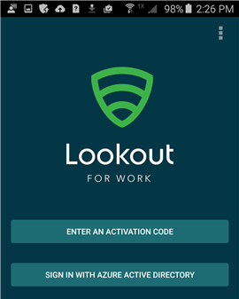

# É-lhe pedido que instale o Lookout for Work

Antes de poder aceder ao seu trabalho, o seu administrador de TI precisa que instale a aplicação Lookout for Work, que ajuda a proteger o seu dispositivo ao detetar potenciais ameaças de segurança.

**O que tem de fazer:**

1.  Arraste para baixo a partir da parte superior do ecrã para abrir a Barra de Notificações e, em seguida, toque em **Aplicação necessária – Instale o Lookout for Work a partir da Play Store**.

    

    É direcionado para a página de instalação do Lookout for Work na Play Store.

2.  Instale o Lookout for Work e, em seguida, toque em **ACCEPT (ACEITAR)** para permitir que o Lookout for Work aceda ao seu dispositivo.

    

3. Abra o Lookout for Work e toque em **Activate (Ativar)**.

    

4. Toque em **Iniciar sessão com o Azure Active Directory** e introduza a conta que utiliza para aceder aos seus ficheiros e e-mail escolares ou profissionais.

    

5. Selecione a conta que utiliza para aceder aos e-mails e ficheiros do seu trabalho ou escola e, em seguida, toque em **ADD ACCOUNT (ADICIONAR CONTA)**.

    

6. Toque em **Accept (Aceitar)** para conceder permissão ao Lookout for Work para iniciar a sua sessão e ler o seu perfil.

    

    É apresentado um ecrã que mostra o Lookout for Work a ligar-se à Lookout Security Cloud.

7. Reveja as informações sobre como o Lookout protege o seu dispositivo e, em seguida, toque em **OK**.

    

    Quando vir o ecrã que apresentamos em seguida, significa que o Lookout está configurado e ligado.

    

    O Lookout for Work começa imediatamente a procurar ameaças de segurança no seu dispositivo. Se não forem encontradas ameaças, verá o seguinte ecrã.

    

    O ecrã Detalhes do Dispositivo no Portal da Empresa mostra que está agora em conformidade com os requisitos de segurança da sua empresa.

    

    Se o Lookout for Work encontrar uma ameaça à segurança do seu dispositivo, verá instruções para resolver o problema.

Ainda precisa de ajuda? Contacte o seu administrador de TI. Para encontrar as informações de contacto dele, verifique o [Web site do Portal da Empresa](http://portal.manage.microsoft.com).

<!--HONumber=Sep16_HO4-->

