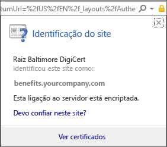
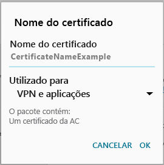

# Está em falta um certificado no seu dispositivo Android de que o administrador de TI necessita

Se o seu dispositivo não estiver inscrito no Intune e não tiver um determinado certificado de que o administrador de TI necessita, não poderá iniciar sessão na aplicação Portal da Empresa. Ao tentar iniciar sessão, verá a seguinte mensagem:

Para resolver este problema e obter o certificado necessário, tem de efetuar dois passos principais:

- Identificar o certificado em falta ao procurar num PC da escola ou empresa.
- Utilizar o dispositivo para transferir o certificado em falta na Internet.

## Identificar o certificado em falta ao procurar num PC da escola ou empresa

1. Num PC, abra o Internet Explorer. Se não tiver um PC para utilizar para esta finalidade, contacte o administrador de TI. Para encontrar as informações de contacto do administrador de TI, veja o [site do Portal da Empresa](http://portal.manage.microsoft.com).

2. Aceda ao [Web site do Portal da Empresa](http://portal.manage.microsoft.com) e inicie sessão com as credenciais profissionais ou escolares.

3. Na extremidade mais à direita da barra de endereço do browser, selecione o símbolo semelhante a um cadeado, conforme mostrado na captura de ecrã seguinte.

    

    Se não vir o símbolo de cadeado, pare e contacte o administrador de TI. O cadeado significa que tem sessão iniciada em segurança, pelo que só deve avançar se ver este símbolo.

4. Selecione **Ver certificados**.

    

5. Na caixa de diálogo **Certificado**, selecione o separador **Caminho do certificado** e identifique o certificado que tem de obter a partir da Internet. O nome do certificado necessário estará na mesma posição que aquele que está realçado na captura de ecrã de exemplo anterior.

## Transferir e instalar o certificado em falta no dispositivo móvel Android

1. Num motor de busca como o Bing ou o Google, procure o nome do certificado em falta que identificou na secção anterior. O certificado pode terminar com diferentes "extensões", como ".crt", ".pem", etc.

2. Transfira o certificado de raiz do Web site.

3. Depois de transferido o certificado, arraste desde a parte superior do dispositivo para baixo para abrir as notificações e toque no nome do certificado na lista de notificações.

4. Na caixa de diálogo **Nomear o Certificado** mostrada na captura de ecrã seguinte, aceite o nome predefinido do certificado.

5. Certifique-se de que a **Utilização da Credencial** está definida como **Utilizada para VPN e aplicações** e, em seguida, toque em **OK**.

    

6. Feche a aplicação Portal da Empresa.

7. Reabra a aplicação Portal da Empresa. Agora deverá conseguir iniciar sessão na aplicação Portal da Empresa. Se precisar de ajuda, contacte o administrador de TI.

Se vir a mesma mensagem que diz "certificado em falta", como mostrado anteriormente, e já tiver seguido os passos, significa que, provavelmente, ainda há outro certificado que o administrador de TI o vai ter de ajudar a instalar. Contacte o seu administrador de TI para obter ajuda, ao utilizar as informações de contacto disponibilizadas no [site do Portal da Empresa](http://portal.manage.microsoft.com).

<!--HONumber=Jan17_HO1-->

