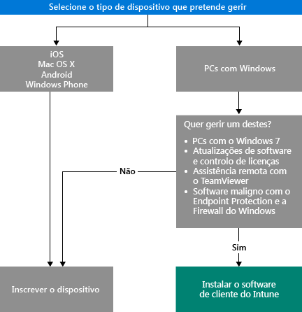

<<<<<<< HEAD
<<<<<<< HEAD
---
title: Escolher como gerir dispositivos | Microsoft Intune
description: "Saiba mais sobre as várias formas de inscrever e gerir dispositivos."
keywords: 
author: robstackmsft
manager: angrobe
ms.date: 08/31/2016
ms.topic: article
ms.prod: 
ms.service: microsoft-intune
ms.technology: 
ms.assetid: 770aad50-fd7a-4cf1-a793-f95fe47fc3f8
ms.reviewer: angrobe
ms.suite: ems
translationtype: Human Translation
ms.sourcegitcommit: e3f27837195e5fdf58b9c13f38b0e5c0ad90d971
ms.openlocfilehash: 86b33ff528a2922e62c4c726bc8ce5f6bdbcfa38

||||||| merged common ancestors
---
title: Escolher como gerir dispositivos | Microsoft Intune
description: "Saiba mais sobre as várias formas de inscrever e gerir dispositivos."
keywords: 
author: robstackmsft
manager: angrobe
ms.date: 08/31/2016
ms.topic: article
ms.prod: 
ms.service: microsoft-intune
ms.technology: 
ms.assetid: 770aad50-fd7a-4cf1-a793-f95fe47fc3f8
ms.reviewer: angrobe
ms.suite: ems
translationtype: Human Translation
ms.sourcegitcommit: e3f27837195e5fdf58b9c13f38b0e5c0ad90d971
ms.openlocfilehash: 86b33ff528a2922e62c4c726bc8ce5f6bdbcfa38

=======
---
title: Escolher como gerir dispositivos | Microsoft Intune
description: "Saiba mais sobre as várias formas de inscrever e gerir dispositivos."
keywords: 
author: robstackmsft
ms.author: robstack
manager: angrobe
ms.date: 08/31/2016
ms.topic: article
ms.prod: 
ms.service: microsoft-intune
ms.technology: 
ms.assetid: 770aad50-fd7a-4cf1-a793-f95fe47fc3f8
ms.reviewer: angrobe
ms.suite: ems
translationtype: Human Translation
ms.sourcegitcommit: a4f7a503417938eabb4334757dcf12a63f082fd3
ms.openlocfilehash: 7b5cadfbc759b025fdad995e34040762b15e0d30

>>>>>>> 2cebb9c337e0b62262ed35e10437cf949bee5815
||||||| merged common ancestors
---
title: Escolher como gerir dispositivos | Microsoft Intune
description: "Saiba mais sobre as várias formas de inscrever e gerir dispositivos."
keywords: 
author: robstackmsft
ms.author: robstack
manager: angrobe
ms.date: 08/31/2016
ms.topic: article
ms.prod: 
ms.service: microsoft-intune
ms.technology: 
ms.assetid: 770aad50-fd7a-4cf1-a793-f95fe47fc3f8
ms.reviewer: angrobe
ms.suite: ems
translationtype: Human Translation
ms.sourcegitcommit: a4f7a503417938eabb4334757dcf12a63f082fd3
ms.openlocfilehash: 7b5cadfbc759b025fdad995e34040762b15e0d30

=======
---
title: Escolher como gerir dispositivos | Microsoft Intune
description: "Saiba mais sobre as várias formas de inscrever e gerir dispositivos."
keywords: 
author: robstackmsft
ms.author: robstack
manager: angrobe
ms.date: 11/14/2016
ms.topic: article
ms.prod: 
ms.service: microsoft-intune
ms.technology: 
ms.assetid: 770aad50-fd7a-4cf1-a793-f95fe47fc3f8
ms.reviewer: angrobe
ms.suite: ems
translationtype: Human Translation
ms.sourcegitcommit: a4f7a503417938eabb4334757dcf12a63f082fd3
ms.openlocfilehash: 7b5cadfbc759b025fdad995e34040762b15e0d30

>>>>>>> 7353fd98b7133f29a0609623f98f8455486209c3

---
<<<<<<< HEAD

# Escolher como gerir dispositivos
||||||| merged common ancestors

# Escolher como gerir dispositivos
=======

# Escolher como gerir dispositivos
>>>>>>> 2cebb9c337e0b62262ed35e10437cf949bee5815

Para tirar partido das várias funcionalidades que o Intune oferece, como a implementação de aplicações e o controlo das definições do dispositivo, os dispositivos têm de ser *geridos*. O método de gestão de dispositivos depende das capacidades do Intune que pretende utilizar.
Este tópico irá ajudá-lo a escolher o método adequado às suas necessidades.

Para gerir dispositivos que executam iOS, Mac OS X, Android e Windows Phone, terá de os *inscrever*.

Para gerir PCs Windows, tem duas opções:

1. Inscrever o dispositivo **ou**
2. Instalar o *cliente de software do Intune*.

## Escolher o método a utilizar
Utilize este fluxo de decisões para decidir como pretende gerir os seus dispositivos.

Inscreva PCs Windows para obter máxima funcionalidade. No entanto, o cliente de software do Intune poderá ser mais adequado às suas necessidades quando:

- O PC está a executar o Windows 7
- Pretender gerir atualizações de software e a utilização de licenças do Windows
- Pretender gerir software maligno com o Endpoint Protection e a Firewall do Windows
- Pretender fornecer assistência remota aos utilizadores com o software TeamViewer

Para obter uma lista detalhada das capacidades de gestão obtidas com cada método, veja [Capacidades de gestão de dispositivos móveis](mobile-device-management-capabilities-in-microsoft-intune.md) e [Capacidades de cliente de software de PCs do Intune](windows-pc-management-capabilities-in-microsoft-intune.md).
Para obter informações sobre os dispositivos e os PCs que o Intune suporta, veja [Dispositivos móveis e computadores suportados](/intune/get-started/supported-mobile-devices-and-computers)

## Gestão do Exchange ActiveSync
Para além de inscrever um dispositivo ou instalar o cliente de software do Intune, também pode gerir dispositivos [com o Exchange ActiveSync](/intune/deploy-use/mobile-device-management-with-exchange-activesync-and-microsoft-intune). Este método requer a instalação do Conector No Local ou a utilização do Conector de Serviços incorporado para ligar ao seu Exchange Server.
Embora esta seja uma terceira opção para gerir dispositivos, fornece um conjunto limitado de capacidades de gestão, em comparação com os outros métodos.

## Passos seguintes

- [Escolher como inscrever dispositivos móveis](/intune/get-started/choose-how-to-enroll-devices1)
- [Gerir PCs Windows com o software de cliente do Intune para PC](/intune/deploy-use/manage-windows-pcs-with-microsoft-intune)

- [Gestão de dispositivos móveis do Exchange ActiveSync com o Microsoft Intune](/intune/deploy-use/mobile-device-management-with-exchange-activesync-and-microsoft-intune).
<<<<<<< HEAD

||||||| merged common ancestors

=======

>>>>>>> 7353fd98b7133f29a0609623f98f8455486209c3

<!--HONumber=Nov16_HO1-->

