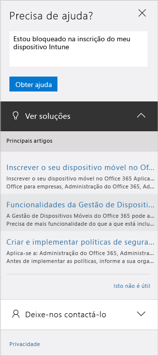

# Como obter suporte de administração para o Microsoft Intune

A Microsoft fornece suporte global técnico, de pré-vendas, de faturação e de subscrição para o Microsoft Intune. O suporte está disponível tanto online como por telefone para subscrições pagas ou de avaliação. O suporte técnico online está disponível em inglês e japonês. O suporte por telefone e o suporte de faturação online estão disponíveis em idiomas adicionais.

O suporte do Intune, bem como do Intune quando utilizado com o Gestor de Configuração, é gratuito. Os clientes do Suporte Premier incorrem numa cobrança para perguntas sobre procedimentos (como configurar uma funcionalidade do Intune).

## Para criar um pedido de assistência online

1.  Inicie sessão no [centro de administração do Office 365](https://portal.office.com) com as suas credenciais do Intune. 
    >[!NOTE]
    >
    >Os clientes do Suporte Premier podem abrir um pedido de suporte do Intune na [página do suporte Premier](https://support.microsoft.com/en-us/premier/contacts).

2.  Selecione o mosaico Administrador.
3.  Do lado esquerdo, em **Suporte**, selecione **Suporte** para abrir um pedido de suporte. Provavelmente irá ver o seguinte:

    

    >[!NOTE]
    >
    >  Os clientes que têm ou já tiveram uma conta do Office 365 com 100 licenças ou menos verão esta mensagem e devem consultar [Alternate method to open a support ticket (Método alternativo para abrir um pedido de suporte – em inglês)](#alternate-method-to-open-a-support-ticket).
    > 

    -   Para problemas de faturação, licenciamento e contas, selecione **Informações de faturação e de produto**.

    -   Para todos os outros problemas do Intune, selecione **Gestão de dispositivos móveis**.

    > [!NOTE]
    > Poderá ter de selecionar **mais** na parte inferior da lista para ver todas as categorias.

3.  Siga as instruções para abrir o seu pedido. 

### Método alternativo de abrir um pedido de suporte

Siga este procedimento se a sua página de suporte tiver o seguinte aspeto:

1. Selecione **Precisa de ajuda?**.
2. Na caixa de texto apresentada, forneça uma descrição do seu problema e selecione **Obter ajuda**.

    

3. Reveja os recursos online sugeridos para obter ajuda de forma autónoma ou selecione **Deixe-nos contactá-lo** para receber uma chamada do Suporte da Microsoft.

## Suporte por telefone
Veja [Contact Assisted Phone Support for Microsoft Intune (Contactar o Suporte Assistido por Telefone do Microsoft Intune)](contact-assisted-phone-support-for-microsoft-intune.md) para obter uma lista de números de telefone de suporte por país e região, horas de suporte e idiomas suportados para cada região.

## Monitorizar os seus pedidos de serviço
1.  Inicie sessão no [centro de administração do Office 365](https://portal.office.com) com as suas credenciais do Intune. 
2.  Selecione o mosaico Administrador.
3.  Do lado esquerdo, em **Suporte**, selecione **Pedidos de serviço** para rever os seus pedidos. 

As nossas respostas iniciais a pedidos de serviço dependem da gravidade do problema. No caso de problemas mais graves, a resposta inicial para clientes Profissionais será dada no espaço de duas horas. Para clientes do Suporte Premier, o tempo de resposta irá variar de acordo com o respetivo contrato de suporte. Existem casos em que:

- Um ou mais serviços não são acessíveis ou não são utilizáveis. 
- Os prazos de produção, operações ou implementação são gravemente afetados ou existirá um impacto grave na produção ou rentabilidade. 
- Vários utilizadores ou serviços são afetados.

No caso de problemas de gravidade moderada, a resposta inicial para clientes Profissionais será dada no espaço de quatro horas. Para clientes do Suporte Premier, o tempo de resposta irá variar de acordo com o respetivo contrato de suporte.  Existem casos em que:

- O serviço é utilizável mas de uma forma debilitada. 
- A situação tem um impacto moderado sobre o negócio e pode ser resolvida durante as horas comerciais. 
- Um único utilizador, cliente ou serviço é afetado parcialmente.

No caso de outro tipo de problema, a resposta inicial para clientes Profissionais será dada no espaço de oito horas. Para clientes do Suporte Premier, o tempo de resposta irá variar de acordo com o respetivo contrato de suporte.  Existem casos em que:

- A situação tem um impacto mínimo sobre o negócio. 
- O problema é importante mas não tem um impacto significativo sobre o serviço ou produtividade atual para o cliente. 
- Um único utilizador está a experienciar uma perturbação parcial mas existe uma solução aceitável.

> [!NOTE]
> **Caso utilize o Microsoft System Center Configuration Manager** ou o **Microsoft System Center Endpoint Protection:** para obter suporte técnico para o Configuration Manager ou o Endpoint Protection, contacte o seu parceiro ou visite o [Solution Center do Microsoft System Center Configuration Manager e do System Center Endpoint Protection](http://www.microsoft.com/en-us/server-cloud/products/system-center-2012-r2/resources.aspx) para encontrar material avançado de autoajuda, com a opção de abrir um pedido de suporte online ou por telefone.
>
> O suporte técnico do System Center Configuration Manager ou do System Center Endpoint Protection requer pagamento ou este é debitado do seu licenciamento ou contratos de Suporte Premier existentes.

## Ajuda autónoma

Poderá conseguir resolver o seu problema sem que seja necessário abrir um pedido de suporte.

Para ajuda autónoma com o Intune, consulte [Sugestões de resolução de problemas genéricos do Microsoft Intune](general-troubleshooting-tips-for-microsoft-intune.md) ou qualquer um dos tópicos de resolução de problemas para problemas específicos. Também pode procurar uma solução ou publicar a sua pergunta no [fórum do Intune](https://social.technet.microsoft.com/Forums/en-US/home?forum=microsoftintuneprod). 

## Suporte para clientes de licenciamento em volume
Se já tiver comprado licenças da Microsoft através de um programa de licenciamento em volume, utilize o seguinte para obter suporte:

-   Para obter suporte relacionado com licenças e chaves de localização, consulte [Centro de Serviços de Licenciamento em Volume](http://go.microsoft.com/fwlink/p/?LinkID=282016)

-   Para perguntas sobre faturação, consulte [Suporte de Gestão de Subscrição e Faturação](http://support.microsoft.com/oas/default.aspx?prid=15371)

-   Para obter informações gerais sobre licenciamento em volume, consulte [Licenciamento em Volume](http://go.microsoft.com/fwlink/p/?LinkID=282015)

<!--HONumber=Nov16_HO1-->

