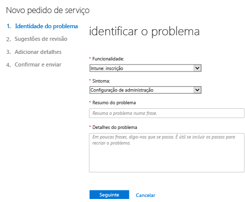

# Como obter suporte de administração para o Microsoft Intune

A Microsoft fornece suporte global técnico, de pré-vendas, de faturação e de subscrição para o Microsoft Intune. O suporte está disponível tanto online como por telefone para subscrições pagas ou de avaliação. O suporte técnico online está disponível em inglês e japonês. O suporte por telefone e o suporte de faturação online estão disponíveis em idiomas adicionais.

O suporte do Intune, bem como do Intune quando utilizado com o Gestor de Configuração, é gratuito. Os clientes do Suporte Premier incorrem numa cobrança para perguntas sobre procedimentos (por exemplo, como configurar uma funcionalidade do Intune).

## Para criar uma permissão de serviço online

1.  Inicie sessão no [centro de administração do Office 365](https://portal.office.com) com as suas credenciais do Intune.
    >[!NOTE]
    >
    >Os clientes do Suporte Premier podem abrir um pedido de suporte do Intune na [página do suporte Premier](https://support.microsoft.com/en-us/premier/contacts).

2.  Escolha o mosaico **Administrador**.
3.  Do lado esquerdo, em **Suporte**, escolha **Suporte** para abrir um pedido de suporte.

    

    >[!NOTE]
    >  Os clientes que tenham, ou tenham tido, uma conta do Office 365 com 100 ou menos licenças, verão esta mensagem. Se a mensagem for apresentada, veja [Criar um pedido de suporte com métodos alternativos](#create-a-support-ticket-with-alternate-methods).

    > 

    -   Para problemas de faturação, licenciamento e contas, selecione **Informações de faturação e de produto**.

    -   Para todos os outros problemas do Intune, selecione **Gestão de dispositivos móveis**.

    > [!NOTE]
    > Poderá ter de selecionar **mais** na parte inferior da lista para ver todas as categorias.

3.  Siga as instruções para abrir o seu pedido.

### Criar um pedido de suporte com métodos alternativos

Siga este procedimento se a sua página de suporte tiver o seguinte aspeto:

1. Selecione **Precisa de ajuda?**.
2. Na caixa de texto, forneça uma descrição do problema e, em seguida, selecione **Obter ajuda**.

    

3. Reveja os recursos online sugeridos ou escolha **Deixe-nos contactá-lo** para receber uma chamada do Suporte da Microsoft.

## Obter suporte por telefone
Veja [Contactar o suporte assistido por telefone do Microsoft Intune](contact-assisted-phone-support-for-microsoft-intune.md) para obter uma lista de números de telefone de suporte por país e região, horas de suporte e idiomas suportados para cada região.

## Monitorizar os seus pedidos de serviço
1.  Inicie sessão no [centro de administração do Office 365](https://portal.office.com) com as suas credenciais do Intune.
2.  Escolha o mosaico **Administrador**.
3.  Do lado esquerdo, em **Suporte**, escolha **Pedidos de serviço**. Em seguida, pode rever os seus pedidos.

As nossas respostas iniciais a pedidos de serviço dependem da gravidade do problema. No caso de problemas mais graves, a resposta inicial para clientes Profissionais é dada no espaço de duas horas. Para clientes do Suporte Premier, o tempo de resposta varia de acordo com o respetivo contrato de suporte. Existem casos em que:

- Um ou mais serviços não são acessíveis ou não são utilizáveis.
- Os prazos de produção, operações ou implementação são gravemente afetados ou existirá um impacto grave na produção ou rentabilidade.
- Vários utilizadores ou serviços são afetados.

No caso de problemas de gravidade moderada, a resposta inicial para clientes Profissionais é dada no espaço de quatro horas. Para clientes do Suporte Premier, o tempo de resposta varia de acordo com o respetivo contrato de suporte.  Existem casos em que:

- O serviço pode ser utilizado, mas não está a funcionar corretamente.
- A situação tem um impacto moderado sobre o negócio e pode ser resolvida durante as horas comerciais.
- Um único utilizador, cliente ou serviço é afetado parcialmente.

No caso de outro tipo de problema, a resposta inicial para clientes Profissionais é dada no espaço de oito horas. Para clientes do Suporte Premier, o tempo de resposta varia de acordo com o respetivo contrato de suporte.  Existem casos em que:

- A situação tem um impacto mínimo sobre o negócio.
- O problema é importante, mas não tem um impacto significativo e imediato sobre o serviço ou a produtividade do cliente.
- Um único utilizador está a experienciar uma perturbação parcial mas existe uma solução aceitável.

> [!NOTE]
> **Caso utilize o Microsoft System Center Configuration Manager** ou o **Microsoft System Center Endpoint Protection:** para obter suporte técnico para o Configuration Manager ou o Endpoint Protection, contacte o seu parceiro ou visite o [Solution Center do Microsoft System Center Configuration Manager e do System Center Endpoint Protection](http://www.microsoft.com/en-us/server-cloud/products/system-center-2012-r2/resources.aspx) para encontrar material avançado de autoajuda. Este também oferece a opção de abrir um pedido de suporte online ou por telefone.
>
> O suporte técnico do System Center Configuration Manager ou do System Center Endpoint Protection requer pagamento ou este é debitado do seu licenciamento ou contratos de Suporte Premier existentes.

## Resolver problemas sem abrir um pedido de suporte

Poderá conseguir resolver o seu problema sem que seja necessário abrir um pedido de suporte.

Para obter ajuda autónoma com o Intune, veja [Sugestões de resolução de problemas genéricos do Microsoft Intune](general-troubleshooting-tips-for-microsoft-intune.md) ou qualquer um dos tópicos de resolução de problemas específicos. Também pode procurar uma solução ou publicar a sua pergunta no [fórum do Intune](https://social.technet.microsoft.com/Forums/en-US/home?forum=microsoftintuneprod).

## Encontrar suporte para licenciamento em volume
Se já tiver comprado licenças da Microsoft através de um programa de licenciamento em volume, utilize os seguintes recursos para obter suporte:

-   Para obter suporte relacionado com licenças e chaves de localização, veja [Centro de Serviços de Licenciamento em Volume](http://go.microsoft.com/fwlink/p/?LinkID=282016).

-   Para perguntas sobre faturação, veja [Suporte de gestão de subscrição e faturação](http://support.microsoft.com/oas/default.aspx?prid=15371).

-   Para obter informações gerais sobre licenciamento em volume, veja [Licenciamento em volume](http://go.microsoft.com/fwlink/p/?LinkID=282015).

<!--HONumber=Dec16_HO1-->

