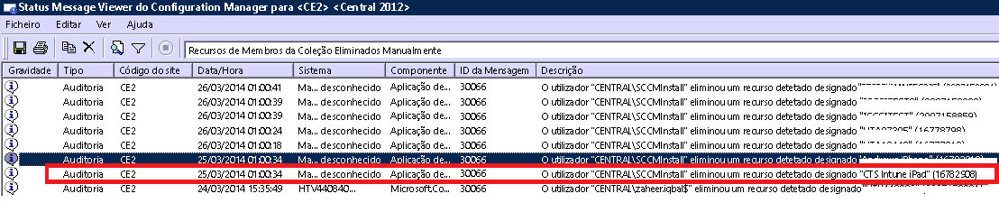

# Resolver problemas de inscrição de dispositivos no Intune

Este tópico fornece sugestões para resolver problemas de inscrição de dispositivos. Se estas informações não resolverem o problema, veja [Como obter suporte para o Microsoft Intune](how-to-get-support-for-microsoft-intune.md) para ver mais formas de obter ajuda.

## Passos iniciais de resolução de problemas

Antes de iniciar a resolução de problemas, certifique-se de que configurou o Intune corretamente para permitir a inscrição. Pode ler sobre estes requisitos de configuração em:

-   [Preparar a inscrição de dispositivos no Microsoft Intune](/intune/deploy-use/prerequisites-for-enrollment)
-   [Configurar a gestão de dispositivos iOS e Mac](/intune/deploy-use/set-up-ios-and-mac-management-with-microsoft-intune)
-   [Configurar a gestão do Windows Phone e Windows 10 Mobile com o Microsoft Intune](/intune/deploy-use/set-up-windows-phone-management-with-microsoft-intune)
-   [Configurar a gestão de dispositivos Windows](/intune/deploy-use/set-up-windows-device-management-with-microsoft-intune)

Os utilizadores de dispositivos geridos podem recolher registos de inscrição e de diagnóstico para que possa analisá-los. Pode encontrar instruções de utilizador para recolher os registos em:

- [Enviar registos de dados de diagnóstico de dispositivos Android para o seu administrador de TI através de um cabo USB](/intune/enduser/send-diagnostic-data-logs-to-your-it-administrator-using-a-usb-cable-android)
- [Enviar registos de dados de diagnóstico para o seu administrador de TI através de e-mail](/intune/enduser/send-diagnostic-data-logs-to-your-it-administrator-using-email-android)
- [Enviar erros de inscrição de dispositivos Android para o seu administrador de TI](/intune/enduser/send-enrollment-errors-to-your-it-administrator-android)
- [Enviar erros de inscrição de dispositivos iOS para o seu administrador de TI](/intune/enduser/send-errors-to-your-it-admin-ios)

## Problemas de inscrição gerais
Estes problemas podem ocorrer em todas as plataformas de dispositivos.

### Máximo de dispositivos atingido
**Problema:** Um utilizador recebe um erro no dispositivo durante a inscrição, tal como um erro **Portal da Empresa Temporariamente Indisponível** num dispositivo iOS e o DMPdownloader.log no Configuration Manager contém o erro **DeviceCapReached**.

**Resolução:**

#### Verificar número de dispositivos inscritos e permitidos

1.  Validar no portal de administração do Intune que o utilizador não excede o valor máximo de 15 dispositivos permitidos atribuídos.

2.  Verifique na consola de administração do Intune em Administração\Gestão de Dispositivos Móveis\Regras de Inscrição se o limite de inscrição de dispositivos está definido como 15.

<!--- Mobile device users can delete devices at the following URL: [https://byodtestservice.azurewebsites.net/](https://byodtestservice.azurewebsites.net/). --->

Os administradores podem eliminar dispositivos no portal do Azure Active Directory.

#### Para eliminar dispositivos no portal do Azure Active Directory

1.  Navegue para [http://aka.ms/accessaad](http://aka.ms/accessaad) ou escolha **Administração** &gt; **Azure AD** a partir de [https://portal.office.com](https://portal.office.com).

2.  Inicie sessão com o seu ID de Organização através da ligação no lado esquerdo da página.

3.  Se não tiver uma, crie uma Subscrição do Azure. Se tiver uma conta paga (escolha a ligação de subscrição **Registar o Azure Active Directory gratuito**), não deverá ser preciso um cartão de crédito ou um pagamento para esta subscrição.

4.  Selecione **Active Directory** e, em seguida, selecione a sua organização.

5.  Selecione o separador **Utilizadores** .

6.  Selecione o utilizador cujos dispositivos pretende eliminar.

7.  Escolha **Dispositivos**.

8.  Remova os dispositivos conforme adequado, como aqueles que já não estão em utilização ou que têm definições incorretas.

> [!NOTE]

> Pode evitar o limite máximo de inscrições de dispositivos com os Gestores de Inscrição de Dispositivos, conforme descrito em [Enroll corporate-owned devices with the Device Enrollment Manager in Microsoft Intune (Inscrever dispositivos pertencentes à empresa com o Gestor de Inscrição de Dispositivos no Microsoft Intune)](/intune/deploy-use/enroll-corporate-owned-devices-with-the-device-enrollment-manager-in-microsoft-intune).
>
> A inscrição de uma conta de utilizador adicionada ao grupo Gestores de Inscrição de Dispositivos não pode ser concluída quando a política de Acesso Condicional é imposta para o início de sessão desse utilizador específico.

### Portal da Empresa Temporariamente Indisponível
**Problema:** Um utilizador recebe um erro **Portal da Empresa Temporariamente Indisponível** no dispositivo.

**Resolução:**

1.  Remova a aplicação Portal da Empresa do Intune do dispositivo.

2.  No dispositivo, abra o browser, navegue para [https://portal.manage.microsoft.com](https://portal.manage.microsoft.com)e tente um início de sessão do utilizador.

3.  Se o utilizador não conseguir iniciar sessão, este que tente outra rede.

4.  Se não conseguir, confirme se as credenciais do utilizador foram sincronizadas corretamente com o Azure Active Directory.

5.  Se o utilizador iniciar sessão com êxito, um dispositivo iOS pedirá para instalar a aplicação Portal da Empresa do Intune e inscrever. Num dispositivo Android, terá de instalar manualmente a aplicação Portal da Empresa do Intune, podendo a seguir repetir a inscrição.

### Autoridade de MDM não definida
**Problema:** Um utilizador recebe um erro **Autoridade de MDM não definida**.

**Resolução:**

1.  Verifique se a Autoridade de MDM foi definida adequadamente para a versão do serviço Intune que estiver a utilizar, ou seja, para o Intune, o Office 365 MDM ou o System Center Configuration Manager com o Intune. No Intune, a Autoridade de MDM é definida em **Administração** &gt; **Gestão de Dispositivos Móveis**. No Configuration Manager com o Intune, pode defini-la quando configurar o conector do Intune e, no O365, é a definição **Dispositivos Móveis**.

    > [!NOTE]
    > Depois de definir a autoridade de MDM, só pode alterá-la se contactar o Suporte, conforme descrito em [Como obter suporte para o Microsoft Intune](how-to-get-support-for-microsoft-intune.md).

2.  Verifique se as credenciais do utilizador foram sincronizadas corretamente com o Azure Active Directory, assegurando que o UPN corresponde às informações do Active Directory no Portal de Contas.
    Se o UPN não corresponder às informações do Active Directory:

    1.  Desative o DirSync no servidor local.

    2.  Elimine o utilizador sem correspondência da lista de utilizadores **Portal de Contas do Intune** .

    3.  Aguarde cerca de uma hora para permitir que o serviço do Azure remova os dados incorretos.

    4.  Ative novamente o DirSync e verifique se o utilizador está agora sincronizado corretamente.

3.  Num cenário em que esteja a utilizar o System Center Configuration Manager com o Intune, verifique se o utilizador tem um ID de Utilizador de Cloud válido:

    1.  Abra o SQL Management Studio.

    2.  Ligue à BD adequada.

    3.  Abra a pasta de bases de dados e localize e abra a pasta **CM_DBName**, em que DBName é o nome da base de dados do cliente.

    4.  Na parte superior, escolha **Nova Consulta** e execute as seguintes consultas:

        -   Para ver todos os utilizadores: `select * from [CM_ DBName].[dbo].[User_DISC]`

        -   Para ver Utilizadores Específicos, utilize a consulta seguinte, em que %testuser1% representa o username@domain.com do utilizador que quer procurar: `select * from [CM_ DBName].[dbo].[User_DISC] where User_Principal_Name0 like '%testuser1%'`

        Depois de escrever a consulta, escolha **!Execute**.
        Depois de devolvidos os resultados, procure o ID clouduser.  Se não for encontrado nenhum ID, o utilizador não está licenciado para utilizar o Intune.

### Não é possível criar a política ou inscrever dispositivos se o nome da empresa incluir carateres especiais
**Problema:** Não é possível criar a política ou inscrever dispositivos.

**Resolução:** No [centro de administração do Office 365](https://portal.office.com/), remova os carateres especiais do nome da empresa e guarde as informações da empresa.

### Não é possível iniciar sessão ou inscrever dispositivos quando tem vários domínios verificados
**Problema:** quando adiciona um segundo domínio verificado ao seu AD FS, os utilizadores com o sufixo de nome principal de utilizador (UPN) do segundo domínio podem não conseguir iniciar sessão nos portais ou inscrever dispositivos.

**Resolução:** Os clientes do Microsoft Office 365 que utilizam o início de sessão único (SSO) através do AD FS 2.0 e têm vários domínios de nível superior para sufixos UPN dos utilizadores dentro da respetiva empresa (por exemplo, @contoso.com ou @fabrikam.com)) têm de implementar uma instância separada do Serviço de Federação AD FS 2.0 para cada sufixo.  Agora, existe um [rollup para o AD FS 2.0](http://support.microsoft.com/kb/2607496) que funciona em conjunto com o comutador **SupportMultipleDomain** para permitir que o servidor do AD FS suporte este cenário sem necessitar de servidores do AD FS 2.0 adicionais. Consulte [este blogue](https://blogs.technet.microsoft.com/abizerh/2013/02/05/supportmultipledomain-switch-when-managing-sso-to-office-365/) para obter mais informações.

## Problemas do Android
### Os dispositivos não conseguem registar com o serviço Intune e são apresentados como em "Mau estado de funcionamento" na consola de administração do Intune
**Problema:** alguns dispositivos Samsung a executar as versões Android 4.4.x e 5.x poderão deixar de fazer o registo com o serviço do Intune. Se os dispositivos não fizerem o registo:

- Não podem receber políticas, aplicações e comandos remotos a partir do serviço do Intune.
- Mostram o Estado de Gestão **Mau estado de funcionamento** na consola do administrador.
- Os utilizadores protegidos por políticas de acesso condicional podem perder o acesso a recursos empresariais.

A Samsung confirmou que o software Samsung Smart Manager, incluído em determinados dispositivos Samsung, pode desativar o Portal da Empresa do Intune e os respetivos componentes. Quando o Portal da Empresa está num estado desativado, este não pode ser executado em segundo plano e, por conseguinte, não pode contactar o serviço do Intune.

**Resolução n.º 1:**

Informe os utilizadores para iniciarem manualmente a aplicação Portal da Empresa. Depois de a aplicação reiniciar, o dispositivo faz o registo com o serviço do Intune.

> [!IMPORTANT]
> Abrir a aplicação Portal da Empresa manualmente é uma solução temporária, uma vez que o Samsung Smart Manager poderá desativar novamente a aplicação Portal da Empresa.

**Resolução n.º 2:**

Informe os utilizadores para tentarem atualizar para Android 6.0. O problema da desativação não ocorre em dispositivos com Android 6.0. Para verificar se está disponível uma atualização, os utilizadores podem aceder a **Definições** > **Acerca do dispositivo** > **Transferir atualizações manualmente** e seguir as instruções no dispositivo.

**Resolução n.º 3:**

Se a Resolução n.º 2 não funcionar, solicite aos seus utilizadores que sigam estes passos para fazer com o que o Smart Manager exclua a aplicação Portal da Empresa:

1. Inicie a aplicação Smart Manager no dispositivo.

  

2. Escolha o mosaico **Bateria**.

  

3. Em **Poupança de energia da aplicação** ou **Otimização da aplicação**, selecione **Detalhes**.

  

4. Escolha **Portal da Empresa** da lista de aplicações.

  

5. Marque **Desativado**.

  

6. Em **Poupança de energia da aplicação** ou **Otimização da aplicação**, confirme que o Portal da Empresa está desativado.

  

### Falha na instalação do perfil
**Problema:** um utilizador recebe o erro **Falha na instalação do perfil** num dispositivo Android.

**Resolução:**

1.  Confirme que foi atribuída ao utilizador uma licença adequada para a versão do serviço Intune que estiver a utilizar.

2.  Confirme que o dispositivo ainda não está inscrito noutro fornecedor de MDM ou que ainda não tem um perfil de gestão instalado.

3.  Confirme que o Chrome para Android é o browser predefinido e que os cookies estão ativados.

### Problemas de certificados do Android

**Problema**: os utilizadores recebem a mensagem seguinte no dispositivo: *não pode iniciar sessão porque está em falta um certificado obrigatório no seu dispositivo.*

**Resolução 1**:

Peça aos seus utilizadores para seguir as instruções em [O dispositivo tem um certificado obrigatório em falta](/intune/enduser/your-device-is-missing-a-required-certificate-android#your-device-is-missing-a-certificate-required-by-your-it-administrator). Se o erro continuar a aparecer depois de os utilizadores seguirem as instruções, experimente a Resolução 2.

**Resolução 2**:

Se os utilizadores ainda veem o erro de certificado em falta após introduzir as respetivas credenciais empresariais e forem redirecionados para a experiência de início de sessão federado, um certificado intermédio pode estar em falta no seu servidor de Serviços de Federação do Active Directory (AD FS).

O erro de certificado ocorre porque os dispositivos Android necessitam de certificados intermédios a serem incluídos num [hello do Servidor SSL](https://technet.microsoft.com/library/cc783349.aspx), mas atualmente um servidor predefinido do AD FS ou a instalação do servidor Proxy do AD FS envia apenas o certificado SSL de serviço do AD FS na resposta hello do servidor de SSL ao hello do Cliente de SSL.

Para corrigir o problema, importe os certificados para os Certificados dos Computadores Pessoais no servidor do AD FS ou nos proxies da seguinte forma:

1.  Nos servidores ADFS e do proxy, inicie a consola de Gestão de Certificados para o computador local, ao clicar com o botão direito do rato no botão **Iniciar**, escolha **Executar** e escreva **certlm.msc**.
2.  Expanda **Pessoal** e selecione **Certificados**.
3.  Localize o certificado para a comunicação de serviço do AD FS (um certificado assinado publicamente) e faça duplo clique para ver as respetivas propriedades.
4.  Selecione o separador **Caminho de Certificação** para ver o certificado(s) principal para o certificado.
5.  Em cada certificado principal, selecione **Ver Certificado**.
6.  Selecione o separador **Detalhes** e escolha **Copiar para o ficheiro...**.
7.  Siga as instruções do assistente para exportar ou guardar a chave pública do certificado para a localização de ficheiro pretendido.
8.  Importe os certificados principais que foram exportados no Passo 3 para Computador Local\Pessoal\Certificados ao clicar com o botão direito do rato em **Certificados**, selecionar **Todas as Tarefas** > **Importar** e, em seguida, seguir as instruções do assistente para importar o(s) certificado(s).
9.  Reinicie os servidores do AD FS.
10. Repita os passos acima em todos os servidores do AD FS e do proxy.
O utilizador deverá conseguir agora iniciar sessão no Portal da Empresa no dispositivo Android.

**Para validar que o certificado foi instalado corretamente**:

Os passos seguintes descrevem apenas um dos vários métodos e ferramentas que pode utilizar para validar que o certificado está instalado corretamente.

1. Aceda à [ferramenta gratuita Digicert](ttps://www.digicert.com/help/).
2. Introduza o nome de domínio completamente qualificado do servidor do AD FS (por ex., sts.contoso.com) e selecione **VERIFICAR SERVIDOR**.

Se o certificado de Servidor estiver corretamente instalado, verá todas as marcas de verificação nos resultados. Se existir o problema acima, vê um X vermelho nas secções do relatório "Correspondências de Nome de Certificado" e "Certificado SSL está corretamente instalado".

## Problemas do iOS
### Falha na instalação do perfil
**Problema:** um utilizador recebe o erro **Falha na instalação do perfil** num dispositivo iOS.

### Passos de resolução de problemas para a falha na instalação do perfil

1.  Confirme que foi atribuída ao utilizador uma licença adequada para a versão do serviço Intune que estiver a utilizar.

2.  Confirme que o dispositivo ainda não está inscrito noutro fornecedor de MDM ou que ainda não tem um perfil de gestão instalado.

3.  Navegue para [https://portal.manage.microsoft.com](https://portal.manage.microsoft.com) e tente instalar o perfil quando lhe for pedido.

4.  Confirme que o Safari para iOS é o browser predefinido e que os cookies estão ativados.

### Os dispositivos iOS inscritos não aparecem na consola ao utilizar o System Center Configuration Manager com o Intune
**Problema:** O utilizador inscreve o dispositivo iOS, mas não é apresentado na consola de administração do Configuration Manager. O dispositivo não indica que foi inscrito. Causas possíveis:

- Pode ter inscrito o conector do Intune numa conta e, em seguida, inscreveu-o noutra conta.
- Pode ter transferido o certificado MDM a partir de uma conta e utilizado o certificado noutra conta.

**Resolução:** Execute os seguintes passos:

1. Desative o iOS dentro do conector do Windows Intune.
    1. Clique com o botão direito do rato na subscrição do Intune e selecione **Propriedades**.
    1. No separador "iOS", desmarque "Ativar inscrição iOS".

1. No SQL, execute os passos seguintes na BD CAS

    1. atualize SC_ClientComponent_Property set Value2 = '' where Name like '%APNS%'
    1. elimine de MDMPolicy, em que PolicyType = 7
    1. elimine de MDMPolicyAssignment, em que PolicyType = 7
    1. atualize SC_ClientComponent_Property set Value2 = '' where Name like '%APNS%'
    1. elimine de MDMPolicy, em que PolicyType = 11
    1. elimine de MDMPolicyAssignment, em que PolicyType = 11
    1. DELETE Drs_Signals
1. Reinicie o serviço SMS Executive ou reinicie o servidor de CM

1. Obtenha um novo certificado APN e carregue-o: clique com o botão direito do rato na subscrição do Intune no painel esquerdo do Configuration Manager. Selecione **Criar pedido de certificado do APNs** e siga as instruções.
## Problemas quando utiliza o System Center Configuration Manager com o Intune
### Os dispositivos móveis desaparecem
**Problema:** Depois de inscrever com êxito um dispositivo móvel no Configuration Manager, este desaparece da coleção de dispositivos móveis, mas o dispositivo ainda tem o Perfil de Gestão e está listado no Gateway de CSS.

**Resolução:** Isto pode ocorrer porque tem um processo personalizado a remover dispositivos não associados ao domínio ou porque o utilizador retirou o dispositivo da subscrição. Para validar e verificar que processo ou conta de utilizador removeu o dispositivo da consola do Configuration Manager, execute os passos seguintes.

#### Verificar como o dispositivo foi removido

1.  Na consola de administração do Configuration Manager, selecione **Monitorização** &gt; **Estado do Sistema** &gt; **Consultas de Mensagens de Estado**.

2.  Clique com o botão direito do rato em **Recursos Membros da Coleção Eliminados Manualmente** e selecione **Mostrar Mensagens**.

3.  Escolha uma data/hora adequada ou as últimas 12 horas.

4.  Localize o dispositivo em questão e reveja a forma como foi removido. O exemplo abaixo mostra que a conta SCCMInstall eliminou o dispositivo através de uma Aplicação Desconhecida.

    

5.  Verifique se o Configuration Manager tem uma tarefa agendada, script ou outro processo que possa estar a remover automaticamente dispositivos não associados ao domínio, móveis ou relacionados.

### Outros erros de inscrição do iOS
É disponibilizada uma lista de outros erros de inscrição do iOS na documentação do utilizador do dispositivo, em [You see errors while trying to enroll your device in Intune (Obtém erros quando tenta inscrever o dispositivo no Intune)](/intune/enduser/using-your-ios-or-mac-os-x-device-with-intune).

## Problemas do PC

### O computador já está inscrito - Erro hr 0x8007064c
**Problema:** A inscrição falha com o erro **O computador já está inscrito**. O registo de inscrição mostra o erro **hr 0x8007064c**.

Isto pode acontecer porque o computador tinha sido inscrito anteriormente ou tem a imagem clonada de um computador que já tinha sido inscrito. O certificado de conta da conta anterior ainda está presente no computador.

**Resolução:**

1. No menu **Iniciar**, **Executar** -> **MMC**.
1. **Ficheiro** -> **Adicionar/Remover snap-in**.
1. Faça duplo clique em **Certificados**, escolha **Conta de computador**, **Seguinte**, selecione **Computador local**.
1. Faça duplo clique em **Certificados (Computador local)**, escolha **Certificados pessoais**.
1. Procure o certificado do Intune emitido por Sc_Online_Issuing e elimine-o se estiver presente
1. Elimine esta chave de registo, se existir: ** HKEY_LOCAL_MACHINE\SOFTWARE\Microsoft\OnlineManagement regkey** e todas as sub-chaves.
1. Tente efetuar novamente a inscrição.
1. Se o computador ainda não conseguir fazer a inscrição, procure e elimine esta chave, se existir: **KEY_CLASSES_ROOT\Installer\Products\6985F0077D3EEB44AB6849B5D7913E95**.
1. Tente efetuar novamente a inscrição.

    > [!IMPORTANT]
    > Esta secção, método ou tarefa contém passos que indicam como modificar o registo. No entanto, poderão ocorrer problemas graves se modificar o registo incorretamente. Por isso, certifique-se de que segue estes passos cuidadosamente. Para maior proteção, faça uma cópia de segurança do registo antes de o modificar. Em seguida, pode restaurar o registo se ocorrer um problema.
    > Para obter mais informações sobre como criar cópias de segurança e restaurar o registo, leia o artigo [Como fazer cópias de segurança e restaurar o registo no Windows](https://support.microsoft.com/en-us/kb/322756)

## Códigos de erros de inscrição gerais

|Código de erro|Possível problema|Resolução sugerida|
|--------------|--------------------|----------------------------------------|
|0x80CF0437 |O relógio no computador cliente não está definido com a hora correta.|Certifique-se de que o relógio e o fuso horário no computador cliente estão definidos com a hora e fuso horário corretos.|
|0x80240438, 0x80CF0438, 0x80CF402C|Não é possível ligar ao serviço Intune. Verifique as definições de proxy do cliente.|Verifique se a configuração de proxy no computador cliente é suportada pelo Intune e se o computador cliente tem acesso à Internet.|
|0x80240438, 0x80CF0438|As definições de proxy no Internet Explorer e no Sistema Local não estão configuradas.|Não é possível ligar ao serviço Intune. Verifique as definições de proxy do cliente e confirme se a configuração de proxy no computador cliente é suportada pelo Intune e se o computador cliente tem acesso à Internet.|
|0x80043001, 0x80CF3001, 0x80043004, 0x80CF3004|O pacote de inscrição está desatualizado.|Transfira e instale o pacote de software de cliente atual a partir da área de trabalho Administração .|
|0x80043002, 0x80CF3002|A conta está em modo de manutenção.|Não pode inscrever novos computadores cliente quando a conta estiver em modo de manutenção. Para ver as definições da sua conta, inicie sessão na conta.|
|0x80043003, 0x80CF3003|A conta foi eliminada.|Verifique se a sua conta e subscrição do Intune ainda estão ativas. Para ver as definições da sua conta, inicie sessão na conta.|
|0x80043005, 0x80CF3005|O computador cliente foi extinguido.|Aguarde algumas horas, remova todas as antigas versões do software de cliente do computador e, em seguida, tente instalar o software de cliente novamente.|
|0x80043006, 0x80CF3006|O número máximo de estações permitidas para a conta foi atingido.|A sua organização tem de comprar licenças adicionais para que possa inscrever mais computadores cliente no serviço.|
|0x80043007, 0x80CF3007|Não foi possível localizar o ficheiro de certificado na mesma pasta que o programa do instalador.|Extraia todos os ficheiros antes de iniciar a instalação. Não mude o nome ou a localização de nenhum dos ficheiros extraídos; todos os ficheiros têm de estar na mesma pasta ou a instalação irá falhar.|
|0x8024D015, 0x00240005, 0x80070BC2, 0x80070BC9, 0x80CFD015|O software não pode ser instalado porque existe um reinício pendente do computador cliente.|Reinicie o computador e, em seguida, tente instalar o software de cliente novamente.|
|0x80070032|Um ou mais pré-requisitos para a instalação do software de cliente não foram encontrados no computador cliente.|Certifique-se de que todas as atualizações necessárias estão instaladas no computador cliente e, em seguida, tente instalar o software de cliente novamente.|
|0x80043008, 0x80CF3008|Falha ao iniciar o serviço Microsoft Online Management Update.|Contacte o Suporte da Microsoft, conforme descrito em [How to get support for Microsoft Intune (Como obter suporte para o Microsoft Intune)](how-to-get-support-for-microsoft-intune.md).|
|0x80043009, 0x80CF3009|O computador cliente já está inscrito no serviço.|Tem de extinguir o computador cliente para o poder inscrever novamente no serviço.|
|0x8004300B, 0x80CF300B|Não é possível executar o pacote de instalação do software de cliente porque a versão do Windows que está a ser executada no cliente não é suportada.|O Intune não suporta a versão do Windows que está a ser executada no computador cliente.|
|0xAB2|O Windows Installer não conseguiu aceder ao tempo de execução de VBScript de uma ação personalizada.|Este erro é causado por uma ação personalizada baseada em DLLs (Dynamic-Link Libraries). Ao resolver problemas com o DLL, pode ter de utilizar as ferramentas descritas em [KB198038 do Suporte da Microsoft: Ferramentas Úteis para Problemas de Empacotamento e Implementação](https://support.microsoft.com/en-us/kb/198038).|
|0x80cf0440|A ligação ao ponto final do serviço foi terminada.|A conta de avaliação ou paga está suspensa. Crie uma nova conta de avaliação ou paga e volte a inscrever.|

### Passos seguintes
Se estas informações de resolução de problemas não o ajudaram, contacte o Suporte da Microsoft, conforme descrito em [Como obter suporte para o Microsoft Intune](how-to-get-support-for-microsoft-intune.md).

<!--HONumber=Dec16_HO5-->

