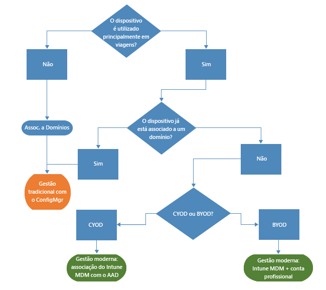
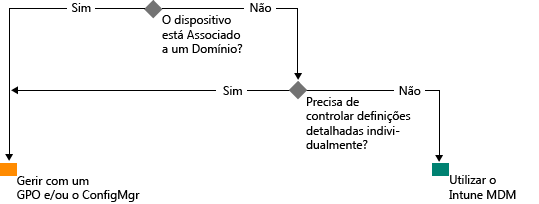

# Caminho para a gestão moderna do Windows com o Microsoft Intune

A utilização de dispositivos pessoais para o trabalho, bem como funcionários a trabalhar fora do escritório, está a mudar a forma como as organizações gerem os dispositivos. Enquanto determinadas partes de algumas organizações podem exigir um controlo mais profundo e granular sobre os dispositivos, outras organizações estão a adotar uma gestão mais leve baseada em cenários que capacitam a força de trabalho moderna.

O Windows 10 continua a tradição do Windows de fornecer às organizações o sistema operativo com a melhor gestão. O Windows fornece suporte para uma maior capacidade de gestão e segurança através de tecnologias como a Política de Grupo, o Active Directory e o System Center Configuration Manager. Também fornece uma abordagem "móvel em primeiro lugar, nuvem em primeiro lugar" de gestão moderna e simplificada com soluções de gestão de dispositivos baseadas na nuvem, tal como o Microsoft Enterprise Mobility Suite (EMS). As inovações futuras do Windows, fornecidas através do Windows como um Serviço, são complementadas por serviços em nuvem rápidos, como o Microsoft Intune, o Azure Active Directory, o Azure Rights Management Service, o Office 365 e a Loja Windows para Empresas.

As organizações de TI têm maior flexibilidade com oportunidades para beneficiar da inovação e da redução de custos. Este documento oferece orientação sobre estratégias para implementar e gerir o Windows 10. Também fornece informações sobre o pensamento estratégico da Microsoft sobre as ferramentas de gestão de dispositivos. Enquanto pensa nos alicerces de gestão e em como pretende aplicá-los a diferentes dispositivos, considere as quatro fases seguintes do ciclo de vida do dispositivo:

## Implementação e aprovisionamento

Ao contrário da implementação do SO tradicional, que necessita de operações de TI complexas, a gestão de dispositivos moderna possibilita uma gestão criativa. As TI pretendem transformar facilmente novos dispositivos em dispositivos totalmente geridos e configurados sem recriação da imagem.  O aprovisionamento dinâmico é mais fácil do que nunca, ativado por serviços de gestão de dispositivos baseados na nuvem como o Microsoft Intune. Também pode criar pacotes de aprovisionamento autónomos incorporados com o Windows Imaging and Configuration Designer (ICD). Continuamos a suportar técnicas de processamento de imagens tradicionais, pelo que as organizações podem implementar imagens personalizadas com o System Center Configuration Manager.

## Identidade e Autenticação

O Windows 10 e serviços como o Azure Active Directory abrem novas possibilidades para gestão, autenticação e identidade baseada na nuvem. Cenários como o BYOD e o CYOD estão a permitir que as empresas reconsiderem a forma como os utilizadores acedem às aplicações e aos recursos empresariais. A gestão de dispositivos e de utilizadores enquadra-se nas duas categorias seguintes:

- Dispositivos empresariais (CYOD) ou pessoais (BYOD) utilizados por utilizadores móveis para aplicações SaaS como o Office 365.

  O Windows 10 permite que os funcionários aprovisionem automaticamente os dispositivos. Os dispositivos empresariais podem configurar facilmente o acesso à empresa com o Azure AD Join. Da mesma forma, uma experiência BYOD nova e simplificada permite que os utilizadores adicionem a sua conta profissional ao Windows e acedam a recursos de trabalho em dispositivos pessoais. Combinar a inscrição MDM do Intune automática e o Azure AD Join coloca os dispositivos num estado gerido pela empresa [num passo simples](https://blogs.technet.microsoft.com/ad/2015/08/14/windows-10-azure-ad-and-microsoft-intune-automatic-mdm-enrollment-powered-by-the-cloud/), tudo a partir da nuvem. O Azure AD Join também é uma ótima solução para funcionários e parceiros temporários ou outros funcionários a tempo parcial. Estas contas podem ser mantidas separadas do domínio do AD no local mas ainda podem aceder aos recursos empresariais necessários.
- Os PCs e tablets associados a um domínio utilizam recursos e aplicações tradicionais que necessitam de autenticação ou acesso a recursos extremamente confidenciais no local

  Os dispositivos com Windows 10 associados a um domínio do Active Directory no local irão registar-se automaticamente com o Azure AD, pelo que os utilizadores podem desfrutar das vantagens adicionais das experiências do Windows 10, tal como o início de sessão único na nuvem e recursos online a partir de qualquer lugar, definições de roaming empresarial, Microsoft Passport for Work e Windows Hello. Os PCs e tablets associados a um domínio devem continuar a ser geridos na Política de Grupo ou cliente do System Center Configuration Manager.

Reveja as funções na sua organização. Identifique os utilizadores ou dispositivos que necessitam de Associação a um Domínio e considere mudar outros para o Azure AD. Pode saber mais [neste artigo](https://azure.microsoft.com/en-us/documentation/articles/active-directory-azureadjoin-windows10-devices/) sobre como o Windows 10 e o Azure AD otimizam o acesso aos recursos de trabalho em vários dispositivos e cenários.

Eis o aspeto que uma árvore de decisão generalizada poderá ter. Serão aplicadas exceções em alguns casos.

## Definições e Configuração

O nível de gestão necessário, os dispositivos e os dados geridos e os requisitos do setor podem definir todos os requisitos de configuração. Entretanto, os funcionários preocupam-se com frequência com o facto de as TI aplicarem políticas rigorosas aos seus dispositivos pessoais, mas continuam a querer aceder a documentos e e-mails empresariais. O Windows 10 fornece um conjunto consistente de configurações em PCs, tablets e telemóveis através de uma camada comum de MDM. A abordagem de MDM precisa de definições que alcancem o objetivo do administrador sem expor todas as definições possíveis. Em contrapartida, a Política de Grupo expõe definições detalhadas que o administrador controla individualmente. Uma vantagem do MDM é que permite que os administradores apliquem definições de gestão de aplicações, segurança e privacidade mais vastas através de ferramentas mais leves e mais eficientes. Isto torna o MDM a melhor opção para dispositivos que estão sempre em movimento.

Muitas organizações ainda precisam de gerir computadores associados a um domínio a um nível granular, tal como 1 500 definições da Política de Grupo configuráveis do Internet Explorer ou regras da Firewall do Windows muito específicas. Nestes casos, a Política de Grupo e o System Center Configuration Manager continuam a ser ótimas opções de gestão. A Política de Grupo é o melhor modo de configurar de forma granular tablets e PCs com Windows associados a um domínio ligados à rede empresarial com ferramentas baseadas no Windows. A Microsoft continua a adicionar definições de Política de Grupo em cada versão nova do Windows. Para a configuração granular com implementação de software robusto, atualizações do Windows e implementação do SO, o Configuration Manager continua a ser a solução recomendada.

## Atualizar dispositivos Windows

Com o Windows como um Serviço, as organizações de TI já não precisam de efetuar processamentos de imagens complexos (wipe-and-load) em cada versão nova do Windows. Quer no Current Branch (CB) ou no Current Branch for Business (CBB), os dispositivos recebem as atualizações de qualidade e de funcionalidades mais recentes através de processos de aplicação de patches simples (muitas vezes automáticos). O MDM com o Intune fornece ferramentas para aplicar atualizações do Windows a computadores cliente na empresa. O Configuration Manager permite funcionalidades de controlo e gestão avançada destas atualizações, incluindo janelas de manutenção e regras de implementação automáticas.

## Resumo

Quando pensa no caminho para a gestão de dispositivos moderna na sua organização, considere os passos que toma para iniciar a sua viagem.

1. **Existem investimentos que pode fazer hoje.** Que componentes da gestão de dispositivos tradicional precisa de manter e onde pode modernizar? Quer tome passos para minimizar o processamento de imagens personalizado, reavaliar a gestão de definições ou reavaliar a autenticação e a conformidade, as vantagens podem ser imediatas.

2. **Avalie os diferentes casos de utilização no seu ambiente.** Existem grupos de dispositivos que podem beneficiar de uma gestão mais leve e simplificada? Por exemplo, os dispositivos BYOD são candidatos naturais para a gestão baseada na nuvem. Os utilizadores ou dispositivos que processam dados mais regulamentados necessitam de um domínio do AD no local para autenticação. O Configuration Manager e o EMS fornecem-lhe a flexibilidade para preparar a implementação dos cenários de gestão modernos enquanto direcionam diferentes dispositivos da forma que melhor se adequa às suas necessidades empresariais. A escolha é sua.

## O Que Fazer a Seguir

- **Avalie as necessidades de gestão no seu ambiente.** Um modelo poderá não se adaptar a todas as suas necessidades dependendo das pessoas, da sua mobilidade, dos dispositivos e dos dados a que acedem.
- **Considere os requisitos.** Com o Windows 10, o Configuration Manager e o Enterprise Mobility Suite, tem a flexibilidade de processar imagens, autenticação, definições e ferramentas de gestão para qualquer cenário.
- **Dê passos pequenos.** A gestão de dispositivos moderna não precisa de ser uma transformação de um dia para o outro.
- **Otimize os seus investimentos existentes.** Desde a gestão no local tradicional à gestão baseada em nuvem moderna, tire partido da arquitetura híbrida e flexível do Configuration Manager e do Intune. À medida que funcionalidades adicionais ficam disponíveis no modelo MDM/identidade em nuvem, a Microsoft está empenhada em fornecer um caminho claro a partir da gestão tradicional para a gestão moderna.

<!--HONumber=Sep16_HO2-->

