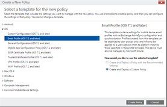

---
# required metadata

title: Configurar o acesso ao e-mail para dispositivos iOS com o Microsoft Intune | Microsoft Intune
description:
keywords:
author: Staciebarker
manager: jeffgilb
ms.date: 04/28/2016
ms.topic: article
ms.prod:
ms.service: microsoft-intune
ms.technology:
ms.assetid: 3853673d-290a-400f-8e45-d55e39d42acd

# optional metadata

#ROBOTS:
#audience:
#ms.devlang:
ms.reviewer: jeffgilb
ms.suite: ems
#ms.tgt_pltfrm:
#ms.custom:

---

# Configurar o acesso ao e-mail para dispositivos iOS com o Microsoft Intune
Quando os dispositivos são inscritos no Intune, pode configurar os dispositivos para que os utilizadores possam aceder ao e-mail da empresa. Uma forma de o fazer para tipos de dispositivos específicos é criar e implementar um **perfil de e-mail**. Os perfis de e-mail são um tipo de política do Intune que configura e liga o dispositivo de um utilizador ao serviço de e-mail da empresa.
A utilização de um perfil de e-mail torna o acesso ao e-mail automático para os dispositivos inscritos, o que evita que tenha de configurar manualmente o dispositivo. Um perfil de e-mail também garante que todos os utilizadores finais estão a configurar o acesso da mesma forma e com as mesmas definições básicas.

## Objetivos destas instruções

- Criar e implementar um perfil de e-mail para dispositivos iOS
- Verificar se a política de perfil de e-mail foi aplicada com êxito

## O que precisa antes de iniciar estas instruções

- Um Exchange Server, no local ou alojado no Azure como parte da sua subscrição do Office/E3.
- O nome de anfitrião do Exchange Server da sua empresa. Este é o nome de domínio completamente qualificado (FQDN), por exemplo, **contosodemo55.onmicrosoft.com**
- Um grupo de utilizadores no qual implementar o perfil de e-mail. Se concluiu as instruções do artigo [Iniciar uma versão de avaliação do Microsoft Intune e implementar a política de PIN para iOS](start-a-microsoft-intune-trial-and-deploy-ios-pin-policy.md), pode utilizar o grupo de utilizadores **GroupDemo** que criou para o mesmo.
- Os dispositivos iOS inscritos nos quais implementar o perfil. Mais uma vez, se concluiu as instruções do artigo [Iniciar uma versão de avaliação do Microsoft Intune e implementar a política de PIN para iOS](start-a-microsoft-intune-trial-and-deploy-ios-pin-policy.md), já inscreveu alguns dispositivos iOS.

## Passos para criar e implementar um perfil de e-mail para dispositivos iOS

Para estas instruções, vamos utilizar o Exchange Server alojado fornecido com uma subscrição de avaliação.
1. Na consola do Intune, clique em **Política** e, em seguida, clique em **Adicionar Política**

2. Na caixa de diálogo **Criar uma nova política**, expanda **iOS**, selecione **Perfil de E-Mail** e, em seguida, clique em **Criar Política**

3. Na página de criação da política, introduza um nome para a política, como, por exemplo, **Perfil de e-mail iOS - palavra-passe do utilizador**, e uma descrição. Pode ter vários perfis de e-mail para diferentes tipos de dispositivos e diferentes métodos de autenticação, pelo que pode utilizar o nome para mostrar para que serve o perfil.
4. Introduza o nome de anfitrião do Exchange. Uma vez que está a utilizar o Exchange Server alojado no Azure, para nome de anfitrião, introduzimos simplesmente: **outlook.office365.com**](./media/Email-Walkthrough/Email-Walkthrough-3.png)
5. <add-exchange-host-name> Introduza o nome de conta que será apresentado aos utilizadores do dispositivo para ajudá-los a identificar o serviço de e-mail.
6. Por exemplo, **E-Mail de Contoso**
7. Uma vez que estamos a utilizar um nome de utilizador e uma palavra-passe para autenticar o utilizador no serviço do Exchange, deixe as definições de nome de utilizador e palavra-passe tal como estão. Ajuste as definições de sincronização para satisfazer as suas necessidades.  
8. Por agora, utilize as predefinições, a menos que exista uma definição específica que queira alterar.
9. Clique em **Guardar Política** É apresentada uma caixa de diálogo a perguntar se pretende implementar a política agora.

10. <deploy-policy-now-dialog>
![Na janela apresentada a seguir, selecione o grupo de utilizadores no qual pretende implementar o perfil de e-mail, clique em **Adicionar** e, em seguida, clique em **OK**

## <finish-add-policy>

Depois de clicar em **OK**, a política irá começar a ser aplicada aos dispositivos inscritos num minuto ou dois.
1. Passos para verificar se o perfil foi aplicado com êxito
Para verificar se o perfil foi aplicado, precisará de acesso a um dos dispositivos no qual implementou o perfil de e-mail.

2. A aplicação irá pedir que introduza o nome de utilizador e a palavra-passe de e-mail do utilizador.
 <verify-policy-add-password>

3. A aplicação Correio abre na conta do Exchange e o e-mail começa a ser sincronizado com o dispositivo.
![<exchange-account-opens>
1. Verifique as definições de conta da aplicação Correio para se certificar de que o nome da conta é o mesmo que introduziu no perfil de e-mail (por exemplo, **E-mail de Contoso**) e se as definições de sincronização estão definidas corretamente.
2. <check-account-settings>
3. <check-email-account-name>

4. Abra a aplicação Portal da Empresa.

<!--HONumber=May16_HO2-->

