---
# required metadata

title: Iniciar uma versão de avaliação do Microsoft Intune e implementar a política de PIN para iOS | Microsoft Intune
description:
keywords:
author: Staciebarker
manager: jeffgilb
ms.date: 04/28/2016
ms.topic: article
ms.prod:
ms.service: microsoft-intune
ms.technology:
ms.assetid: 06cb9a73-0f17-44b3-b334-86c98020316e

# optional metadata

#ROBOTS:
#audience:
#ms.devlang:
ms.reviewer: jeffgilb
ms.suite: ems
#ms.tgt_pltfrm:
#ms.custom:

---

# Iniciar uma versão de avaliação do Microsoft Intune e implementar a política de PIN para iOS
Estas instruções passo a passo ajudam-no a configurar uma avaliação experimental do Intune e uma política de PIN para dispositivos iOS. Para obter uma lista de outras tarefas de avaliação do Intune comuns que pode experimentar, consulte [Tarefas de avaliação comuns do Microsoft Intune](common-microsoft-intune-evaluation-tasks.md)

## Rever pré-requisitos para esta tarefa

-   PC com Windows com o Internet Explorer - para fazer tarefas administrativas

-   Dispositivo iOS 7.1 ou posterior para testar a validação da política de utilizador

-   Telefonar para se autenticar a si próprio durante a inscrição na avaliação gratuita

## Criar uma conta de avaliação gratuita do Intune
> Se já tiver uma subscrição do Intune, ignore esta secção e avance para a seguinte.

1.  Num PC Windows, clique com o botão direito do rato em **Internet Explorer** (IE) e selecione **Navegação InPrivate**

    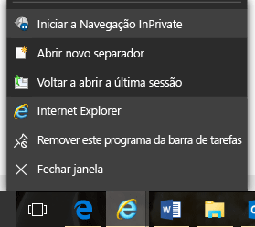

2.  Aceda ao [portal de inscrição do Intune](https://portal.office.com/Signup/Signup.aspx?OfferId=40BE278A-DFD1-470a-9EF7-9F2596EA7FF9&dl=INTUNE_A&ali=1), forneça as informações pedidas e clique em **Seguinte**

    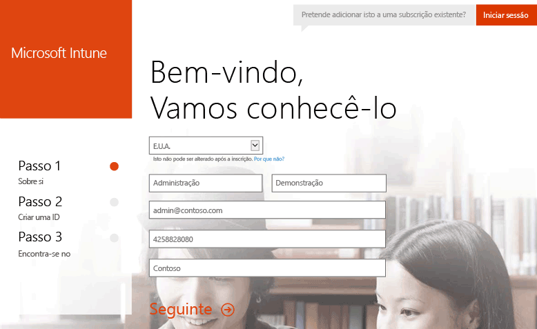

3.  Introduza um ID e uma palavra-passe de utilizador para a sua conta de administração e clique em **Seguinte**. Irá utilizar este ID para iniciar sessão no portal do Intune e fazer as tarefas administrativas.

    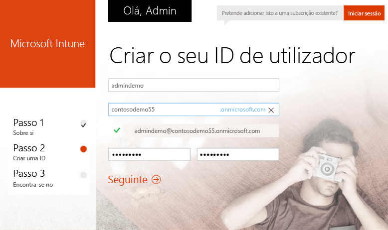

4.  Introduza o seu número de telemóvel e clique em **Enviar mensagem de texto** para validar o número.

    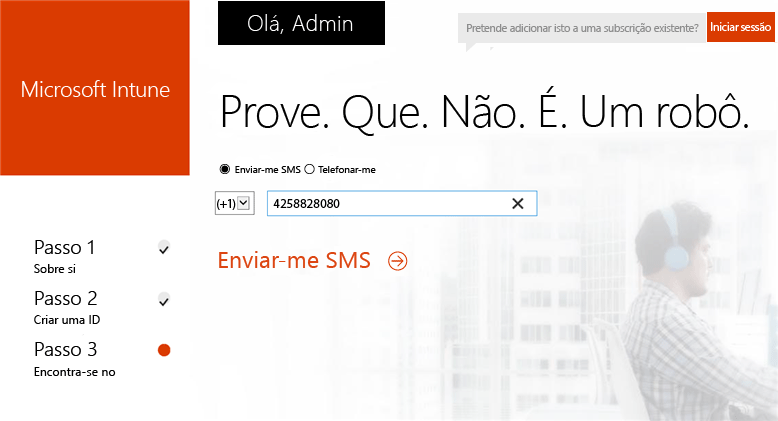

5.  Guarde as informações que aparecem no ecrã e clique em **Está pronto para começar…**

    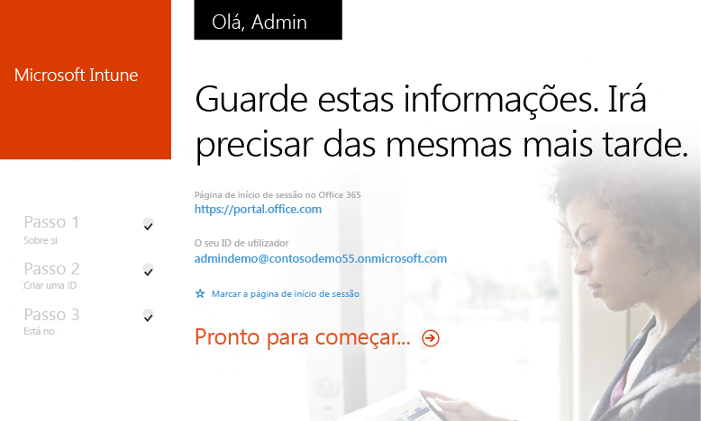

## Criar um utilizador de teste

1.  Num PC com Windows, clique em **Iniciar** para aceder à página de gestão de utilizadores.

    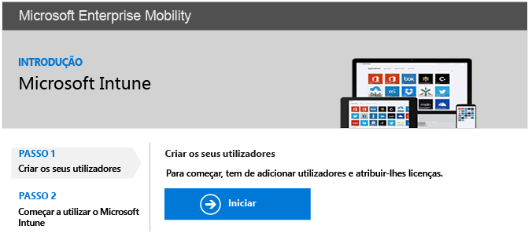

2.  Clique no botão **+** para adicionar um utilizador.

    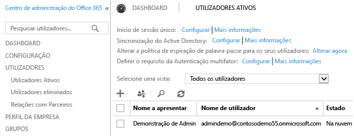

3.  Na página **Criar nova conta de utilizador**:

    1.  Forneça as informações do utilizador de teste.

    2.  Selecione a opção **Escrever palavra-passe**.

    3.  Limpe a caixa de verificação **Fazer com que esta pessoa altere a palavra-passe da próxima vez que iniciar sessão**.

    4.  Clique em **Criar**

    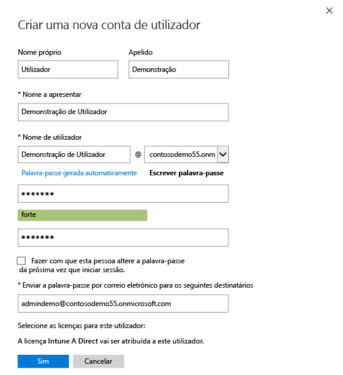

4.  Na página de confirmação da criação do utilizador, clique em **Fechar**

    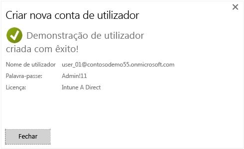

5.  Clique no botão **Atualizar** para ver o utilizador de teste que criou.

    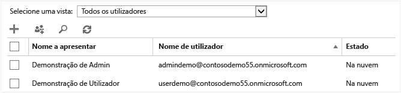

## Configurar uma política de PIN para iOS para o utilizador de teste

1.  Num PC com Windows, defina o Intune para ser a autoridade MDM:

    1.  Aceda à [Consola de gestão do Intune](http://manage.microsoft.com/), inicie sessão com a sua conta de administrador e clique em **Começar a Gerir Dispositivos Móveis**. É aberta a página Autoridade de Gestão de Dispositivos Móveis.

        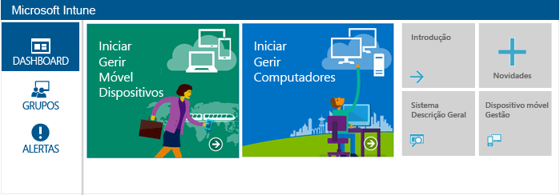

    2.  Clique na ligação **Definir Autoridade de Gestão de Dispositivos Móveis**.

        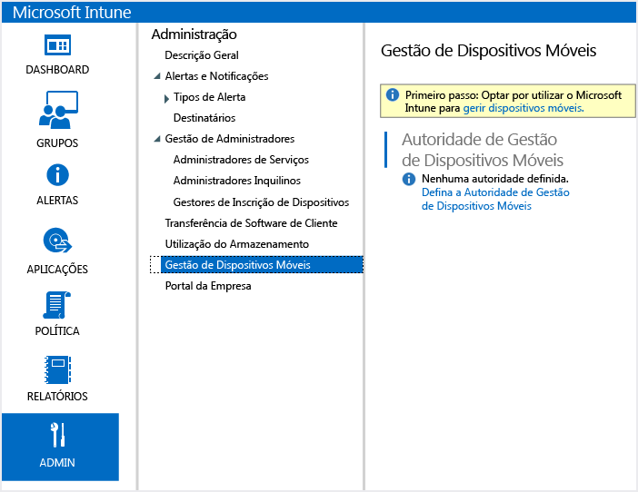

2.  Ativar os dispositivos iOS para inscrição. Este processo configura um certificado fidedigno entre o serviço Apple Push Notification (APNs) e a sua subscrição do Intune.

    1.  Clique em **Ativar a plataforma iOS e Mac OS X**

        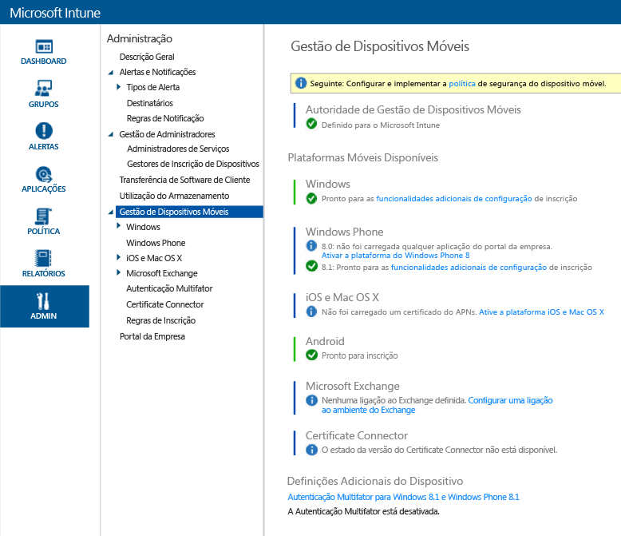

    2.  Clique em **Transferir o Pedido de Certificado do APNs**

        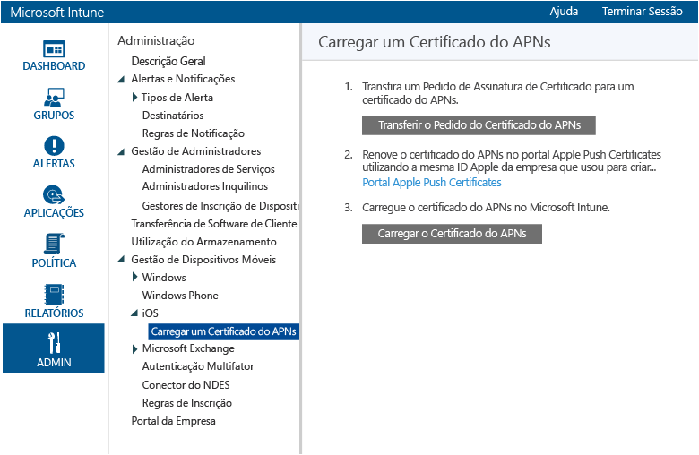

    3.  Especifique um nome de ficheiro e uma localização para a Solicitação de Assinatura de Certificado (CSR) e clique em **Guardar**. Este ficheiro contém a chave pública que corresponde a uma chave privada presente na sua subscrição do Intune.

        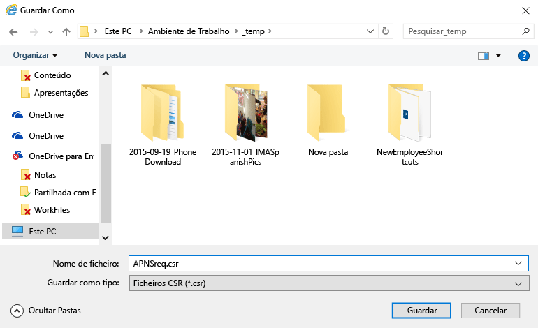

    4.  Clique no **portal Certificados Apple Push** para abrir um novo separador.

        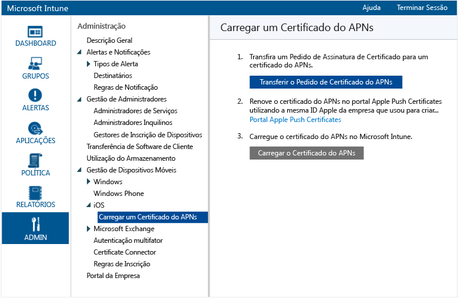

    5.  Introduza o seu ID e a sua palavra-passe da Apple e clique em **Iniciar sessão**. Este ID pode ser o que utiliza no seu dispositivo iOS para obter aplicações a partir da iOS App Store.

        

    6.  Clique em **Criar Certificado**

        

    7.  Leia os Termos de Utilização da Apple, selecione a caixa de verificação e clique em **Aceitar**

        

    8.  Clique em **Procurar**

        

    9. Selecione o ficheiro CSR que guardou anteriormente e clique em **Abrir**

        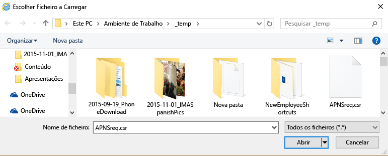

    10. Clique no botão **Carregar**.

        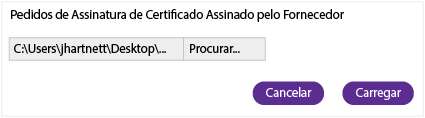

    11. Quando lhe for pedido para transferir um ficheiro JSON, clique em **Guardar como**

        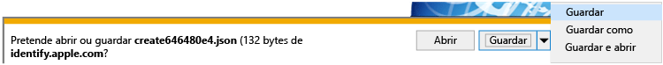

    12. Especifique uma localização para o ficheiro JSON e clique em **Guardar**

        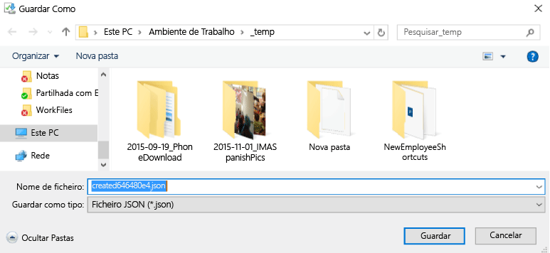

        Se a página não redirecionar automaticamente após alguns segundos, clique em **Cancelar**

        

    13. Para obter o ficheiro de certificado criado recentemente, clique em **Transferir**

        

    14. Quando lhe for pedido para transferir um ficheiro PEM, clique em **Guardar como**

        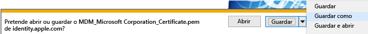

    15. Especifique uma localização para o ficheiro PEM e clique em **Guardar**

        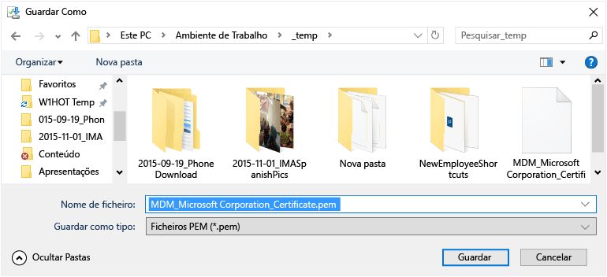

    16. Regresse ao separador Consola de Gestão do Intune e clique em **Carregar o Certificado do APNs**

        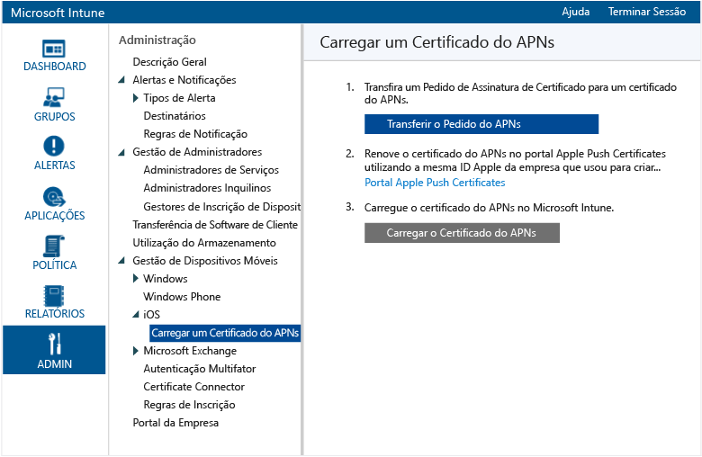

    17. Introduza o seu ID Apple e clique em **Procurar**

        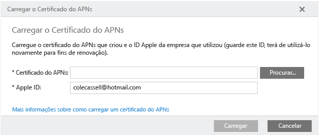

    18. Selecione o ficheiro PEM que acabou de guardar e clique em **Abrir**

        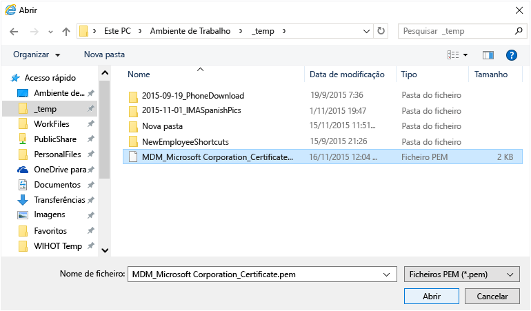

    19. Clique em **Carregar**

        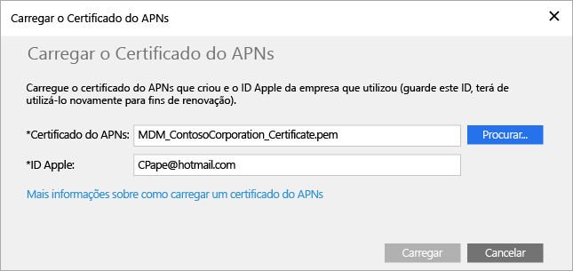

        O certificado do APNs está agora configurado.

        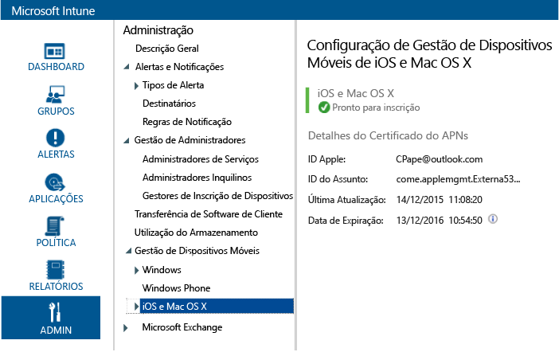

3.  Criar um grupo de utilizadores de teste para a segmentação da política:

    1.  No painel esquerdo, clique em **Grupos**

        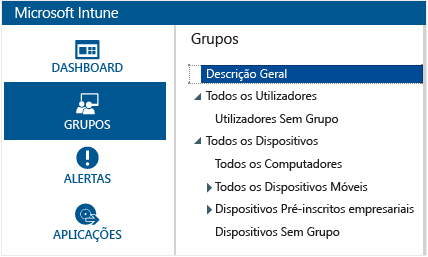

    2.  Clique em **Criar Grupo**, na extremidade direita

        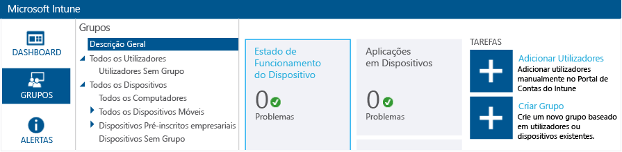

    3.  Dê um nome ao grupo, selecione **Todos os Utilizadores** como o grupo principal e clique em **Seguinte**

        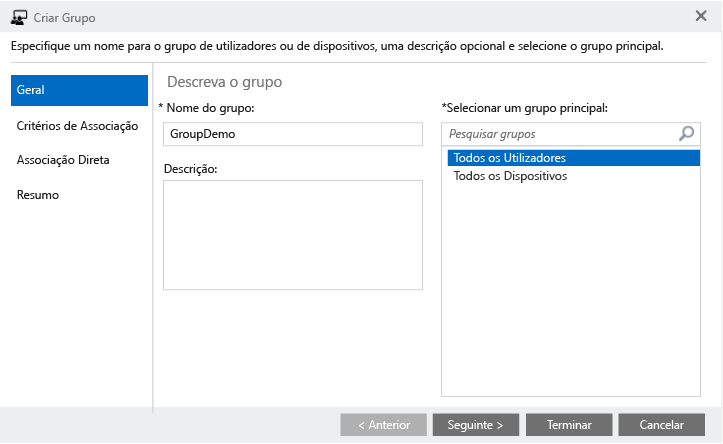

    4.  No campo **Iniciar associação ao grupo com**, selecione **Todos os Utilizadores no Grupo Principal** e clique em **Concluir**

        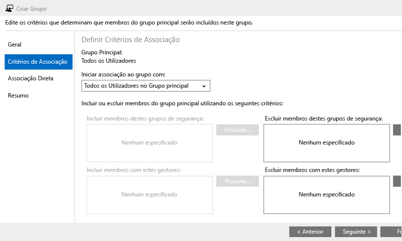

4.  Criar uma política de PIN para iOS e segmentá-la para o grupo de utilizadores de teste:

    1.  No painel esquerdo, clique em **Política**

        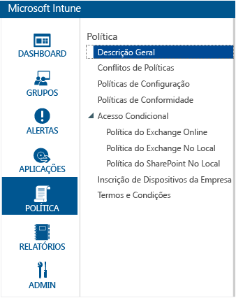

    2.  Clique em **Adicionar Política**, na extremidade direita

        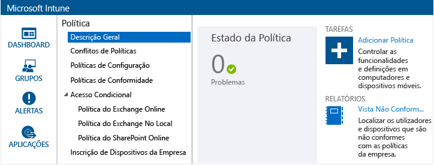

    3.  Expanda o nó iOS, selecione a linha **Configuração Geral** e clique em **Criar Política**

        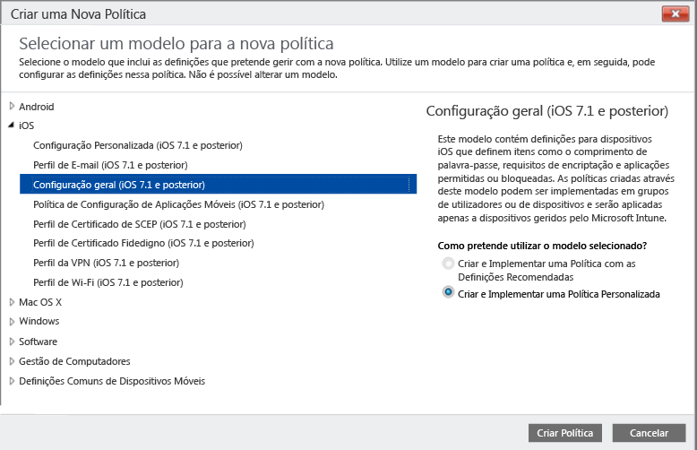

    4.  Escreva um nome para a política, ative a opção **Pedir palavra-passe para desbloquear dispositivos móveis** e defina o **Comprimento mínimo da palavra-passe** como **4**

        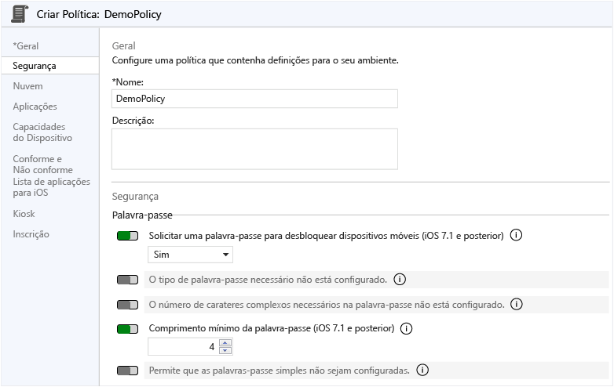

    5.  Clique em **Sim** para implementar a política.

        

    6.  Clique no grupo de utilizadores que criou anteriormente, clique em **Adicionar** e clique em **OK**

        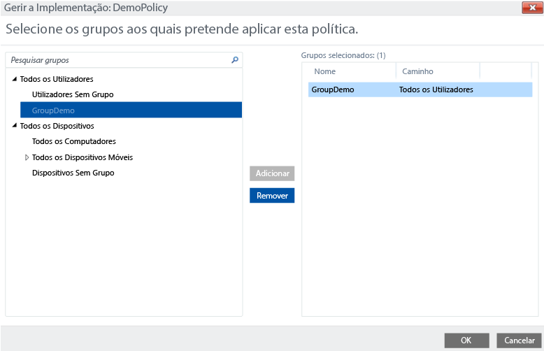

        Tem agora uma política de PIN para iOS direcionada para o grupo de utilizadores de teste.

        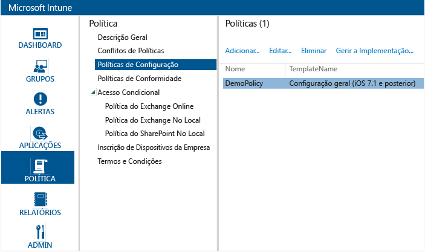

## Confirmar que a política é aplicada a um dispositivo iOS

1.  Num iPad, inicie a iOS App Store, instale a aplicação gratuita **Portal da Empresa do Microsoft Intune** e abra-a.

    

2.  Introduza o nome e a palavra-passe da conta de utilizador de teste e toque em **Iniciar sessão**

    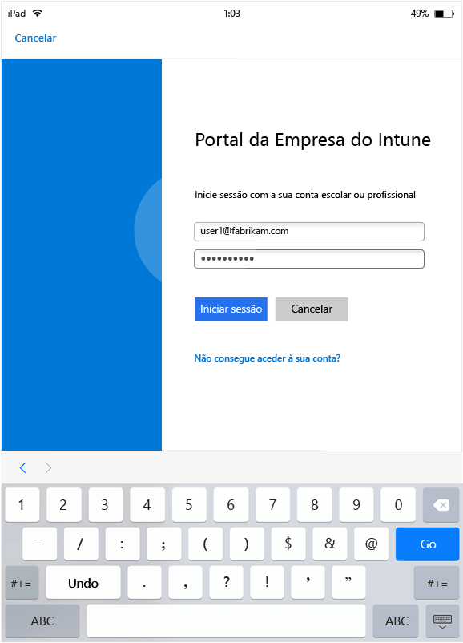

3.  Toque em **Inscrever** para começar a inscrever o dispositivo no Intune.

    

4.  No ecrã **Instalar Perfil**, toque em **Instalar**

    

5.  Na caixa de diálogo **Instalar Perfil**, toque em **Instalar**

    

6.  No ecrã **Aviso**, toque em **Instalar**

    

7.  Na caixa de diálogo **Gestão Remota**, toque em **Confiar**

    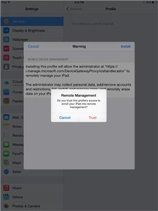

8.  Depois de concluída a instalação do perfil de gestão, toque em **Concluído**. A inscrição agora está concluída.

    

9. Quando a inscrição estiver concluída, toque em **OK** e feche a aplicação do Portal da Empresa.

    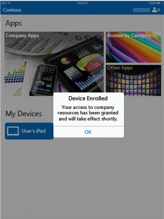

10. Quando lhe for pedido para configurar um código de acesso, toque em **Continuar**

    

11. Introduza o código de acesso, toque em **Continuar**, introduza novamente o código de acesso e toque em **Guardar**

    

12. Prima o botão de energia para bloquear o iPad, deslize para o desbloquear e verá que agora precisa de introduzir o código de acesso para o desbloquear.

### Consulte também
[Guia de avaliação do Intune](get-started-with-a-30-day-trial-of-microsoft-intune.md)

<!--HONumber=May16_HO2-->

