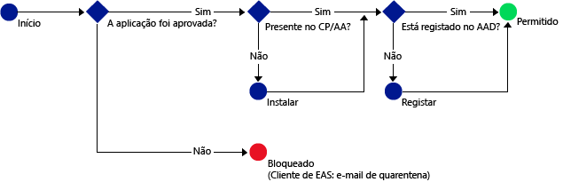

# Permitir aplicações móveis que suportem políticas de MAM do Intune para aceder aos serviços do Office 365

[!INCLUDE[classic-portal](../includes/classic-portal.md)]

[As políticas de gestão de aplicações móveis (MAM) do Intune](protect-apps-and-data-with-microsoft-intune.md) ajudam a proteger os dados da sua empresa em dispositivos que estão inscritos para gestão no Intune. Também pode utilizar políticas de MAM em **dispositivos que sejam propriedade de funcionários e não estejam inscritos para gestão no Intune**.  Neste caso, apesar de não gerir o dispositivo, ainda precisa de garantir que os recursos e os dados da sua empresa estão protegidos. Ao utilizar acesso condicional para MAM, pode criar uma política para permitir que apenas as aplicações móveis que suportam políticas de MAM do Intune acedam a serviços do O365, como o Exchange Online.

Por exemplo, ao permitir que apenas a **aplicação Microsoft Outlook** aceda ao Exchange Online, pode **bloquear as aplicações de correio incorporadas no iOS e Android**, que não têm a proteção de dados das políticas de MAM do Intune para obter e-mails do **Exchange Online**.

O diagrama abaixo ilustra o fluxo utilizado pelas políticas de acesso condicional para MAM para determinar quando permitir ou bloquear acesso: .

Descrição das abreviações utilizadas nos diagramas:
* **CP**: aplicação Portal da Empresa
* **AA**: aplicação Azure Authenticator
* **AAD**: Azure Active Directory
* **EAS**: Exchange Active Sync

## Pré-requisitos
**Antes** de poder configurar a política de acesso condicional para MAM, tem de ter uma **subscrição do Enterprise Mobility + Security ou do Azure Active Directory Premium** e os utilizadores finais têm de ter uma licença do EMS ou do Azure AD. Para saber mais detalhes, consulte a [página de preços do Enterprise Mobility](https://www.microsoft.com/en-us/cloud-platform/enterprise-mobility-pricing) ou a [página de preços do Azure Active Directory](https://azure.microsoft.com/en-us/pricing/details/active-directory/).

## Aplicações suportadas
**Exchange Online**: **Microsoft Outlook** para Android e iOS.

Para conhecer a experiência de utilizador com uma aplicação com políticas de acesso condicional para MAM, consulte [O que esperar ao utilizar uma aplicação com acesso condicional para MAM](use-apps-with-mam-ca.md).

## Passos seguintes
[Criar uma Política do Exchange Online para aplicações de MAM](mam-ca-for-exchange-online.md)

[Bloquear aplicações que não tenham autenticação moderna](block-apps-with-no-modern-authentication.md)

### Consulte também

[Proteger dados de aplicações com políticas de MAM](protect-app-data-using-mobile-app-management-policies-with-microsoft-intune.md)

<!--HONumber=Dec16_HO2-->

