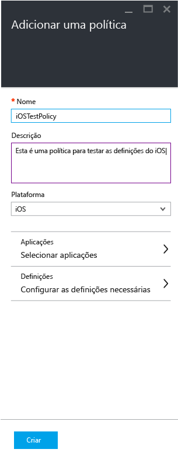
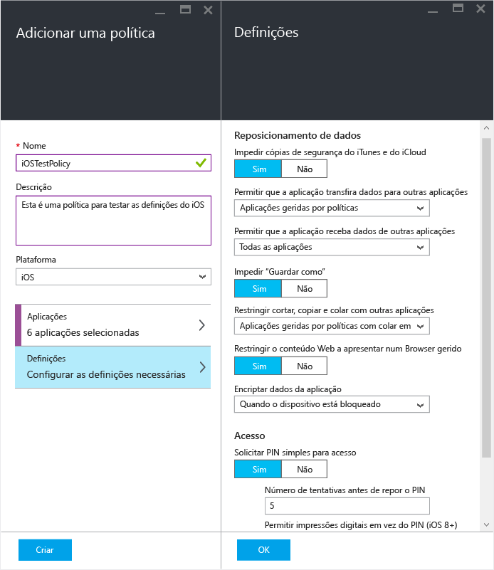
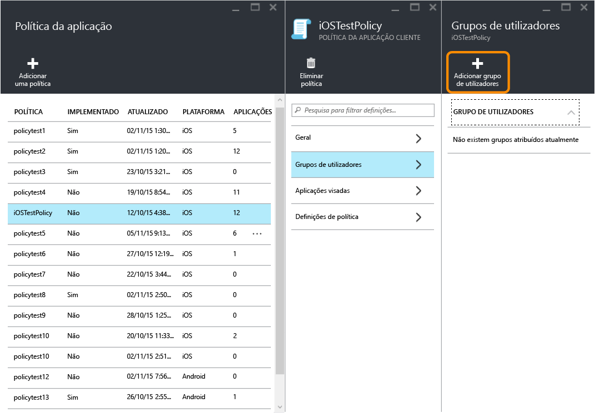
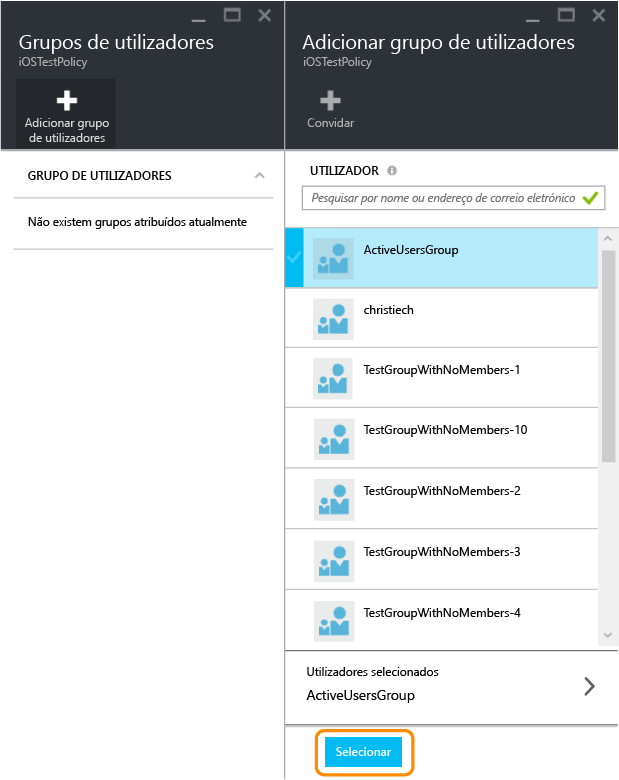
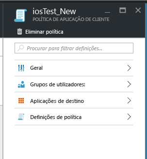
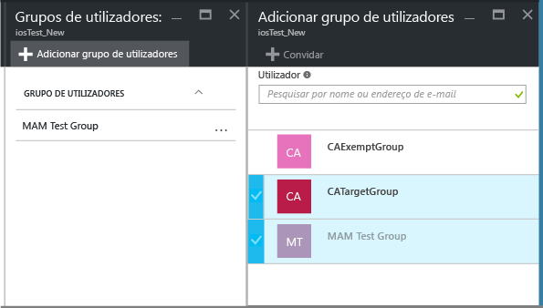
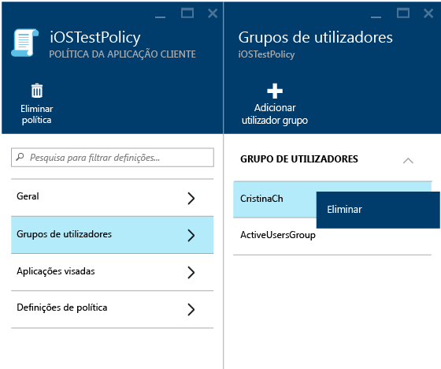
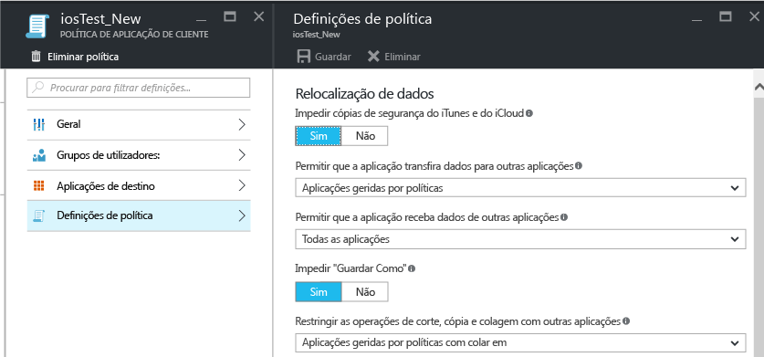

# Criar e implementar políticas de proteção de aplicações com o Microsoft Intune

[!INCLUDE[classic-portal](../includes/classic-portal.md)]

Este tópico descreve o processo de criação de uma política de proteção de aplicações no **portal do Azure**. O portal do Azure é a nova consola de administração para criar políticas de proteção de aplicações e recomendamos que utilize este portal para esse mesmo fim. O portal do Azure suporta os seguintes cenários MAM:

- Dispositivos inscritos no Intune.
- Dispositivos geridos por uma solução de MDM de terceiros.
- Dispositivos que não são geridos por qualquer solução MDM (BYOD).

>[!IMPORTANT]
Eis algumas considerações se estiver a utilizar a **consola de administração do Intune** para gerir os seus dispositivos:

> * Pode criar uma política de proteção de aplicações que suporte aplicações para dispositivos inscritos no Intune ao utilizar a [consola de administração do Intune](configure-and-deploy-mobile-application-management-policies-in-the-microsoft-intune-console.md).
> * As políticas de proteção de aplicações criadas na consola de administração do Intune não podem ser importadas para o portal do Azure.  Têm de ser recriadas no portal do Azure.

> * Poderá não ver todas as definições de política de proteção de aplicações na consola de administração do Intune. O portal do Azure é a nova consola de administração para criar políticas de proteção de aplicações.

> * Para implementar aplicações geridas, tem de criar uma política de proteção de aplicações na consola de administração do Intune. Neste caso, é aconselhável criar políticas de proteção de aplicações na consola de administração do Intune e no portal do Azure: na consola de administração do Intune para se certificar de que tem a capacidade de implementar aplicações geridas e no portal do Azure porque é a nova consola de administração que tem todas as definições de política de proteção de aplicações.

> * Se criar políticas de proteção de aplicações na consola de administração do Intune e no portal do Azure, a política criada no portal do Azure é aplicada às aplicações.

Para ver uma lista de definições de política suportadas para plataformas Android e iOS, selecione uma das seguintes opções:

> [!div class="op_single_selector"]
- [Políticas para iOS](ios-mam-policy-settings.md)
- [Políticas para Android](android-mam-policy-settings.md)

- Para obter uma descrição mais detalhada sobre como funcionam as políticas de proteção de aplicações e os cenários suportados pelas políticas de proteção de aplicações do Intune, veja [Proteger os dados da aplicação através de políticas de proteção de aplicações](protect-app-data-using-mobile-app-management-policies-with-microsoft-intune.md).

##  Criar uma política de proteção de aplicações
As políticas de proteção de aplicações são criadas no portal do Azure. Se esta for a primeira vez que está a utilizar o portal do Azure, leia o artigo [Portal do Azure para políticas de proteção de aplicações do Microsoft Intune](azure-portal-for-microsoft-intune-mam-policies.md) para se familiarizar com o portal do Azure. Antes de criar uma política de proteção de aplicações, analise as informações de [pré-requisitos e suporte](get-ready-to-configure-mobile-app-management-policies-with-microsoft-intune.md).

Siga os passos abaixo para criar políticas de proteção de aplicações:

1. Aceda ao [portal do Azure](http://portal.azure.com) e introduza as suas credenciais.

2. Selecione **Mais Serviços** e escreva "Intune".

3. Selecione **Intune App Protection**.

4. Selecione **Gestão de aplicações móveis do Intune &gt; Definições** para abrir o painel **Todas as Definições**.

    

2.  No painel **Todas as Definições**, selecione **Política de aplicações**. É aberto o painel **Política de aplicações**, onde irá criar novas políticas e editar as já existentes. Selecione **Adicionar uma política**.

    

3.  Escreva um nome para a política, adicione uma breve descrição e selecione o tipo de plataforma para criar uma política para iOS ou Android. Pode criar mais de uma política para cada plataforma.

    

4.  Escolha **Aplicações** para abrir o painel **Aplicações** onde é apresentada uma lista de aplicações disponíveis. Selecione uma ou mais aplicações na lista que pretende associar à política que está a criar. Depois de selecionar as aplicações, selecione **Selecionar** na parte inferior do painel **Aplicações** para guardar a sua seleção.

    > [!IMPORTANT]
    > Tem de selecionar pelo menos uma aplicação para criar uma política.

5.  No painel **Adicionar uma política**, escolha **Configurar definições necessárias** para abrir o painel de definições de política.

    Existem duas categorias de definições de política: **Reposicionamento de Dados** e **Acesso**.  As políticas de reposicionamento de dados são aplicáveis ao movimento de dados de e para as aplicações, enquanto que as políticas de acesso determinam a forma como o utilizador final acede às aplicações num contexto profissional.
    Para começar, as definições de política têm valores predefinidos. Não é necessário efetuar quaisquer alterações se os valores predefinidos cumprirem os requisitos.

    > [!TIP]
    > Estas definições de política apenas são impostas quando utilizar aplicações no contexto profissional.  Quando o utilizador final utiliza a aplicação para realizar uma tarefa pessoal, este não será afetado por estas políticas.

    

6.  Escolha **OK** para guardar esta configuração. Está agora novamente no painel **Adicionar uma política** . Escolha **Criar** para criar a política e guardar as suas definições.

    

Quando acabar de criar uma política, conforme descrito no procedimento anterior, esta não é implementada para nenhum utilizador. Para implementar uma política, consulte a secção seguinte, "Implementar uma política para utilizadores".

> [!IMPORTANT]
> Se criar uma política de proteção de aplicações para uma aplicação com a consola de administração do Intune e uma política de proteção de aplicações através do portal do Azure, a política que criou com o portal do Azure tem precedência. No entanto, os relatórios na consola do Intune ou do Configuration Manager irão comunicar as definições de política criadas na consola de administração do Intune. Por exemplo:
>
> -   Criou uma política de proteção de aplicações na consola de administração do Intune que bloqueia a cópia a partir de uma aplicação.
> -   Criou uma política de proteção de aplicações na consola do Azure que permite a cópia a partir de uma aplicação.
> -   Associa ambas estas políticas à mesma aplicação.
> -   A política que criou a partir da consola do Azure tem precedência e a cópia é permitida.
> -   No entanto, o estado e os relatórios na consola do Intune indicarão incorretamente que a cópia está bloqueada.

## Implementar uma política para utilizadores

1.  No painel **Política**, escolha **Grupos de utilizadores**, que abre o painel **Grupos de utilizadores**. Escolha **Adicionar um grupo de utilizadores** no painel **Grupos de utilizadores** para abrir o painel **Adicionar um grupo de utilizadores**.

    

2.  É apresentada uma lista dos grupos de utilizadores no painel **Adicionar grupo de utilizadores** . Esta é uma lista de todos os grupos de segurança no seu **Azure Active Directory**. Selecione os grupos de utilizadores aos quais pretende aplicar esta política e, em seguida, selecione **Selecionar**. Escolher **Selecionar** implementa a política para os utilizadores.

    

    Criou agora uma política e implementou-a a utilizadores.

Apenas os utilizadores com licenças do [!INCLUDE[wit_nextref](../includes/wit_nextref_md.md)] atribuídas são afetados pela política. Os utilizadores que estão no grupo de segurança que selecionou que não têm uma licença do [!INCLUDE[wit_nextref](../includes/wit_nextref_md.md)] atribuída não são afetados.

>[!IMPORTANT]
> Se estiver a utilizar o Intune com o Configuration Manager para gerir os seus dispositivos iOS e Android, a política só é aplicada aos utilizadores diretamente no grupo que selecionou. Os membros dos grupos subordinados aninhados dentro do grupo que selecionou não são afetados.

Os utilizadores finais podem transferir as aplicações a partir da Apple Store ou do Google Play. Para obter mais informações, consulte:
* [O que esperar quando a aplicação Android é gerida por políticas de proteção de aplicações](user-experience-for-mam-enabled-android-apps-with-microsoft-intune.md)
* [O que esperar quando a sua aplicação iOS é gerida por políticas de proteção de aplicações](user-experience-for-mam-enabled-ios-apps-with-microsoft-intune.md)

##  Alterar políticas existentes
Pode editar uma política existente e aplicá-la aos utilizadores visados. No entanto, quando altera as políticas existentes, os utilizadores que já têm sessão iniciada nas aplicações não verão as alterações durante um período de 8 horas.

Para ver o efeito das alterações imediatamente, o utilizador final terá de terminar sessão na aplicação e voltar a iniciar sessão.

### Para alterar a lista de aplicações associadas à política

1.  No painel **Política de aplicações**, escolha a política que pretende alterar. Esta ação abre um painel específico da política que acabou de selecionar.

    

2.  No painel da política, escolha **Aplicações alvo** para abrir a lista de aplicações.

3.  Remova ou adicione aplicações a partir da lista e selecione o ícone **Guardar** para guardar as alterações.

### Para alterar a lista de grupos de utilizadores

1.  No painel **Política de aplicações**, escolha a política que pretende alterar. Esta ação abre o painel específico da política que selecionou.

2.  No painel da política, escolha **Grupos de utilizadores** para abrir o painel **Grupo de utilizadores** que mostra a lista dos grupos de utilizadores atuais que têm esta política.

3.  Para adicionar um novo grupo de utilizadores à política, selecione **Adicionar grupo de utilizadores** e selecione o grupo de utilizadores. Escolha **Selecionar** para implementar a política no grupo que selecionou.

    

4.  Para eliminar um grupo de utilizadores, realce o grupo de utilizadores que pretende remover. Em seguida, selecione as reticências (…) e **Eliminar** para remover o grupo de utilizadores.

    

### Para alterar definições de política

1.  No painel **Política de aplicações**, escolha a política que pretende alterar. Esta ação abre um painel específico da política que acabou de selecionar.

    

2.  Escolha **Definições de política** para abrir o painel **Definições de política**.

3.  Altere as definições e selecione o ícone **Guardar** para guardar as alterações.

    

## Definições de política
Para ver uma lista completa das definições de política para iOS e Android, selecione uma das seguintes opções:

> [!div class="op_single_selector"]
- [Políticas para iOS](ios-mam-policy-settings.md)
- [Políticas para Android](android-mam-policy-settings.md)

## Passos seguintes
[Monitorizar o estado do utilizador e de conformidade](monitor-mobile-app-management-policies-with-microsoft-intune.md)

### Consulte também
* [O que esperar quando a aplicação Android é gerida por políticas de proteção de aplicações](user-experience-for-mam-enabled-android-apps-with-microsoft-intune.md)
* [O que esperar quando a sua aplicação iOS é gerida por políticas de proteção de aplicações](user-experience-for-mam-enabled-ios-apps-with-microsoft-intune.md)

<!--HONumber=Feb17_HO2-->

